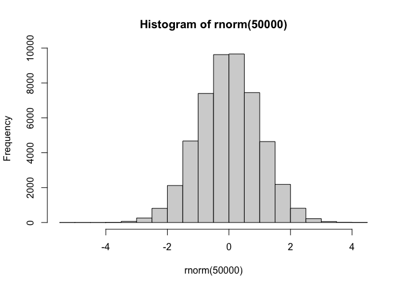
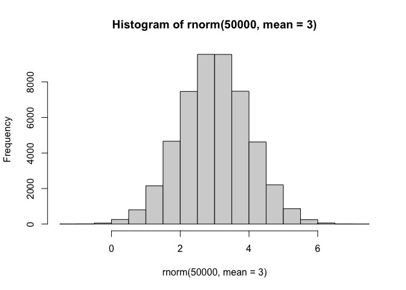
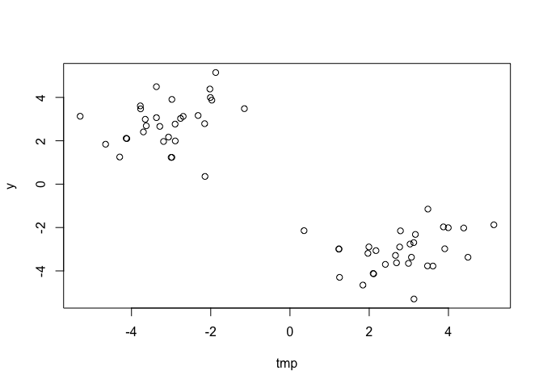
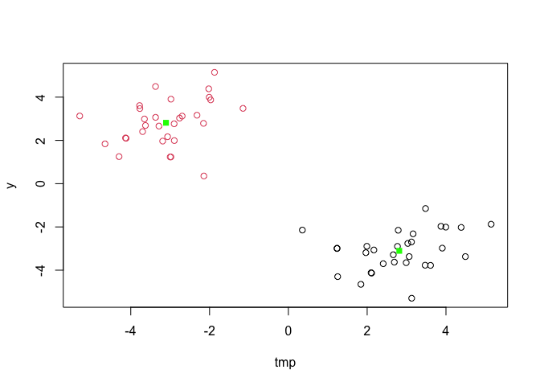
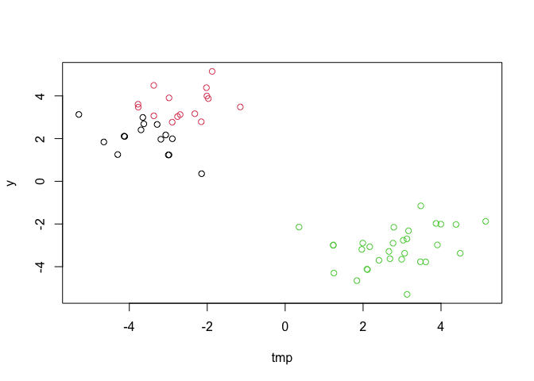
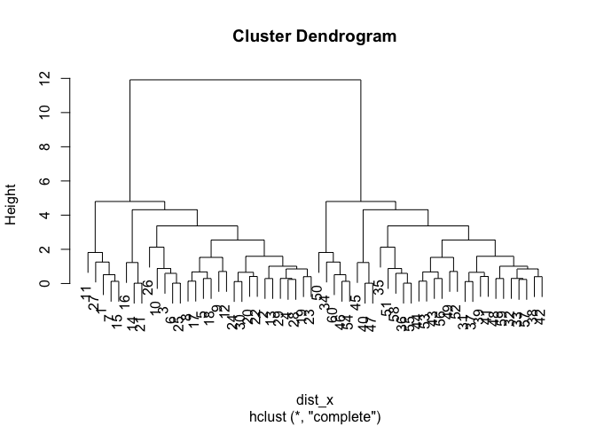
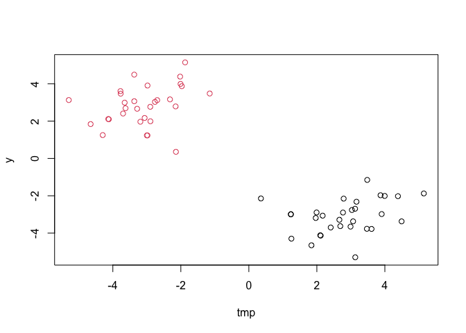
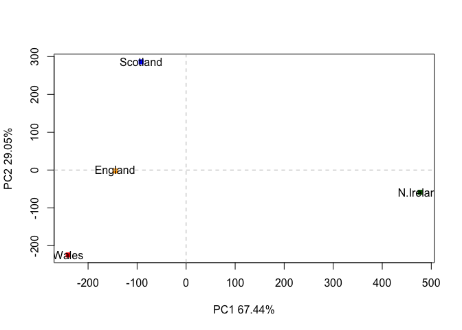
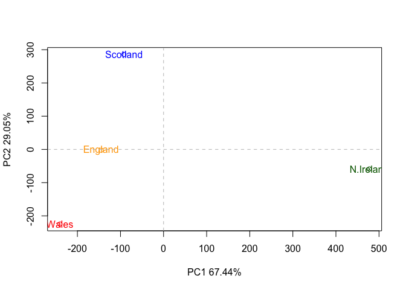

# Class 7: Machine Learning

Today we are going to explore some core machine learning methods. Namely
clustering and dimensionality.

# Kmeans clustering

The main function for k-means in “base” R is called `kmeans()`. Let’s
first make up some data to see how kmeans works and to get aat the
results.

``` r
hist( rnorm(50000) )
```



``` r
hist( rnorm(50000, mean =3) )
```



Make a vector with 60 total points, half centered at +3 and half at -3.

``` r
a <- rnorm(30, mean=3)
b <- rnorm(30, mean=-3)
c<-c(a,b)
c
```

     [1]  2.9359595  3.1691498  2.8248192  1.7032451  4.2687030  1.8843707
     [7]  3.4598771  2.8203432  3.6448144  1.9314047  3.0091983  2.9670610
    [13]  2.9742299  4.0257739  4.3151102  3.4859829  2.1180936  2.2118172
    [19]  2.7086379  2.7442288  3.9081614  0.2039862  3.8557549  3.8218080
    [25]  1.5608960  3.7810143  4.3370456  3.6821933  0.9467508  3.5990010
    [31] -4.2807204 -4.5102052 -3.1032035 -2.1222548 -4.1963163 -1.6996565
    [37] -2.6559626 -4.5522279 -2.4800597 -3.1113923 -4.8778311 -1.0288989
    [43] -4.2928236 -2.4156633 -3.2104664 -2.6456386 -4.0256034 -3.2672002
    [49] -3.1922255 -3.6447907 -3.1259527 -3.7847896 -2.5800314 -3.2850625
    [55] -4.4674183 -0.5914190 -4.3424890 -2.4516331 -1.9999645 -2.6374416

Can shorten code doing this way.

``` r
tmp <- c(rnorm(30,3),rnorm(30,-3))
```

Get the reverse to make another vector

``` r
x <- cbind(tmp,y=rev(tmp))
plot(x)
```



Now run the Kmeans function to see how they cluster

``` r
k <-kmeans(x,centers = 2, nstart=20)
k
```

    K-means clustering with 2 clusters of sizes 30, 30

    Cluster means:
            tmp         y
    1  2.814794 -3.105458
    2 -3.105458  2.814794

    Clustering vector:
     [1] 1 1 1 1 1 1 1 1 1 1 1 1 1 1 1 1 1 1 1 1 1 1 1 1 1 1 1 1 1 1 2 2 2 2 2 2 2 2
    [39] 2 2 2 2 2 2 2 2 2 2 2 2 2 2 2 2 2 2 2 2 2 2

    Within cluster sum of squares by cluster:
    [1] 58.3952 58.3952
     (between_SS / total_SS =  90.0 %)

    Available components:

    [1] "cluster"      "centers"      "totss"        "withinss"     "tot.withinss"
    [6] "betweenss"    "size"         "iter"         "ifault"      

Whats in this results?

``` r
attributes(k)
```

    $names
    [1] "cluster"      "centers"      "totss"        "withinss"     "tot.withinss"
    [6] "betweenss"    "size"         "iter"         "ifault"      

    $class
    [1] "kmeans"

What are the cluster centers?

``` r
k$centers
```

            tmp         y
    1  2.814794 -3.105458
    2 -3.105458  2.814794

What are the clustering results?

``` r
k$cluster
```

     [1] 1 1 1 1 1 1 1 1 1 1 1 1 1 1 1 1 1 1 1 1 1 1 1 1 1 1 1 1 1 1 2 2 2 2 2 2 2 2
    [39] 2 2 2 2 2 2 2 2 2 2 2 2 2 2 2 2 2 2 2 2 2 2

> Q. Plot your data `x` showing your clustering results and the center
> point for each cluster?

``` r
plot(x, col=k$cluster)
points(k$centers, pch=15, col="green")
```



> Q. Run kmeans and cluster into 3 groups and plot the results?

``` r
k2<- kmeans(x,centers = 3, nstart=20)
k2
```

    K-means clustering with 3 clusters of sizes 15, 15, 30

    Cluster means:
            tmp         y
    1 -3.602601  2.009395
    2 -2.608315  3.620193
    3  2.814794 -3.105458

    Clustering vector:
     [1] 3 3 3 3 3 3 3 3 3 3 3 3 3 3 3 3 3 3 3 3 3 3 3 3 3 3 3 3 3 3 2 1 1 2 1 1 2 1
    [39] 2 1 2 2 2 2 1 2 1 1 2 2 1 2 2 2 1 1 1 1 1 2

    Within cluster sum of squares by cluster:
    [1] 16.79895 14.72168 58.39520
     (between_SS / total_SS =  92.3 %)

    Available components:

    [1] "cluster"      "centers"      "totss"        "withinss"     "tot.withinss"
    [6] "betweenss"    "size"         "iter"         "ifault"      

``` r
plot(x,col=k2$cluster)
```



The big limitations of kmeans is that it imposes a structure on your
data (it will force your data to fit what you told it to, aka. not
real). Process requires arbitrarily but systematically (manually)
applying until you find the best one.

# Hierarchical clustering

The main function in “base” R for this is called `hclust()`. It wants a
distance matric as input not the data itself.

We can calculate a distance matrix in lots of different ways but here we
will use the `dist()` function.

``` r
dist_x<- dist(x)
# dist_x
hc<-hclust(dist_x)
# hc
```

There is a specific method to graphing hierarchical clustering. Try
plotting it as is and see what the result is.

``` r
plot(hc)
```



This shows you all the possible clusters based off your data, thereby
not forcing your data into anything but takes it by the distance of each
point from each other.

Lets learn how to cut your tree to get desired clusters. To get the
cluster membership vector (equivalent of k$cluster in kmeans), we cut
the tree at a given height we choose. The function to do this is called
`cutree()`.

``` r
cutree(hc,h=9) 
```

     [1] 1 1 1 1 1 1 1 1 1 1 1 1 1 1 1 1 1 1 1 1 1 1 1 1 1 1 1 1 1 1 2 2 2 2 2 2 2 2
    [39] 2 2 2 2 2 2 2 2 2 2 2 2 2 2 2 2 2 2 2 2 2 2

``` r
# h cuts based off the height you pick in graph where k cuts based off the cluster you want
```

``` r
cutree(hc,k=2) 
```

     [1] 1 1 1 1 1 1 1 1 1 1 1 1 1 1 1 1 1 1 1 1 1 1 1 1 1 1 1 1 1 1 2 2 2 2 2 2 2 2
    [39] 2 2 2 2 2 2 2 2 2 2 2 2 2 2 2 2 2 2 2 2 2 2

``` r
grps<-cutree(hc,k=2)
```

> Q. Plot our data (`x`) colored by our hclust result.

``` r
plot(x, col=grps)
```



# Principal Component Analysis (PCA): PCAs function by calculating new variables that represent the components of your data that account for the most variation.

Each quadrant represents a portion of the dataset and what is captured.
However, quadrants are arbitrary and do not actually represent numbers
or categories, but new variables of variance within your dataset (ie.
quadrant 1 has data that meets variance 1, and quadrant 2 has data that
meets variance 2).

The motivation is trying to reduce the number of things to look at to
gain insight of your data while only losing a small amount of
information.

Lets use a real data set to understand PCA:

``` r
url <- "https://tinyurl.com/UK-foods"
x <- read.csv(url, row.names = 1)
```

> Q1. How many rows and columns are in your new data frame named x? What
> R functions could you use to answer this questions?

``` r
dim(x)
```

    [1] 17  4

> Q2. Which approach to solving the ‘row-names problem’ mentioned above
> do you prefer and why? Is one approach more robust than another under
> certain circumstances?

I prefer the reading in to the CSV file as it is straight forward and
less work.

``` r
barplot(as.matrix(x), beside=T, col=rainbow(nrow(x)))
```


> Q3: Changing what optional argument in the above barplot() function
> results in the following plot?

``` r
barplot(as.matrix(x), beside=F, col=rainbow(nrow(x)))
```


> Q5: Generating all pairwise plots may help somewhat. Can you make
> sense of the following code and resulting figure? What does it mean if
> a given point lies on the diagonal for a given plot?

``` r
pairs(x, col=rainbow(10), pch=16) 
```


> Q6. What is the main differences between N. Ireland and the other
> countries of the UK in terms of this data-set?

N. Ireland eats much more potatoes and less fresh fruit than the other
UK countries.

## Enter PCA

The main function to do PCA in “base” R is called `prcomp()`.

It wants our foots as the columns and the countries as the rows.

`t()` transposes data (needed for this dataset)

`prcomp()` calculates the principal components of data

``` r
pca <- prcomp(t(x))
summary(pca)
```

    Importance of components:
                                PC1      PC2      PC3       PC4
    Standard deviation     324.1502 212.7478 73.87622 2.921e-14
    Proportion of Variance   0.6744   0.2905  0.03503 0.000e+00
    Cumulative Proportion    0.6744   0.9650  1.00000 1.000e+00

``` r
attributes(pca)
```

    $names
    [1] "sdev"     "rotation" "center"   "scale"    "x"       

    $class
    [1] "prcomp"

``` r
pca$x
```

                     PC1         PC2        PC3           PC4
    England   -144.99315   -2.532999 105.768945 -9.152022e-15
    Wales     -240.52915 -224.646925 -56.475555  5.560040e-13
    Scotland   -91.86934  286.081786 -44.415495 -6.638419e-13
    N.Ireland  477.39164  -58.901862  -4.877895  1.329771e-13

``` r
pca$rotation
```

                                 PC1          PC2         PC3          PC4
    Cheese              -0.056955380  0.016012850  0.02394295 -0.409382587
    Carcass_meat         0.047927628  0.013915823  0.06367111  0.729481922
    Other_meat          -0.258916658 -0.015331138 -0.55384854  0.331001134
    Fish                -0.084414983 -0.050754947  0.03906481  0.022375878
    Fats_and_oils       -0.005193623 -0.095388656 -0.12522257  0.034512161
    Sugars              -0.037620983 -0.043021699 -0.03605745  0.024943337
    Fresh_potatoes       0.401402060 -0.715017078 -0.20668248  0.021396007
    Fresh_Veg           -0.151849942 -0.144900268  0.21382237  0.001606882
    Other_Veg           -0.243593729 -0.225450923 -0.05332841  0.031153231
    Processed_potatoes  -0.026886233  0.042850761 -0.07364902 -0.017379680
    Processed_Veg       -0.036488269 -0.045451802  0.05289191  0.021250980
    Fresh_fruit         -0.632640898 -0.177740743  0.40012865  0.227657348
    Cereals             -0.047702858 -0.212599678 -0.35884921  0.100043319
    Beverages           -0.026187756 -0.030560542 -0.04135860 -0.018382072
    Soft_drinks          0.232244140  0.555124311 -0.16942648  0.222319484
    Alcoholic_drinks    -0.463968168  0.113536523 -0.49858320 -0.273126013
    Confectionery       -0.029650201  0.005949921 -0.05232164  0.001890737

``` r
plot(pca$x[,1],pca$x[,2],xlab="PC1 67.44%",ylab="PC2 29.05%", col=c("orange","red","blue","darkgreen"),pch=15)
text(pca$x[,1], pca$x[,2], colnames(x))
abline(h=0, col="gray", lty=2)
abline(v=0, col="gray", lty=2)
```



> Q8. Customize your plot so that the colors of the country names match
> the colors in our UK and Ireland map and table at start of this
> document.

``` r
plot(pca$x[,1],pca$x[,2],xlab="PC1 67.44%",ylab="PC2 29.05%", col=c("orange","red","blue","darkgreen"))
text(pca$x[,1], pca$x[,2], colnames(x), col=c("orange","red","blue","darkgreen"))
abline(h=0, col="gray", lty=2)
abline(v=0, col="gray", lty=2)
```



We can manually calculate the variance here using the standard
deviation.

``` r
v <- round( pca$sdev^2/sum(pca$sdev^2) * 100 )
v
```

    [1] 67 29  4  0

We can use the `summary()` function to do the same. Given in the second
row.

``` r
z <- summary(pca)
z$importance
```

                                 PC1       PC2      PC3          PC4
    Standard deviation     324.15019 212.74780 73.87622 2.921348e-14
    Proportion of Variance   0.67444   0.29052  0.03503 0.000000e+00
    Cumulative Proportion    0.67444   0.96497  1.00000 1.000000e+00

``` r
barplot(v, xlab="Principal Component", ylab="Percent Variation")
```


