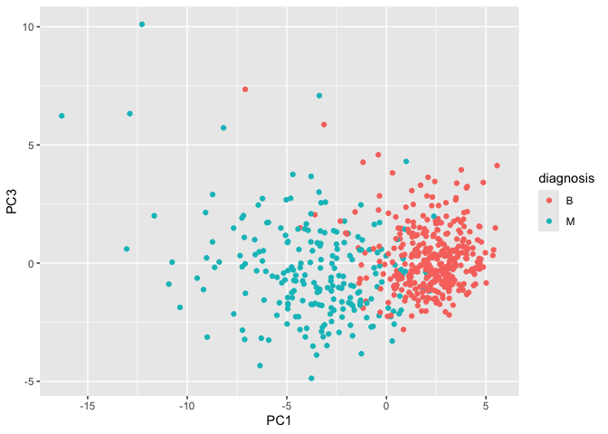
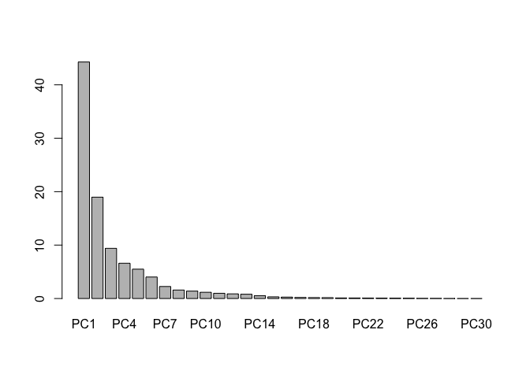

# Class 8: Mini Project
Andrew Sue

The goal of this mini-project is for you to explore a complete analysis
using the unsupervised learning techniques covered in class. You’ll
extend what you’ve learned by combining PCA as a preprocessing step to
clustering using data that consist of measurements of cell nuclei of
human breast masses. This expands on our RNA-Seq analysis from last day.

``` r
# Save your input data file into your Project directory
fna.data <- read.csv("WisconsinCancer.csv", row.names=1)

# Complete the following code to input the data and store as wisc.df
wisc.df <- fna.data
```

> Q1. How many observations/samples/patients/rows?

There are 569 individuals in this dataset.

> Q2. What is in the `$diagnosis` column? How many of each type?

There are 357, 212.

``` r
table(wisc.df$diagnosis)
```


      B   M 
    357 212 

> Q3. How many variables/features in the data are suffixed with \_mean?

``` r
#gives you column indexes
grep("_mean",colnames(wisc.df)) 
```

     [1]  2  3  4  5  6  7  8  9 10 11

``` r
#gives you values (in this case column name)
grep("_mean",colnames(wisc.df), value=TRUE) 
```

     [1] "radius_mean"            "texture_mean"           "perimeter_mean"        
     [4] "area_mean"              "smoothness_mean"        "compactness_mean"      
     [7] "concavity_mean"         "concave.points_mean"    "symmetry_mean"         
    [10] "fractal_dimension_mean"

``` r
#Gives you the number of values as it counts 
length(grep("_mean",colnames(wisc.df), value=TRUE))
```

    [1] 10

> Q. How many variables/dimensions have we?

``` r
ncol(wisc.df)
```

    [1] 31

Save the diagnosis for reference later.

``` r
#Factors useful for categorical data and provides levels to data. 
diagnosis <- as.factor(wisc.df$diagnosis)
diagnosis
```

      [1] M M M M M M M M M M M M M M M M M M M B B B M M M M M M M M M M M M M M M
     [38] B M M M M M M M M B M B B B B B M M B M M B B B B M B M M B B B B M B M M
     [75] B M B M M B B B M M B M M M B B B M B B M M B B B M M B B B B M B B M B B
    [112] B B B B B B M M M B M M B B B M M B M B M M B M M B B M B B M B B B B M B
    [149] B B B B B B B B M B B B B M M B M B B M M B B M M B B B B M B B M M M B M
    [186] B M B B B M B B M M B M M M M B M M M B M B M B B M B M M M M B B M M B B
    [223] B M B B B B B M M B B M B B M M B M B B B B M B B B B B M B M M M M M M M
    [260] M M M M M M M B B B B B B M B M B B M B B M B M M B B B B B B B B B B B B
    [297] B M B B M B M B B B B B B B B B B B B B B M B B B M B M B B B B M M M B B
    [334] B B M B M B M B B B M B B B B B B B M M M B B B B B B B B B B B M M B M M
    [371] M B M M B B B B B M B B B B B M B B B M B B M M B B B B B B M B B B B B B
    [408] B M B B B B B M B B M B B B B B B B B B B B B M B M M B M B B B B B M B B
    [445] M B M B B M B M B B B B B B B B M M B B B B B B M B B B B B B B B B B M B
    [482] B B B B B B M B M B B M B B B B B M M B M B M B B B B B M B B M B M B M M
    [519] B B B M B B B B B B B B B B B M B M M B B B B B B B B B B B B B B B B B B
    [556] B B B B B B B M M M M M M B
    Levels: B M

Remove or exclude this column from any of our analysis

``` r
wisc.data <- wisc.df[,-1]
head(wisc.data)
```

             radius_mean texture_mean perimeter_mean area_mean smoothness_mean
    842302         17.99        10.38         122.80    1001.0         0.11840
    842517         20.57        17.77         132.90    1326.0         0.08474
    84300903       19.69        21.25         130.00    1203.0         0.10960
    84348301       11.42        20.38          77.58     386.1         0.14250
    84358402       20.29        14.34         135.10    1297.0         0.10030
    843786         12.45        15.70          82.57     477.1         0.12780
             compactness_mean concavity_mean concave.points_mean symmetry_mean
    842302            0.27760         0.3001             0.14710        0.2419
    842517            0.07864         0.0869             0.07017        0.1812
    84300903          0.15990         0.1974             0.12790        0.2069
    84348301          0.28390         0.2414             0.10520        0.2597
    84358402          0.13280         0.1980             0.10430        0.1809
    843786            0.17000         0.1578             0.08089        0.2087
             fractal_dimension_mean radius_se texture_se perimeter_se area_se
    842302                  0.07871    1.0950     0.9053        8.589  153.40
    842517                  0.05667    0.5435     0.7339        3.398   74.08
    84300903                0.05999    0.7456     0.7869        4.585   94.03
    84348301                0.09744    0.4956     1.1560        3.445   27.23
    84358402                0.05883    0.7572     0.7813        5.438   94.44
    843786                  0.07613    0.3345     0.8902        2.217   27.19
             smoothness_se compactness_se concavity_se concave.points_se
    842302        0.006399        0.04904      0.05373           0.01587
    842517        0.005225        0.01308      0.01860           0.01340
    84300903      0.006150        0.04006      0.03832           0.02058
    84348301      0.009110        0.07458      0.05661           0.01867
    84358402      0.011490        0.02461      0.05688           0.01885
    843786        0.007510        0.03345      0.03672           0.01137
             symmetry_se fractal_dimension_se radius_worst texture_worst
    842302       0.03003             0.006193        25.38         17.33
    842517       0.01389             0.003532        24.99         23.41
    84300903     0.02250             0.004571        23.57         25.53
    84348301     0.05963             0.009208        14.91         26.50
    84358402     0.01756             0.005115        22.54         16.67
    843786       0.02165             0.005082        15.47         23.75
             perimeter_worst area_worst smoothness_worst compactness_worst
    842302            184.60     2019.0           0.1622            0.6656
    842517            158.80     1956.0           0.1238            0.1866
    84300903          152.50     1709.0           0.1444            0.4245
    84348301           98.87      567.7           0.2098            0.8663
    84358402          152.20     1575.0           0.1374            0.2050
    843786            103.40      741.6           0.1791            0.5249
             concavity_worst concave.points_worst symmetry_worst
    842302            0.7119               0.2654         0.4601
    842517            0.2416               0.1860         0.2750
    84300903          0.4504               0.2430         0.3613
    84348301          0.6869               0.2575         0.6638
    84358402          0.4000               0.1625         0.2364
    843786            0.5355               0.1741         0.3985
             fractal_dimension_worst
    842302                   0.11890
    842517                   0.08902
    84300903                 0.08758
    84348301                 0.17300
    84358402                 0.07678
    843786                   0.12440

Lets try clustering this data:

``` r
wisc.hc<-hclust(dist(wisc.data))
plot(wisc.hc)
```


#Principal Component Analysis

Let’s try PCA on this data. Before doing any analysis like this we
should check if our input data needs to be scaled first? Scaling in data
for PCA is important as PCA looks at variance, thus a category with the
largest variance within it will dominate PCA.

``` r
# Check column means and standard deviations
colMeans(wisc.data)
```

                radius_mean            texture_mean          perimeter_mean 
               1.412729e+01            1.928965e+01            9.196903e+01 
                  area_mean         smoothness_mean        compactness_mean 
               6.548891e+02            9.636028e-02            1.043410e-01 
             concavity_mean     concave.points_mean           symmetry_mean 
               8.879932e-02            4.891915e-02            1.811619e-01 
     fractal_dimension_mean               radius_se              texture_se 
               6.279761e-02            4.051721e-01            1.216853e+00 
               perimeter_se                 area_se           smoothness_se 
               2.866059e+00            4.033708e+01            7.040979e-03 
             compactness_se            concavity_se       concave.points_se 
               2.547814e-02            3.189372e-02            1.179614e-02 
                symmetry_se    fractal_dimension_se            radius_worst 
               2.054230e-02            3.794904e-03            1.626919e+01 
              texture_worst         perimeter_worst              area_worst 
               2.567722e+01            1.072612e+02            8.805831e+02 
           smoothness_worst       compactness_worst         concavity_worst 
               1.323686e-01            2.542650e-01            2.721885e-01 
       concave.points_worst          symmetry_worst fractal_dimension_worst 
               1.146062e-01            2.900756e-01            8.394582e-02 

``` r
apply(wisc.data,2,sd)
```

                radius_mean            texture_mean          perimeter_mean 
               3.524049e+00            4.301036e+00            2.429898e+01 
                  area_mean         smoothness_mean        compactness_mean 
               3.519141e+02            1.406413e-02            5.281276e-02 
             concavity_mean     concave.points_mean           symmetry_mean 
               7.971981e-02            3.880284e-02            2.741428e-02 
     fractal_dimension_mean               radius_se              texture_se 
               7.060363e-03            2.773127e-01            5.516484e-01 
               perimeter_se                 area_se           smoothness_se 
               2.021855e+00            4.549101e+01            3.002518e-03 
             compactness_se            concavity_se       concave.points_se 
               1.790818e-02            3.018606e-02            6.170285e-03 
                symmetry_se    fractal_dimension_se            radius_worst 
               8.266372e-03            2.646071e-03            4.833242e+00 
              texture_worst         perimeter_worst              area_worst 
               6.146258e+00            3.360254e+01            5.693570e+02 
           smoothness_worst       compactness_worst         concavity_worst 
               2.283243e-02            1.573365e-01            2.086243e-01 
       concave.points_worst          symmetry_worst fractal_dimension_worst 
               6.573234e-02            6.186747e-02            1.806127e-02 

Use mtcars dataframe as an example of anaylsis with small dataset.

``` r
pc <- prcomp(mtcars)
summary(pc)
```

    Importance of components:
                               PC1      PC2     PC3     PC4     PC5     PC6    PC7
    Standard deviation     136.533 38.14808 3.07102 1.30665 0.90649 0.66354 0.3086
    Proportion of Variance   0.927  0.07237 0.00047 0.00008 0.00004 0.00002 0.0000
    Cumulative Proportion    0.927  0.99937 0.99984 0.99992 0.99996 0.99998 1.0000
                             PC8    PC9   PC10   PC11
    Standard deviation     0.286 0.2507 0.2107 0.1984
    Proportion of Variance 0.000 0.0000 0.0000 0.0000
    Cumulative Proportion  1.000 1.0000 1.0000 1.0000

``` r
biplot(pc)
```


``` r
pc.scale <- prcomp(mtcars,scale =TRUE)
biplot(pc.scale)
```


> Q. Do we need to scale out cancer data set?

Yes we do! If you look at the standard deviation between the variance is
too large to compare.

``` r
wisc.pr <- prcomp(wisc.data, scale=TRUE)
```

How well do the PCs capture the variance?

``` r
summary(wisc.pr)
```

    Importance of components:
                              PC1    PC2     PC3     PC4     PC5     PC6     PC7
    Standard deviation     3.6444 2.3857 1.67867 1.40735 1.28403 1.09880 0.82172
    Proportion of Variance 0.4427 0.1897 0.09393 0.06602 0.05496 0.04025 0.02251
    Cumulative Proportion  0.4427 0.6324 0.72636 0.79239 0.84734 0.88759 0.91010
                               PC8    PC9    PC10   PC11    PC12    PC13    PC14
    Standard deviation     0.69037 0.6457 0.59219 0.5421 0.51104 0.49128 0.39624
    Proportion of Variance 0.01589 0.0139 0.01169 0.0098 0.00871 0.00805 0.00523
    Cumulative Proportion  0.92598 0.9399 0.95157 0.9614 0.97007 0.97812 0.98335
                              PC15    PC16    PC17    PC18    PC19    PC20   PC21
    Standard deviation     0.30681 0.28260 0.24372 0.22939 0.22244 0.17652 0.1731
    Proportion of Variance 0.00314 0.00266 0.00198 0.00175 0.00165 0.00104 0.0010
    Cumulative Proportion  0.98649 0.98915 0.99113 0.99288 0.99453 0.99557 0.9966
                              PC22    PC23   PC24    PC25    PC26    PC27    PC28
    Standard deviation     0.16565 0.15602 0.1344 0.12442 0.09043 0.08307 0.03987
    Proportion of Variance 0.00091 0.00081 0.0006 0.00052 0.00027 0.00023 0.00005
    Cumulative Proportion  0.99749 0.99830 0.9989 0.99942 0.99969 0.99992 0.99997
                              PC29    PC30
    Standard deviation     0.02736 0.01153
    Proportion of Variance 0.00002 0.00000
    Cumulative Proportion  1.00000 1.00000

> Q4. From your results, what proportion of the original variance is
> captured by the first principal components (PC1)?

44.27% of original variance is calculated in PC1.

> Q5. How many principal components (PCs) are required to describe at
> least 70% of the original variance in the data?

The first 3 PCs are required to get 70% of the variance.

> Q6. How many principal components (PCs) are required to describe at
> least 90% of the original variance in the data?

You need 7 PCs to get 90% of the variance.

``` r
biplot(wisc.pr)
```


> Q7. What stands out to you about this plot? Is it easy or difficult to
> understand? Why?

This plot is unreadable and not useful as everything is on top of each
other. This is because it is graphing all of the categories rather than
the most principal components.

Our main PC score plot (a.k.a PC plot, PC1 vs PC2, ordination plot).

``` r
attributes(wisc.pr)
```

    $names
    [1] "sdev"     "rotation" "center"   "scale"    "x"       

    $class
    [1] "prcomp"

We need to build our own plot here:

``` r
plot(wisc.pr$x[,1], wisc.pr$x[,2],col=diagnosis)
```


``` r
# wisc.pr$x
```

Make a nice ggplot version of plot

``` r
pc <-as.data.frame(wisc.pr$x)
library(ggplot2)
ggplot(pc) + 
  aes(PC1, PC2, col=diagnosis) +
  geom_point()
```


> Q8. Generate a similar plot for principal components 1 and 3. What do
> you notice about these plots?

While they are similar, there is slightly less variance within the PC1
and PC3 than the previous. Which makes sense since PC3 has less
influence than PC2.

``` r
pc <-as.data.frame(wisc.pr$x)
library(ggplot2)
ggplot(pc) + 
  aes(PC1, PC3, col=diagnosis) +
  geom_point()
```



Make scree plot of variance

``` r
wisc.scree<-summary(wisc.pr)
# wisc.scree
barplot(wisc.scree$importance[2,]*100) #graphing only proportion variance
```



``` r
#factoextra package automatically calculates variance within it (doing what you did above for you)
library(factoextra)
```

    Welcome! Want to learn more? See two factoextra-related books at https://goo.gl/ve3WBa

``` r
fviz_eig(wisc.pr, addlabels = TRUE)
```


> Q9. For the first principal component, what is the component of the
> loading vector (i.e. wisc.pr$rotation\[,1\]) for the feature
> concave.points_mean? This tells us how much this original feature
> contributes to the first PC.

It is contributing 1.6% to the original PC1. (Category/Dimension 8)

# Hierarchical clustering

``` r
data.scaled <-scale(wisc.data)
data.dist <-dist(data.scaled)
wisc.hclust<- hclust(data.dist,method ="complete")
```

> Q10. Using the plot() and abline() functions, what is the height at
> which the clustering model has 4 clusters?

Height = 19

``` r
plot(wisc.hclust)
abline(h=19,col="red", lty=2)
```


This exercise will help you determine if, in this case, hierarchical
clustering provides a promising new feature.

Use `cutree()` to cut the tree so that it has 4 clusters. Assign the
output to the variable wisc.hclust.clusters.

``` r
wisc.hclust.clusters <- cutree(wisc.hclust, 4)
table(wisc.hclust.clusters, diagnosis)
```

                        diagnosis
    wisc.hclust.clusters   B   M
                       1  12 165
                       2   2   5
                       3 343  40
                       4   0   2

``` r
plot(wisc.hclust.clusters)
```


> Q11. OPTIONAL: Can you find a better cluster vs diagnoses match by
> cutting into a different number of clusters between 2 and 10? How do
> you judge the quality of your result in each case?

In this case, it would be visually inspecting the tree and/or calling
the predicted diagnosis to the actual to see if you are become farther
due to the cuts. using the complete method, cutting at 4 seems to make
the most sense.

``` r
wisc.hclust.clusters1 <- cutree(wisc.hclust,8)
table(wisc.hclust.clusters1, diagnosis)
```

                         diagnosis
    wisc.hclust.clusters1   B   M
                        1  12  86
                        2   0  79
                        3   0   3
                        4 331  39
                        5   2   0
                        6  12   1
                        7   0   2
                        8   0   2

``` r
plot(wisc.hclust.clusters1)
```


> Q12. Which method gives your favorite results for the same data.dist
> dataset? Explain your reasoning.

ward.D2 is better as it clustered better and minimized the variance
between better.

# Using 3 PCs

We start with using 3 PCs

``` r
wisc.pr.hclust<- hclust(dist(wisc.pr$x[,1:3]), method="ward.D2")
plot(wisc.pr.hclust)
```


``` r
plot(wisc.pr.hclust)
abline(h=80, col="red") #abline just draws a line across
```


``` r
grps<- cutree(wisc.pr.hclust, h=80)
table(grps)
```

    grps
      1   2 
    203 366 

``` r
table(grps, diagnosis)
```

        diagnosis
    grps   B   M
       1  24 179
       2 333  33

``` r
#url <- "new_samples.csv"
url <- "https://tinyurl.com/new-samples-CSV"
new <- read.csv(url)
npc <- predict(wisc.pr, newdata=new)
npc
```

               PC1       PC2        PC3        PC4       PC5        PC6        PC7
    [1,]  2.576616 -3.135913  1.3990492 -0.7631950  2.781648 -0.8150185 -0.3959098
    [2,] -4.754928 -3.009033 -0.1660946 -0.6052952 -1.140698 -1.2189945  0.8193031
                PC8       PC9       PC10      PC11      PC12      PC13     PC14
    [1,] -0.2307350 0.1029569 -0.9272861 0.3411457  0.375921 0.1610764 1.187882
    [2,] -0.3307423 0.5281896 -0.4855301 0.7173233 -1.185917 0.5893856 0.303029
              PC15       PC16        PC17        PC18        PC19       PC20
    [1,] 0.3216974 -0.1743616 -0.07875393 -0.11207028 -0.08802955 -0.2495216
    [2,] 0.1299153  0.1448061 -0.40509706  0.06565549  0.25591230 -0.4289500
               PC21       PC22       PC23       PC24        PC25         PC26
    [1,]  0.1228233 0.09358453 0.08347651  0.1223396  0.02124121  0.078884581
    [2,] -0.1224776 0.01732146 0.06316631 -0.2338618 -0.20755948 -0.009833238
                 PC27        PC28         PC29         PC30
    [1,]  0.220199544 -0.02946023 -0.015620933  0.005269029
    [2,] -0.001134152  0.09638361  0.002795349 -0.019015820

``` r
plot(wisc.pr$x[,1:2], col=diagnosis)
points(npc[,1], npc[,2], col="blue", pch=16, cex=3)
text(npc[,1], npc[,2], c(1,2), col="white")
```


> Q16. Which of these new patients should we prioritize for follow up
> based on your results?

We would prioritize patient 2 given that is falls within the malignant
side.
