# Class 09: Mini Project (Candy)
Andrew Sue

Today we will analyze some data from about 538 typical halloween candy.

Our first job is to get the data into R.

``` r
candy_file<- read.csv("candy-data.csv", row.names =1)
head(candy_file)
```

                 chocolate fruity caramel peanutyalmondy nougat crispedricewafer
    100 Grand            1      0       1              0      0                1
    3 Musketeers         1      0       0              0      1                0
    One dime             0      0       0              0      0                0
    One quarter          0      0       0              0      0                0
    Air Heads            0      1       0              0      0                0
    Almond Joy           1      0       0              1      0                0
                 hard bar pluribus sugarpercent pricepercent winpercent
    100 Grand       0   1        0        0.732        0.860   66.97173
    3 Musketeers    0   1        0        0.604        0.511   67.60294
    One dime        0   0        0        0.011        0.116   32.26109
    One quarter     0   0        0        0.011        0.511   46.11650
    Air Heads       0   0        0        0.906        0.511   52.34146
    Almond Joy      0   1        0        0.465        0.767   50.34755

``` r
candy<- candy_file
```

> Q. How many chocolate candy types are in this dataset?

``` r
sum(candy$chocolate)
```

    [1] 37

> Q1. How many different candy types are in this dataset?

There are 9 types of candy.

``` r
head(candy)
```

                 chocolate fruity caramel peanutyalmondy nougat crispedricewafer
    100 Grand            1      0       1              0      0                1
    3 Musketeers         1      0       0              0      1                0
    One dime             0      0       0              0      0                0
    One quarter          0      0       0              0      0                0
    Air Heads            0      1       0              0      0                0
    Almond Joy           1      0       0              1      0                0
                 hard bar pluribus sugarpercent pricepercent winpercent
    100 Grand       0   1        0        0.732        0.860   66.97173
    3 Musketeers    0   1        0        0.604        0.511   67.60294
    One dime        0   0        0        0.011        0.116   32.26109
    One quarter     0   0        0        0.011        0.511   46.11650
    Air Heads       0   0        0        0.906        0.511   52.34146
    Almond Joy      0   1        0        0.465        0.767   50.34755

> Q2. How many fruit candy are there?

``` r
sum(candy$fruity)
```

    [1] 38

> Q. How many total candy?

``` r
nrow(candy)
```

    [1] 85

> Q. How many variables/dimensions are there?

``` r
ncol(candy)
```

    [1] 12

``` r
dim(candy)
```

    [1] 85 12

Skimr package allows for a peak/report of your dataset.

``` r
skimr::skim(candy)
```

|                                                  |       |
|:-------------------------------------------------|:------|
| Name                                             | candy |
| Number of rows                                   | 85    |
| Number of columns                                | 12    |
| \_\_\_\_\_\_\_\_\_\_\_\_\_\_\_\_\_\_\_\_\_\_\_   |       |
| Column type frequency:                           |       |
| numeric                                          | 12    |
| \_\_\_\_\_\_\_\_\_\_\_\_\_\_\_\_\_\_\_\_\_\_\_\_ |       |
| Group variables                                  | None  |

Data summary

**Variable type: numeric**

| skim_variable    | n_missing | complete_rate |  mean |    sd |    p0 |   p25 |   p50 |   p75 |  p100 | hist  |
|:------------|-------:|----------:|-----:|-----:|-----:|-----:|-----:|-----:|-----:|:-----|
| chocolate        |         0 |             1 |  0.44 |  0.50 |  0.00 |  0.00 |  0.00 |  1.00 |  1.00 | ▇▁▁▁▆ |
| fruity           |         0 |             1 |  0.45 |  0.50 |  0.00 |  0.00 |  0.00 |  1.00 |  1.00 | ▇▁▁▁▆ |
| caramel          |         0 |             1 |  0.16 |  0.37 |  0.00 |  0.00 |  0.00 |  0.00 |  1.00 | ▇▁▁▁▂ |
| peanutyalmondy   |         0 |             1 |  0.16 |  0.37 |  0.00 |  0.00 |  0.00 |  0.00 |  1.00 | ▇▁▁▁▂ |
| nougat           |         0 |             1 |  0.08 |  0.28 |  0.00 |  0.00 |  0.00 |  0.00 |  1.00 | ▇▁▁▁▁ |
| crispedricewafer |         0 |             1 |  0.08 |  0.28 |  0.00 |  0.00 |  0.00 |  0.00 |  1.00 | ▇▁▁▁▁ |
| hard             |         0 |             1 |  0.18 |  0.38 |  0.00 |  0.00 |  0.00 |  0.00 |  1.00 | ▇▁▁▁▂ |
| bar              |         0 |             1 |  0.25 |  0.43 |  0.00 |  0.00 |  0.00 |  0.00 |  1.00 | ▇▁▁▁▂ |
| pluribus         |         0 |             1 |  0.52 |  0.50 |  0.00 |  0.00 |  1.00 |  1.00 |  1.00 | ▇▁▁▁▇ |
| sugarpercent     |         0 |             1 |  0.48 |  0.28 |  0.01 |  0.22 |  0.47 |  0.73 |  0.99 | ▇▇▇▇▆ |
| pricepercent     |         0 |             1 |  0.47 |  0.29 |  0.01 |  0.26 |  0.47 |  0.65 |  0.98 | ▇▇▇▇▆ |
| winpercent       |         0 |             1 | 50.32 | 14.71 | 22.45 | 39.14 | 47.83 | 59.86 | 84.18 | ▃▇▆▅▂ |

> Q3. What is your favorite candy in the dataset and what is it’s
> winpercent value?

``` r
candy["Haribo Gold Bears",]$winpercent
```

    [1] 57.11974

> Q. What are the five least liked candy’s in the dataset?

``` r
inds <- order(candy$winpercent)

head(candy[inds,])
```

                       chocolate fruity caramel peanutyalmondy nougat
    Nik L Nip                  0      1       0              0      0
    Boston Baked Beans         0      0       0              1      0
    Chiclets                   0      1       0              0      0
    Super Bubble               0      1       0              0      0
    Jawbusters                 0      1       0              0      0
    Root Beer Barrels          0      0       0              0      0
                       crispedricewafer hard bar pluribus sugarpercent pricepercent
    Nik L Nip                         0    0   0        1        0.197        0.976
    Boston Baked Beans                0    0   0        1        0.313        0.511
    Chiclets                          0    0   0        1        0.046        0.325
    Super Bubble                      0    0   0        0        0.162        0.116
    Jawbusters                        0    1   0        1        0.093        0.511
    Root Beer Barrels                 0    1   0        1        0.732        0.069
                       winpercent
    Nik L Nip            22.44534
    Boston Baked Beans   23.41782
    Chiclets             24.52499
    Super Bubble         27.30386
    Jawbusters           28.12744
    Root Beer Barrels    29.70369

> Q4. What is the winpercent value for “Kit Kat”?

``` r
candy["Kit Kat",]$winpercent
```

    [1] 76.7686

> Q5. What is the winpercent value for “Tootsie Roll Snack Bars”?

``` r
candy["Tootsie Roll Snack Bars",]$winpercent
```

    [1] 49.6535

> Q6. Is there any variable/column that looks to be on a different scale
> to the majority of the other columns in the dataset?

The last 3 columns are all percent values compared to the logical values
within the candy types.

> Q7. What do you think a zero and one represent for the candy$chocolate
> column?

It represents whether that particular candy has chocolate in it or not.
(1 is yes, 0 is no)

> Q8. Plot a histogram of winpercent values

``` r
library(ggplot2)
ggplot(candy)+
  aes(winpercent)+
  geom_histogram(binwidth=8)
```

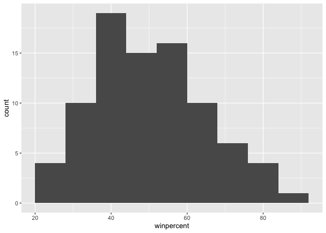

``` r
hist(candy$winpercent)
```


> Q9. Is the distribution of winpercent values symmetrical?

No it is skewed to the left. \> Q10. Is the center of the distribution
above or below 50%?

The center of the distribution is below 50% \> Q11. On average is
chocolate candy higher or lower ranked than fruit candy?

First find all chocolate candy and all fruit candy. Take the mean of the
winpercent values. Compare.

``` r
chocolate<- subset(candy,chocolate == 1)
fruity <- subset(candy,fruity == 1)

choco_mean <-mean(chocolate$winpercent)
fruity_mean <- mean(fruity$winpercent)
```

> Q12. Is this difference statistically significant?

Yes it is.

``` r
t.test(chocolate$winpercent,fruity$winpercent)
```


        Welch Two Sample t-test

    data:  chocolate$winpercent and fruity$winpercent
    t = 6.2582, df = 68.882, p-value = 2.871e-08
    alternative hypothesis: true difference in means is not equal to 0
    95 percent confidence interval:
     11.44563 22.15795
    sample estimates:
    mean of x mean of y 
     60.92153  44.11974 

# Overall candy rankings

> Q13. What are the five least liked candy types in this set?

``` r
head(candy[inds,])
```

                       chocolate fruity caramel peanutyalmondy nougat
    Nik L Nip                  0      1       0              0      0
    Boston Baked Beans         0      0       0              1      0
    Chiclets                   0      1       0              0      0
    Super Bubble               0      1       0              0      0
    Jawbusters                 0      1       0              0      0
    Root Beer Barrels          0      0       0              0      0
                       crispedricewafer hard bar pluribus sugarpercent pricepercent
    Nik L Nip                         0    0   0        1        0.197        0.976
    Boston Baked Beans                0    0   0        1        0.313        0.511
    Chiclets                          0    0   0        1        0.046        0.325
    Super Bubble                      0    0   0        0        0.162        0.116
    Jawbusters                        0    1   0        1        0.093        0.511
    Root Beer Barrels                 0    1   0        1        0.732        0.069
                       winpercent
    Nik L Nip            22.44534
    Boston Baked Beans   23.41782
    Chiclets             24.52499
    Super Bubble         27.30386
    Jawbusters           28.12744
    Root Beer Barrels    29.70369

> Q14. What are the top 5 all time favorite candy types out of this set?

``` r
inds_2 <- rev(inds)
head(candy[inds_2,])
```

                              chocolate fruity caramel peanutyalmondy nougat
    Reese's Peanut Butter cup         1      0       0              1      0
    Reese's Miniatures                1      0       0              1      0
    Twix                              1      0       1              0      0
    Kit Kat                           1      0       0              0      0
    Snickers                          1      0       1              1      1
    Reese's pieces                    1      0       0              1      0
                              crispedricewafer hard bar pluribus sugarpercent
    Reese's Peanut Butter cup                0    0   0        0        0.720
    Reese's Miniatures                       0    0   0        0        0.034
    Twix                                     1    0   1        0        0.546
    Kit Kat                                  1    0   1        0        0.313
    Snickers                                 0    0   1        0        0.546
    Reese's pieces                           0    0   0        1        0.406
                              pricepercent winpercent
    Reese's Peanut Butter cup        0.651   84.18029
    Reese's Miniatures               0.279   81.86626
    Twix                             0.906   81.64291
    Kit Kat                          0.511   76.76860
    Snickers                         0.651   76.67378
    Reese's pieces                   0.651   73.43499

> Q15. Make a first barplot of candy ranking based on winpercent values.

``` r
ggplot(candy) +
  aes(winpercent, rownames(candy)) + 
  geom_col()
```

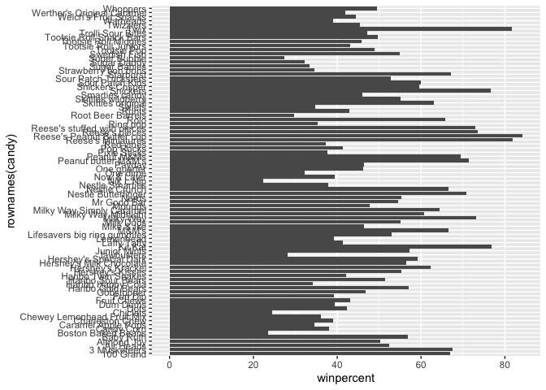

> Q16. This is quite ugly, use the reorder() function to get the bars
> sorted by winpercent?

``` r
ggplot(candy) +
  aes(winpercent, reorder(rownames(candy), winpercent)) + 
  geom_col()
```

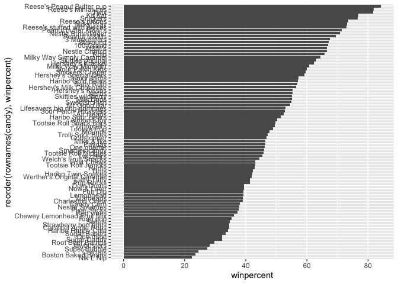

``` r
ggsave("barplot1.png", height =10, width =7)
```

We can now insert any image using markdown syntax. This is ! followed by
square brackets and then normal parenthesis.

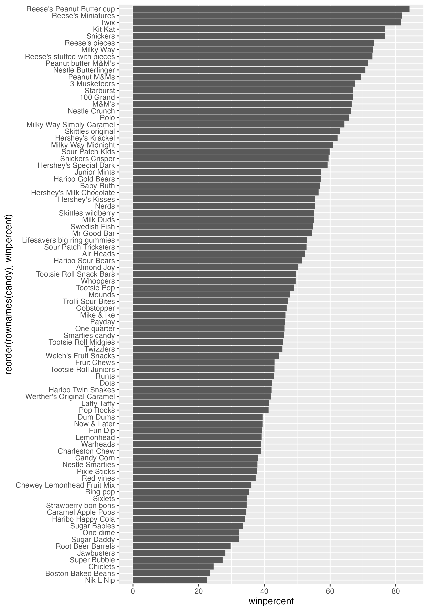

[Figure 1](#fig-gray)

``` r
ggplot(candy) +
  aes(winpercent, reorder(rownames(candy), winpercent)) + 
  geom_col() + 
  labs(x = "Match-up Win percent", y = NULL)
```

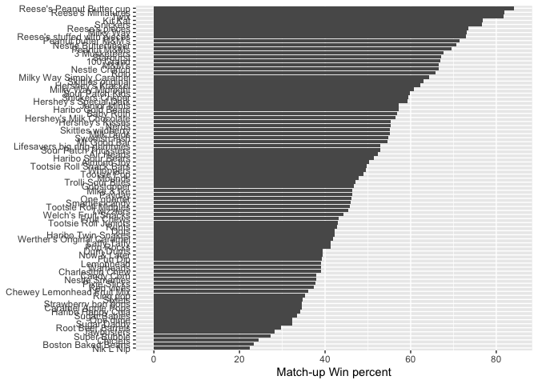

Lets add some color.

``` r
ggplot(candy) +
  aes(winpercent, reorder(rownames(candy), winpercent), fill = chocolate) + 
  geom_col() +
  labs(x = "Match-up Win percent", y = NULL)
```

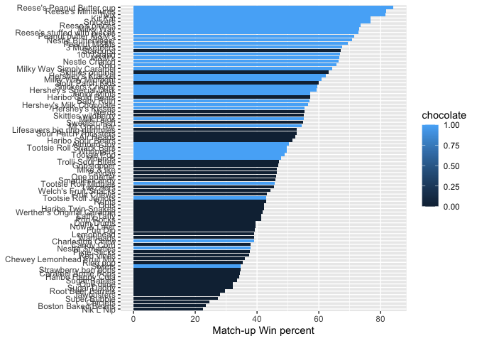

``` r
ggplot(candy) +
  aes(winpercent, reorder(rownames(candy), winpercent), fill = as.factor(chocolate)) + 
  geom_col() +
  labs(x = "Match-up Win percent", y = NULL)
```

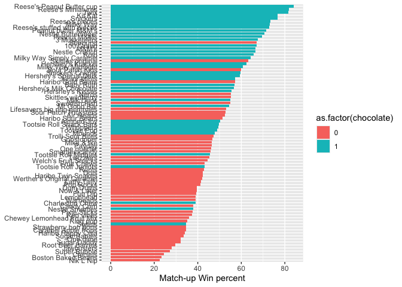

We need to make our own color vactor with the colors we like.

``` r
#you need this default vector set to every value within dataset and then we manually rewrite it afterwards. 
my_cols <- rep("black", nrow(candy)) 

my_cols[ as.logical(candy$chocolate) ] <- "brown"
my_cols[ as.logical(candy$fruity) ] <- "red"
my_cols[ as.logical(candy$bar) ] <- "chocolate"
my_cols[ as.logical(candy$caramel) ] <- "tan"
```

Because we mapped my_cols to our dataset, we cannot set the aesthetic in
the typical aes() portion of ggplot. It needs to go to the geom\_()

``` r
ggplot(candy) +
  aes(winpercent, reorder(rownames(candy), winpercent)) + 
  geom_col(fill=my_cols) +
  labs(x = "Match-up Win percent", y = NULL)
```

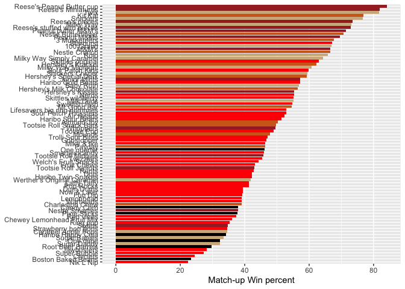

``` r
ggsave("barplot2.png", height =10, width =7)
```

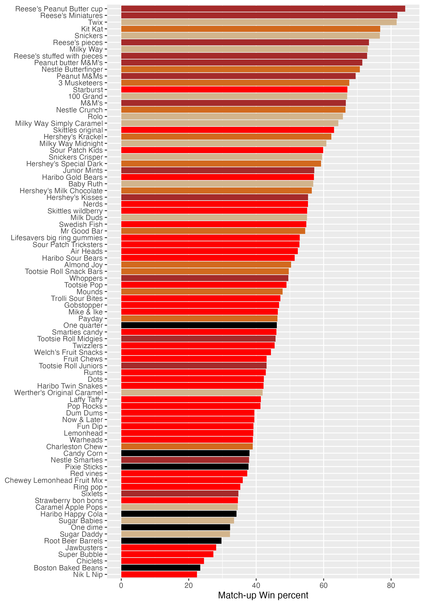

As shown in [Figure 2](#fig-bar) there is terrible colors choices.

> Q17. What is the worst ranked chocolate candy?

The worst chocolate candy is Sixlets. \> Q18. What is the best ranked
fruity candy?

The worst fruity candy is Nik L Nip.

#Take a look at pricepercent Lets make a plot of winpercent vs
pricepercent. the original idea with this is to show what is the best
candy for your money.

``` r
ggplot(candy) +
  aes(winpercent, pricepercent, label =rownames(candy)) +
  geom_point(col=my_cols) +
  geom_text(col=my_cols)
```

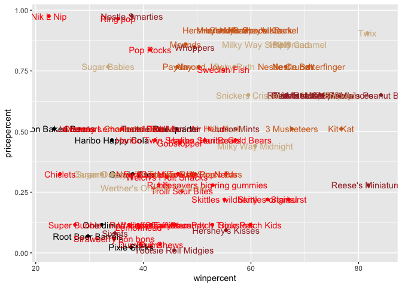

These labels suck so lets try making a new one using ggrepel.

``` r
library(ggrepel)
ggplot(candy) +
  aes(winpercent, pricepercent, label =rownames(candy)) +
  geom_point(col=my_cols) +
  geom_text_repel(col=my_cols)
```

    Warning: ggrepel: 29 unlabeled data points (too many overlaps). Consider
    increasing max.overlaps

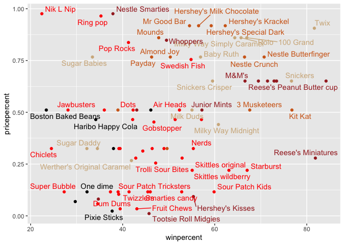

``` r
library(ggrepel)
ggplot(candy) +
  aes(winpercent, pricepercent, label =rownames(candy)) +
  geom_point(col=my_cols) +
  geom_text_repel(col=my_cols, size = 4, max.overlaps = 8)
```

    Warning: ggrepel: 39 unlabeled data points (too many overlaps). Consider
    increasing max.overlaps

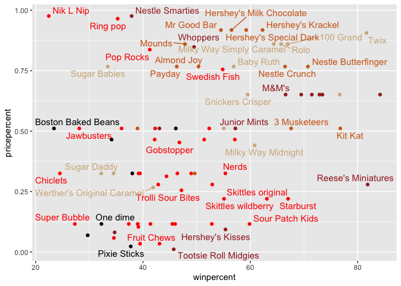

> Q19. Which candy type is the highest ranked in terms of winpercent for
> the least money - i.e. offers the most bang for your buck?

Reece’s miniatures are the best bang for your buck. Highest win percent
but still low pricepercent. However, using the code below, you would
pick tootsie roll midgies.

``` r
ord <- order(candy$pricepercent, decreasing = FALSE)
head( candy[ord,c(11,12)], n=5 )
```

                         pricepercent winpercent
    Tootsie Roll Midgies        0.011   45.73675
    Pixie Sticks                0.023   37.72234
    Dum Dums                    0.034   39.46056
    Fruit Chews                 0.034   43.08892
    Strawberry bon bons         0.058   34.57899

> Q20. What are the top 5 most expensive candy types in the dataset and
> of these which is the least popular?

``` r
ord <- order(candy$pricepercent, decreasing = TRUE)
head( candy[ord,c(11,12)], n=5 )
```

                             pricepercent winpercent
    Nik L Nip                       0.976   22.44534
    Nestle Smarties                 0.976   37.88719
    Ring pop                        0.965   35.29076
    Hershey's Krackel               0.918   62.28448
    Hershey's Milk Chocolate        0.918   56.49050

##explore the correlation within the candy data.

``` r
cij<-cor(candy)
```

``` r
head(cij)
```

                      chocolate     fruity     caramel peanutyalmondy      nougat
    chocolate         1.0000000 -0.7417211  0.24987535     0.37782357  0.25489183
    fruity           -0.7417211  1.0000000 -0.33548538    -0.39928014 -0.26936712
    caramel           0.2498753 -0.3354854  1.00000000     0.05935614  0.32849280
    peanutyalmondy    0.3778236 -0.3992801  0.05935614     1.00000000  0.21311310
    nougat            0.2548918 -0.2693671  0.32849280     0.21311310  1.00000000
    crispedricewafer  0.3412098 -0.2693671  0.21311310    -0.01764631 -0.08974359
                     crispedricewafer       hard        bar   pluribus sugarpercent
    chocolate              0.34120978 -0.3441769  0.5974211 -0.3396752   0.10416906
    fruity                -0.26936712  0.3906775 -0.5150656  0.2997252  -0.03439296
    caramel                0.21311310 -0.1223551  0.3339600 -0.2695850   0.22193335
    peanutyalmondy        -0.01764631 -0.2055566  0.2604196 -0.2061093   0.08788927
    nougat                -0.08974359 -0.1386750  0.5229764 -0.3103388   0.12308135
    crispedricewafer       1.00000000 -0.1386750  0.4237509 -0.2246934   0.06994969
                     pricepercent winpercent
    chocolate           0.5046754  0.6365167
    fruity             -0.4309685 -0.3809381
    caramel             0.2543271  0.2134163
    peanutyalmondy      0.3091532  0.4061922
    nougat              0.1531964  0.1993753
    crispedricewafer    0.3282654  0.3246797

``` r
library(corrplot)
```

    corrplot 0.92 loaded

``` r
corrplot(cij)
```


> Q22. Examining this plot what two variables are anti-correlated
> (i.e. have minus values)?

Chocolate and Fruity is anti-correlated. \> Q23. Similarly, what two
variables are most positively correlated?

Chocolate and winpercent or bar are positively correlated.

``` r
pca <- prcomp(candy, scale = TRUE)
attributes(pca)
```

    $names
    [1] "sdev"     "rotation" "center"   "scale"    "x"       

    $class
    [1] "prcomp"

``` r
summary(pca)
```

    Importance of components:
                              PC1    PC2    PC3     PC4    PC5     PC6     PC7
    Standard deviation     2.0788 1.1378 1.1092 1.07533 0.9518 0.81923 0.81530
    Proportion of Variance 0.3601 0.1079 0.1025 0.09636 0.0755 0.05593 0.05539
    Cumulative Proportion  0.3601 0.4680 0.5705 0.66688 0.7424 0.79830 0.85369
                               PC8     PC9    PC10    PC11    PC12
    Standard deviation     0.74530 0.67824 0.62349 0.43974 0.39760
    Proportion of Variance 0.04629 0.03833 0.03239 0.01611 0.01317
    Cumulative Proportion  0.89998 0.93832 0.97071 0.98683 1.00000

``` r
pc.score.results<- as.data.frame(pca$x)
head(pc.score.results)
```

                        PC1        PC2        PC3        PC4         PC5
    100 Grand    -3.8198617 -0.5935788 -2.1863087 -2.3715957 -0.66236243
    3 Musketeers -2.7960236 -1.5196062  1.4121986  0.6994387 -0.16006665
    One dime      1.2025836  0.1718121  2.0607712 -1.2006782 -0.26977985
    One quarter   0.4486538  0.4519736  1.4764928 -1.0017714 -0.05093737
    Air Heads     0.7028992 -0.5731343 -0.9293893  0.4124566  0.33108524
    Almond Joy   -2.4683383  0.7035501  0.8581089  0.5724974  1.43200435
                         PC6        PC7        PC8        PC9        PC10
    100 Grand    -0.54521840 -0.1434056  0.5772242  0.3791482 -0.15409954
    3 Musketeers  0.38258842  2.0215553 -1.5025750  0.0238327 -0.15523907
    One dime      0.09495053 -0.7722007  0.1556221 -0.4539890 -0.94378362
    One quarter   0.42835404 -0.5908920  0.3591344 -0.6388898  0.09557965
    Air Heads     0.18879160  0.9680808  1.0123933 -1.3830122 -0.57372349
    Almond Joy    1.02227348 -0.6660460  0.6082613 -0.1390599 -0.31277870
                       PC11        PC12
    100 Grand     0.1419038  0.06469883
    3 Musketeers -0.5179272 -0.18394717
    One dime     -0.5158708 -0.51074779
    One quarter  -0.9867194 -0.95827191
    Air Heads    -0.5144537  0.04429924
    Almond Joy    1.0611487  0.18893471

``` r
ggplot(pc.score.results) +
  aes(PC1,PC2, label =rownames(pc.score.results))+
  geom_point(col = my_cols)+
  geom_text_repel(col = my_cols, max.overlaps = 8)+
  labs(title="PCA Candy Space", 
       subtitle = "Chocolate and fruity candy plot")
```

    Warning: ggrepel: 36 unlabeled data points (too many overlaps). Consider
    increasing max.overlaps

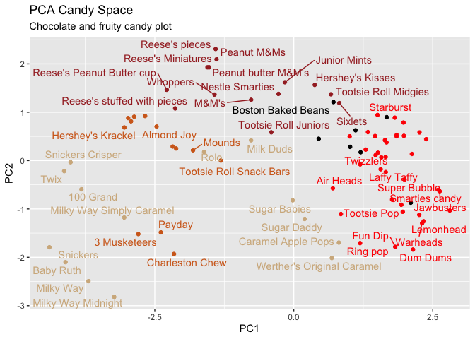

#Loading plots

``` r
pc.loadings <-as.data.frame(pca$rotation)

ggplot(pc.loadings) + 
  aes(PC1, reorder(rownames(pc.loadings),PC1)) +
  geom_col()
```

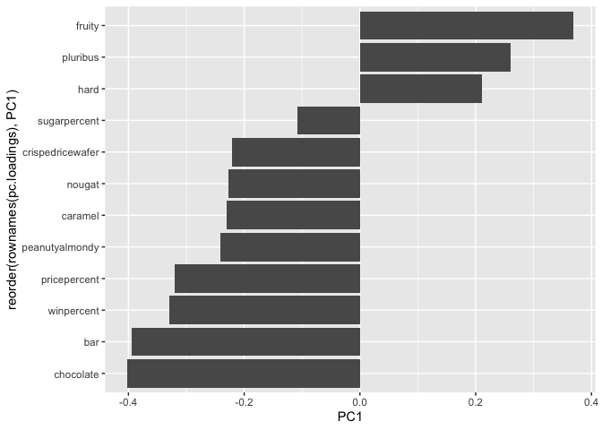

> Q24. What original variables are picked up strongly by PC1 in the
> positive direction? Do these make sense to you?

Fruit, pluribus, and hard are all correlated together (right half) vs
Chocolate and the other factors (left half) are correlated with the most
correlated from bottom up.
