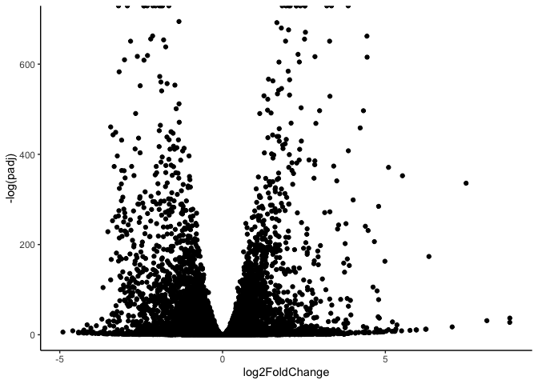

# Class 14: RNAseq mini project
Andrew Sue

## Data import

Must import data (metadate and counts)

``` r
counts <- read.csv("GSE37704_featurecounts.csv", row.names = 1)
metadata <- read.csv("GSE37704_metadata.csv")
```

``` r
head(counts)
```

                    length SRR493366 SRR493367 SRR493368 SRR493369 SRR493370
    ENSG00000186092    918         0         0         0         0         0
    ENSG00000279928    718         0         0         0         0         0
    ENSG00000279457   1982        23        28        29        29        28
    ENSG00000278566    939         0         0         0         0         0
    ENSG00000273547    939         0         0         0         0         0
    ENSG00000187634   3214       124       123       205       207       212
                    SRR493371
    ENSG00000186092         0
    ENSG00000279928         0
    ENSG00000279457        46
    ENSG00000278566         0
    ENSG00000273547         0
    ENSG00000187634       258

``` r
head(metadata)
```

             id     condition
    1 SRR493366 control_sirna
    2 SRR493367 control_sirna
    3 SRR493368 control_sirna
    4 SRR493369      hoxa1_kd
    5 SRR493370      hoxa1_kd
    6 SRR493371      hoxa1_kd

## Data exploration and format confirmation

Now lets confirm data is in the right order/format to associate between
files.

``` r
all(colnames(counts) == metadata$id)
```

    Warning in colnames(counts) == metadata$id: longer object length is not a
    multiple of shorter object length

    [1] FALSE

> Q. Complete the code below to remove the troublesome first column from
> countData

``` r
#Delete the length column since we dont really need it. 

countData <- counts[,-1]
all(colnames(countData) == metadata$id)
```

    [1] TRUE

## Setup for DESeq2

Now lets pre-filter the data and remove all the zero data.

> Q. Complete the code below to filter countData to exclude genes
> (i.e. rows) where we have 0 read count across all samples
> (i.e. columns).

``` r
inds <- rowSums(countData) > 0 #takes the indexees of nonzero values
non.zero.counts <- countData[inds,] #finds those in the data to make new dataaset 
head(non.zero.counts) #visualize it worked 
```

                    SRR493366 SRR493367 SRR493368 SRR493369 SRR493370 SRR493371
    ENSG00000279457        23        28        29        29        28        46
    ENSG00000187634       124       123       205       207       212       258
    ENSG00000188976      1637      1831      2383      1226      1326      1504
    ENSG00000187961       120       153       180       236       255       357
    ENSG00000187583        24        48        65        44        48        64
    ENSG00000187642         4         9        16        14        16        16

Lets look at the number of genes left.

``` r
nrow(non.zero.counts)
```

    [1] 15975

## DESeq analysis

``` r
#/ message: false #This removes the library load message from appearing
library(DESeq2)
```

    Warning: package 'DESeq2' was built under R version 4.3.3

    Loading required package: S4Vectors

    Loading required package: stats4

    Loading required package: BiocGenerics


    Attaching package: 'BiocGenerics'

    The following objects are masked from 'package:stats':

        IQR, mad, sd, var, xtabs

    The following objects are masked from 'package:base':

        anyDuplicated, aperm, append, as.data.frame, basename, cbind,
        colnames, dirname, do.call, duplicated, eval, evalq, Filter, Find,
        get, grep, grepl, intersect, is.unsorted, lapply, Map, mapply,
        match, mget, order, paste, pmax, pmax.int, pmin, pmin.int,
        Position, rank, rbind, Reduce, rownames, sapply, setdiff, sort,
        table, tapply, union, unique, unsplit, which.max, which.min


    Attaching package: 'S4Vectors'

    The following object is masked from 'package:utils':

        findMatches

    The following objects are masked from 'package:base':

        expand.grid, I, unname

    Loading required package: IRanges

    Loading required package: GenomicRanges

    Loading required package: GenomeInfoDb

    Warning: package 'GenomeInfoDb' was built under R version 4.3.3

    Loading required package: SummarizedExperiment

    Loading required package: MatrixGenerics

    Loading required package: matrixStats


    Attaching package: 'MatrixGenerics'

    The following objects are masked from 'package:matrixStats':

        colAlls, colAnyNAs, colAnys, colAvgsPerRowSet, colCollapse,
        colCounts, colCummaxs, colCummins, colCumprods, colCumsums,
        colDiffs, colIQRDiffs, colIQRs, colLogSumExps, colMadDiffs,
        colMads, colMaxs, colMeans2, colMedians, colMins, colOrderStats,
        colProds, colQuantiles, colRanges, colRanks, colSdDiffs, colSds,
        colSums2, colTabulates, colVarDiffs, colVars, colWeightedMads,
        colWeightedMeans, colWeightedMedians, colWeightedSds,
        colWeightedVars, rowAlls, rowAnyNAs, rowAnys, rowAvgsPerColSet,
        rowCollapse, rowCounts, rowCummaxs, rowCummins, rowCumprods,
        rowCumsums, rowDiffs, rowIQRDiffs, rowIQRs, rowLogSumExps,
        rowMadDiffs, rowMads, rowMaxs, rowMeans2, rowMedians, rowMins,
        rowOrderStats, rowProds, rowQuantiles, rowRanges, rowRanks,
        rowSdDiffs, rowSds, rowSums2, rowTabulates, rowVarDiffs, rowVars,
        rowWeightedMads, rowWeightedMeans, rowWeightedMedians,
        rowWeightedSds, rowWeightedVars

    Loading required package: Biobase

    Welcome to Bioconductor

        Vignettes contain introductory material; view with
        'browseVignettes()'. To cite Bioconductor, see
        'citation("Biobase")', and for packages 'citation("pkgname")'.


    Attaching package: 'Biobase'

    The following object is masked from 'package:MatrixGenerics':

        rowMedians

    The following objects are masked from 'package:matrixStats':

        anyMissing, rowMedians

``` r
dds <- DESeqDataSetFromMatrix(non.zero.counts, metadata, ~condition) #Design is what the colData reperesents to the countData
```

    Warning in DESeqDataSet(se, design = design, ignoreRank): some variables in
    design formula are characters, converting to factors

## Result extraction and visualization

``` r
dds <- DESeq(dds)
```

    estimating size factors

    estimating dispersions

    gene-wise dispersion estimates

    mean-dispersion relationship

    final dispersion estimates

    fitting model and testing

``` r
res <- results(dds)
head(res)
```

    log2 fold change (MLE): condition hoxa1 kd vs control sirna 
    Wald test p-value: condition hoxa1 kd vs control sirna 
    DataFrame with 6 rows and 6 columns
                     baseMean log2FoldChange     lfcSE       stat      pvalue
                    <numeric>      <numeric> <numeric>  <numeric>   <numeric>
    ENSG00000279457   29.9136      0.1792571 0.3248216   0.551863 5.81042e-01
    ENSG00000187634  183.2296      0.4264571 0.1402658   3.040350 2.36304e-03
    ENSG00000188976 1651.1881     -0.6927205 0.0548465 -12.630158 1.43989e-36
    ENSG00000187961  209.6379      0.7297556 0.1318599   5.534326 3.12428e-08
    ENSG00000187583   47.2551      0.0405765 0.2718928   0.149237 8.81366e-01
    ENSG00000187642   11.9798      0.5428105 0.5215599   1.040744 2.97994e-01
                           padj
                      <numeric>
    ENSG00000279457 6.86555e-01
    ENSG00000187634 5.15718e-03
    ENSG00000188976 1.76549e-35
    ENSG00000187961 1.13413e-07
    ENSG00000187583 9.19031e-01
    ENSG00000187642 4.03379e-01

``` r
library(ggplot2)
library(ggrepel)
```

``` r
#ggplot requires everything to be a dataframe (not just values)
res2 <- as.data.frame(res)
```

``` r
ggplot(res2) +
  aes(log2FoldChange, -log(padj)) + 
  geom_point() + 
  theme_classic()
```

    Warning: Removed 1237 rows containing missing values or values outside the scale range
    (`geom_point()`).



Lets add color to it. We cannot set variables to it as there is no
distinguishing category to actually be able to set default colors.
Therefore, we must make our own color settings.

``` r
mycols <- rep("gray", nrow(res2)) #make entire dataframe one color to start
mycols[abs(res2$log2FoldChange) > 2] <- "blue" #sets the fold change we care about
mycols[res2$padj > 0.05] <- "red" #sets the p-value significance of 0.05 
```

``` r
ggplot(res2) +
  aes(log2FoldChange, -log(padj)) + 
  geom_point(col = mycols) + 
  theme_classic()
```

    Warning: Removed 1237 rows containing missing values or values outside the scale range
    (`geom_point()`).


# Annotation

Now we want to know what the points are. So we need to annotate our data
using the `AnnotationDBI` and our database package that it will pull
from.

``` r
library(AnnotationDbi)
library(org.Hs.eg.db)
```

``` r
columns(org.Hs.eg.db) #These are all the databases useable to reference
```

     [1] "ACCNUM"       "ALIAS"        "ENSEMBL"      "ENSEMBLPROT"  "ENSEMBLTRANS"
     [6] "ENTREZID"     "ENZYME"       "EVIDENCE"     "EVIDENCEALL"  "GENENAME"    
    [11] "GENETYPE"     "GO"           "GOALL"        "IPI"          "MAP"         
    [16] "OMIM"         "ONTOLOGY"     "ONTOLOGYALL"  "PATH"         "PFAM"        
    [21] "PMID"         "PROSITE"      "REFSEQ"       "SYMBOL"       "UCSCKG"      
    [26] "UNIPROT"     

We can use these “columns” within `mapIds()` function to translate the
ENS IDs into what we want.

``` r
res2$symbol <- mapIds(org.Hs.eg.db,
                     keys=row.names(res2), # Our gene names
                     keytype="ENSEMBL", # The format of our gene names
                     column="SYMBOL", # The new format we want to add
                     multiVals="first") #default is first but can be changed
```

    'select()' returned 1:many mapping between keys and columns

``` r
res2$entrez <- mapIds(org.Hs.eg.db,
                     keys=row.names(res2), # Our gene names
                     keytype="ENSEMBL", # The format of our gene names
                     column="ENTREZID", # The new format we want to add
                     multiVals="first")
```

    'select()' returned 1:many mapping between keys and columns

``` r
res2$uniprot <- mapIds(org.Hs.eg.db,
                     keys=row.names(res2),
                     keytype="ENSEMBL",
                     column="UNIPROT",
                     multiVals="first")
```

    'select()' returned 1:many mapping between keys and columns

``` r
res2$genename <- mapIds(org.Hs.eg.db,
                     keys=row.names(res2),
                     keytype="ENSEMBL",
                     column="GENENAME",
                     multiVals="first")
```

    'select()' returned 1:many mapping between keys and columns

``` r
head(res2)
```

                      baseMean log2FoldChange      lfcSE        stat       pvalue
    ENSG00000279457   29.91358     0.17925708 0.32482157   0.5518632 5.810421e-01
    ENSG00000187634  183.22965     0.42645712 0.14026582   3.0403495 2.363038e-03
    ENSG00000188976 1651.18808    -0.69272046 0.05484654 -12.6301577 1.439894e-36
    ENSG00000187961  209.63794     0.72975561 0.13185990   5.5343255 3.124283e-08
    ENSG00000187583   47.25512     0.04057653 0.27189281   0.1492372 8.813664e-01
    ENSG00000187642   11.97975     0.54281049 0.52155985   1.0407444 2.979942e-01
                            padj  symbol entrez uniprot
    ENSG00000279457 6.865548e-01    <NA>   <NA>    <NA>
    ENSG00000187634 5.157182e-03  SAMD11 148398  Q96NU1
    ENSG00000188976 1.765488e-35   NOC2L  26155  Q9Y3T9
    ENSG00000187961 1.134130e-07  KLHL17 339451  Q6TDP4
    ENSG00000187583 9.190306e-01 PLEKHN1  84069  Q494U1
    ENSG00000187642 4.033793e-01   PERM1  84808  Q5SV97
                                                                    genename
    ENSG00000279457                                                     <NA>
    ENSG00000187634                 sterile alpha motif domain containing 11
    ENSG00000188976 NOC2 like nucleolar associated transcriptional repressor
    ENSG00000187961                              kelch like family member 17
    ENSG00000187583                 pleckstrin homology domain containing N1
    ENSG00000187642             PPARGC1 and ESRR induced regulator, muscle 1

``` r
res2 = res2[order(res$pvalue),]
write.csv(res2, file ="deseq_results.csv")
```

## Pathway analysis (KEGG and GO analysis and graphs)

BiocManager::install(c(“pathview”, “gage”, “gageData”))

``` r
#/ message: false
library(pathview)
```

    ##############################################################################
    Pathview is an open source software package distributed under GNU General
    Public License version 3 (GPLv3). Details of GPLv3 is available at
    http://www.gnu.org/licenses/gpl-3.0.html. Particullary, users are required to
    formally cite the original Pathview paper (not just mention it) in publications
    or products. For details, do citation("pathview") within R.

    The pathview downloads and uses KEGG data. Non-academic uses may require a KEGG
    license agreement (details at http://www.kegg.jp/kegg/legal.html).
    ##############################################################################

``` r
library(gage)
```

``` r
library(gageData)
```

Gage function wants as input of a vector, in this case, fold changes
with names of the genes in a format that matches the database/geneset we
are going to use.

``` r
data(kegg.sets.hs)
data(sigmet.idx.hs)

# Focus on signaling and metabolic pathways only
kegg.sets.hs = kegg.sets.hs[sigmet.idx.hs]

# Examine the first 3 pathways
head(kegg.sets.hs, 3)
```

    $`hsa00232 Caffeine metabolism`
    [1] "10"   "1544" "1548" "1549" "1553" "7498" "9"   

    $`hsa00983 Drug metabolism - other enzymes`
     [1] "10"     "1066"   "10720"  "10941"  "151531" "1548"   "1549"   "1551"  
     [9] "1553"   "1576"   "1577"   "1806"   "1807"   "1890"   "221223" "2990"  
    [17] "3251"   "3614"   "3615"   "3704"   "51733"  "54490"  "54575"  "54576" 
    [25] "54577"  "54578"  "54579"  "54600"  "54657"  "54658"  "54659"  "54963" 
    [33] "574537" "64816"  "7083"   "7084"   "7172"   "7363"   "7364"   "7365"  
    [41] "7366"   "7367"   "7371"   "7372"   "7378"   "7498"   "79799"  "83549" 
    [49] "8824"   "8833"   "9"      "978"   

    $`hsa00230 Purine metabolism`
      [1] "100"    "10201"  "10606"  "10621"  "10622"  "10623"  "107"    "10714" 
      [9] "108"    "10846"  "109"    "111"    "11128"  "11164"  "112"    "113"   
     [17] "114"    "115"    "122481" "122622" "124583" "132"    "158"    "159"   
     [25] "1633"   "171568" "1716"   "196883" "203"    "204"    "205"    "221823"
     [33] "2272"   "22978"  "23649"  "246721" "25885"  "2618"   "26289"  "270"   
     [41] "271"    "27115"  "272"    "2766"   "2977"   "2982"   "2983"   "2984"  
     [49] "2986"   "2987"   "29922"  "3000"   "30833"  "30834"  "318"    "3251"  
     [57] "353"    "3614"   "3615"   "3704"   "377841" "471"    "4830"   "4831"  
     [65] "4832"   "4833"   "4860"   "4881"   "4882"   "4907"   "50484"  "50940" 
     [73] "51082"  "51251"  "51292"  "5136"   "5137"   "5138"   "5139"   "5140"  
     [81] "5141"   "5142"   "5143"   "5144"   "5145"   "5146"   "5147"   "5148"  
     [89] "5149"   "5150"   "5151"   "5152"   "5153"   "5158"   "5167"   "5169"  
     [97] "51728"  "5198"   "5236"   "5313"   "5315"   "53343"  "54107"  "5422"  
    [105] "5424"   "5425"   "5426"   "5427"   "5430"   "5431"   "5432"   "5433"  
    [113] "5434"   "5435"   "5436"   "5437"   "5438"   "5439"   "5440"   "5441"  
    [121] "5471"   "548644" "55276"  "5557"   "5558"   "55703"  "55811"  "55821" 
    [129] "5631"   "5634"   "56655"  "56953"  "56985"  "57804"  "58497"  "6240"  
    [137] "6241"   "64425"  "646625" "654364" "661"    "7498"   "8382"   "84172" 
    [145] "84265"  "84284"  "84618"  "8622"   "8654"   "87178"  "8833"   "9060"  
    [153] "9061"   "93034"  "953"    "9533"   "954"    "955"    "956"    "957"   
    [161] "9583"   "9615"  

``` r
foldchanges <- res2$log2FoldChange
names(foldchanges) <- res2$entrez
head(foldchanges)
```

         1266     54855      1465     51232      2034      2317 
    -2.422719  3.201955 -2.313738 -2.059631 -1.888019 -1.649792 

``` r
 # Get the results
keggres = gage(foldchanges, gsets=kegg.sets.hs)
```

``` r
attributes(keggres)
```

    $names
    [1] "greater" "less"    "stats"  

``` r
# Look at the first few down (less) pathways
head(keggres$less)
```

                                             p.geomean stat.mean        p.val
    hsa04110 Cell cycle                   8.995727e-06 -4.378644 8.995727e-06
    hsa03030 DNA replication              9.424076e-05 -3.951803 9.424076e-05
    hsa03013 RNA transport                1.375901e-03 -3.028500 1.375901e-03
    hsa03440 Homologous recombination     3.066756e-03 -2.852899 3.066756e-03
    hsa04114 Oocyte meiosis               3.784520e-03 -2.698128 3.784520e-03
    hsa00010 Glycolysis / Gluconeogenesis 8.961413e-03 -2.405398 8.961413e-03
                                                q.val set.size         exp1
    hsa04110 Cell cycle                   0.001448312      121 8.995727e-06
    hsa03030 DNA replication              0.007586381       36 9.424076e-05
    hsa03013 RNA transport                0.073840037      144 1.375901e-03
    hsa03440 Homologous recombination     0.121861535       28 3.066756e-03
    hsa04114 Oocyte meiosis               0.121861535      102 3.784520e-03
    hsa00010 Glycolysis / Gluconeogenesis 0.212222694       53 8.961413e-03

``` r
pathview(gene.data=foldchanges, pathway.id="hsa04110")
```

    'select()' returned 1:1 mapping between keys and columns

    Info: Working in directory /Users/andrew/Documents/School /SDSU /PhD 2023-/2023-2024/UCSD/BGGN213_Bioinformatics/Class14_RNAseq_analysis

    Info: Writing image file hsa04110.pathview.png

``` r
# A different PDF based output of the same data
pathview(gene.data=foldchanges, pathway.id="hsa04110", kegg.native=FALSE)
```

    'select()' returned 1:1 mapping between keys and columns

    Warning: reconcile groups sharing member nodes!

         [,1] [,2] 
    [1,] "9"  "300"
    [2,] "9"  "306"

    Info: Working in directory /Users/andrew/Documents/School /SDSU /PhD 2023-/2023-2024/UCSD/BGGN213_Bioinformatics/Class14_RNAseq_analysis

    Info: Writing image file hsa04110.pathview.pdf

``` r
## Focus on top 5 upregulated pathways here for demo purposes only
keggrespathways <- rownames(keggres$greater)[1:5]

# Extract the 8 character long IDs part of each string
keggresids = substr(keggrespathways, start=1, stop=8)
keggresids
```

    [1] "hsa04640" "hsa04630" "hsa00140" "hsa04142" "hsa04330"

``` r
pathview(gene.data=foldchanges, pathway.id=keggresids, species="hsa")
```

    'select()' returned 1:1 mapping between keys and columns

    Info: Working in directory /Users/andrew/Documents/School /SDSU /PhD 2023-/2023-2024/UCSD/BGGN213_Bioinformatics/Class14_RNAseq_analysis

    Info: Writing image file hsa04640.pathview.png

    'select()' returned 1:1 mapping between keys and columns

    Info: Working in directory /Users/andrew/Documents/School /SDSU /PhD 2023-/2023-2024/UCSD/BGGN213_Bioinformatics/Class14_RNAseq_analysis

    Info: Writing image file hsa04630.pathview.png

    'select()' returned 1:1 mapping between keys and columns

    Info: Working in directory /Users/andrew/Documents/School /SDSU /PhD 2023-/2023-2024/UCSD/BGGN213_Bioinformatics/Class14_RNAseq_analysis

    Info: Writing image file hsa00140.pathview.png

    'select()' returned 1:1 mapping between keys and columns

    Info: Working in directory /Users/andrew/Documents/School /SDSU /PhD 2023-/2023-2024/UCSD/BGGN213_Bioinformatics/Class14_RNAseq_analysis

    Info: Writing image file hsa04142.pathview.png

    Info: some node width is different from others, and hence adjusted!

    'select()' returned 1:1 mapping between keys and columns

    Info: Working in directory /Users/andrew/Documents/School /SDSU /PhD 2023-/2023-2024/UCSD/BGGN213_Bioinformatics/Class14_RNAseq_analysis

    Info: Writing image file hsa04330.pathview.png

## Gene ontology (GO)

``` r
data(go.sets.hs)
data(go.subs.hs)

# Focus on Biological Process subset of GO
gobpsets <- go.sets.hs[go.subs.hs$BP]

gobpres <- gage(foldchanges, gsets=gobpsets, same.dir=TRUE)

lapply(gobpres, head)
```

    $greater
                                                 p.geomean stat.mean        p.val
    GO:0007156 homophilic cell adhesion       8.519724e-05  3.824205 8.519724e-05
    GO:0002009 morphogenesis of an epithelium 1.396681e-04  3.653886 1.396681e-04
    GO:0048729 tissue morphogenesis           1.432451e-04  3.643242 1.432451e-04
    GO:0007610 behavior                       1.925222e-04  3.565432 1.925222e-04
    GO:0060562 epithelial tube morphogenesis  5.932837e-04  3.261376 5.932837e-04
    GO:0035295 tube development               5.953254e-04  3.253665 5.953254e-04
                                                  q.val set.size         exp1
    GO:0007156 homophilic cell adhesion       0.1952430      113 8.519724e-05
    GO:0002009 morphogenesis of an epithelium 0.1952430      339 1.396681e-04
    GO:0048729 tissue morphogenesis           0.1952430      424 1.432451e-04
    GO:0007610 behavior                       0.1968058      426 1.925222e-04
    GO:0060562 epithelial tube morphogenesis  0.3566193      257 5.932837e-04
    GO:0035295 tube development               0.3566193      391 5.953254e-04

    $less
                                                p.geomean stat.mean        p.val
    GO:0048285 organelle fission             1.536227e-15 -8.063910 1.536227e-15
    GO:0000280 nuclear division              4.286961e-15 -7.939217 4.286961e-15
    GO:0007067 mitosis                       4.286961e-15 -7.939217 4.286961e-15
    GO:0000087 M phase of mitotic cell cycle 1.169934e-14 -7.797496 1.169934e-14
    GO:0007059 chromosome segregation        2.028624e-11 -6.878340 2.028624e-11
    GO:0000236 mitotic prometaphase          1.729553e-10 -6.695966 1.729553e-10
                                                    q.val set.size         exp1
    GO:0048285 organelle fission             5.843127e-12      376 1.536227e-15
    GO:0000280 nuclear division              5.843127e-12      352 4.286961e-15
    GO:0007067 mitosis                       5.843127e-12      352 4.286961e-15
    GO:0000087 M phase of mitotic cell cycle 1.195965e-11      362 1.169934e-14
    GO:0007059 chromosome segregation        1.659009e-08      142 2.028624e-11
    GO:0000236 mitotic prometaphase          1.178690e-07       84 1.729553e-10

    $stats
                                              stat.mean     exp1
    GO:0007156 homophilic cell adhesion        3.824205 3.824205
    GO:0002009 morphogenesis of an epithelium  3.653886 3.653886
    GO:0048729 tissue morphogenesis            3.643242 3.643242
    GO:0007610 behavior                        3.565432 3.565432
    GO:0060562 epithelial tube morphogenesis   3.261376 3.261376
    GO:0035295 tube development                3.253665 3.253665

## Reactome analysis

We need a list of genes as a text file for using the reactome online
site

Let’s start with our genes that haev a abs(logFC) \> 2 and a P-value \<
0.05.

``` r
inds <- abs(res2$log2FoldChange) > 2 & (res2$padj < 0.05)
mygenes <- res2$symbol[inds]
cat(head(mygenes), sep= "\n")
```

    CNN3
    TENT5C
    CSRP1
    CRIM1
    F2RL1
    SOX4

``` r
write.table(mygenes, file = "mygenes.txt", quote = FALSE, row.names = FALSE, col.names = FALSE)
```


