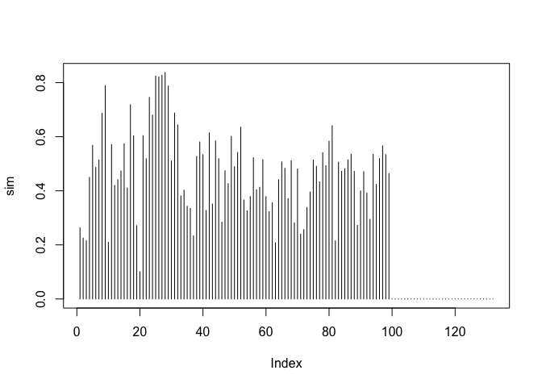
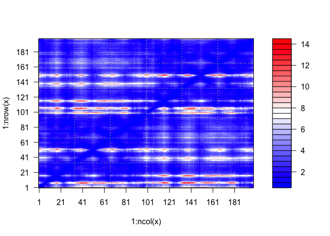
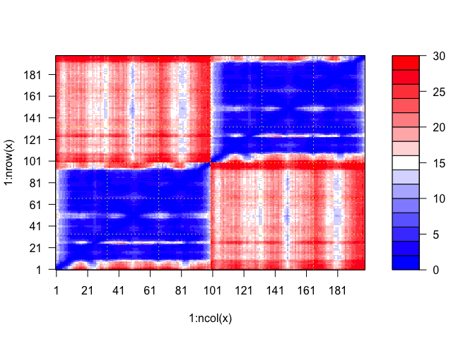
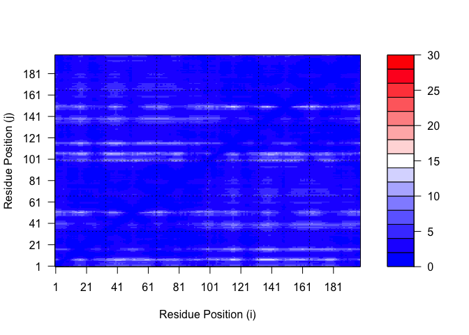
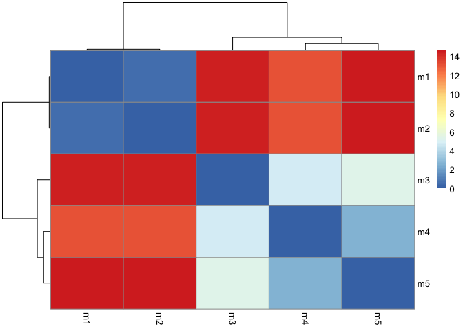
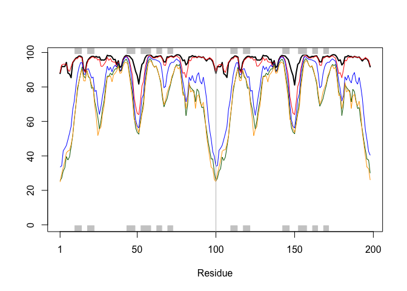
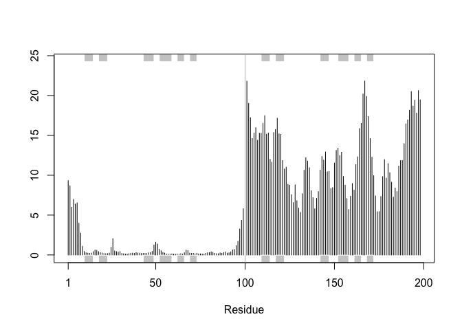

# Class 11: Alpha Fold
Andrew Sue (PID: A13006809)

#Alpha Fold

AlphaFold is a new bioinformatics tool developed by DeepMind that uses
AI to predict protein structure - with high reliability!

We can run AlphaFold on our own computers by installing it or we can run
on GoogleColab (without needing to install anything) via:
https://github.com/sokrypton/ColabFold. To run locally, it is simply a
matter of copying the code from above and putting it directly into R.

If you run the it on Google Colab, you will get a zip folder. Make sure
to move it into your project folder to make it accessible.

Since it is a folder, we need to be able to read it in. Use below:

``` r
#Read in name of folder 
pth <- "HIV1dimer_23119/"

list.files(path=pth)
```

     [1] "cite.bibtex"                                                                   
     [2] "config.json"                                                                   
     [3] "HIV1dimer_23119_coverage.png"                                                  
     [4] "HIV1dimer_23119_env"                                                           
     [5] "HIV1dimer_23119_pae.png"                                                       
     [6] "HIV1dimer_23119_plddt.png"                                                     
     [7] "HIV1dimer_23119_predicted_aligned_error_v1.json"                               
     [8] "HIV1dimer_23119_scores_rank_001_alphafold2_multimer_v3_model_1_seed_000.json"  
     [9] "HIV1dimer_23119_scores_rank_002_alphafold2_multimer_v3_model_5_seed_000.json"  
    [10] "HIV1dimer_23119_scores_rank_003_alphafold2_multimer_v3_model_4_seed_000.json"  
    [11] "HIV1dimer_23119_scores_rank_004_alphafold2_multimer_v3_model_2_seed_000.json"  
    [12] "HIV1dimer_23119_scores_rank_005_alphafold2_multimer_v3_model_3_seed_000.json"  
    [13] "HIV1dimer_23119_unrelaxed_rank_001_alphafold2_multimer_v3_model_1_seed_000.pdb"
    [14] "HIV1dimer_23119_unrelaxed_rank_002_alphafold2_multimer_v3_model_5_seed_000.pdb"
    [15] "HIV1dimer_23119_unrelaxed_rank_003_alphafold2_multimer_v3_model_4_seed_000.pdb"
    [16] "HIV1dimer_23119_unrelaxed_rank_004_alphafold2_multimer_v3_model_2_seed_000.pdb"
    [17] "HIV1dimer_23119_unrelaxed_rank_005_alphafold2_multimer_v3_model_3_seed_000.pdb"
    [18] "HIV1dimer_23119.a3m"                                                           
    [19] "HIV1dimer_23119.csv"                                                           
    [20] "HIV1dimer_23119.done.txt"                                                      
    [21] "log.txt"                                                                       

The .a3m file is your multiple sequence alignment (MSA) file in the
AlphaFold output.

Now we want to return a single file or file of interest. The
`list.files()` function has an argument `pattern =` that we can use to
do so. To get the full path and be able to actually open file, you need
to call or find the path. Use another argument `full.names =` and set as
`TRUE`.

``` r
aln.file <- list.files(path=pth, pattern = ".a3m", full.names = TRUE)
```

``` r
library(bio3d)
# to.upper arguments converts all the letters to uppercase. 
aln <- read.fasta(aln.file, to.upper = TRUE)
```

    [1] " ** Duplicated sequence id's: 101 **"
    [2] " ** Duplicated sequence id's: 101 **"

``` r
attributes(aln)
```

    $names
    [1] "id"   "ali"  "call"

    $class
    [1] "fasta"

This is a big alignment / large FASTA file. Not worth printing. So use
dim to get overall picture.

``` r
dim(aln$ali)
```

    [1] 5378  132

Lets calculate sum summary info such as conservation scores.

``` r
#conserv is a function within the Bio3D package. 
sim <- conserv(aln)
```

Highest values (1) shows the location of conservation of amino acids.

``` r
plot(sim, typ = "h")
```



We can summarize the conserved column (the ones with high scores above)
via a consensus sequence.

``` r
#default cutoff is 0.6, which might be too low. There are multiple outputs, so call just the $seq to get the highest conserved amino acids. 
consensus(aln, cutoff = 0.9)$seq
```

      [1] "-" "-" "-" "-" "-" "-" "-" "-" "-" "-" "-" "-" "-" "-" "-" "-" "-" "-"
     [19] "-" "-" "-" "-" "-" "-" "D" "T" "G" "A" "-" "-" "-" "-" "-" "-" "-" "-"
     [37] "-" "-" "-" "-" "-" "-" "-" "-" "-" "-" "-" "-" "-" "-" "-" "-" "-" "-"
     [55] "-" "-" "-" "-" "-" "-" "-" "-" "-" "-" "-" "-" "-" "-" "-" "-" "-" "-"
     [73] "-" "-" "-" "-" "-" "-" "-" "-" "-" "-" "-" "-" "-" "-" "-" "-" "-" "-"
     [91] "-" "-" "-" "-" "-" "-" "-" "-" "-" "-" "-" "-" "-" "-" "-" "-" "-" "-"
    [109] "-" "-" "-" "-" "-" "-" "-" "-" "-" "-" "-" "-" "-" "-" "-" "-" "-" "-"
    [127] "-" "-" "-" "-" "-" "-"

Read all out structure files into R

Read the PAE (predicted alignment error files) into R to make sense of
the different multichain models. These are stored in the .json files.

The PAE from AlphaFold is a metric for the reliability of protein
structure predictions.

``` r
library(jsonlite)
```

Now we need to find out json files. There are multiple json files so
make sure you are reading into the right ones. We will cheat below but
you can use this syntax to modify and call files `.*model.*\\.json`
where the `*` means anything before.

``` r
pae.files<- list.files(path=pth, pattern = "000.json", full.names = TRUE)
```

``` r
pae5 <- read_json(pae.files[5], simplifyVector = TRUE)
pae1 <- read_json(pae.files[1], simplifyVector = TRUE)
```

``` r
dim(pae1$pae)
```

    [1] 198 198

This is a good predicted alignment. Low PAE score.

``` r
plot.dmat(pae1$pae)
```



This is a bad PAE score as shown with red and blue portions in graph.

``` r
plot.dmat(pae5$pae)
```



``` r
plot.dmat(pae1$pae, 
          xlab="Residue Position (i)",
          ylab="Residue Position (j)",
          grid.col = "black",
          zlim=c(0,30))
```



To visualize the predicted structures like you would in Molstar, we can
customize the parameters here like we would there.

In this section we will read the results of the more complicated HIV-Pr
dimer AlphaFold2 models into R with the help of the `Bio3D` package. You
can do the same thing for the monomer models if you wish but again they
will be less interesting as the monomer is not physiologically relevant.

For tidiness we can move our AlphaFold results directory into our
RStudio project directory. In this example my results are in the
directory `pth` (set above). You should change this to match your
directory/folder name.

``` r
# Change this for YOUR results dir name
# results_dir <- "hivprdimer_23119/" this was already written above

pth
```

    [1] "HIV1dimer_23119/"

Our visualized predicted structures are stored in the PDB files within
the output. So select them as we did above.

``` r
# File names for all PDB models
pdb_files <- list.files(path=pth,
                        pattern="*.pdb",
                        full.names = TRUE)

# Print our PDB file names
basename(pdb_files)
```

    [1] "HIV1dimer_23119_unrelaxed_rank_001_alphafold2_multimer_v3_model_1_seed_000.pdb"
    [2] "HIV1dimer_23119_unrelaxed_rank_002_alphafold2_multimer_v3_model_5_seed_000.pdb"
    [3] "HIV1dimer_23119_unrelaxed_rank_003_alphafold2_multimer_v3_model_4_seed_000.pdb"
    [4] "HIV1dimer_23119_unrelaxed_rank_004_alphafold2_multimer_v3_model_2_seed_000.pdb"
    [5] "HIV1dimer_23119_unrelaxed_rank_005_alphafold2_multimer_v3_model_3_seed_000.pdb"

``` r
library(bio3d)

# Read all data from Models 
#  and superpose/fit coords
pdbs <- pdbaln(pdb_files, fit=TRUE, exefile="msa")
```

    Reading PDB files:
    HIV1dimer_23119//HIV1dimer_23119_unrelaxed_rank_001_alphafold2_multimer_v3_model_1_seed_000.pdb
    HIV1dimer_23119//HIV1dimer_23119_unrelaxed_rank_002_alphafold2_multimer_v3_model_5_seed_000.pdb
    HIV1dimer_23119//HIV1dimer_23119_unrelaxed_rank_003_alphafold2_multimer_v3_model_4_seed_000.pdb
    HIV1dimer_23119//HIV1dimer_23119_unrelaxed_rank_004_alphafold2_multimer_v3_model_2_seed_000.pdb
    HIV1dimer_23119//HIV1dimer_23119_unrelaxed_rank_005_alphafold2_multimer_v3_model_3_seed_000.pdb
    .....

    Extracting sequences

    pdb/seq: 1   name: HIV1dimer_23119//HIV1dimer_23119_unrelaxed_rank_001_alphafold2_multimer_v3_model_1_seed_000.pdb 
    pdb/seq: 2   name: HIV1dimer_23119//HIV1dimer_23119_unrelaxed_rank_002_alphafold2_multimer_v3_model_5_seed_000.pdb 
    pdb/seq: 3   name: HIV1dimer_23119//HIV1dimer_23119_unrelaxed_rank_003_alphafold2_multimer_v3_model_4_seed_000.pdb 
    pdb/seq: 4   name: HIV1dimer_23119//HIV1dimer_23119_unrelaxed_rank_004_alphafold2_multimer_v3_model_2_seed_000.pdb 
    pdb/seq: 5   name: HIV1dimer_23119//HIV1dimer_23119_unrelaxed_rank_005_alphafold2_multimer_v3_model_3_seed_000.pdb 

If your `pdbaln()` function gives an error message then you likely do
not have the msa package from BioConductor installed correctly. You will
need to run `install.packages("BiocManager")` and then
`BiocManager::install("msa")` in your console.

A quick view of model sequences - this should be a boring alignment in
the sense that all sequences are the same.

``` r
pdbs
```

                                   1        .         .         .         .         50 
    [Truncated_Name:1]HIV1dimer_   PQITLWQRPLVTIKIGGQLKEALLDTGADDTVLEEMSLPGRWKPKMIGGI
    [Truncated_Name:2]HIV1dimer_   PQITLWQRPLVTIKIGGQLKEALLDTGADDTVLEEMSLPGRWKPKMIGGI
    [Truncated_Name:3]HIV1dimer_   PQITLWQRPLVTIKIGGQLKEALLDTGADDTVLEEMSLPGRWKPKMIGGI
    [Truncated_Name:4]HIV1dimer_   PQITLWQRPLVTIKIGGQLKEALLDTGADDTVLEEMSLPGRWKPKMIGGI
    [Truncated_Name:5]HIV1dimer_   PQITLWQRPLVTIKIGGQLKEALLDTGADDTVLEEMSLPGRWKPKMIGGI
                                   ************************************************** 
                                   1        .         .         .         .         50 

                                  51        .         .         .         .         100 
    [Truncated_Name:1]HIV1dimer_   GGFIKVRQYDQILIEICGHKAIGTVLVGPTPVNIIGRNLLTQIGCTLNFP
    [Truncated_Name:2]HIV1dimer_   GGFIKVRQYDQILIEICGHKAIGTVLVGPTPVNIIGRNLLTQIGCTLNFP
    [Truncated_Name:3]HIV1dimer_   GGFIKVRQYDQILIEICGHKAIGTVLVGPTPVNIIGRNLLTQIGCTLNFP
    [Truncated_Name:4]HIV1dimer_   GGFIKVRQYDQILIEICGHKAIGTVLVGPTPVNIIGRNLLTQIGCTLNFP
    [Truncated_Name:5]HIV1dimer_   GGFIKVRQYDQILIEICGHKAIGTVLVGPTPVNIIGRNLLTQIGCTLNFP
                                   ************************************************** 
                                  51        .         .         .         .         100 

                                 101        .         .         .         .         150 
    [Truncated_Name:1]HIV1dimer_   QITLWQRPLVTIKIGGQLKEALLDTGADDTVLEEMSLPGRWKPKMIGGIG
    [Truncated_Name:2]HIV1dimer_   QITLWQRPLVTIKIGGQLKEALLDTGADDTVLEEMSLPGRWKPKMIGGIG
    [Truncated_Name:3]HIV1dimer_   QITLWQRPLVTIKIGGQLKEALLDTGADDTVLEEMSLPGRWKPKMIGGIG
    [Truncated_Name:4]HIV1dimer_   QITLWQRPLVTIKIGGQLKEALLDTGADDTVLEEMSLPGRWKPKMIGGIG
    [Truncated_Name:5]HIV1dimer_   QITLWQRPLVTIKIGGQLKEALLDTGADDTVLEEMSLPGRWKPKMIGGIG
                                   ************************************************** 
                                 101        .         .         .         .         150 

                                 151        .         .         .         .       198 
    [Truncated_Name:1]HIV1dimer_   GFIKVRQYDQILIEICGHKAIGTVLVGPTPVNIIGRNLLTQIGCTLNF
    [Truncated_Name:2]HIV1dimer_   GFIKVRQYDQILIEICGHKAIGTVLVGPTPVNIIGRNLLTQIGCTLNF
    [Truncated_Name:3]HIV1dimer_   GFIKVRQYDQILIEICGHKAIGTVLVGPTPVNIIGRNLLTQIGCTLNF
    [Truncated_Name:4]HIV1dimer_   GFIKVRQYDQILIEICGHKAIGTVLVGPTPVNIIGRNLLTQIGCTLNF
    [Truncated_Name:5]HIV1dimer_   GFIKVRQYDQILIEICGHKAIGTVLVGPTPVNIIGRNLLTQIGCTLNF
                                   ************************************************ 
                                 151        .         .         .         .       198 

    Call:
      pdbaln(files = pdb_files, fit = TRUE, exefile = "msa")

    Class:
      pdbs, fasta

    Alignment dimensions:
      5 sequence rows; 198 position columns (198 non-gap, 0 gap) 

    + attr: xyz, resno, b, chain, id, ali, resid, sse, call

RMSD is a standard measure of structural distance between coordinate
sets. We can use the rmsd() function to calculate the RMSD between all
pairs models.

``` r
rd <- rmsd(pdbs, fit=T)
```

    Warning in rmsd(pdbs, fit = T): No indices provided, using the 198 non NA positions

``` r
range(rd)
```

    [1]  0.000 14.631

``` r
library(pheatmap)

colnames(rd) <- paste0("m",1:5)
rownames(rd) <- paste0("m",1:5)
pheatmap(rd)
```



Here we can see that models 1 and 2 are more similar to each other than
they are to any other model. Models 4 and 5 are quite similar to each
other and in turn more similar to model 3 than to models 1 and 2. We
will see this trend again in the pLDDT and PAE plots further below.

Now lets plot the pLDDT values across all models. Recall that this
information is in the B-factor column of each model and that this is
stored in our aligned `pdbs` object as `pdbs$b` with a row per
structure/model.

``` r
# Read a reference PDB structure
reference_pdb <- read.pdb("1hsg")
```

      Note: Accessing on-line PDB file

You could optionally obtain secondary structure from a call to
`stride()` or `dssp()` on any of the model structures.

``` r
plotb3(pdbs$b[1,], typ="l", lwd=2, sse=reference_pdb)
points(pdbs$b[2,], typ="l", col="red")
points(pdbs$b[3,], typ="l", col="blue")
points(pdbs$b[4,], typ="l", col="darkgreen")
points(pdbs$b[5,], typ="l", col="orange")
abline(v=100, col="gray")
```



We can improve the superposition/fitting of our models by finding the
most consistent “rigid core” common across all the models. For this we
will use the `core.find()` function:

``` r
core <- core.find(pdbs)
```

     core size 197 of 198  vol = 4578.346 
     core size 196 of 198  vol = 3931.108 
     core size 195 of 198  vol = 3709.733 
     core size 194 of 198  vol = 3496.019 
     core size 193 of 198  vol = 3302.432 
     core size 192 of 198  vol = 3146.474 
     core size 191 of 198  vol = 3048.964 
     core size 190 of 198  vol = 2970.354 
     core size 189 of 198  vol = 2893.012 
     core size 188 of 198  vol = 2831.825 
     core size 187 of 198  vol = 2774.506 
     core size 186 of 198  vol = 2728.043 
     core size 185 of 198  vol = 2704.946 
     core size 184 of 198  vol = 2701.981 
     core size 183 of 198  vol = 2715.909 
     core size 182 of 198  vol = 2809.853 
     core size 181 of 198  vol = 2888.95 
     core size 180 of 198  vol = 2967.282 
     core size 179 of 198  vol = 3036.256 
     core size 178 of 198  vol = 3066.287 
     core size 177 of 198  vol = 3096.833 
     core size 176 of 198  vol = 3056.414 
     core size 175 of 198  vol = 3014.768 
     core size 174 of 198  vol = 2975.013 
     core size 173 of 198  vol = 2898.051 
     core size 172 of 198  vol = 2810.173 
     core size 171 of 198  vol = 2747.532 
     core size 170 of 198  vol = 2684.434 
     core size 169 of 198  vol = 2620.353 
     core size 168 of 198  vol = 2550.877 
     core size 167 of 198  vol = 2492.582 
     core size 166 of 198  vol = 2422.978 
     core size 165 of 198  vol = 2358.916 
     core size 164 of 198  vol = 2298.292 
     core size 163 of 198  vol = 2235.918 
     core size 162 of 198  vol = 2171.02 
     core size 161 of 198  vol = 2093.559 
     core size 160 of 198  vol = 2029.144 
     core size 159 of 198  vol = 1950.957 
     core size 158 of 198  vol = 1881.015 
     core size 157 of 198  vol = 1801.506 
     core size 156 of 198  vol = 1728.892 
     core size 155 of 198  vol = 1660.037 
     core size 154 of 198  vol = 1586.149 
     core size 153 of 198  vol = 1532.718 
     core size 152 of 198  vol = 1460.186 
     core size 151 of 198  vol = 1399.251 
     core size 150 of 198  vol = 1333.908 
     core size 149 of 198  vol = 1271.747 
     core size 148 of 198  vol = 1219.496 
     core size 147 of 198  vol = 1176.003 
     core size 146 of 198  vol = 1138.478 
     core size 145 of 198  vol = 1102.124 
     core size 144 of 198  vol = 1049.642 
     core size 143 of 198  vol = 1014.063 
     core size 142 of 198  vol = 970.575 
     core size 141 of 198  vol = 929.178 
     core size 140 of 198  vol = 889.104 
     core size 139 of 198  vol = 846.668 
     core size 138 of 198  vol = 805.8 
     core size 137 of 198  vol = 775.034 
     core size 136 of 198  vol = 743.09 
     core size 135 of 198  vol = 715.695 
     core size 134 of 198  vol = 689.788 
     core size 133 of 198  vol = 660.329 
     core size 132 of 198  vol = 630.966 
     core size 131 of 198  vol = 597.207 
     core size 130 of 198  vol = 566.989 
     core size 129 of 198  vol = 532.89 
     core size 128 of 198  vol = 496.208 
     core size 127 of 198  vol = 463.183 
     core size 126 of 198  vol = 431.893 
     core size 125 of 198  vol = 408.864 
     core size 124 of 198  vol = 376.61 
     core size 123 of 198  vol = 362.377 
     core size 122 of 198  vol = 353.633 
     core size 121 of 198  vol = 331.501 
     core size 120 of 198  vol = 312.518 
     core size 119 of 198  vol = 286.715 
     core size 118 of 198  vol = 262.336 
     core size 117 of 198  vol = 245.109 
     core size 116 of 198  vol = 228.342 
     core size 115 of 198  vol = 210.366 
     core size 114 of 198  vol = 197.519 
     core size 113 of 198  vol = 179.392 
     core size 112 of 198  vol = 161.891 
     core size 111 of 198  vol = 148.359 
     core size 110 of 198  vol = 134.477 
     core size 109 of 198  vol = 121.261 
     core size 108 of 198  vol = 109.516 
     core size 107 of 198  vol = 103.031 
     core size 106 of 198  vol = 96.443 
     core size 105 of 198  vol = 88.455 
     core size 104 of 198  vol = 81.816 
     core size 103 of 198  vol = 74.88 
     core size 102 of 198  vol = 68.386 
     core size 101 of 198  vol = 65.937 
     core size 100 of 198  vol = 62.345 
     core size 99 of 198  vol = 58.836 
     core size 98 of 198  vol = 52.868 
     core size 97 of 198  vol = 47.796 
     core size 96 of 198  vol = 41.292 
     core size 95 of 198  vol = 33.831 
     core size 94 of 198  vol = 24.912 
     core size 93 of 198  vol = 18.912 
     core size 92 of 198  vol = 12.7 
     core size 91 of 198  vol = 7.35 
     core size 90 of 198  vol = 4.922 
     core size 89 of 198  vol = 3.421 
     core size 88 of 198  vol = 2.553 
     core size 87 of 198  vol = 1.917 
     core size 86 of 198  vol = 1.513 
     core size 85 of 198  vol = 1.201 
     core size 84 of 198  vol = 1.046 
     core size 83 of 198  vol = 0.922 
     core size 82 of 198  vol = 0.755 
     core size 81 of 198  vol = 0.668 
     core size 80 of 198  vol = 0.596 
     core size 79 of 198  vol = 0.549 
     core size 78 of 198  vol = 0.493 
     FINISHED: Min vol ( 0.5 ) reached

We can now use the identified core atom positions as a basis for a more
suitable superposition and write out the fitted structures to a
directory called `corefit_structures:`

``` r
core.inds <- print(core, vol=0.5)
```

    # 79 positions (cumulative volume <= 0.5 Angstrom^3) 
      start end length
    1    10  25     16
    2    28  48     21
    3    53  94     42

``` r
xyz <- pdbfit(pdbs, core.inds, outpath="corefit_structures")
```

The resulting superposed coordinates are written to a new director
called `corefit_structures/`. We can now open these in Mol\* and color
by the Atom Property of Uncertainty/Disorder (i.e. the B-factor column
that contains the pLDDT scores Figure 19):

Now we can examine the RMSF between positions of the structure. RMSF is
an often used measure of conformational variance along the structure:

``` r
rf <- rmsf(xyz)

plotb3(rf, sse=reference_pdb)
abline(v=100, col="gray", ylab="RMSF")
```



Here we see that the first chain is largely very similar across the
different models. However, the second chain is much more variable - we
saw this in Mol\* previously (Figure 19).

For a final visualization of these functionally important sites we can
map this conservation score to the Occupancy column of a PDB file for
viewing in molecular viewer programs such as Mol\*, PyMol, VMD, chimera
etc.

``` r
m1.pdb <- read.pdb(pdb_files[1])
occ <- vec2resno(c(sim[1:99], sim[1:99]), m1.pdb$atom$resno)
write.pdb(m1.pdb, o=occ, file="m1_conserv.pdb")
```

Here is an image of this data generated from and Mol\* using coloring by
Occupancy. This is done in a similar manor to the pLDDT coloring
procedure detailed above (Figure 20).
