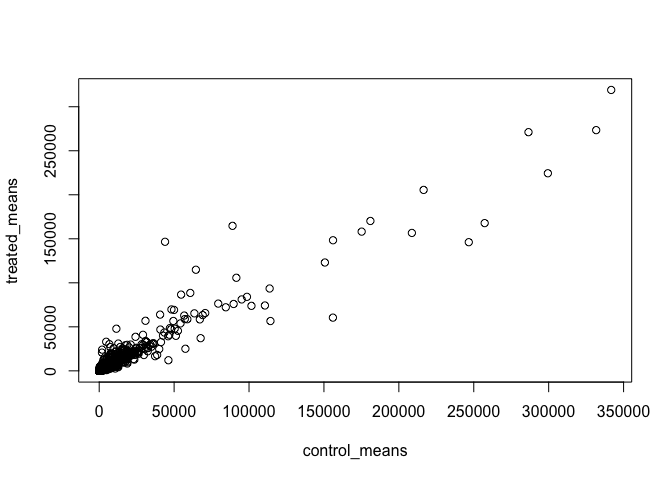
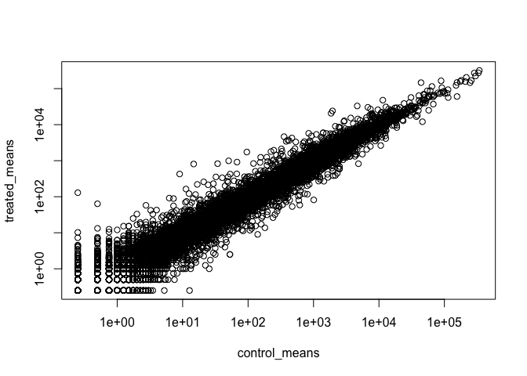
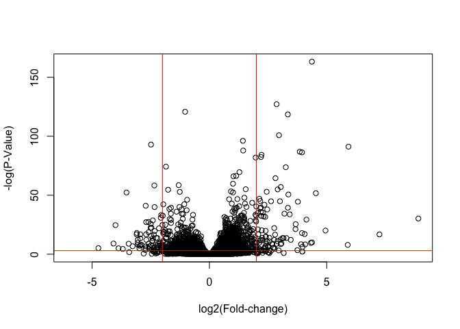

# Class 13: Transcriptomics
Andrew Sue

``` r
library(BiocManager)
library(DESeq2)
```

    Warning: package 'DESeq2' was built under R version 4.3.3

    Loading required package: S4Vectors

    Loading required package: stats4

    Loading required package: BiocGenerics


    Attaching package: 'BiocGenerics'

    The following objects are masked from 'package:stats':

        IQR, mad, sd, var, xtabs

    The following objects are masked from 'package:base':

        anyDuplicated, aperm, append, as.data.frame, basename, cbind,
        colnames, dirname, do.call, duplicated, eval, evalq, Filter, Find,
        get, grep, grepl, intersect, is.unsorted, lapply, Map, mapply,
        match, mget, order, paste, pmax, pmax.int, pmin, pmin.int,
        Position, rank, rbind, Reduce, rownames, sapply, setdiff, sort,
        table, tapply, union, unique, unsplit, which.max, which.min


    Attaching package: 'S4Vectors'

    The following object is masked from 'package:utils':

        findMatches

    The following objects are masked from 'package:base':

        expand.grid, I, unname

    Loading required package: IRanges

    Loading required package: GenomicRanges

    Loading required package: GenomeInfoDb

    Warning: package 'GenomeInfoDb' was built under R version 4.3.3

    Loading required package: SummarizedExperiment

    Loading required package: MatrixGenerics

    Loading required package: matrixStats


    Attaching package: 'MatrixGenerics'

    The following objects are masked from 'package:matrixStats':

        colAlls, colAnyNAs, colAnys, colAvgsPerRowSet, colCollapse,
        colCounts, colCummaxs, colCummins, colCumprods, colCumsums,
        colDiffs, colIQRDiffs, colIQRs, colLogSumExps, colMadDiffs,
        colMads, colMaxs, colMeans2, colMedians, colMins, colOrderStats,
        colProds, colQuantiles, colRanges, colRanks, colSdDiffs, colSds,
        colSums2, colTabulates, colVarDiffs, colVars, colWeightedMads,
        colWeightedMeans, colWeightedMedians, colWeightedSds,
        colWeightedVars, rowAlls, rowAnyNAs, rowAnys, rowAvgsPerColSet,
        rowCollapse, rowCounts, rowCummaxs, rowCummins, rowCumprods,
        rowCumsums, rowDiffs, rowIQRDiffs, rowIQRs, rowLogSumExps,
        rowMadDiffs, rowMads, rowMaxs, rowMeans2, rowMedians, rowMins,
        rowOrderStats, rowProds, rowQuantiles, rowRanges, rowRanks,
        rowSdDiffs, rowSds, rowSums2, rowTabulates, rowVarDiffs, rowVars,
        rowWeightedMads, rowWeightedMeans, rowWeightedMedians,
        rowWeightedSds, rowWeightedVars

    Loading required package: Biobase

    Welcome to Bioconductor

        Vignettes contain introductory material; view with
        'browseVignettes()'. To cite Bioconductor, see
        'citation("Biobase")', and for packages 'citation("pkgname")'.


    Attaching package: 'Biobase'

    The following object is masked from 'package:MatrixGenerics':

        rowMedians

    The following objects are masked from 'package:matrixStats':

        anyMissing, rowMedians

#Import countData and colData

DESeq2 Required Inputs: As input, the DESeq2 package expects (1) a
data.frame of count data (as obtained from RNA-seq or another
high-throughput sequencing experiment) and (2) a second data.frame with
information about the samples - often called sample metadata (or colData
in DESeq2-speak because it supplies metadata/information about the
columns of the countData matrix) (Figure 2).

``` r
counts <- read.csv("airway_scaledcounts.csv", row.names=1)
metadata <-  read.csv("airway_metadata.csv")
```

``` r
head(counts)
```

                    SRR1039508 SRR1039509 SRR1039512 SRR1039513 SRR1039516
    ENSG00000000003        723        486        904        445       1170
    ENSG00000000005          0          0          0          0          0
    ENSG00000000419        467        523        616        371        582
    ENSG00000000457        347        258        364        237        318
    ENSG00000000460         96         81         73         66        118
    ENSG00000000938          0          0          1          0          2
                    SRR1039517 SRR1039520 SRR1039521
    ENSG00000000003       1097        806        604
    ENSG00000000005          0          0          0
    ENSG00000000419        781        417        509
    ENSG00000000457        447        330        324
    ENSG00000000460         94        102         74
    ENSG00000000938          0          0          0

``` r
head(metadata)
```

              id     dex celltype     geo_id
    1 SRR1039508 control   N61311 GSM1275862
    2 SRR1039509 treated   N61311 GSM1275863
    3 SRR1039512 control  N052611 GSM1275866
    4 SRR1039513 treated  N052611 GSM1275867
    5 SRR1039516 control  N080611 GSM1275870
    6 SRR1039517 treated  N080611 GSM1275871

``` r
# View(counts)
# View(metadata)
```

> Q1. How many genes are in this dataset?

``` r
nrow(counts)
```

    [1] 38694

> Q. How many cell lines are there?

``` r
ncol(counts)
```

    [1] 8

> Q2. How many ‘control’ cell lines do we have?

There are 4 control cell lines.

``` r
table(metadata$dex)
```


    control treated 
          4       4 

``` r
# or 
sum(metadata$dex == "control")
```

    [1] 4

Lets verify that the metadata names match the counts name. (The cell
line names are the same)

``` r
colnames(counts) == metadata$id #verify that the columns are in the same order 
```

    [1] TRUE TRUE TRUE TRUE TRUE TRUE TRUE TRUE

Can also use the `all()` function, a common flow-control function to
verify if your statements are true.

``` r
all(colnames(counts) == metadata$id) #verify that the columns are in the same order
```

    [1] TRUE

What do we want to compare? We would like to first start with the mean
of gene expression between the control groups and the treatmetn group.
So we must subset all the control data and treatment data into separate
groups.

``` r
control_inds <- metadata$dex == "control" #gives us the indexes (column position) of everything that equals control 
control_counts <- counts[,control_inds] #applies that indexes to the data and puts into a new dataset 
control_means <- apply(control_counts, 1, mean) #apply mean function across the rows of the dataset
```

Lets do the same for the treated group.

``` r
treated_inds <- metadata$dex == "treated"
treated_counts <- counts[,treated_inds]
treated_means <- apply(treated_counts, 1, mean)
```

Lets combine them back together for data saving purposes.

``` r
mean_counts <- data.frame(control_means, treated_means)
```

> Q5 (a). Create a scatter plot showing the mean of the treated samples
> against the mean of the control samples. Your plot should look
> something like the following.

``` r
plot(mean_counts)
```



> Q5(B) You could also use the ggplot2 package to make this figure
> producing the plot below. What geom\_?() function would you use for
> this plot?

geom_point

``` r
head(mean_counts)
```

                    control_means treated_means
    ENSG00000000003        900.75        658.00
    ENSG00000000005          0.00          0.00
    ENSG00000000419        520.50        546.00
    ENSG00000000457        339.75        316.50
    ENSG00000000460         97.25         78.75
    ENSG00000000938          0.75          0.00

We have such skewed data that we need to adjust the axis to see more of
the data.

``` r
plot(mean_counts, log = "xy")
```

    Warning in xy.coords(x, y, xlabel, ylabel, log): 15032 x values <= 0 omitted
    from logarithmic plot

    Warning in xy.coords(x, y, xlabel, ylabel, log): 15281 y values <= 0 omitted
    from logarithmic plot



We can look at differences here via a fraction between conditions in the
data to give us log-fold changes in expression.

``` r
mean_counts$log_change <- log2(treated_means/control_means)
```

We have data that has no values, thus giving us weird log values. So
lets filter out that data to only use the data that makes sense.

``` r
zero.sums <- (rowSums(mean_counts[,1:2] == 0)) #turn into a logical finding everything in the two columns that equals 0
to.rm.ind <- zero.sums > 0 #gives us opposide of what we want
my_counts<- mean_counts[!to.rm.ind,] #exclamation point switches the logicals
```

A common threshold for calling something “differentially expressed” is a
log2 fold-change value of +2 or -2.

How many of our remaining genes are “up” regulated?

> Q8. Using the up.ind vector above can you determine how many up
> regulated genes we have at the greater than 2 fc level?

``` r
sum(my_counts$log_change >= +2)
```

    [1] 314

> Q9. Using the down.ind vector above can you determine how many down
> regulated genes we have at the greater than 2 fc level?

``` r
sum(my_counts$log_change <= -2)
```

    [1] 485

> Q10. Do you trust these results? Why or why not?

No I do not since we havent accounted for significance and this was
taken across the mean of the samples.

#DESeq2 Analysis

Lets use the DESeq2 package to do this anaylsis properly. DESeq requires
a specific format of your data to be compatible.

``` r
dds<- DESeqDataSetFromMatrix(counts, metadata, ~dex)
```

    converting counts to integer mode

    Warning in DESeqDataSet(se, design = design, ignoreRank): some variables in
    design formula are characters, converting to factors

``` r
dds<- DESeq(dds)
```

    estimating size factors

    estimating dispersions

    gene-wise dispersion estimates

    mean-dispersion relationship

    final dispersion estimates

    fitting model and testing

``` r
res <- results(dds)
head(res)
```

    log2 fold change (MLE): dex treated vs control 
    Wald test p-value: dex treated vs control 
    DataFrame with 6 rows and 6 columns
                      baseMean log2FoldChange     lfcSE      stat    pvalue
                     <numeric>      <numeric> <numeric> <numeric> <numeric>
    ENSG00000000003 747.194195     -0.3507030  0.168246 -2.084470 0.0371175
    ENSG00000000005   0.000000             NA        NA        NA        NA
    ENSG00000000419 520.134160      0.2061078  0.101059  2.039475 0.0414026
    ENSG00000000457 322.664844      0.0245269  0.145145  0.168982 0.8658106
    ENSG00000000460  87.682625     -0.1471420  0.257007 -0.572521 0.5669691
    ENSG00000000938   0.319167     -1.7322890  3.493601 -0.495846 0.6200029
                         padj
                    <numeric>
    ENSG00000000003  0.163035
    ENSG00000000005        NA
    ENSG00000000419  0.176032
    ENSG00000000457  0.961694
    ENSG00000000460  0.815849
    ENSG00000000938        NA

## Volcano plot

A common visualization for this type of data is called a volcano plot.

``` r
plot(res$log2FoldChange, -log(res$padj), ylab = "-log(P-Value)", xlab = "log2(Fold-change)")
abline(v=-2, col = "red")
abline(v=+2, col ="red")
abline(h = -log(0.05), col = "red")
```



Save our results thus far. Thus far it has not been filtered or
annotated, so not very useful as is.

``` r
write.csv(res, file = "myresults.csv")
```

# Adding annotations

Lets add the proper gene names to the dataset that we can evaluate and
reference known pathways later.

Our table thus far contains the Ensembl gene IDs, but are not the actual
gene names. So we can use some packages to aid us in translating these
IDs into their gene names.

``` r
library(AnnotationDbi)
library(org.Hs.eg.db)
```

``` r
columns(org.Hs.eg.db) #These are all the databases useable to reference
```

     [1] "ACCNUM"       "ALIAS"        "ENSEMBL"      "ENSEMBLPROT"  "ENSEMBLTRANS"
     [6] "ENTREZID"     "ENZYME"       "EVIDENCE"     "EVIDENCEALL"  "GENENAME"    
    [11] "GENETYPE"     "GO"           "GOALL"        "IPI"          "MAP"         
    [16] "OMIM"         "ONTOLOGY"     "ONTOLOGYALL"  "PATH"         "PFAM"        
    [21] "PMID"         "PROSITE"      "REFSEQ"       "SYMBOL"       "UCSCKG"      
    [26] "UNIPROT"     

The main function we will use from the AnnotationDbi package is called
`mapIds()`.

We can use the `mapIds()` function to add individual columns to our
results table. We provide the row names of our results table as a key,
and specify that keytype=ENSEMBL. The column argument tells the
`mapIds()` function which information we want, and the multiVals
argument tells the function what to do if there are multiple possible
values for a single input value. Here we ask to just give us back the
first one that occurs in the database.

``` r
res$symbol <- mapIds(org.Hs.eg.db,
                     keys=row.names(res), # Our genenames
                     keytype="ENSEMBL", # The format of our genenames
                     column="SYMBOL", # The new format we want to add
                     multiVals="first") #default is first but can be changed
```

    'select()' returned 1:many mapping between keys and columns

``` r
head(res)
```

    log2 fold change (MLE): dex treated vs control 
    Wald test p-value: dex treated vs control 
    DataFrame with 6 rows and 7 columns
                      baseMean log2FoldChange     lfcSE      stat    pvalue
                     <numeric>      <numeric> <numeric> <numeric> <numeric>
    ENSG00000000003 747.194195     -0.3507030  0.168246 -2.084470 0.0371175
    ENSG00000000005   0.000000             NA        NA        NA        NA
    ENSG00000000419 520.134160      0.2061078  0.101059  2.039475 0.0414026
    ENSG00000000457 322.664844      0.0245269  0.145145  0.168982 0.8658106
    ENSG00000000460  87.682625     -0.1471420  0.257007 -0.572521 0.5669691
    ENSG00000000938   0.319167     -1.7322890  3.493601 -0.495846 0.6200029
                         padj      symbol
                    <numeric> <character>
    ENSG00000000003  0.163035      TSPAN6
    ENSG00000000005        NA        TNMD
    ENSG00000000419  0.176032        DPM1
    ENSG00000000457  0.961694       SCYL3
    ENSG00000000460  0.815849       FIRRM
    ENSG00000000938        NA         FGR

Run it again and add the GENENAME, ENTREZ and UNIPROT names

``` r
res$entrez <- mapIds(org.Hs.eg.db,
                     keys=row.names(res), # Our genenames
                     column="ENTREZID", # The new format we want to add
                     keytype="ENSEMBL", # The format of our genenames
                     multiVals="first")
```

    'select()' returned 1:many mapping between keys and columns

``` r
res$uniprot <- mapIds(org.Hs.eg.db,
                     keys=row.names(res),
                     column="UNIPROT",
                     keytype="ENSEMBL",
                     multiVals="first")
```

    'select()' returned 1:many mapping between keys and columns

``` r
res$genename <- mapIds(org.Hs.eg.db,
                     keys=row.names(res),
                     column="GENENAME",
                     keytype="ENSEMBL",
                     multiVals="first")
```

    'select()' returned 1:many mapping between keys and columns

Finally, lets resave our data with all the proper tags.

``` r
write.csv(res, file = "myresults.csv")
```

# Kegg pathways graphs

Kegg pathways speak entrez, so its important for our gene data to have
the Entrez ID.
