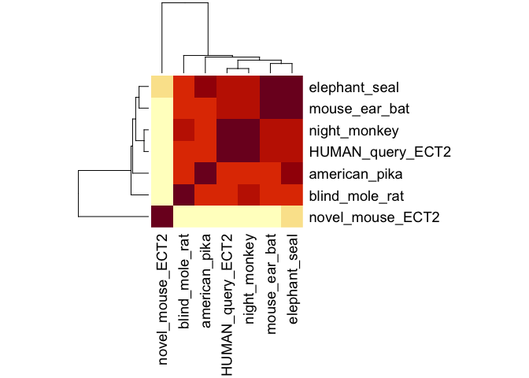
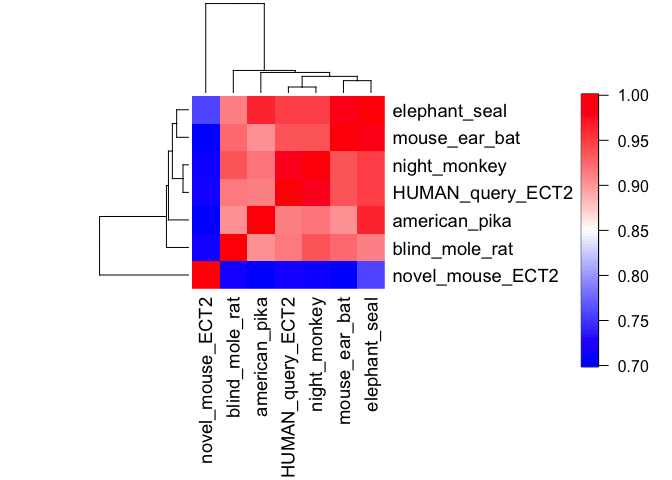
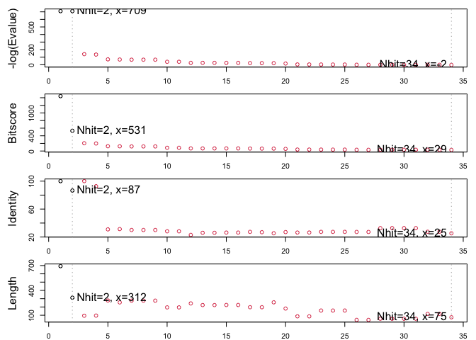
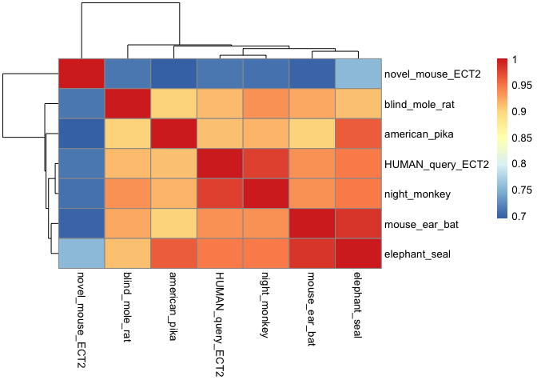

# Find a Gene project: ECT2 homologs
Andrew Sue

First must upload all my fasta file sequences being used to compare. Use
Bio3d package

``` r
library(bio3d)
```

#Read in fasta files

Read in fasta files with designated variable

``` r
novel_mouse_protein <- read.fasta("novel_protein_mus_musculus.fasta")
human_ECT2_query <- read.fasta("ECT2_human_protein.fasta")
night_monkey_homolog <- read.fasta("night_monkey.fasta")
elephant_seal_homo <- read.fasta("southern_elephant_seal.fasta")
mole_rat_homo <- read.fasta("blind_mole_rat_ect2.fasta")
am_pika_homo <- read.fasta("american_pika_ect2.fasta")
mouse_ear_bat_homo <- read.fasta("ect2_greater_mouse_ear_bat.fasta")
```

``` r
attributes(novel_mouse_protein)
```

    $names
    [1] "id"   "ali"  "call"

    $class
    [1] "fasta"

``` r
# head(novel_mouse_protein)
# print(novel_mouse_protein$ali)
```

``` r
seqs <- seqbind(novel_mouse_protein, human_ECT2_query, night_monkey_homolog, elephant_seal_homo, mole_rat_homo, am_pika_homo, mouse_ear_bat_homo)

seqcomb <- read.fasta("muscle-I20240314-211828-0990-91231778-p1m-fa.txt")
attributes(seqcomb)
```

    $names
    [1] "id"   "ali"  "call"

    $class
    [1] "fasta"

``` r
seqcomb$id
```

    [1] "novel_mouse_ECT2" "HUMAN_query_ECT2" "blind_mole_rat"   "night_monkey"    
    [5] "american_pika"    "mouse_ear_bat"    "elephant_seal"   

``` r
seqcomb
```

                       1        .         .         .         .         .         60 
    novel_mouse_ECT2   ------------------------------------------------------------
    HUMAN_query_ECT2   MAENSVLTSTTGRTSLADSSIFDSKVTEISKENLLIGSTSYVEEEMPQIETRVILVQEAG
    blind_mole_rat     MADSSVLATATGTASLVDSSIFDSKVTETSKENLCTESTSYVDEEMPQVQTRVVLVQEAG
    night_monkey       ------------------------------------------------------------
    american_pika      ------------------------------------------------------------
    mouse_ear_bat      ------------------------------------------------------------
    elephant_seal      MADSSVLTSTTGRTSLADSSIFDSKVTEISKENVVIRSASYVEEEMPQIETRLILVQEAG
                                                                                    
                       1        .         .         .         .         .         60 

                      61        .         .         .         .         .         120 
    novel_mouse_ECT2   ------------------------------------------------------------
    HUMAN_query_ECT2   KQEELIKALKTIKIMEVPVIKIKESCPGKSDEKLIKSVINMDIKVGFVKMESVEEFEGLD
    blind_mole_rat     SREELLKAAK-------------------------------EIKAPCVKMDSMEEFGGLD
    night_monkey       ----------MFKVFT-------------------------DIKVCFVKMESVEEFEGLD
    american_pika      ------------------------------------------------------------
    mouse_ear_bat      ------------------------------------------------------------
    elephant_seal      KQEELIKALKTIKIMEVPVIKIRESCPGKSDEK--------LIKSVVNMMESLEEFESLD
                                                                                    
                      61        .         .         .         .         .         120 

                     121        .         .         .         .         .         180 
    novel_mouse_ECT2   ------------------------------------------------------------
    HUMAN_query_ECT2   SPEFENVFVVTDFQDSVFNDLYKADCRVIGPPVVLNCSQKGEPLPFSCRPLYCTSMMNLV
    blind_mole_rat     SPEFENVFVVMDFQDPIFDDLYKADCRIIGPPVLLNCARMGEPVPFSCRPLYCASMVGLV
    night_monkey       SPEFENVFVVMDFQDSVFNDLYKADCRVIGPPVVLNCSQKGEPLPFSCRPLYCTSMMNLV
    american_pika      ------------------------------------------------------------
    mouse_ear_bat      ------------------------------------------------------------
    elephant_seal      SPEFENVFVVMDFQDSVFNELHKTDYRIIGPPVILNCAQKGE------------------
                                                                                    
                     121        .         .         .         .         .         180 

                     181        .         .         .         .         .         240 
    novel_mouse_ECT2   ------------------------------------------------------------
    HUMAN_query_ECT2   LCFTGFRKKEELVRLVTLVHHMGGVIRKDFNSKVTHLVANCTQGEKFRVAVSLGTPIMKP
    blind_mole_rat     LCFTGFRRKEELVKLVTLVHHMGGVIRKDFNSRVTHLVANCTQGEKFRVAVSLGTPIMKP
    night_monkey       LCFTGFRKKEELVRLVTLVHHMGGVIRKDFNSKVTHLVANSTQGEKFRVAVSLGTPIMKP
    american_pika      ---------------------MGGVIRKDFNSKVTHLVANNTQGEKFRVAVSLGTPIMKT
    mouse_ear_bat      ---------------------MGGVIRKDFNSKVTHLVANCTQGEKFRIAVSLGTPIMKP
    elephant_seal      ------------VRLVTLVHHMGGVIRKDFNSKVTHLVANCTQGEKFR------------
                                                                                    
                     181        .         .         .         .         .         240 

                     241        .         .         .         .         .         300 
    novel_mouse_ECT2   ------------------------------------------------------------
    HUMAN_query_ECT2   EWIYKAWERRNEQDFYAAVDDFRNEFKVPPFQDCILSFLGFSDEEKTNMEEMTEMQGGKY
    blind_mole_rat     EWIYKAWEKRNEQDFCAAVDDFRNEFKIPPFQDCILSFLGFSDDERTNMEEMTEMQGGSY
    night_monkey       EWIYKAWARRNEQDFCAAVDDFRNEFKVPPFQDCVLSFLGFSDEEKTNMEEMTEMQGGKY
    american_pika      EWIYKAWDRRNEQGFCAAVDDFRNEFKVPPFQDCVLSFLGFSEEDKTNMEEMTEMQGGKY
    mouse_ear_bat      EWIYKAWERRNEQDFCASADDFRNEFKVPPFQDCILSFLGFSDEEKTNMEEMTEMQGGSY
    elephant_seal      ------------------------------------------------------------
                                                                                    
                     241        .         .         .         .         .         300 

                     301        .         .         .         .         .         360 
    novel_mouse_ECT2   ------------------------------------------------------------
    HUMAN_query_ECT2   LPLGDERCTHLVVEENIVKDLPFEPSKKLYVVKQEWFWGSIQMDARAGETMYLYEKANTP
    blind_mole_rat     LAVGDERCTHLVVEENTVKDLPFEPSKKLYVVKQEWFWGSIQMDARAGESMYLYEKANTP
    night_monkey       LPLGDERCTHLVVEENIVKDLPFEPSKKLYVVKQEWFWGSIQMDARAGETMYLYEKANTP
    american_pika      LPVGDERCTHLIVEENIVKELPFEPAKKLYVVKQEWFWGSIQMDARAGETMYLYEKASTP
    mouse_ear_bat      LQVGDERCTHLIVEENTVKELPFEPSKKLYVVKQEWFWGSIQMDARAGETMYLYEKANTP
    elephant_seal      -----------------------------------WFWGSIQMDARAGETMYLYEKANTP
                                                                                    
                     301        .         .         .         .         .         360 

                     361        .         .         .         .         .         420 
    novel_mouse_ECT2   ------------------------------------------------------------
    HUMAN_query_ECT2   ELKKSVSMLSLNTPNSNRKRRRLKETLAQLSRETDVSPFPPRKRPSAEHSLSIGSLLDIS
    blind_mole_rat     ELKKSVSLLSLSTPNSNRKRRRLKETLAQLSRETDLSPFPPRKRPSAEHSLSIGSLLDIS
    night_monkey       ELKKSVSMLSLNTPNSNRKRRRLKETLAQLSRETDLSPFPPRKRASAEHSLSIGSLLDIS
    american_pika      ELKKSVSLLSLSTPNSNRKRRRLKESLAQLSRETDLSPFPPRKRPSAEHSLSIGSLLDIS
    mouse_ear_bat      ELKKSVSLLSLSTPNSNRKRRRLKETLAQLSRETDLSPFPPRKRPSAEHSLSIGSLLDIS
    elephant_seal      ELKKSVSLLSLNTPNSNRKRRRLKETLAQLSRETDMSPFPPRKRPSAEHSLSIGSLLDIS
                                                                                    
                     361        .         .         .         .         .         420 

                     421        .         .         .         .         .         480 
    novel_mouse_ECT2   -------------------SRSSTPVPPKQSVRWQVAKELYQTESNYVNILATIIQLFQV
    HUMAN_query_ECT2   NTPESSINYGDTPKSCTKSSKSSTPVPSKQSARWQVAKELYQTESNYVNILATIIQLFQV
    blind_mole_rat     NTPESSINYGETPKSCTKSSRNSTPVPPKQSARWQVAKELYQTESNYVNILATIIQLFQV
    night_monkey       NTPESSINYGETPKSCTKSSKNSTPVPSKQSARWQVAKELYQTESNYVNILATIIQLFQV
    american_pika      NTPDSSINYGETPKSCTKSSKNSTPVPLKQSARWQVAKELYQTESNYVNILATIIQLFQV
    mouse_ear_bat      NTPESSINYGETPKSCTKSSKNSTPVPSKQSARWQVAKELYQTESNYVNILATIIQLFQV
    elephant_seal      NTPESSINYGETPKSCTKSSKNSTPVPSKQSARWQVAKELYQTESNYVNILATIIQLFQV
                                          *^ ***** *** **************************** 
                     421        .         .         .         .         .         480 

                     481        .         .         .         .         .         540 
    novel_mouse_ECT2   PLEEEGQRGGPILAPEEIKTIFGSIPDIFDVHMKIKDDLEDLIANWDESRSIGDIFLKYA
    HUMAN_query_ECT2   PLEEEGQRGGPILAPEEIKTIFGSIPDIFDVHTKIKDDLEDLIVNWDESKSIGDIFLKYS
    blind_mole_rat     PLEEEGQRGGPILAPEEIKTIFGSIPDIFDVHMKIKDDLEDLIVNWDENKSIGDIFLKYS
    night_monkey       PLEEEGQRGGPILAPEEIKTIFGSIPDIFDVHTKIKDDLEDLIVNWDESKSIGDIFLKYS
    american_pika      PLEEEGQRGGPILAPEEIKTIFGSIPDIFDVHTKIKDDLEDLIVNWDESKSIGDIFLKYS
    mouse_ear_bat      PLEEEGQRGGPILAPEEIKTIFGSIPDIFDVHTKIKDDLEDLIVNWDESKSIGDIFLKYS
    elephant_seal      PLEEEGQRGGPILAPEEIKTIFGSIPDIFDVHTKIKDDLEDLIVNWDESKSIGDIFLKYS
                       ******************************** ********** **** ^*********  
                     481        .         .         .         .         .         540 

                     541        .         .         .         .         .         600 
    novel_mouse_ECT2   KDLVKTYPPFVNFFEMSKEMIIKCEKQKPRFHAFLKINQAKPECGRQSLVELLIRPVQRL
    HUMAN_query_ECT2   KDLVKTYPPFVNFFEMSKETIIKCEKQKPRFHAFLKINQAKPECGRQSLVELLIRPVQRL
    blind_mole_rat     KDLVKTYPPFVNFFEMSKETIIKCEKQKPRFHAFLKINQAKPECGRQSLVELLIRPVQRL
    night_monkey       KDLVKTYPPFVNFFEMSKETIIKCEKQKPRFHAFLKINQAKPECGRQSLVELLIRPVQRL
    american_pika      KDLIKTYPPFVNFFEMSKETIIKCEKQKPRFHAFLKINQAKPECGRQSLVELLIRPVQRL
    mouse_ear_bat      KDLVKTYPPFVNFFEMSKETIIKCEKQKPRFHAFLKINQAKPECGRQSLVELLIRPVQRL
    elephant_seal      KDLVKTYPPFVNFFEMSKETIVKCEKQKPRFHAFLKINQAKPECGRQSLVELLIRPVQRL
                       ***^*************** *^************************************** 
                     541        .         .         .         .         .         600 

                     601        .         .         .         .         .         660 
    novel_mouse_ECT2   PSVALLLNDLKKHTADENPDKSTLEKAIGSLKEVMTHINEDKRKTEAQKQIFDVVYEVDG
    HUMAN_query_ECT2   PSVALLLNDLKKHTADENPDKSTLEKAIGSLKEVMTHINEDKRKTEAQKQIFDVVYEVDG
    blind_mole_rat     PSVALLLNDLKKHTADENPDKSTLEKAIGSLKEVMTHINEDKRKTEAQKQIFDVVYEVDG
    night_monkey       PSVALLLNDLKKHTADENPDKSTLEKAIGSLKEVMTHINEDKRKTEAQKQIFDVVYEVDG
    american_pika      PSVALLLNDLKKHTVDENPDKSTLEKAIGSLKEVMTHINEDKRKTEAQKQIFDVVYEVDG
    mouse_ear_bat      PSVALLLNDLKKHTAEENPDKSTLEKAIGSLKEVMTHINEDKRKTEAQKQIFDVVYEVDG
    elephant_seal      PSVALLLNDLKKHTAEENPDKSTLEKAIGSLKEVMTHINEDKRKTEAQKQIFDVVYEVDG
                       ************** ^******************************************** 
                     601        .         .         .         .         .         660 

                     661        .         .         .         .         .         720 
    novel_mouse_ECT2   CPANLLSSHRSLVQRVETVSLGEHPCDRGEQVTLFPL---MTASRQESGTKLLALLESLT
    HUMAN_query_ECT2   CPANLLSSHRSLVQRVETISLGEHPCDRGEQVTLFLFNDCLEIARKRH--KVIGTFRSPH
    blind_mole_rat     CPANLLSSHRSLVQRVETVSLGEQPCDRGEQVTLFLFNDCLEIARKRH--KVIGTFRSPH
    night_monkey       CPANLLSSHRSLVQRVETISLGEHPCDRGEQVTLFLFNDCLEIARKRH--KVIGTFRSPH
    american_pika      CPANLLSSHRSLIQRVETISLGEHPCDRGEQVTLFLFNDCLEIARKRH--KVIGTFRSPH
    mouse_ear_bat      CPANLLSSHRSLIQRVETISLGEHPCDRGEQVTLFLFNDCLEIARKRH--KVIGTFRSPH
    elephant_seal      CPANLLSSHRSLVQRVETVSLGEHPCDRGEQVTLFLFNDCLEIARKRH--KVIGTFRSPP
                       ************^*****^**** ***********     ^   *     *^^^   *   
                     661        .         .         .         .         .         720 

                     721        .         .         .         .         .         780 
    novel_mouse_ECT2   NAPGPPLLSTFISCLFL-RLKRAGHPRD-KRLSPCLCPACKPXTEQAMYCSTFK-RPRTF
    HUMAN_query_ECT2   GQTRPPASLKHIHLMPLSQIKKVLDIRETEDCHNAFALLVRPPTEQANVLLSFQMTSDEL
    blind_mole_rat     GHTRPPASLKHIHLMPLSQIKKVLDIRETEDCRNAFALLVRPPTEQANVLLSFQMTSDEL
    night_monkey       GQTRPPASLKHIHLMPLSQIKKVLDIRETEDCHNAFALLVRPPTEQANVLLSFQMTSDEL
    american_pika      GHTRPPASLKHVRLMPLSQIKKVLDIRETEDCHNAFALLVRPPTEQANVLLSFQMTSYDL
    mouse_ear_bat      GQTRPPASLKHIHLMPLSQIKKVLDIRETEDCHNAFALLVRPPTEQANVLLSFQMTSEEL
    elephant_seal      GHTRPPASLKHIHLMPLSQIKKVLDIRETEDCHNAFALLVRPPTERANVLLSFQMTSEEL
                           **     ^  ^ *  ^*^    *^            ^* ** *    ^*        
                     721        .         .         .         .         .         780 

                     781        .         .         .         .         .         840 
    novel_mouse_ECT2   PKETALKSL-PTFTQPFVRAKLEIFWMGLIP----IPLRKTKDGIAIGAR----------
    HUMAN_query_ECT2   PKENWLKMLCRHVANTICKADAENLIYTADPESFEVNTKDMDSTLSRASRAIKKTSKKVT
    blind_mole_rat     PKENWLKMLCRHVANTICKADAENLIYTADPESFEVNTKDMDSTLSRASRAIKKTSKKVT
    night_monkey       PKENWLKMLCRHVANTICKADAENLIYTADPETFEVNTKDMDSTLSRASRAIKKTSKKVT
    american_pika      PKENWLKMLCRHVANTICKADAENLMYPADPESFEVNTKDMDSTLSRASRAIKKTSKKVT
    mouse_ear_bat      PKENWLKMLCRHVANTICKADAENLIYTADPETFEVNTKDMDSTLSRASRAIKKTSKRVT
    elephant_seal      PKENWLKMLCRHVANTICKAD---------------------------------------
                       ***  ** *     ^   ^*                                         
                     781        .         .         .         .         .         840 

                     841        .         .         .         .         .         900 
    novel_mouse_ECT2   --FTIKKTPKRVRG----------------------------------------------
    HUMAN_query_ECT2   RAFSFSKTPKRALRRALMTSHGSVEGRSPSSNDKHVMSRLSSTSSLAGIPSPSLVSL---
    blind_mole_rat     RAFSFSKTPKRALRLALMSSHSSSEARSPPSSDKHAVSRLSSTSSLAGISSPSLVSL---
    night_monkey       RAFSFSKTPKRALRRALMTSHSSGEGRSPSSSDKHGMSRLSSTSSLAGIPSPSLVSL---
    american_pika      RAFSFSKTPKRAFRMTLTTSHSSAEGRSPTSSDKLAVSRLPSTSSLAITHSVSTSNIIGF
    mouse_ear_bat      RAFSFSKTPRRVLRRALMTSQSSVEGRSPLSSDKHVMSRMSSTSSLAIIHSVSTSSTIGF
    elephant_seal      ------------------------------------------------------------
                                                                                    
                     841        .         .         .         .         .         900 

                     901        .         .         .         .         .         960 
    novel_mouse_ECT2   -----------------VSFFQX-------------------------------------
    HUMAN_query_ECT2   -----------------PSFFERRSHTLSRSTTHLI------------------------
    blind_mole_rat     -----------------PSFFERRSHTLSRSTTHLI------------------------
    night_monkey       -----------------PSFFERRSHTLSRSTTHLI------------------------
    american_pika      TRHSYGQRSNSTRGHSRSSWFRSIHHSSSQASFSEILEGNTDFQISQKFYPTHL------
    mouse_ear_bat      TKHVYAQCSHSTGGRSQNSWFPSIRHSASRVSFSETLKENIDFSNFKKSSIQVIFGICEE
    elephant_seal      ------------------------------------------------------------
                                                                                    
                     901        .         .         .         .         .         960 

                     961        .   974 
    novel_mouse_ECT2   --------------
    HUMAN_query_ECT2   --------------
    blind_mole_rat     --------------
    night_monkey       --------------
    american_pika      --------------
    mouse_ear_bat      LRDMPTSNGNKPQV
    elephant_seal      --------------
                                      
                     961        .   974 

    Call:
      read.fasta(file = "muscle-I20240314-211828-0990-91231778-p1m-fa.txt")

    Class:
      fasta

    Alignment dimensions:
      7 sequence rows; 974 position columns (353 non-gap, 621 gap) 

    + attr: id, ali, call

``` r
seq_dist <- seqidentity(seqcomb)
seq_dist <- as.matrix(seq_dist)
```

``` r
library(ggplot2)
library(fields)
```

    Loading required package: spam

    Spam version 2.10-0 (2023-10-23) is loaded.
    Type 'help( Spam)' or 'demo( spam)' for a short introduction 
    and overview of this package.
    Help for individual functions is also obtained by adding the
    suffix '.spam' to the function name, e.g. 'help( chol.spam)'.


    Attaching package: 'spam'

    The following objects are masked from 'package:base':

        backsolve, forwardsolve

    Loading required package: viridisLite


    Try help(fields) to get started.

``` r
heatmap(seq_dist, margins = c(12,12), scale= "none") 
```



``` r
  # legend(x="right", legend = )

heatmap(seq_dist, margins = c(12,12), 
        col = colorRampPalette(c("blue", "white", "red"))(100),  # Choose your color palette
        legend = TRUE,                                           # Add legend
        scale = "none"                                         # Specify no scaling
)
```

    Warning in plot.window(...): "legend" is not a graphical parameter

    Warning in plot.xy(xy, type, ...): "legend" is not a graphical parameter

    Warning in title(...): "legend" is not a graphical parameter

``` r
image.plot(legend.only=TRUE, col = colorRampPalette(c("blue", "white", "red"))(100), zlim=c(0.7, 1))
```



``` r
cseq <- consensus(seqcomb$ali, 0.1)
cseq
```

    $seq
      [1] "M" "A" "D" "S" "S" "V" "L" "T" "S" "T" "T" "G" "R" "T" "S" "L" "A" "D"
     [19] "S" "S" "I" "F" "D" "S" "K" "V" "T" "E" "I" "S" "K" "E" "N" "L" "V" "I"
     [37] "R" "S" "T" "S" "Y" "V" "E" "E" "E" "M" "P" "Q" "I" "E" "T" "R" "V" "I"
     [55] "L" "V" "Q" "E" "A" "G" "K" "Q" "E" "E" "L" "I" "K" "A" "L" "K" "T" "I"
     [73] "K" "I" "M" "E" "V" "P" "V" "I" "K" "I" "K" "E" "S" "C" "P" "G" "K" "S"
     [91] "D" "E" "K" "L" "I" "K" "S" "V" "I" "N" "M" "D" "I" "K" "V" "V" "F" "V"
    [109] "K" "M" "E" "S" "V" "E" "E" "F" "E" "G" "L" "D" "S" "P" "E" "F" "E" "N"
    [127] "V" "F" "V" "V" "M" "D" "F" "Q" "D" "S" "V" "F" "N" "D" "L" "Y" "K" "A"
    [145] "D" "C" "R" "V" "I" "G" "P" "P" "V" "V" "L" "N" "C" "S" "Q" "K" "G" "E"
    [163] "P" "L" "P" "F" "S" "C" "R" "P" "L" "Y" "C" "T" "S" "M" "M" "N" "L" "V"
    [181] "L" "C" "F" "T" "G" "F" "R" "K" "K" "E" "E" "L" "V" "R" "L" "V" "T" "L"
    [199] "V" "H" "H" "M" "G" "G" "V" "I" "R" "K" "D" "F" "N" "S" "K" "V" "T" "H"
    [217] "L" "V" "A" "N" "C" "T" "Q" "G" "E" "K" "F" "R" "V" "A" "V" "S" "L" "G"
    [235] "T" "P" "I" "M" "K" "P" "E" "W" "I" "Y" "K" "A" "W" "E" "R" "R" "N" "E"
    [253] "Q" "D" "F" "C" "A" "A" "V" "D" "D" "F" "R" "N" "E" "F" "K" "V" "P" "P"
    [271] "F" "Q" "D" "C" "I" "L" "S" "F" "L" "G" "F" "S" "D" "E" "E" "K" "T" "N"
    [289] "M" "E" "E" "M" "T" "E" "M" "Q" "G" "G" "K" "Y" "L" "P" "V" "G" "D" "E"
    [307] "R" "C" "T" "H" "L" "V" "V" "E" "E" "N" "I" "V" "K" "D" "L" "P" "F" "E"
    [325] "P" "S" "K" "K" "L" "Y" "V" "V" "K" "Q" "E" "W" "F" "W" "G" "S" "I" "Q"
    [343] "M" "D" "A" "R" "A" "G" "E" "T" "M" "Y" "L" "Y" "E" "K" "A" "N" "T" "P"
    [361] "E" "L" "K" "K" "S" "V" "S" "L" "L" "S" "L" "S" "T" "P" "N" "S" "N" "R"
    [379] "K" "R" "R" "R" "L" "K" "E" "T" "L" "A" "Q" "L" "S" "R" "E" "T" "D" "L"
    [397] "S" "P" "F" "P" "P" "R" "K" "R" "P" "S" "A" "E" "H" "S" "L" "S" "I" "G"
    [415] "S" "L" "L" "D" "I" "S" "N" "T" "P" "E" "S" "S" "I" "N" "Y" "G" "E" "T"
    [433] "P" "K" "S" "C" "T" "K" "S" "S" "K" "N" "S" "T" "P" "V" "P" "S" "K" "Q"
    [451] "S" "A" "R" "W" "Q" "V" "A" "K" "E" "L" "Y" "Q" "T" "E" "S" "N" "Y" "V"
    [469] "N" "I" "L" "A" "T" "I" "I" "Q" "L" "F" "Q" "V" "P" "L" "E" "E" "E" "G"
    [487] "Q" "R" "G" "G" "P" "I" "L" "A" "P" "E" "E" "I" "K" "T" "I" "F" "G" "S"
    [505] "I" "P" "D" "I" "F" "D" "V" "H" "T" "K" "I" "K" "D" "D" "L" "E" "D" "L"
    [523] "I" "V" "N" "W" "D" "E" "S" "K" "S" "I" "G" "D" "I" "F" "L" "K" "Y" "S"
    [541] "K" "D" "L" "V" "K" "T" "Y" "P" "P" "F" "V" "N" "F" "F" "E" "M" "S" "K"
    [559] "E" "T" "I" "I" "K" "C" "E" "K" "Q" "K" "P" "R" "F" "H" "A" "F" "L" "K"
    [577] "I" "N" "Q" "A" "K" "P" "E" "C" "G" "R" "Q" "S" "L" "V" "E" "L" "L" "I"
    [595] "R" "P" "V" "Q" "R" "L" "P" "S" "V" "A" "L" "L" "L" "N" "D" "L" "K" "K"
    [613] "H" "T" "A" "D" "E" "N" "P" "D" "K" "S" "T" "L" "E" "K" "A" "I" "G" "S"
    [631] "L" "K" "E" "V" "M" "T" "H" "I" "N" "E" "D" "K" "R" "K" "T" "E" "A" "Q"
    [649] "K" "Q" "I" "F" "D" "V" "V" "Y" "E" "V" "D" "G" "C" "P" "A" "N" "L" "L"
    [667] "S" "S" "H" "R" "S" "L" "V" "Q" "R" "V" "E" "T" "I" "S" "L" "G" "E" "H"
    [685] "P" "C" "D" "R" "G" "E" "Q" "V" "T" "L" "F" "L" "F" "N" "D" "C" "L" "E"
    [703] "I" "A" "R" "K" "R" "H" "G" "T" "K" "V" "I" "G" "T" "F" "R" "S" "P" "H"
    [721] "G" "Q" "T" "R" "P" "P" "A" "S" "L" "K" "H" "I" "H" "L" "M" "P" "L" "S"
    [739] "Q" "I" "K" "K" "V" "L" "D" "I" "R" "E" "T" "E" "D" "C" "H" "N" "A" "F"
    [757] "A" "L" "L" "V" "R" "P" "P" "T" "E" "Q" "A" "N" "V" "L" "L" "S" "F" "Q"
    [775] "M" "T" "S" "D" "E" "L" "P" "K" "E" "N" "W" "L" "K" "M" "L" "C" "R" "H"
    [793] "V" "A" "N" "T" "I" "C" "K" "A" "D" "A" "E" "N" "L" "I" "Y" "T" "A" "D"
    [811] "P" "E" "S" "F" "E" "V" "N" "T" "K" "D" "M" "D" "S" "T" "L" "S" "R" "A"
    [829] "S" "R" "A" "I" "K" "K" "T" "S" "K" "K" "V" "T" "R" "A" "F" "S" "F" "S"
    [847] "K" "T" "P" "K" "R" "A" "L" "R" "R" "A" "L" "M" "T" "S" "H" "S" "S" "V"
    [865] "E" "G" "R" "S" "P" "S" "S" "S" "D" "K" "H" "V" "M" "S" "R" "L" "S" "S"
    [883] "T" "S" "S" "L" "A" "G" "I" "H" "S" "P" "S" "L" "V" "S" "L" "I" "G" "F"
    [901] "T" "K" "H" "V" "Y" "A" "Q" "R" "S" "N" "S" "T" "R" "G" "H" "S" "Q" "P"
    [919] "S" "F" "F" "E" "R" "R" "S" "H" "T" "L" "S" "R" "S" "T" "T" "H" "L" "I"
    [937] "L" "K" "E" "N" "I" "D" "F" "S" "I" "F" "Q" "K" "F" "Y" "I" "T" "V" "I"
    [955] "F" "G" "I" "C" "E" "E" "L" "R" "D" "M" "P" "T" "S" "N" "G" "N" "K" "P"
    [973] "Q" "V"

    $freq
              1         2         3         4         5         6         7
    V 0.0000000 0.0000000 0.0000000 0.0000000 0.0000000 0.4285714 0.0000000
    I 0.0000000 0.0000000 0.0000000 0.0000000 0.0000000 0.0000000 0.0000000
    L 0.0000000 0.0000000 0.0000000 0.0000000 0.0000000 0.0000000 0.4285714
    M 0.4285714 0.0000000 0.0000000 0.0000000 0.0000000 0.0000000 0.0000000
    F 0.0000000 0.0000000 0.0000000 0.0000000 0.0000000 0.0000000 0.0000000
    W 0.0000000 0.0000000 0.0000000 0.0000000 0.0000000 0.0000000 0.0000000
    Y 0.0000000 0.0000000 0.0000000 0.0000000 0.0000000 0.0000000 0.0000000
    S 0.0000000 0.0000000 0.0000000 0.2857143 0.4285714 0.0000000 0.0000000
    T 0.0000000 0.0000000 0.0000000 0.0000000 0.0000000 0.0000000 0.0000000
    N 0.0000000 0.0000000 0.0000000 0.1428571 0.0000000 0.0000000 0.0000000
    Q 0.0000000 0.0000000 0.0000000 0.0000000 0.0000000 0.0000000 0.0000000
    H 0.0000000 0.0000000 0.0000000 0.0000000 0.0000000 0.0000000 0.0000000
    K 0.0000000 0.0000000 0.0000000 0.0000000 0.0000000 0.0000000 0.0000000
    R 0.0000000 0.0000000 0.0000000 0.0000000 0.0000000 0.0000000 0.0000000
    D 0.0000000 0.0000000 0.2857143 0.0000000 0.0000000 0.0000000 0.0000000
    E 0.0000000 0.0000000 0.1428571 0.0000000 0.0000000 0.0000000 0.0000000
    A 0.0000000 0.4285714 0.0000000 0.0000000 0.0000000 0.0000000 0.0000000
    G 0.0000000 0.0000000 0.0000000 0.0000000 0.0000000 0.0000000 0.0000000
    P 0.0000000 0.0000000 0.0000000 0.0000000 0.0000000 0.0000000 0.0000000
    C 0.0000000 0.0000000 0.0000000 0.0000000 0.0000000 0.0000000 0.0000000
    - 0.5714286 0.5714286 0.5714286 0.5714286 0.5714286 0.5714286 0.5714286
    X 0.0000000 0.0000000 0.0000000 0.0000000 0.0000000 0.0000000 0.0000000
              8         9        10        11        12        13        14
    V 0.0000000 0.0000000 0.0000000 0.0000000 0.0000000 0.0000000 0.0000000
    I 0.0000000 0.0000000 0.0000000 0.0000000 0.0000000 0.0000000 0.0000000
    L 0.0000000 0.0000000 0.0000000 0.0000000 0.0000000 0.0000000 0.0000000
    M 0.0000000 0.0000000 0.0000000 0.0000000 0.0000000 0.0000000 0.0000000
    F 0.0000000 0.0000000 0.0000000 0.0000000 0.0000000 0.0000000 0.0000000
    W 0.0000000 0.0000000 0.0000000 0.0000000 0.0000000 0.0000000 0.0000000
    Y 0.0000000 0.0000000 0.0000000 0.0000000 0.0000000 0.0000000 0.0000000
    S 0.0000000 0.2857143 0.0000000 0.0000000 0.0000000 0.0000000 0.0000000
    T 0.2857143 0.1428571 0.2857143 0.4285714 0.0000000 0.1428571 0.2857143
    N 0.0000000 0.0000000 0.0000000 0.0000000 0.0000000 0.0000000 0.0000000
    Q 0.0000000 0.0000000 0.0000000 0.0000000 0.0000000 0.0000000 0.0000000
    H 0.0000000 0.0000000 0.0000000 0.0000000 0.0000000 0.0000000 0.0000000
    K 0.0000000 0.0000000 0.0000000 0.0000000 0.0000000 0.0000000 0.0000000
    R 0.0000000 0.0000000 0.0000000 0.0000000 0.0000000 0.2857143 0.0000000
    D 0.0000000 0.0000000 0.0000000 0.0000000 0.0000000 0.0000000 0.0000000
    E 0.0000000 0.0000000 0.0000000 0.0000000 0.0000000 0.0000000 0.0000000
    A 0.1428571 0.0000000 0.1428571 0.0000000 0.0000000 0.0000000 0.1428571
    G 0.0000000 0.0000000 0.0000000 0.0000000 0.4285714 0.0000000 0.0000000
    P 0.0000000 0.0000000 0.0000000 0.0000000 0.0000000 0.0000000 0.0000000
    C 0.0000000 0.0000000 0.0000000 0.0000000 0.0000000 0.0000000 0.0000000
    - 0.5714286 0.5714286 0.5714286 0.5714286 0.5714286 0.5714286 0.5714286
    X 0.0000000 0.0000000 0.0000000 0.0000000 0.0000000 0.0000000 0.0000000
             15        16        17        18        19        20        21
    V 0.0000000 0.0000000 0.1428571 0.0000000 0.0000000 0.0000000 0.0000000
    I 0.0000000 0.0000000 0.0000000 0.0000000 0.0000000 0.0000000 0.4285714
    L 0.0000000 0.4285714 0.0000000 0.0000000 0.0000000 0.0000000 0.0000000
    M 0.0000000 0.0000000 0.0000000 0.0000000 0.0000000 0.0000000 0.0000000
    F 0.0000000 0.0000000 0.0000000 0.0000000 0.0000000 0.0000000 0.0000000
    W 0.0000000 0.0000000 0.0000000 0.0000000 0.0000000 0.0000000 0.0000000
    Y 0.0000000 0.0000000 0.0000000 0.0000000 0.0000000 0.0000000 0.0000000
    S 0.4285714 0.0000000 0.0000000 0.0000000 0.4285714 0.4285714 0.0000000
    T 0.0000000 0.0000000 0.0000000 0.0000000 0.0000000 0.0000000 0.0000000
    N 0.0000000 0.0000000 0.0000000 0.0000000 0.0000000 0.0000000 0.0000000
    Q 0.0000000 0.0000000 0.0000000 0.0000000 0.0000000 0.0000000 0.0000000
    H 0.0000000 0.0000000 0.0000000 0.0000000 0.0000000 0.0000000 0.0000000
    K 0.0000000 0.0000000 0.0000000 0.0000000 0.0000000 0.0000000 0.0000000
    R 0.0000000 0.0000000 0.0000000 0.0000000 0.0000000 0.0000000 0.0000000
    D 0.0000000 0.0000000 0.0000000 0.4285714 0.0000000 0.0000000 0.0000000
    E 0.0000000 0.0000000 0.0000000 0.0000000 0.0000000 0.0000000 0.0000000
    A 0.0000000 0.0000000 0.2857143 0.0000000 0.0000000 0.0000000 0.0000000
    G 0.0000000 0.0000000 0.0000000 0.0000000 0.0000000 0.0000000 0.0000000
    P 0.0000000 0.0000000 0.0000000 0.0000000 0.0000000 0.0000000 0.0000000
    C 0.0000000 0.0000000 0.0000000 0.0000000 0.0000000 0.0000000 0.0000000
    - 0.5714286 0.5714286 0.5714286 0.5714286 0.5714286 0.5714286 0.5714286
    X 0.0000000 0.0000000 0.0000000 0.0000000 0.0000000 0.0000000 0.0000000
             22        23        24        25        26        27        28
    V 0.0000000 0.0000000 0.0000000 0.0000000 0.4285714 0.0000000 0.0000000
    I 0.0000000 0.0000000 0.0000000 0.0000000 0.0000000 0.0000000 0.0000000
    L 0.0000000 0.0000000 0.0000000 0.0000000 0.0000000 0.0000000 0.0000000
    M 0.0000000 0.0000000 0.0000000 0.0000000 0.0000000 0.0000000 0.0000000
    F 0.4285714 0.0000000 0.0000000 0.0000000 0.0000000 0.0000000 0.0000000
    W 0.0000000 0.0000000 0.0000000 0.0000000 0.0000000 0.0000000 0.0000000
    Y 0.0000000 0.0000000 0.0000000 0.0000000 0.0000000 0.0000000 0.0000000
    S 0.0000000 0.0000000 0.4285714 0.0000000 0.0000000 0.0000000 0.0000000
    T 0.0000000 0.0000000 0.0000000 0.0000000 0.0000000 0.4285714 0.0000000
    N 0.0000000 0.0000000 0.0000000 0.0000000 0.0000000 0.0000000 0.0000000
    Q 0.0000000 0.0000000 0.0000000 0.0000000 0.0000000 0.0000000 0.0000000
    H 0.0000000 0.0000000 0.0000000 0.0000000 0.0000000 0.0000000 0.0000000
    K 0.0000000 0.0000000 0.0000000 0.4285714 0.0000000 0.0000000 0.0000000
    R 0.0000000 0.0000000 0.0000000 0.0000000 0.0000000 0.0000000 0.0000000
    D 0.0000000 0.4285714 0.0000000 0.0000000 0.0000000 0.0000000 0.0000000
    E 0.0000000 0.0000000 0.0000000 0.0000000 0.0000000 0.0000000 0.4285714
    A 0.0000000 0.0000000 0.0000000 0.0000000 0.0000000 0.0000000 0.0000000
    G 0.0000000 0.0000000 0.0000000 0.0000000 0.0000000 0.0000000 0.0000000
    P 0.0000000 0.0000000 0.0000000 0.0000000 0.0000000 0.0000000 0.0000000
    C 0.0000000 0.0000000 0.0000000 0.0000000 0.0000000 0.0000000 0.0000000
    - 0.5714286 0.5714286 0.5714286 0.5714286 0.5714286 0.5714286 0.5714286
    X 0.0000000 0.0000000 0.0000000 0.0000000 0.0000000 0.0000000 0.0000000
             29        30        31        32        33        34        35
    V 0.0000000 0.0000000 0.0000000 0.0000000 0.0000000 0.1428571 0.1428571
    I 0.2857143 0.0000000 0.0000000 0.0000000 0.0000000 0.0000000 0.0000000
    L 0.0000000 0.0000000 0.0000000 0.0000000 0.0000000 0.2857143 0.1428571
    M 0.0000000 0.0000000 0.0000000 0.0000000 0.0000000 0.0000000 0.0000000
    F 0.0000000 0.0000000 0.0000000 0.0000000 0.0000000 0.0000000 0.0000000
    W 0.0000000 0.0000000 0.0000000 0.0000000 0.0000000 0.0000000 0.0000000
    Y 0.0000000 0.0000000 0.0000000 0.0000000 0.0000000 0.0000000 0.0000000
    S 0.0000000 0.4285714 0.0000000 0.0000000 0.0000000 0.0000000 0.0000000
    T 0.1428571 0.0000000 0.0000000 0.0000000 0.0000000 0.0000000 0.0000000
    N 0.0000000 0.0000000 0.0000000 0.0000000 0.4285714 0.0000000 0.0000000
    Q 0.0000000 0.0000000 0.0000000 0.0000000 0.0000000 0.0000000 0.0000000
    H 0.0000000 0.0000000 0.0000000 0.0000000 0.0000000 0.0000000 0.0000000
    K 0.0000000 0.0000000 0.4285714 0.0000000 0.0000000 0.0000000 0.0000000
    R 0.0000000 0.0000000 0.0000000 0.0000000 0.0000000 0.0000000 0.0000000
    D 0.0000000 0.0000000 0.0000000 0.0000000 0.0000000 0.0000000 0.0000000
    E 0.0000000 0.0000000 0.0000000 0.4285714 0.0000000 0.0000000 0.0000000
    A 0.0000000 0.0000000 0.0000000 0.0000000 0.0000000 0.0000000 0.0000000
    G 0.0000000 0.0000000 0.0000000 0.0000000 0.0000000 0.0000000 0.0000000
    P 0.0000000 0.0000000 0.0000000 0.0000000 0.0000000 0.0000000 0.0000000
    C 0.0000000 0.0000000 0.0000000 0.0000000 0.0000000 0.0000000 0.1428571
    - 0.5714286 0.5714286 0.5714286 0.5714286 0.5714286 0.5714286 0.5714286
    X 0.0000000 0.0000000 0.0000000 0.0000000 0.0000000 0.0000000 0.0000000
             36        37        38        39        40        41        42
    V 0.0000000 0.0000000 0.0000000 0.0000000 0.0000000 0.0000000 0.4285714
    I 0.2857143 0.0000000 0.0000000 0.0000000 0.0000000 0.0000000 0.0000000
    L 0.0000000 0.0000000 0.0000000 0.0000000 0.0000000 0.0000000 0.0000000
    M 0.0000000 0.0000000 0.0000000 0.0000000 0.0000000 0.0000000 0.0000000
    F 0.0000000 0.0000000 0.0000000 0.0000000 0.0000000 0.0000000 0.0000000
    W 0.0000000 0.0000000 0.0000000 0.0000000 0.0000000 0.0000000 0.0000000
    Y 0.0000000 0.0000000 0.0000000 0.0000000 0.0000000 0.4285714 0.0000000
    S 0.0000000 0.0000000 0.4285714 0.0000000 0.4285714 0.0000000 0.0000000
    T 0.1428571 0.0000000 0.0000000 0.2857143 0.0000000 0.0000000 0.0000000
    N 0.0000000 0.0000000 0.0000000 0.0000000 0.0000000 0.0000000 0.0000000
    Q 0.0000000 0.0000000 0.0000000 0.0000000 0.0000000 0.0000000 0.0000000
    H 0.0000000 0.0000000 0.0000000 0.0000000 0.0000000 0.0000000 0.0000000
    K 0.0000000 0.0000000 0.0000000 0.0000000 0.0000000 0.0000000 0.0000000
    R 0.0000000 0.1428571 0.0000000 0.0000000 0.0000000 0.0000000 0.0000000
    D 0.0000000 0.0000000 0.0000000 0.0000000 0.0000000 0.0000000 0.0000000
    E 0.0000000 0.1428571 0.0000000 0.0000000 0.0000000 0.0000000 0.0000000
    A 0.0000000 0.0000000 0.0000000 0.1428571 0.0000000 0.0000000 0.0000000
    G 0.0000000 0.1428571 0.0000000 0.0000000 0.0000000 0.0000000 0.0000000
    P 0.0000000 0.0000000 0.0000000 0.0000000 0.0000000 0.0000000 0.0000000
    C 0.0000000 0.0000000 0.0000000 0.0000000 0.0000000 0.0000000 0.0000000
    - 0.5714286 0.5714286 0.5714286 0.5714286 0.5714286 0.5714286 0.5714286
    X 0.0000000 0.0000000 0.0000000 0.0000000 0.0000000 0.0000000 0.0000000
             43        44        45        46        47        48        49
    V 0.0000000 0.0000000 0.0000000 0.0000000 0.0000000 0.0000000 0.1428571
    I 0.0000000 0.0000000 0.0000000 0.0000000 0.0000000 0.0000000 0.2857143
    L 0.0000000 0.0000000 0.0000000 0.0000000 0.0000000 0.0000000 0.0000000
    M 0.0000000 0.0000000 0.0000000 0.4285714 0.0000000 0.0000000 0.0000000
    F 0.0000000 0.0000000 0.0000000 0.0000000 0.0000000 0.0000000 0.0000000
    W 0.0000000 0.0000000 0.0000000 0.0000000 0.0000000 0.0000000 0.0000000
    Y 0.0000000 0.0000000 0.0000000 0.0000000 0.0000000 0.0000000 0.0000000
    S 0.0000000 0.0000000 0.0000000 0.0000000 0.0000000 0.0000000 0.0000000
    T 0.0000000 0.0000000 0.0000000 0.0000000 0.0000000 0.0000000 0.0000000
    N 0.0000000 0.0000000 0.0000000 0.0000000 0.0000000 0.0000000 0.0000000
    Q 0.0000000 0.0000000 0.0000000 0.0000000 0.0000000 0.4285714 0.0000000
    H 0.0000000 0.0000000 0.0000000 0.0000000 0.0000000 0.0000000 0.0000000
    K 0.0000000 0.0000000 0.0000000 0.0000000 0.0000000 0.0000000 0.0000000
    R 0.0000000 0.0000000 0.0000000 0.0000000 0.0000000 0.0000000 0.0000000
    D 0.1428571 0.0000000 0.0000000 0.0000000 0.0000000 0.0000000 0.0000000
    E 0.2857143 0.4285714 0.4285714 0.0000000 0.0000000 0.0000000 0.0000000
    A 0.0000000 0.0000000 0.0000000 0.0000000 0.0000000 0.0000000 0.0000000
    G 0.0000000 0.0000000 0.0000000 0.0000000 0.0000000 0.0000000 0.0000000
    P 0.0000000 0.0000000 0.0000000 0.0000000 0.4285714 0.0000000 0.0000000
    C 0.0000000 0.0000000 0.0000000 0.0000000 0.0000000 0.0000000 0.0000000
    - 0.5714286 0.5714286 0.5714286 0.5714286 0.5714286 0.5714286 0.5714286
    X 0.0000000 0.0000000 0.0000000 0.0000000 0.0000000 0.0000000 0.0000000
             50        51        52        53        54        55        56
    V 0.0000000 0.0000000 0.0000000 0.2857143 0.1428571 0.0000000 0.4285714
    I 0.0000000 0.0000000 0.0000000 0.0000000 0.2857143 0.0000000 0.0000000
    L 0.0000000 0.0000000 0.0000000 0.1428571 0.0000000 0.4285714 0.0000000
    M 0.0000000 0.0000000 0.0000000 0.0000000 0.0000000 0.0000000 0.0000000
    F 0.0000000 0.0000000 0.0000000 0.0000000 0.0000000 0.0000000 0.0000000
    W 0.0000000 0.0000000 0.0000000 0.0000000 0.0000000 0.0000000 0.0000000
    Y 0.0000000 0.0000000 0.0000000 0.0000000 0.0000000 0.0000000 0.0000000
    S 0.0000000 0.0000000 0.0000000 0.0000000 0.0000000 0.0000000 0.0000000
    T 0.0000000 0.4285714 0.0000000 0.0000000 0.0000000 0.0000000 0.0000000
    N 0.0000000 0.0000000 0.0000000 0.0000000 0.0000000 0.0000000 0.0000000
    Q 0.1428571 0.0000000 0.0000000 0.0000000 0.0000000 0.0000000 0.0000000
    H 0.0000000 0.0000000 0.0000000 0.0000000 0.0000000 0.0000000 0.0000000
    K 0.0000000 0.0000000 0.0000000 0.0000000 0.0000000 0.0000000 0.0000000
    R 0.0000000 0.0000000 0.4285714 0.0000000 0.0000000 0.0000000 0.0000000
    D 0.0000000 0.0000000 0.0000000 0.0000000 0.0000000 0.0000000 0.0000000
    E 0.2857143 0.0000000 0.0000000 0.0000000 0.0000000 0.0000000 0.0000000
    A 0.0000000 0.0000000 0.0000000 0.0000000 0.0000000 0.0000000 0.0000000
    G 0.0000000 0.0000000 0.0000000 0.0000000 0.0000000 0.0000000 0.0000000
    P 0.0000000 0.0000000 0.0000000 0.0000000 0.0000000 0.0000000 0.0000000
    C 0.0000000 0.0000000 0.0000000 0.0000000 0.0000000 0.0000000 0.0000000
    - 0.5714286 0.5714286 0.5714286 0.5714286 0.5714286 0.5714286 0.5714286
    X 0.0000000 0.0000000 0.0000000 0.0000000 0.0000000 0.0000000 0.0000000
             57        58        59        60        61        62        63
    V 0.0000000 0.0000000 0.0000000 0.0000000 0.0000000 0.0000000 0.0000000
    I 0.0000000 0.0000000 0.0000000 0.0000000 0.0000000 0.0000000 0.0000000
    L 0.0000000 0.0000000 0.0000000 0.0000000 0.0000000 0.0000000 0.0000000
    M 0.0000000 0.0000000 0.0000000 0.0000000 0.0000000 0.0000000 0.0000000
    F 0.0000000 0.0000000 0.0000000 0.0000000 0.0000000 0.0000000 0.0000000
    W 0.0000000 0.0000000 0.0000000 0.0000000 0.0000000 0.0000000 0.0000000
    Y 0.0000000 0.0000000 0.0000000 0.0000000 0.0000000 0.0000000 0.0000000
    S 0.0000000 0.0000000 0.0000000 0.0000000 0.1428571 0.0000000 0.0000000
    T 0.0000000 0.0000000 0.0000000 0.0000000 0.0000000 0.0000000 0.0000000
    N 0.0000000 0.0000000 0.0000000 0.0000000 0.0000000 0.0000000 0.0000000
    Q 0.4285714 0.0000000 0.0000000 0.0000000 0.0000000 0.2857143 0.0000000
    H 0.0000000 0.0000000 0.0000000 0.0000000 0.0000000 0.0000000 0.0000000
    K 0.0000000 0.0000000 0.0000000 0.0000000 0.2857143 0.0000000 0.0000000
    R 0.0000000 0.0000000 0.0000000 0.0000000 0.0000000 0.1428571 0.0000000
    D 0.0000000 0.0000000 0.0000000 0.0000000 0.0000000 0.0000000 0.0000000
    E 0.0000000 0.4285714 0.0000000 0.0000000 0.0000000 0.0000000 0.4285714
    A 0.0000000 0.0000000 0.4285714 0.0000000 0.0000000 0.0000000 0.0000000
    G 0.0000000 0.0000000 0.0000000 0.4285714 0.0000000 0.0000000 0.0000000
    P 0.0000000 0.0000000 0.0000000 0.0000000 0.0000000 0.0000000 0.0000000
    C 0.0000000 0.0000000 0.0000000 0.0000000 0.0000000 0.0000000 0.0000000
    - 0.5714286 0.5714286 0.5714286 0.5714286 0.5714286 0.5714286 0.5714286
    X 0.0000000 0.0000000 0.0000000 0.0000000 0.0000000 0.0000000 0.0000000
             64        65        66        67        68        69        70
    V 0.0000000 0.0000000 0.0000000 0.0000000 0.0000000 0.0000000 0.0000000
    I 0.0000000 0.0000000 0.2857143 0.0000000 0.0000000 0.0000000 0.0000000
    L 0.0000000 0.4285714 0.1428571 0.0000000 0.0000000 0.2857143 0.0000000
    M 0.0000000 0.0000000 0.0000000 0.0000000 0.0000000 0.0000000 0.0000000
    F 0.0000000 0.0000000 0.0000000 0.0000000 0.0000000 0.0000000 0.0000000
    W 0.0000000 0.0000000 0.0000000 0.0000000 0.0000000 0.0000000 0.0000000
    Y 0.0000000 0.0000000 0.0000000 0.0000000 0.0000000 0.0000000 0.0000000
    S 0.0000000 0.0000000 0.0000000 0.0000000 0.0000000 0.0000000 0.0000000
    T 0.0000000 0.0000000 0.0000000 0.0000000 0.0000000 0.0000000 0.0000000
    N 0.0000000 0.0000000 0.0000000 0.0000000 0.0000000 0.0000000 0.0000000
    Q 0.0000000 0.0000000 0.0000000 0.0000000 0.0000000 0.0000000 0.0000000
    H 0.0000000 0.0000000 0.0000000 0.0000000 0.0000000 0.0000000 0.0000000
    K 0.0000000 0.0000000 0.0000000 0.4285714 0.0000000 0.0000000 0.4285714
    R 0.0000000 0.0000000 0.0000000 0.0000000 0.0000000 0.0000000 0.0000000
    D 0.0000000 0.0000000 0.0000000 0.0000000 0.0000000 0.0000000 0.0000000
    E 0.4285714 0.0000000 0.0000000 0.0000000 0.0000000 0.0000000 0.0000000
    A 0.0000000 0.0000000 0.0000000 0.0000000 0.4285714 0.1428571 0.0000000
    G 0.0000000 0.0000000 0.0000000 0.0000000 0.0000000 0.0000000 0.0000000
    P 0.0000000 0.0000000 0.0000000 0.0000000 0.0000000 0.0000000 0.0000000
    C 0.0000000 0.0000000 0.0000000 0.0000000 0.0000000 0.0000000 0.0000000
    - 0.5714286 0.5714286 0.5714286 0.5714286 0.5714286 0.5714286 0.5714286
    X 0.0000000 0.0000000 0.0000000 0.0000000 0.0000000 0.0000000 0.0000000
             71        72        73        74        75        76        77
    V 0.0000000 0.0000000 0.0000000 0.1428571 0.0000000 0.0000000 0.2857143
    I 0.0000000 0.2857143 0.0000000 0.2857143 0.0000000 0.0000000 0.0000000
    L 0.0000000 0.0000000 0.0000000 0.0000000 0.0000000 0.0000000 0.0000000
    M 0.1428571 0.0000000 0.0000000 0.0000000 0.2857143 0.0000000 0.0000000
    F 0.0000000 0.1428571 0.0000000 0.0000000 0.1428571 0.0000000 0.0000000
    W 0.0000000 0.0000000 0.0000000 0.0000000 0.0000000 0.0000000 0.0000000
    Y 0.0000000 0.0000000 0.0000000 0.0000000 0.0000000 0.0000000 0.0000000
    S 0.0000000 0.0000000 0.0000000 0.0000000 0.0000000 0.0000000 0.0000000
    T 0.2857143 0.0000000 0.0000000 0.0000000 0.0000000 0.1428571 0.0000000
    N 0.0000000 0.0000000 0.0000000 0.0000000 0.0000000 0.0000000 0.0000000
    Q 0.0000000 0.0000000 0.0000000 0.0000000 0.0000000 0.0000000 0.0000000
    H 0.0000000 0.0000000 0.0000000 0.0000000 0.0000000 0.0000000 0.0000000
    K 0.0000000 0.0000000 0.4285714 0.0000000 0.0000000 0.0000000 0.0000000
    R 0.0000000 0.0000000 0.0000000 0.0000000 0.0000000 0.0000000 0.0000000
    D 0.0000000 0.0000000 0.0000000 0.0000000 0.0000000 0.0000000 0.0000000
    E 0.0000000 0.0000000 0.0000000 0.0000000 0.0000000 0.2857143 0.0000000
    A 0.0000000 0.0000000 0.0000000 0.0000000 0.0000000 0.0000000 0.0000000
    G 0.0000000 0.0000000 0.0000000 0.0000000 0.0000000 0.0000000 0.0000000
    P 0.0000000 0.0000000 0.0000000 0.0000000 0.0000000 0.0000000 0.0000000
    C 0.0000000 0.0000000 0.0000000 0.0000000 0.0000000 0.0000000 0.0000000
    - 0.5714286 0.5714286 0.5714286 0.5714286 0.5714286 0.5714286 0.7142857
    X 0.0000000 0.0000000 0.0000000 0.0000000 0.0000000 0.0000000 0.0000000
             78        79        80        81        82        83        84
    V 0.0000000 0.2857143 0.0000000 0.0000000 0.0000000 0.0000000 0.0000000
    I 0.0000000 0.0000000 0.2857143 0.0000000 0.2857143 0.0000000 0.0000000
    L 0.0000000 0.0000000 0.0000000 0.0000000 0.0000000 0.0000000 0.0000000
    M 0.0000000 0.0000000 0.0000000 0.0000000 0.0000000 0.0000000 0.0000000
    F 0.0000000 0.0000000 0.0000000 0.0000000 0.0000000 0.0000000 0.0000000
    W 0.0000000 0.0000000 0.0000000 0.0000000 0.0000000 0.0000000 0.0000000
    Y 0.0000000 0.0000000 0.0000000 0.0000000 0.0000000 0.0000000 0.0000000
    S 0.0000000 0.0000000 0.0000000 0.0000000 0.0000000 0.0000000 0.0000000
    T 0.0000000 0.0000000 0.0000000 0.0000000 0.0000000 0.0000000 0.0000000
    N 0.0000000 0.0000000 0.0000000 0.0000000 0.0000000 0.0000000 0.0000000
    Q 0.0000000 0.0000000 0.0000000 0.0000000 0.0000000 0.0000000 0.0000000
    H 0.0000000 0.0000000 0.0000000 0.0000000 0.0000000 0.0000000 0.0000000
    K 0.0000000 0.0000000 0.0000000 0.2857143 0.0000000 0.1428571 0.0000000
    R 0.0000000 0.0000000 0.0000000 0.0000000 0.0000000 0.1428571 0.0000000
    D 0.0000000 0.0000000 0.0000000 0.0000000 0.0000000 0.0000000 0.0000000
    E 0.0000000 0.0000000 0.0000000 0.0000000 0.0000000 0.0000000 0.2857143
    A 0.0000000 0.0000000 0.0000000 0.0000000 0.0000000 0.0000000 0.0000000
    G 0.0000000 0.0000000 0.0000000 0.0000000 0.0000000 0.0000000 0.0000000
    P 0.2857143 0.0000000 0.0000000 0.0000000 0.0000000 0.0000000 0.0000000
    C 0.0000000 0.0000000 0.0000000 0.0000000 0.0000000 0.0000000 0.0000000
    - 0.7142857 0.7142857 0.7142857 0.7142857 0.7142857 0.7142857 0.7142857
    X 0.0000000 0.0000000 0.0000000 0.0000000 0.0000000 0.0000000 0.0000000
             85        86        87        88        89        90        91
    V 0.0000000 0.0000000 0.0000000 0.0000000 0.0000000 0.0000000 0.0000000
    I 0.0000000 0.0000000 0.0000000 0.0000000 0.0000000 0.0000000 0.0000000
    L 0.0000000 0.0000000 0.0000000 0.0000000 0.0000000 0.0000000 0.0000000
    M 0.0000000 0.0000000 0.0000000 0.0000000 0.0000000 0.0000000 0.0000000
    F 0.0000000 0.0000000 0.0000000 0.0000000 0.0000000 0.0000000 0.0000000
    W 0.0000000 0.0000000 0.0000000 0.0000000 0.0000000 0.0000000 0.0000000
    Y 0.0000000 0.0000000 0.0000000 0.0000000 0.0000000 0.0000000 0.0000000
    S 0.2857143 0.0000000 0.0000000 0.0000000 0.0000000 0.2857143 0.0000000
    T 0.0000000 0.0000000 0.0000000 0.0000000 0.0000000 0.0000000 0.0000000
    N 0.0000000 0.0000000 0.0000000 0.0000000 0.0000000 0.0000000 0.0000000
    Q 0.0000000 0.0000000 0.0000000 0.0000000 0.0000000 0.0000000 0.0000000
    H 0.0000000 0.0000000 0.0000000 0.0000000 0.0000000 0.0000000 0.0000000
    K 0.0000000 0.0000000 0.0000000 0.0000000 0.2857143 0.0000000 0.0000000
    R 0.0000000 0.0000000 0.0000000 0.0000000 0.0000000 0.0000000 0.0000000
    D 0.0000000 0.0000000 0.0000000 0.0000000 0.0000000 0.0000000 0.2857143
    E 0.0000000 0.0000000 0.0000000 0.0000000 0.0000000 0.0000000 0.0000000
    A 0.0000000 0.0000000 0.0000000 0.0000000 0.0000000 0.0000000 0.0000000
    G 0.0000000 0.0000000 0.0000000 0.2857143 0.0000000 0.0000000 0.0000000
    P 0.0000000 0.0000000 0.2857143 0.0000000 0.0000000 0.0000000 0.0000000
    C 0.0000000 0.2857143 0.0000000 0.0000000 0.0000000 0.0000000 0.0000000
    - 0.7142857 0.7142857 0.7142857 0.7142857 0.7142857 0.7142857 0.7142857
    X 0.0000000 0.0000000 0.0000000 0.0000000 0.0000000 0.0000000 0.0000000
             92        93        94        95        96        97        98
    V 0.0000000 0.0000000 0.0000000 0.0000000 0.0000000 0.0000000 0.1428571
    I 0.0000000 0.0000000 0.0000000 0.1428571 0.0000000 0.0000000 0.0000000
    L 0.0000000 0.0000000 0.1428571 0.0000000 0.0000000 0.0000000 0.0000000
    M 0.0000000 0.0000000 0.0000000 0.0000000 0.0000000 0.0000000 0.0000000
    F 0.0000000 0.0000000 0.0000000 0.0000000 0.0000000 0.0000000 0.0000000
    W 0.0000000 0.0000000 0.0000000 0.0000000 0.0000000 0.0000000 0.0000000
    Y 0.0000000 0.0000000 0.0000000 0.0000000 0.0000000 0.0000000 0.0000000
    S 0.0000000 0.0000000 0.0000000 0.0000000 0.0000000 0.1428571 0.0000000
    T 0.0000000 0.0000000 0.0000000 0.0000000 0.0000000 0.0000000 0.0000000
    N 0.0000000 0.0000000 0.0000000 0.0000000 0.0000000 0.0000000 0.0000000
    Q 0.0000000 0.0000000 0.0000000 0.0000000 0.0000000 0.0000000 0.0000000
    H 0.0000000 0.0000000 0.0000000 0.0000000 0.0000000 0.0000000 0.0000000
    K 0.0000000 0.2857143 0.0000000 0.0000000 0.1428571 0.0000000 0.0000000
    R 0.0000000 0.0000000 0.0000000 0.0000000 0.0000000 0.0000000 0.0000000
    D 0.0000000 0.0000000 0.0000000 0.0000000 0.0000000 0.0000000 0.0000000
    E 0.2857143 0.0000000 0.0000000 0.0000000 0.0000000 0.0000000 0.0000000
    A 0.0000000 0.0000000 0.0000000 0.0000000 0.0000000 0.0000000 0.0000000
    G 0.0000000 0.0000000 0.0000000 0.0000000 0.0000000 0.0000000 0.0000000
    P 0.0000000 0.0000000 0.0000000 0.0000000 0.0000000 0.0000000 0.0000000
    C 0.0000000 0.0000000 0.0000000 0.0000000 0.0000000 0.0000000 0.0000000
    - 0.7142857 0.7142857 0.8571429 0.8571429 0.8571429 0.8571429 0.8571429
    X 0.0000000 0.0000000 0.0000000 0.0000000 0.0000000 0.0000000 0.0000000
             99       100       101       102       103       104       105
    V 0.0000000 0.0000000 0.0000000 0.0000000 0.0000000 0.0000000 0.2857143
    I 0.1428571 0.0000000 0.0000000 0.0000000 0.5714286 0.0000000 0.0000000
    L 0.0000000 0.0000000 0.0000000 0.1428571 0.0000000 0.0000000 0.0000000
    M 0.0000000 0.0000000 0.1428571 0.0000000 0.0000000 0.0000000 0.0000000
    F 0.0000000 0.0000000 0.0000000 0.0000000 0.0000000 0.0000000 0.0000000
    W 0.0000000 0.0000000 0.0000000 0.0000000 0.0000000 0.0000000 0.0000000
    Y 0.0000000 0.0000000 0.0000000 0.0000000 0.0000000 0.0000000 0.0000000
    S 0.0000000 0.0000000 0.0000000 0.0000000 0.0000000 0.0000000 0.1428571
    T 0.0000000 0.0000000 0.0000000 0.0000000 0.0000000 0.0000000 0.0000000
    N 0.0000000 0.1428571 0.0000000 0.0000000 0.0000000 0.0000000 0.0000000
    Q 0.0000000 0.0000000 0.0000000 0.0000000 0.0000000 0.0000000 0.0000000
    H 0.0000000 0.0000000 0.0000000 0.0000000 0.0000000 0.0000000 0.0000000
    K 0.0000000 0.0000000 0.0000000 0.0000000 0.0000000 0.5714286 0.0000000
    R 0.0000000 0.0000000 0.0000000 0.0000000 0.0000000 0.0000000 0.0000000
    D 0.0000000 0.0000000 0.0000000 0.2857143 0.0000000 0.0000000 0.0000000
    E 0.0000000 0.0000000 0.0000000 0.1428571 0.0000000 0.0000000 0.0000000
    A 0.0000000 0.0000000 0.0000000 0.0000000 0.0000000 0.0000000 0.1428571
    G 0.0000000 0.0000000 0.0000000 0.0000000 0.0000000 0.0000000 0.0000000
    P 0.0000000 0.0000000 0.0000000 0.0000000 0.0000000 0.0000000 0.0000000
    C 0.0000000 0.0000000 0.0000000 0.0000000 0.0000000 0.0000000 0.0000000
    - 0.8571429 0.8571429 0.8571429 0.4285714 0.4285714 0.4285714 0.4285714
    X 0.0000000 0.0000000 0.0000000 0.0000000 0.0000000 0.0000000 0.0000000
            106       107       108       109       110       111       112
    V 0.1428571 0.1428571 0.4285714 0.0000000 0.0000000 0.0000000 0.0000000
    I 0.0000000 0.0000000 0.0000000 0.0000000 0.0000000 0.0000000 0.0000000
    L 0.0000000 0.0000000 0.0000000 0.0000000 0.0000000 0.0000000 0.0000000
    M 0.0000000 0.0000000 0.0000000 0.1428571 0.5714286 0.0000000 0.0000000
    F 0.0000000 0.2857143 0.0000000 0.0000000 0.0000000 0.0000000 0.0000000
    W 0.0000000 0.0000000 0.0000000 0.0000000 0.0000000 0.0000000 0.0000000
    Y 0.0000000 0.0000000 0.0000000 0.0000000 0.0000000 0.0000000 0.0000000
    S 0.0000000 0.0000000 0.0000000 0.0000000 0.0000000 0.0000000 0.5714286
    T 0.0000000 0.0000000 0.0000000 0.0000000 0.0000000 0.0000000 0.0000000
    N 0.0000000 0.0000000 0.1428571 0.0000000 0.0000000 0.0000000 0.0000000
    Q 0.0000000 0.0000000 0.0000000 0.0000000 0.0000000 0.0000000 0.0000000
    H 0.0000000 0.0000000 0.0000000 0.0000000 0.0000000 0.0000000 0.0000000
    K 0.0000000 0.0000000 0.0000000 0.4285714 0.0000000 0.0000000 0.0000000
    R 0.0000000 0.0000000 0.0000000 0.0000000 0.0000000 0.0000000 0.0000000
    D 0.0000000 0.0000000 0.0000000 0.0000000 0.0000000 0.1428571 0.0000000
    E 0.0000000 0.0000000 0.0000000 0.0000000 0.0000000 0.4285714 0.0000000
    A 0.0000000 0.0000000 0.0000000 0.0000000 0.0000000 0.0000000 0.0000000
    G 0.1428571 0.0000000 0.0000000 0.0000000 0.0000000 0.0000000 0.0000000
    P 0.1428571 0.0000000 0.0000000 0.0000000 0.0000000 0.0000000 0.0000000
    C 0.1428571 0.1428571 0.0000000 0.0000000 0.0000000 0.0000000 0.0000000
    - 0.4285714 0.4285714 0.4285714 0.4285714 0.4285714 0.4285714 0.4285714
    X 0.0000000 0.0000000 0.0000000 0.0000000 0.0000000 0.0000000 0.0000000
            113       114       115       116       117       118       119
    V 0.2857143 0.0000000 0.0000000 0.0000000 0.0000000 0.0000000 0.0000000
    I 0.0000000 0.0000000 0.0000000 0.0000000 0.0000000 0.0000000 0.0000000
    L 0.1428571 0.0000000 0.0000000 0.0000000 0.0000000 0.0000000 0.5714286
    M 0.1428571 0.0000000 0.0000000 0.0000000 0.0000000 0.0000000 0.0000000
    F 0.0000000 0.0000000 0.0000000 0.5714286 0.0000000 0.0000000 0.0000000
    W 0.0000000 0.0000000 0.0000000 0.0000000 0.0000000 0.0000000 0.0000000
    Y 0.0000000 0.0000000 0.0000000 0.0000000 0.0000000 0.0000000 0.0000000
    S 0.0000000 0.0000000 0.0000000 0.0000000 0.0000000 0.1428571 0.0000000
    T 0.0000000 0.0000000 0.0000000 0.0000000 0.0000000 0.0000000 0.0000000
    N 0.0000000 0.0000000 0.0000000 0.0000000 0.0000000 0.0000000 0.0000000
    Q 0.0000000 0.0000000 0.0000000 0.0000000 0.0000000 0.0000000 0.0000000
    H 0.0000000 0.0000000 0.0000000 0.0000000 0.0000000 0.0000000 0.0000000
    K 0.0000000 0.0000000 0.0000000 0.0000000 0.0000000 0.0000000 0.0000000
    R 0.0000000 0.0000000 0.0000000 0.0000000 0.0000000 0.0000000 0.0000000
    D 0.0000000 0.0000000 0.0000000 0.0000000 0.0000000 0.0000000 0.0000000
    E 0.0000000 0.5714286 0.5714286 0.0000000 0.4285714 0.0000000 0.0000000
    A 0.0000000 0.0000000 0.0000000 0.0000000 0.0000000 0.0000000 0.0000000
    G 0.0000000 0.0000000 0.0000000 0.0000000 0.1428571 0.4285714 0.0000000
    P 0.0000000 0.0000000 0.0000000 0.0000000 0.0000000 0.0000000 0.0000000
    C 0.0000000 0.0000000 0.0000000 0.0000000 0.0000000 0.0000000 0.0000000
    - 0.4285714 0.4285714 0.4285714 0.4285714 0.4285714 0.4285714 0.4285714
    X 0.0000000 0.0000000 0.0000000 0.0000000 0.0000000 0.0000000 0.0000000
            120       121       122       123       124       125       126
    V 0.0000000 0.0000000 0.0000000 0.0000000 0.0000000 0.0000000 0.0000000
    I 0.0000000 0.0000000 0.0000000 0.0000000 0.0000000 0.0000000 0.0000000
    L 0.0000000 0.0000000 0.0000000 0.0000000 0.0000000 0.0000000 0.0000000
    M 0.0000000 0.0000000 0.0000000 0.0000000 0.0000000 0.0000000 0.0000000
    F 0.0000000 0.0000000 0.0000000 0.0000000 0.5714286 0.0000000 0.0000000
    W 0.0000000 0.0000000 0.0000000 0.0000000 0.0000000 0.0000000 0.0000000
    Y 0.0000000 0.0000000 0.0000000 0.0000000 0.0000000 0.0000000 0.0000000
    S 0.0000000 0.5714286 0.0000000 0.0000000 0.0000000 0.0000000 0.0000000
    T 0.0000000 0.0000000 0.0000000 0.0000000 0.0000000 0.0000000 0.0000000
    N 0.0000000 0.0000000 0.0000000 0.0000000 0.0000000 0.0000000 0.5714286
    Q 0.0000000 0.0000000 0.0000000 0.0000000 0.0000000 0.0000000 0.0000000
    H 0.0000000 0.0000000 0.0000000 0.0000000 0.0000000 0.0000000 0.0000000
    K 0.0000000 0.0000000 0.0000000 0.0000000 0.0000000 0.0000000 0.0000000
    R 0.0000000 0.0000000 0.0000000 0.0000000 0.0000000 0.0000000 0.0000000
    D 0.5714286 0.0000000 0.0000000 0.0000000 0.0000000 0.0000000 0.0000000
    E 0.0000000 0.0000000 0.0000000 0.5714286 0.0000000 0.5714286 0.0000000
    A 0.0000000 0.0000000 0.0000000 0.0000000 0.0000000 0.0000000 0.0000000
    G 0.0000000 0.0000000 0.0000000 0.0000000 0.0000000 0.0000000 0.0000000
    P 0.0000000 0.0000000 0.5714286 0.0000000 0.0000000 0.0000000 0.0000000
    C 0.0000000 0.0000000 0.0000000 0.0000000 0.0000000 0.0000000 0.0000000
    - 0.4285714 0.4285714 0.4285714 0.4285714 0.4285714 0.4285714 0.4285714
    X 0.0000000 0.0000000 0.0000000 0.0000000 0.0000000 0.0000000 0.0000000
            127       128       129       130       131       132       133
    V 0.5714286 0.0000000 0.5714286 0.5714286 0.0000000 0.0000000 0.0000000
    I 0.0000000 0.0000000 0.0000000 0.0000000 0.0000000 0.0000000 0.0000000
    L 0.0000000 0.0000000 0.0000000 0.0000000 0.0000000 0.0000000 0.0000000
    M 0.0000000 0.0000000 0.0000000 0.0000000 0.4285714 0.0000000 0.0000000
    F 0.0000000 0.5714286 0.0000000 0.0000000 0.0000000 0.0000000 0.5714286
    W 0.0000000 0.0000000 0.0000000 0.0000000 0.0000000 0.0000000 0.0000000
    Y 0.0000000 0.0000000 0.0000000 0.0000000 0.0000000 0.0000000 0.0000000
    S 0.0000000 0.0000000 0.0000000 0.0000000 0.0000000 0.0000000 0.0000000
    T 0.0000000 0.0000000 0.0000000 0.0000000 0.1428571 0.0000000 0.0000000
    N 0.0000000 0.0000000 0.0000000 0.0000000 0.0000000 0.0000000 0.0000000
    Q 0.0000000 0.0000000 0.0000000 0.0000000 0.0000000 0.0000000 0.0000000
    H 0.0000000 0.0000000 0.0000000 0.0000000 0.0000000 0.0000000 0.0000000
    K 0.0000000 0.0000000 0.0000000 0.0000000 0.0000000 0.0000000 0.0000000
    R 0.0000000 0.0000000 0.0000000 0.0000000 0.0000000 0.0000000 0.0000000
    D 0.0000000 0.0000000 0.0000000 0.0000000 0.0000000 0.5714286 0.0000000
    E 0.0000000 0.0000000 0.0000000 0.0000000 0.0000000 0.0000000 0.0000000
    A 0.0000000 0.0000000 0.0000000 0.0000000 0.0000000 0.0000000 0.0000000
    G 0.0000000 0.0000000 0.0000000 0.0000000 0.0000000 0.0000000 0.0000000
    P 0.0000000 0.0000000 0.0000000 0.0000000 0.0000000 0.0000000 0.0000000
    C 0.0000000 0.0000000 0.0000000 0.0000000 0.0000000 0.0000000 0.0000000
    - 0.4285714 0.4285714 0.4285714 0.4285714 0.4285714 0.4285714 0.4285714
    X 0.0000000 0.0000000 0.0000000 0.0000000 0.0000000 0.0000000 0.0000000
            134       135       136       137       138       139       140
    V 0.0000000 0.0000000 0.0000000 0.4285714 0.0000000 0.0000000 0.0000000
    I 0.0000000 0.0000000 0.0000000 0.1428571 0.0000000 0.0000000 0.0000000
    L 0.0000000 0.0000000 0.0000000 0.0000000 0.0000000 0.0000000 0.0000000
    M 0.0000000 0.0000000 0.0000000 0.0000000 0.0000000 0.0000000 0.0000000
    F 0.0000000 0.0000000 0.0000000 0.0000000 0.5714286 0.0000000 0.0000000
    W 0.0000000 0.0000000 0.0000000 0.0000000 0.0000000 0.0000000 0.0000000
    Y 0.0000000 0.0000000 0.0000000 0.0000000 0.0000000 0.0000000 0.0000000
    S 0.0000000 0.0000000 0.4285714 0.0000000 0.0000000 0.0000000 0.0000000
    T 0.0000000 0.0000000 0.0000000 0.0000000 0.0000000 0.0000000 0.0000000
    N 0.0000000 0.0000000 0.0000000 0.0000000 0.0000000 0.4285714 0.0000000
    Q 0.5714286 0.0000000 0.0000000 0.0000000 0.0000000 0.0000000 0.0000000
    H 0.0000000 0.0000000 0.0000000 0.0000000 0.0000000 0.0000000 0.0000000
    K 0.0000000 0.0000000 0.0000000 0.0000000 0.0000000 0.0000000 0.0000000
    R 0.0000000 0.0000000 0.0000000 0.0000000 0.0000000 0.0000000 0.0000000
    D 0.0000000 0.5714286 0.0000000 0.0000000 0.0000000 0.1428571 0.4285714
    E 0.0000000 0.0000000 0.0000000 0.0000000 0.0000000 0.0000000 0.1428571
    A 0.0000000 0.0000000 0.0000000 0.0000000 0.0000000 0.0000000 0.0000000
    G 0.0000000 0.0000000 0.0000000 0.0000000 0.0000000 0.0000000 0.0000000
    P 0.0000000 0.0000000 0.1428571 0.0000000 0.0000000 0.0000000 0.0000000
    C 0.0000000 0.0000000 0.0000000 0.0000000 0.0000000 0.0000000 0.0000000
    - 0.4285714 0.4285714 0.4285714 0.4285714 0.4285714 0.4285714 0.4285714
    X 0.0000000 0.0000000 0.0000000 0.0000000 0.0000000 0.0000000 0.0000000
            141       142       143       144       145       146       147
    V 0.0000000 0.0000000 0.0000000 0.0000000 0.0000000 0.0000000 0.0000000
    I 0.0000000 0.0000000 0.0000000 0.0000000 0.0000000 0.0000000 0.0000000
    L 0.5714286 0.0000000 0.0000000 0.0000000 0.0000000 0.0000000 0.0000000
    M 0.0000000 0.0000000 0.0000000 0.0000000 0.0000000 0.0000000 0.0000000
    F 0.0000000 0.0000000 0.0000000 0.0000000 0.0000000 0.0000000 0.0000000
    W 0.0000000 0.0000000 0.0000000 0.0000000 0.0000000 0.0000000 0.0000000
    Y 0.0000000 0.4285714 0.0000000 0.0000000 0.0000000 0.1428571 0.0000000
    S 0.0000000 0.0000000 0.0000000 0.0000000 0.0000000 0.0000000 0.0000000
    T 0.0000000 0.0000000 0.0000000 0.1428571 0.0000000 0.0000000 0.0000000
    N 0.0000000 0.0000000 0.0000000 0.0000000 0.0000000 0.0000000 0.0000000
    Q 0.0000000 0.0000000 0.0000000 0.0000000 0.0000000 0.0000000 0.0000000
    H 0.0000000 0.1428571 0.0000000 0.0000000 0.0000000 0.0000000 0.0000000
    K 0.0000000 0.0000000 0.5714286 0.0000000 0.0000000 0.0000000 0.0000000
    R 0.0000000 0.0000000 0.0000000 0.0000000 0.0000000 0.0000000 0.5714286
    D 0.0000000 0.0000000 0.0000000 0.0000000 0.5714286 0.0000000 0.0000000
    E 0.0000000 0.0000000 0.0000000 0.0000000 0.0000000 0.0000000 0.0000000
    A 0.0000000 0.0000000 0.0000000 0.4285714 0.0000000 0.0000000 0.0000000
    G 0.0000000 0.0000000 0.0000000 0.0000000 0.0000000 0.0000000 0.0000000
    P 0.0000000 0.0000000 0.0000000 0.0000000 0.0000000 0.0000000 0.0000000
    C 0.0000000 0.0000000 0.0000000 0.0000000 0.0000000 0.4285714 0.0000000
    - 0.4285714 0.4285714 0.4285714 0.4285714 0.4285714 0.4285714 0.4285714
    X 0.0000000 0.0000000 0.0000000 0.0000000 0.0000000 0.0000000 0.0000000
            148       149       150       151       152       153       154
    V 0.2857143 0.0000000 0.0000000 0.0000000 0.0000000 0.5714286 0.2857143
    I 0.2857143 0.5714286 0.0000000 0.0000000 0.0000000 0.0000000 0.1428571
    L 0.0000000 0.0000000 0.0000000 0.0000000 0.0000000 0.0000000 0.1428571
    M 0.0000000 0.0000000 0.0000000 0.0000000 0.0000000 0.0000000 0.0000000
    F 0.0000000 0.0000000 0.0000000 0.0000000 0.0000000 0.0000000 0.0000000
    W 0.0000000 0.0000000 0.0000000 0.0000000 0.0000000 0.0000000 0.0000000
    Y 0.0000000 0.0000000 0.0000000 0.0000000 0.0000000 0.0000000 0.0000000
    S 0.0000000 0.0000000 0.0000000 0.0000000 0.0000000 0.0000000 0.0000000
    T 0.0000000 0.0000000 0.0000000 0.0000000 0.0000000 0.0000000 0.0000000
    N 0.0000000 0.0000000 0.0000000 0.0000000 0.0000000 0.0000000 0.0000000
    Q 0.0000000 0.0000000 0.0000000 0.0000000 0.0000000 0.0000000 0.0000000
    H 0.0000000 0.0000000 0.0000000 0.0000000 0.0000000 0.0000000 0.0000000
    K 0.0000000 0.0000000 0.0000000 0.0000000 0.0000000 0.0000000 0.0000000
    R 0.0000000 0.0000000 0.0000000 0.0000000 0.0000000 0.0000000 0.0000000
    D 0.0000000 0.0000000 0.0000000 0.0000000 0.0000000 0.0000000 0.0000000
    E 0.0000000 0.0000000 0.0000000 0.0000000 0.0000000 0.0000000 0.0000000
    A 0.0000000 0.0000000 0.0000000 0.0000000 0.0000000 0.0000000 0.0000000
    G 0.0000000 0.0000000 0.5714286 0.0000000 0.0000000 0.0000000 0.0000000
    P 0.0000000 0.0000000 0.0000000 0.5714286 0.5714286 0.0000000 0.0000000
    C 0.0000000 0.0000000 0.0000000 0.0000000 0.0000000 0.0000000 0.0000000
    - 0.4285714 0.4285714 0.4285714 0.4285714 0.4285714 0.4285714 0.4285714
    X 0.0000000 0.0000000 0.0000000 0.0000000 0.0000000 0.0000000 0.0000000
            155       156       157       158       159       160       161
    V 0.0000000 0.0000000 0.0000000 0.0000000 0.0000000 0.0000000 0.0000000
    I 0.0000000 0.0000000 0.0000000 0.0000000 0.0000000 0.0000000 0.0000000
    L 0.5714286 0.0000000 0.0000000 0.0000000 0.0000000 0.0000000 0.0000000
    M 0.0000000 0.0000000 0.0000000 0.0000000 0.0000000 0.1428571 0.0000000
    F 0.0000000 0.0000000 0.0000000 0.0000000 0.0000000 0.0000000 0.0000000
    W 0.0000000 0.0000000 0.0000000 0.0000000 0.0000000 0.0000000 0.0000000
    Y 0.0000000 0.0000000 0.0000000 0.0000000 0.0000000 0.0000000 0.0000000
    S 0.0000000 0.0000000 0.0000000 0.2857143 0.0000000 0.0000000 0.0000000
    T 0.0000000 0.0000000 0.0000000 0.0000000 0.0000000 0.0000000 0.0000000
    N 0.0000000 0.5714286 0.0000000 0.0000000 0.0000000 0.0000000 0.0000000
    Q 0.0000000 0.0000000 0.0000000 0.0000000 0.4285714 0.0000000 0.0000000
    H 0.0000000 0.0000000 0.0000000 0.0000000 0.0000000 0.0000000 0.0000000
    K 0.0000000 0.0000000 0.0000000 0.0000000 0.0000000 0.4285714 0.0000000
    R 0.0000000 0.0000000 0.0000000 0.0000000 0.1428571 0.0000000 0.0000000
    D 0.0000000 0.0000000 0.0000000 0.0000000 0.0000000 0.0000000 0.0000000
    E 0.0000000 0.0000000 0.0000000 0.0000000 0.0000000 0.0000000 0.0000000
    A 0.0000000 0.0000000 0.0000000 0.2857143 0.0000000 0.0000000 0.0000000
    G 0.0000000 0.0000000 0.0000000 0.0000000 0.0000000 0.0000000 0.5714286
    P 0.0000000 0.0000000 0.0000000 0.0000000 0.0000000 0.0000000 0.0000000
    C 0.0000000 0.0000000 0.5714286 0.0000000 0.0000000 0.0000000 0.0000000
    - 0.4285714 0.4285714 0.4285714 0.4285714 0.4285714 0.4285714 0.4285714
    X 0.0000000 0.0000000 0.0000000 0.0000000 0.0000000 0.0000000 0.0000000
            162       163       164       165       166       167       168
    V 0.0000000 0.0000000 0.1428571 0.0000000 0.0000000 0.0000000 0.0000000
    I 0.0000000 0.0000000 0.0000000 0.0000000 0.0000000 0.0000000 0.0000000
    L 0.0000000 0.0000000 0.2857143 0.0000000 0.0000000 0.0000000 0.0000000
    M 0.0000000 0.0000000 0.0000000 0.0000000 0.0000000 0.0000000 0.0000000
    F 0.0000000 0.0000000 0.0000000 0.0000000 0.4285714 0.0000000 0.0000000
    W 0.0000000 0.0000000 0.0000000 0.0000000 0.0000000 0.0000000 0.0000000
    Y 0.0000000 0.0000000 0.0000000 0.0000000 0.0000000 0.0000000 0.0000000
    S 0.0000000 0.0000000 0.0000000 0.0000000 0.0000000 0.4285714 0.0000000
    T 0.0000000 0.0000000 0.0000000 0.0000000 0.0000000 0.0000000 0.0000000
    N 0.0000000 0.0000000 0.0000000 0.0000000 0.0000000 0.0000000 0.0000000
    Q 0.0000000 0.0000000 0.0000000 0.0000000 0.0000000 0.0000000 0.0000000
    H 0.0000000 0.0000000 0.0000000 0.0000000 0.0000000 0.0000000 0.0000000
    K 0.0000000 0.0000000 0.0000000 0.0000000 0.0000000 0.0000000 0.0000000
    R 0.0000000 0.0000000 0.0000000 0.0000000 0.0000000 0.0000000 0.0000000
    D 0.0000000 0.0000000 0.0000000 0.0000000 0.0000000 0.0000000 0.0000000
    E 0.5714286 0.0000000 0.0000000 0.0000000 0.0000000 0.0000000 0.0000000
    A 0.0000000 0.0000000 0.0000000 0.0000000 0.0000000 0.0000000 0.0000000
    G 0.0000000 0.0000000 0.0000000 0.0000000 0.0000000 0.0000000 0.0000000
    P 0.0000000 0.4285714 0.0000000 0.4285714 0.0000000 0.0000000 0.0000000
    C 0.0000000 0.0000000 0.0000000 0.0000000 0.0000000 0.0000000 0.4285714
    - 0.4285714 0.5714286 0.5714286 0.5714286 0.5714286 0.5714286 0.5714286
    X 0.0000000 0.0000000 0.0000000 0.0000000 0.0000000 0.0000000 0.0000000
            169       170       171       172       173       174       175
    V 0.0000000 0.0000000 0.0000000 0.0000000 0.0000000 0.0000000 0.0000000
    I 0.0000000 0.0000000 0.0000000 0.0000000 0.0000000 0.0000000 0.0000000
    L 0.0000000 0.0000000 0.4285714 0.0000000 0.0000000 0.0000000 0.0000000
    M 0.0000000 0.0000000 0.0000000 0.0000000 0.0000000 0.0000000 0.0000000
    F 0.0000000 0.0000000 0.0000000 0.0000000 0.0000000 0.0000000 0.0000000
    W 0.0000000 0.0000000 0.0000000 0.0000000 0.0000000 0.0000000 0.0000000
    Y 0.0000000 0.0000000 0.0000000 0.4285714 0.0000000 0.0000000 0.0000000
    S 0.0000000 0.0000000 0.0000000 0.0000000 0.0000000 0.0000000 0.4285714
    T 0.0000000 0.0000000 0.0000000 0.0000000 0.0000000 0.2857143 0.0000000
    N 0.0000000 0.0000000 0.0000000 0.0000000 0.0000000 0.0000000 0.0000000
    Q 0.0000000 0.0000000 0.0000000 0.0000000 0.0000000 0.0000000 0.0000000
    H 0.0000000 0.0000000 0.0000000 0.0000000 0.0000000 0.0000000 0.0000000
    K 0.0000000 0.0000000 0.0000000 0.0000000 0.0000000 0.0000000 0.0000000
    R 0.4285714 0.0000000 0.0000000 0.0000000 0.0000000 0.0000000 0.0000000
    D 0.0000000 0.0000000 0.0000000 0.0000000 0.0000000 0.0000000 0.0000000
    E 0.0000000 0.0000000 0.0000000 0.0000000 0.0000000 0.0000000 0.0000000
    A 0.0000000 0.0000000 0.0000000 0.0000000 0.0000000 0.1428571 0.0000000
    G 0.0000000 0.0000000 0.0000000 0.0000000 0.0000000 0.0000000 0.0000000
    P 0.0000000 0.4285714 0.0000000 0.0000000 0.0000000 0.0000000 0.0000000
    C 0.0000000 0.0000000 0.0000000 0.0000000 0.4285714 0.0000000 0.0000000
    - 0.5714286 0.5714286 0.5714286 0.5714286 0.5714286 0.5714286 0.5714286
    X 0.0000000 0.0000000 0.0000000 0.0000000 0.0000000 0.0000000 0.0000000
            176       177       178       179       180       181       182
    V 0.0000000 0.1428571 0.0000000 0.0000000 0.4285714 0.0000000 0.0000000
    I 0.0000000 0.0000000 0.0000000 0.0000000 0.0000000 0.0000000 0.0000000
    L 0.0000000 0.0000000 0.0000000 0.4285714 0.0000000 0.4285714 0.0000000
    M 0.4285714 0.2857143 0.0000000 0.0000000 0.0000000 0.0000000 0.0000000
    F 0.0000000 0.0000000 0.0000000 0.0000000 0.0000000 0.0000000 0.0000000
    W 0.0000000 0.0000000 0.0000000 0.0000000 0.0000000 0.0000000 0.0000000
    Y 0.0000000 0.0000000 0.0000000 0.0000000 0.0000000 0.0000000 0.0000000
    S 0.0000000 0.0000000 0.0000000 0.0000000 0.0000000 0.0000000 0.0000000
    T 0.0000000 0.0000000 0.0000000 0.0000000 0.0000000 0.0000000 0.0000000
    N 0.0000000 0.0000000 0.2857143 0.0000000 0.0000000 0.0000000 0.0000000
    Q 0.0000000 0.0000000 0.0000000 0.0000000 0.0000000 0.0000000 0.0000000
    H 0.0000000 0.0000000 0.0000000 0.0000000 0.0000000 0.0000000 0.0000000
    K 0.0000000 0.0000000 0.0000000 0.0000000 0.0000000 0.0000000 0.0000000
    R 0.0000000 0.0000000 0.0000000 0.0000000 0.0000000 0.0000000 0.0000000
    D 0.0000000 0.0000000 0.0000000 0.0000000 0.0000000 0.0000000 0.0000000
    E 0.0000000 0.0000000 0.0000000 0.0000000 0.0000000 0.0000000 0.0000000
    A 0.0000000 0.0000000 0.0000000 0.0000000 0.0000000 0.0000000 0.0000000
    G 0.0000000 0.0000000 0.1428571 0.0000000 0.0000000 0.0000000 0.0000000
    P 0.0000000 0.0000000 0.0000000 0.0000000 0.0000000 0.0000000 0.0000000
    C 0.0000000 0.0000000 0.0000000 0.0000000 0.0000000 0.0000000 0.4285714
    - 0.5714286 0.5714286 0.5714286 0.5714286 0.5714286 0.5714286 0.5714286
    X 0.0000000 0.0000000 0.0000000 0.0000000 0.0000000 0.0000000 0.0000000
            183       184       185       186       187       188       189
    V 0.0000000 0.0000000 0.0000000 0.0000000 0.0000000 0.0000000 0.0000000
    I 0.0000000 0.0000000 0.0000000 0.0000000 0.0000000 0.0000000 0.0000000
    L 0.0000000 0.0000000 0.0000000 0.0000000 0.0000000 0.0000000 0.0000000
    M 0.0000000 0.0000000 0.0000000 0.0000000 0.0000000 0.0000000 0.0000000
    F 0.4285714 0.0000000 0.0000000 0.4285714 0.0000000 0.0000000 0.0000000
    W 0.0000000 0.0000000 0.0000000 0.0000000 0.0000000 0.0000000 0.0000000
    Y 0.0000000 0.0000000 0.0000000 0.0000000 0.0000000 0.0000000 0.0000000
    S 0.0000000 0.0000000 0.0000000 0.0000000 0.0000000 0.0000000 0.0000000
    T 0.0000000 0.4285714 0.0000000 0.0000000 0.0000000 0.0000000 0.0000000
    N 0.0000000 0.0000000 0.0000000 0.0000000 0.0000000 0.0000000 0.0000000
    Q 0.0000000 0.0000000 0.0000000 0.0000000 0.0000000 0.0000000 0.0000000
    H 0.0000000 0.0000000 0.0000000 0.0000000 0.0000000 0.0000000 0.0000000
    K 0.0000000 0.0000000 0.0000000 0.0000000 0.0000000 0.2857143 0.4285714
    R 0.0000000 0.0000000 0.0000000 0.0000000 0.4285714 0.1428571 0.0000000
    D 0.0000000 0.0000000 0.0000000 0.0000000 0.0000000 0.0000000 0.0000000
    E 0.0000000 0.0000000 0.0000000 0.0000000 0.0000000 0.0000000 0.0000000
    A 0.0000000 0.0000000 0.0000000 0.0000000 0.0000000 0.0000000 0.0000000
    G 0.0000000 0.0000000 0.4285714 0.0000000 0.0000000 0.0000000 0.0000000
    P 0.0000000 0.0000000 0.0000000 0.0000000 0.0000000 0.0000000 0.0000000
    C 0.0000000 0.0000000 0.0000000 0.0000000 0.0000000 0.0000000 0.0000000
    - 0.5714286 0.5714286 0.5714286 0.5714286 0.5714286 0.5714286 0.5714286
    X 0.0000000 0.0000000 0.0000000 0.0000000 0.0000000 0.0000000 0.0000000
            190       191       192       193       194       195       196
    V 0.0000000 0.0000000 0.0000000 0.5714286 0.0000000 0.0000000 0.5714286
    I 0.0000000 0.0000000 0.0000000 0.0000000 0.0000000 0.0000000 0.0000000
    L 0.0000000 0.0000000 0.4285714 0.0000000 0.0000000 0.5714286 0.0000000
    M 0.0000000 0.0000000 0.0000000 0.0000000 0.0000000 0.0000000 0.0000000
    F 0.0000000 0.0000000 0.0000000 0.0000000 0.0000000 0.0000000 0.0000000
    W 0.0000000 0.0000000 0.0000000 0.0000000 0.0000000 0.0000000 0.0000000
    Y 0.0000000 0.0000000 0.0000000 0.0000000 0.0000000 0.0000000 0.0000000
    S 0.0000000 0.0000000 0.0000000 0.0000000 0.0000000 0.0000000 0.0000000
    T 0.0000000 0.0000000 0.0000000 0.0000000 0.0000000 0.0000000 0.0000000
    N 0.0000000 0.0000000 0.0000000 0.0000000 0.0000000 0.0000000 0.0000000
    Q 0.0000000 0.0000000 0.0000000 0.0000000 0.0000000 0.0000000 0.0000000
    H 0.0000000 0.0000000 0.0000000 0.0000000 0.0000000 0.0000000 0.0000000
    K 0.0000000 0.0000000 0.0000000 0.0000000 0.1428571 0.0000000 0.0000000
    R 0.0000000 0.0000000 0.0000000 0.0000000 0.4285714 0.0000000 0.0000000
    D 0.0000000 0.0000000 0.0000000 0.0000000 0.0000000 0.0000000 0.0000000
    E 0.4285714 0.4285714 0.0000000 0.0000000 0.0000000 0.0000000 0.0000000
    A 0.0000000 0.0000000 0.0000000 0.0000000 0.0000000 0.0000000 0.0000000
    G 0.0000000 0.0000000 0.0000000 0.0000000 0.0000000 0.0000000 0.0000000
    P 0.0000000 0.0000000 0.0000000 0.0000000 0.0000000 0.0000000 0.0000000
    C 0.0000000 0.0000000 0.0000000 0.0000000 0.0000000 0.0000000 0.0000000
    - 0.5714286 0.5714286 0.5714286 0.4285714 0.4285714 0.4285714 0.4285714
    X 0.0000000 0.0000000 0.0000000 0.0000000 0.0000000 0.0000000 0.0000000
            197       198       199       200       201       202       203
    V 0.0000000 0.0000000 0.5714286 0.0000000 0.0000000 0.0000000 0.0000000
    I 0.0000000 0.0000000 0.0000000 0.0000000 0.0000000 0.0000000 0.0000000
    L 0.0000000 0.5714286 0.0000000 0.0000000 0.0000000 0.0000000 0.0000000
    M 0.0000000 0.0000000 0.0000000 0.0000000 0.0000000 0.8571429 0.0000000
    F 0.0000000 0.0000000 0.0000000 0.0000000 0.0000000 0.0000000 0.0000000
    W 0.0000000 0.0000000 0.0000000 0.0000000 0.0000000 0.0000000 0.0000000
    Y 0.0000000 0.0000000 0.0000000 0.0000000 0.0000000 0.0000000 0.0000000
    S 0.0000000 0.0000000 0.0000000 0.0000000 0.0000000 0.0000000 0.0000000
    T 0.5714286 0.0000000 0.0000000 0.0000000 0.0000000 0.0000000 0.0000000
    N 0.0000000 0.0000000 0.0000000 0.0000000 0.0000000 0.0000000 0.0000000
    Q 0.0000000 0.0000000 0.0000000 0.0000000 0.0000000 0.0000000 0.0000000
    H 0.0000000 0.0000000 0.0000000 0.5714286 0.5714286 0.0000000 0.0000000
    K 0.0000000 0.0000000 0.0000000 0.0000000 0.0000000 0.0000000 0.0000000
    R 0.0000000 0.0000000 0.0000000 0.0000000 0.0000000 0.0000000 0.0000000
    D 0.0000000 0.0000000 0.0000000 0.0000000 0.0000000 0.0000000 0.0000000
    E 0.0000000 0.0000000 0.0000000 0.0000000 0.0000000 0.0000000 0.0000000
    A 0.0000000 0.0000000 0.0000000 0.0000000 0.0000000 0.0000000 0.0000000
    G 0.0000000 0.0000000 0.0000000 0.0000000 0.0000000 0.0000000 0.8571429
    P 0.0000000 0.0000000 0.0000000 0.0000000 0.0000000 0.0000000 0.0000000
    C 0.0000000 0.0000000 0.0000000 0.0000000 0.0000000 0.0000000 0.0000000
    - 0.4285714 0.4285714 0.4285714 0.4285714 0.4285714 0.1428571 0.1428571
    X 0.0000000 0.0000000 0.0000000 0.0000000 0.0000000 0.0000000 0.0000000
            204       205       206       207       208       209       210
    V 0.0000000 0.8571429 0.0000000 0.0000000 0.0000000 0.0000000 0.0000000
    I 0.0000000 0.0000000 0.8571429 0.0000000 0.0000000 0.0000000 0.0000000
    L 0.0000000 0.0000000 0.0000000 0.0000000 0.0000000 0.0000000 0.0000000
    M 0.0000000 0.0000000 0.0000000 0.0000000 0.0000000 0.0000000 0.0000000
    F 0.0000000 0.0000000 0.0000000 0.0000000 0.0000000 0.0000000 0.8571429
    W 0.0000000 0.0000000 0.0000000 0.0000000 0.0000000 0.0000000 0.0000000
    Y 0.0000000 0.0000000 0.0000000 0.0000000 0.0000000 0.0000000 0.0000000
    S 0.0000000 0.0000000 0.0000000 0.0000000 0.0000000 0.0000000 0.0000000
    T 0.0000000 0.0000000 0.0000000 0.0000000 0.0000000 0.0000000 0.0000000
    N 0.0000000 0.0000000 0.0000000 0.0000000 0.0000000 0.0000000 0.0000000
    Q 0.0000000 0.0000000 0.0000000 0.0000000 0.0000000 0.0000000 0.0000000
    H 0.0000000 0.0000000 0.0000000 0.0000000 0.0000000 0.0000000 0.0000000
    K 0.0000000 0.0000000 0.0000000 0.0000000 0.8571429 0.0000000 0.0000000
    R 0.0000000 0.0000000 0.0000000 0.8571429 0.0000000 0.0000000 0.0000000
    D 0.0000000 0.0000000 0.0000000 0.0000000 0.0000000 0.8571429 0.0000000
    E 0.0000000 0.0000000 0.0000000 0.0000000 0.0000000 0.0000000 0.0000000
    A 0.0000000 0.0000000 0.0000000 0.0000000 0.0000000 0.0000000 0.0000000
    G 0.8571429 0.0000000 0.0000000 0.0000000 0.0000000 0.0000000 0.0000000
    P 0.0000000 0.0000000 0.0000000 0.0000000 0.0000000 0.0000000 0.0000000
    C 0.0000000 0.0000000 0.0000000 0.0000000 0.0000000 0.0000000 0.0000000
    - 0.1428571 0.1428571 0.1428571 0.1428571 0.1428571 0.1428571 0.1428571
    X 0.0000000 0.0000000 0.0000000 0.0000000 0.0000000 0.0000000 0.0000000
            211       212       213       214       215       216       217
    V 0.0000000 0.0000000 0.0000000 0.8571429 0.0000000 0.0000000 0.0000000
    I 0.0000000 0.0000000 0.0000000 0.0000000 0.0000000 0.0000000 0.0000000
    L 0.0000000 0.0000000 0.0000000 0.0000000 0.0000000 0.0000000 0.8571429
    M 0.0000000 0.0000000 0.0000000 0.0000000 0.0000000 0.0000000 0.0000000
    F 0.0000000 0.0000000 0.0000000 0.0000000 0.0000000 0.0000000 0.0000000
    W 0.0000000 0.0000000 0.0000000 0.0000000 0.0000000 0.0000000 0.0000000
    Y 0.0000000 0.0000000 0.0000000 0.0000000 0.0000000 0.0000000 0.0000000
    S 0.0000000 0.8571429 0.0000000 0.0000000 0.0000000 0.0000000 0.0000000
    T 0.0000000 0.0000000 0.0000000 0.0000000 0.8571429 0.0000000 0.0000000
    N 0.8571429 0.0000000 0.0000000 0.0000000 0.0000000 0.0000000 0.0000000
    Q 0.0000000 0.0000000 0.0000000 0.0000000 0.0000000 0.0000000 0.0000000
    H 0.0000000 0.0000000 0.0000000 0.0000000 0.0000000 0.8571429 0.0000000
    K 0.0000000 0.0000000 0.7142857 0.0000000 0.0000000 0.0000000 0.0000000
    R 0.0000000 0.0000000 0.1428571 0.0000000 0.0000000 0.0000000 0.0000000
    D 0.0000000 0.0000000 0.0000000 0.0000000 0.0000000 0.0000000 0.0000000
    E 0.0000000 0.0000000 0.0000000 0.0000000 0.0000000 0.0000000 0.0000000
    A 0.0000000 0.0000000 0.0000000 0.0000000 0.0000000 0.0000000 0.0000000
    G 0.0000000 0.0000000 0.0000000 0.0000000 0.0000000 0.0000000 0.0000000
    P 0.0000000 0.0000000 0.0000000 0.0000000 0.0000000 0.0000000 0.0000000
    C 0.0000000 0.0000000 0.0000000 0.0000000 0.0000000 0.0000000 0.0000000
    - 0.1428571 0.1428571 0.1428571 0.1428571 0.1428571 0.1428571 0.1428571
    X 0.0000000 0.0000000 0.0000000 0.0000000 0.0000000 0.0000000 0.0000000
            218       219       220       221       222       223       224
    V 0.8571429 0.0000000 0.0000000 0.0000000 0.0000000 0.0000000 0.0000000
    I 0.0000000 0.0000000 0.0000000 0.0000000 0.0000000 0.0000000 0.0000000
    L 0.0000000 0.0000000 0.0000000 0.0000000 0.0000000 0.0000000 0.0000000
    M 0.0000000 0.0000000 0.0000000 0.0000000 0.0000000 0.0000000 0.0000000
    F 0.0000000 0.0000000 0.0000000 0.0000000 0.0000000 0.0000000 0.0000000
    W 0.0000000 0.0000000 0.0000000 0.0000000 0.0000000 0.0000000 0.0000000
    Y 0.0000000 0.0000000 0.0000000 0.0000000 0.0000000 0.0000000 0.0000000
    S 0.0000000 0.0000000 0.0000000 0.1428571 0.0000000 0.0000000 0.0000000
    T 0.0000000 0.0000000 0.0000000 0.0000000 0.8571429 0.0000000 0.0000000
    N 0.0000000 0.0000000 0.8571429 0.1428571 0.0000000 0.0000000 0.0000000
    Q 0.0000000 0.0000000 0.0000000 0.0000000 0.0000000 0.8571429 0.0000000
    H 0.0000000 0.0000000 0.0000000 0.0000000 0.0000000 0.0000000 0.0000000
    K 0.0000000 0.0000000 0.0000000 0.0000000 0.0000000 0.0000000 0.0000000
    R 0.0000000 0.0000000 0.0000000 0.0000000 0.0000000 0.0000000 0.0000000
    D 0.0000000 0.0000000 0.0000000 0.0000000 0.0000000 0.0000000 0.0000000
    E 0.0000000 0.0000000 0.0000000 0.0000000 0.0000000 0.0000000 0.0000000
    A 0.0000000 0.8571429 0.0000000 0.0000000 0.0000000 0.0000000 0.0000000
    G 0.0000000 0.0000000 0.0000000 0.0000000 0.0000000 0.0000000 0.8571429
    P 0.0000000 0.0000000 0.0000000 0.0000000 0.0000000 0.0000000 0.0000000
    C 0.0000000 0.0000000 0.0000000 0.5714286 0.0000000 0.0000000 0.0000000
    - 0.1428571 0.1428571 0.1428571 0.1428571 0.1428571 0.1428571 0.1428571
    X 0.0000000 0.0000000 0.0000000 0.0000000 0.0000000 0.0000000 0.0000000
            225       226       227       228       229       230       231
    V 0.0000000 0.0000000 0.0000000 0.0000000 0.5714286 0.0000000 0.7142857
    I 0.0000000 0.0000000 0.0000000 0.0000000 0.1428571 0.0000000 0.0000000
    L 0.0000000 0.0000000 0.0000000 0.0000000 0.0000000 0.0000000 0.0000000
    M 0.0000000 0.0000000 0.0000000 0.0000000 0.0000000 0.0000000 0.0000000
    F 0.0000000 0.0000000 0.8571429 0.0000000 0.0000000 0.0000000 0.0000000
    W 0.0000000 0.0000000 0.0000000 0.0000000 0.0000000 0.0000000 0.0000000
    Y 0.0000000 0.0000000 0.0000000 0.0000000 0.0000000 0.0000000 0.0000000
    S 0.0000000 0.0000000 0.0000000 0.0000000 0.0000000 0.0000000 0.0000000
    T 0.0000000 0.0000000 0.0000000 0.0000000 0.0000000 0.0000000 0.0000000
    N 0.0000000 0.0000000 0.0000000 0.0000000 0.0000000 0.0000000 0.0000000
    Q 0.0000000 0.0000000 0.0000000 0.0000000 0.0000000 0.0000000 0.0000000
    H 0.0000000 0.0000000 0.0000000 0.0000000 0.0000000 0.0000000 0.0000000
    K 0.0000000 0.8571429 0.0000000 0.0000000 0.0000000 0.0000000 0.0000000
    R 0.0000000 0.0000000 0.0000000 0.8571429 0.0000000 0.0000000 0.0000000
    D 0.0000000 0.0000000 0.0000000 0.0000000 0.0000000 0.0000000 0.0000000
    E 0.8571429 0.0000000 0.0000000 0.0000000 0.0000000 0.0000000 0.0000000
    A 0.0000000 0.0000000 0.0000000 0.0000000 0.0000000 0.7142857 0.0000000
    G 0.0000000 0.0000000 0.0000000 0.0000000 0.0000000 0.0000000 0.0000000
    P 0.0000000 0.0000000 0.0000000 0.0000000 0.0000000 0.0000000 0.0000000
    C 0.0000000 0.0000000 0.0000000 0.0000000 0.0000000 0.0000000 0.0000000
    - 0.1428571 0.1428571 0.1428571 0.1428571 0.2857143 0.2857143 0.2857143
    X 0.0000000 0.0000000 0.0000000 0.0000000 0.0000000 0.0000000 0.0000000
            232       233       234       235       236       237       238
    V 0.0000000 0.0000000 0.0000000 0.0000000 0.0000000 0.0000000 0.0000000
    I 0.0000000 0.0000000 0.0000000 0.0000000 0.0000000 0.7142857 0.0000000
    L 0.0000000 0.7142857 0.0000000 0.0000000 0.0000000 0.0000000 0.0000000
    M 0.0000000 0.0000000 0.0000000 0.0000000 0.0000000 0.0000000 0.7142857
    F 0.0000000 0.0000000 0.0000000 0.0000000 0.0000000 0.0000000 0.0000000
    W 0.0000000 0.0000000 0.0000000 0.0000000 0.0000000 0.0000000 0.0000000
    Y 0.0000000 0.0000000 0.0000000 0.0000000 0.0000000 0.0000000 0.0000000
    S 0.7142857 0.0000000 0.0000000 0.0000000 0.0000000 0.0000000 0.0000000
    T 0.0000000 0.0000000 0.0000000 0.7142857 0.0000000 0.0000000 0.0000000
    N 0.0000000 0.0000000 0.0000000 0.0000000 0.0000000 0.0000000 0.0000000
    Q 0.0000000 0.0000000 0.0000000 0.0000000 0.0000000 0.0000000 0.0000000
    H 0.0000000 0.0000000 0.0000000 0.0000000 0.0000000 0.0000000 0.0000000
    K 0.0000000 0.0000000 0.0000000 0.0000000 0.0000000 0.0000000 0.0000000
    R 0.0000000 0.0000000 0.0000000 0.0000000 0.0000000 0.0000000 0.0000000
    D 0.0000000 0.0000000 0.0000000 0.0000000 0.0000000 0.0000000 0.0000000
    E 0.0000000 0.0000000 0.0000000 0.0000000 0.0000000 0.0000000 0.0000000
    A 0.0000000 0.0000000 0.0000000 0.0000000 0.0000000 0.0000000 0.0000000
    G 0.0000000 0.0000000 0.7142857 0.0000000 0.0000000 0.0000000 0.0000000
    P 0.0000000 0.0000000 0.0000000 0.0000000 0.7142857 0.0000000 0.0000000
    C 0.0000000 0.0000000 0.0000000 0.0000000 0.0000000 0.0000000 0.0000000
    - 0.2857143 0.2857143 0.2857143 0.2857143 0.2857143 0.2857143 0.2857143
    X 0.0000000 0.0000000 0.0000000 0.0000000 0.0000000 0.0000000 0.0000000
            239       240       241       242       243       244       245
    V 0.0000000 0.0000000 0.0000000 0.0000000 0.0000000 0.0000000 0.0000000
    I 0.0000000 0.0000000 0.0000000 0.0000000 0.7142857 0.0000000 0.0000000
    L 0.0000000 0.0000000 0.0000000 0.0000000 0.0000000 0.0000000 0.0000000
    M 0.0000000 0.0000000 0.0000000 0.0000000 0.0000000 0.0000000 0.0000000
    F 0.0000000 0.0000000 0.0000000 0.0000000 0.0000000 0.0000000 0.0000000
    W 0.0000000 0.0000000 0.0000000 0.7142857 0.0000000 0.0000000 0.0000000
    Y 0.0000000 0.0000000 0.0000000 0.0000000 0.0000000 0.7142857 0.0000000
    S 0.0000000 0.0000000 0.0000000 0.0000000 0.0000000 0.0000000 0.0000000
    T 0.0000000 0.1428571 0.0000000 0.0000000 0.0000000 0.0000000 0.0000000
    N 0.0000000 0.0000000 0.0000000 0.0000000 0.0000000 0.0000000 0.0000000
    Q 0.0000000 0.0000000 0.0000000 0.0000000 0.0000000 0.0000000 0.0000000
    H 0.0000000 0.0000000 0.0000000 0.0000000 0.0000000 0.0000000 0.0000000
    K 0.7142857 0.0000000 0.0000000 0.0000000 0.0000000 0.0000000 0.7142857
    R 0.0000000 0.0000000 0.0000000 0.0000000 0.0000000 0.0000000 0.0000000
    D 0.0000000 0.0000000 0.0000000 0.0000000 0.0000000 0.0000000 0.0000000
    E 0.0000000 0.0000000 0.7142857 0.0000000 0.0000000 0.0000000 0.0000000
    A 0.0000000 0.0000000 0.0000000 0.0000000 0.0000000 0.0000000 0.0000000
    G 0.0000000 0.0000000 0.0000000 0.0000000 0.0000000 0.0000000 0.0000000
    P 0.0000000 0.5714286 0.0000000 0.0000000 0.0000000 0.0000000 0.0000000
    C 0.0000000 0.0000000 0.0000000 0.0000000 0.0000000 0.0000000 0.0000000
    - 0.2857143 0.2857143 0.2857143 0.2857143 0.2857143 0.2857143 0.2857143
    X 0.0000000 0.0000000 0.0000000 0.0000000 0.0000000 0.0000000 0.0000000
            246       247       248       249       250       251       252
    V 0.0000000 0.0000000 0.0000000 0.0000000 0.0000000 0.0000000 0.0000000
    I 0.0000000 0.0000000 0.0000000 0.0000000 0.0000000 0.0000000 0.0000000
    L 0.0000000 0.0000000 0.0000000 0.0000000 0.0000000 0.0000000 0.0000000
    M 0.0000000 0.0000000 0.0000000 0.0000000 0.0000000 0.0000000 0.0000000
    F 0.0000000 0.0000000 0.0000000 0.0000000 0.0000000 0.0000000 0.0000000
    W 0.0000000 0.7142857 0.0000000 0.0000000 0.0000000 0.0000000 0.0000000
    Y 0.0000000 0.0000000 0.0000000 0.0000000 0.0000000 0.0000000 0.0000000
    S 0.0000000 0.0000000 0.0000000 0.0000000 0.0000000 0.0000000 0.0000000
    T 0.0000000 0.0000000 0.0000000 0.0000000 0.0000000 0.0000000 0.0000000
    N 0.0000000 0.0000000 0.0000000 0.0000000 0.0000000 0.7142857 0.0000000
    Q 0.0000000 0.0000000 0.0000000 0.0000000 0.0000000 0.0000000 0.0000000
    H 0.0000000 0.0000000 0.0000000 0.0000000 0.0000000 0.0000000 0.0000000
    K 0.0000000 0.0000000 0.0000000 0.1428571 0.0000000 0.0000000 0.0000000
    R 0.0000000 0.0000000 0.0000000 0.5714286 0.7142857 0.0000000 0.0000000
    D 0.0000000 0.0000000 0.1428571 0.0000000 0.0000000 0.0000000 0.0000000
    E 0.0000000 0.0000000 0.4285714 0.0000000 0.0000000 0.0000000 0.7142857
    A 0.7142857 0.0000000 0.1428571 0.0000000 0.0000000 0.0000000 0.0000000
    G 0.0000000 0.0000000 0.0000000 0.0000000 0.0000000 0.0000000 0.0000000
    P 0.0000000 0.0000000 0.0000000 0.0000000 0.0000000 0.0000000 0.0000000
    C 0.0000000 0.0000000 0.0000000 0.0000000 0.0000000 0.0000000 0.0000000
    - 0.2857143 0.2857143 0.2857143 0.2857143 0.2857143 0.2857143 0.2857143
    X 0.0000000 0.0000000 0.0000000 0.0000000 0.0000000 0.0000000 0.0000000
            253       254       255       256       257       258       259
    V 0.0000000 0.0000000 0.0000000 0.0000000 0.0000000 0.0000000 0.5714286
    I 0.0000000 0.0000000 0.0000000 0.0000000 0.0000000 0.0000000 0.0000000
    L 0.0000000 0.0000000 0.0000000 0.0000000 0.0000000 0.0000000 0.0000000
    M 0.0000000 0.0000000 0.0000000 0.0000000 0.0000000 0.0000000 0.0000000
    F 0.0000000 0.0000000 0.7142857 0.0000000 0.0000000 0.0000000 0.0000000
    W 0.0000000 0.0000000 0.0000000 0.0000000 0.0000000 0.0000000 0.0000000
    Y 0.0000000 0.0000000 0.0000000 0.1428571 0.0000000 0.0000000 0.0000000
    S 0.0000000 0.0000000 0.0000000 0.0000000 0.0000000 0.1428571 0.0000000
    T 0.0000000 0.0000000 0.0000000 0.0000000 0.0000000 0.0000000 0.0000000
    N 0.0000000 0.0000000 0.0000000 0.0000000 0.0000000 0.0000000 0.0000000
    Q 0.7142857 0.0000000 0.0000000 0.0000000 0.0000000 0.0000000 0.0000000
    H 0.0000000 0.0000000 0.0000000 0.0000000 0.0000000 0.0000000 0.0000000
    K 0.0000000 0.0000000 0.0000000 0.0000000 0.0000000 0.0000000 0.0000000
    R 0.0000000 0.0000000 0.0000000 0.0000000 0.0000000 0.0000000 0.0000000
    D 0.0000000 0.5714286 0.0000000 0.0000000 0.0000000 0.0000000 0.0000000
    E 0.0000000 0.0000000 0.0000000 0.0000000 0.0000000 0.0000000 0.0000000
    A 0.0000000 0.0000000 0.0000000 0.0000000 0.7142857 0.5714286 0.1428571
    G 0.0000000 0.1428571 0.0000000 0.0000000 0.0000000 0.0000000 0.0000000
    P 0.0000000 0.0000000 0.0000000 0.0000000 0.0000000 0.0000000 0.0000000
    C 0.0000000 0.0000000 0.0000000 0.5714286 0.0000000 0.0000000 0.0000000
    - 0.2857143 0.2857143 0.2857143 0.2857143 0.2857143 0.2857143 0.2857143
    X 0.0000000 0.0000000 0.0000000 0.0000000 0.0000000 0.0000000 0.0000000
            260       261       262       263       264       265       266
    V 0.0000000 0.0000000 0.0000000 0.0000000 0.0000000 0.0000000 0.0000000
    I 0.0000000 0.0000000 0.0000000 0.0000000 0.0000000 0.0000000 0.0000000
    L 0.0000000 0.0000000 0.0000000 0.0000000 0.0000000 0.0000000 0.0000000
    M 0.0000000 0.0000000 0.0000000 0.0000000 0.0000000 0.0000000 0.0000000
    F 0.0000000 0.0000000 0.7142857 0.0000000 0.0000000 0.0000000 0.7142857
    W 0.0000000 0.0000000 0.0000000 0.0000000 0.0000000 0.0000000 0.0000000
    Y 0.0000000 0.0000000 0.0000000 0.0000000 0.0000000 0.0000000 0.0000000
    S 0.0000000 0.0000000 0.0000000 0.0000000 0.0000000 0.0000000 0.0000000
    T 0.0000000 0.0000000 0.0000000 0.0000000 0.0000000 0.0000000 0.0000000
    N 0.0000000 0.0000000 0.0000000 0.0000000 0.7142857 0.0000000 0.0000000
    Q 0.0000000 0.0000000 0.0000000 0.0000000 0.0000000 0.0000000 0.0000000
    H 0.0000000 0.0000000 0.0000000 0.0000000 0.0000000 0.0000000 0.0000000
    K 0.0000000 0.0000000 0.0000000 0.0000000 0.0000000 0.0000000 0.0000000
    R 0.0000000 0.0000000 0.0000000 0.7142857 0.0000000 0.0000000 0.0000000
    D 0.7142857 0.7142857 0.0000000 0.0000000 0.0000000 0.0000000 0.0000000
    E 0.0000000 0.0000000 0.0000000 0.0000000 0.0000000 0.7142857 0.0000000
    A 0.0000000 0.0000000 0.0000000 0.0000000 0.0000000 0.0000000 0.0000000
    G 0.0000000 0.0000000 0.0000000 0.0000000 0.0000000 0.0000000 0.0000000
    P 0.0000000 0.0000000 0.0000000 0.0000000 0.0000000 0.0000000 0.0000000
    C 0.0000000 0.0000000 0.0000000 0.0000000 0.0000000 0.0000000 0.0000000
    - 0.2857143 0.2857143 0.2857143 0.2857143 0.2857143 0.2857143 0.2857143
    X 0.0000000 0.0000000 0.0000000 0.0000000 0.0000000 0.0000000 0.0000000
            267       268       269       270       271       272       273
    V 0.0000000 0.5714286 0.0000000 0.0000000 0.0000000 0.0000000 0.0000000
    I 0.0000000 0.1428571 0.0000000 0.0000000 0.0000000 0.0000000 0.0000000
    L 0.0000000 0.0000000 0.0000000 0.0000000 0.0000000 0.0000000 0.0000000
    M 0.0000000 0.0000000 0.0000000 0.0000000 0.0000000 0.0000000 0.0000000
    F 0.0000000 0.0000000 0.0000000 0.0000000 0.7142857 0.0000000 0.0000000
    W 0.0000000 0.0000000 0.0000000 0.0000000 0.0000000 0.0000000 0.0000000
    Y 0.0000000 0.0000000 0.0000000 0.0000000 0.0000000 0.0000000 0.0000000
    S 0.0000000 0.0000000 0.0000000 0.0000000 0.0000000 0.0000000 0.0000000
    T 0.0000000 0.0000000 0.0000000 0.0000000 0.0000000 0.0000000 0.0000000
    N 0.0000000 0.0000000 0.0000000 0.0000000 0.0000000 0.0000000 0.0000000
    Q 0.0000000 0.0000000 0.0000000 0.0000000 0.0000000 0.7142857 0.0000000
    H 0.0000000 0.0000000 0.0000000 0.0000000 0.0000000 0.0000000 0.0000000
    K 0.7142857 0.0000000 0.0000000 0.0000000 0.0000000 0.0000000 0.0000000
    R 0.0000000 0.0000000 0.0000000 0.0000000 0.0000000 0.0000000 0.0000000
    D 0.0000000 0.0000000 0.0000000 0.0000000 0.0000000 0.0000000 0.7142857
    E 0.0000000 0.0000000 0.0000000 0.0000000 0.0000000 0.0000000 0.0000000
    A 0.0000000 0.0000000 0.0000000 0.0000000 0.0000000 0.0000000 0.0000000
    G 0.0000000 0.0000000 0.0000000 0.0000000 0.0000000 0.0000000 0.0000000
    P 0.0000000 0.0000000 0.7142857 0.7142857 0.0000000 0.0000000 0.0000000
    C 0.0000000 0.0000000 0.0000000 0.0000000 0.0000000 0.0000000 0.0000000
    - 0.2857143 0.2857143 0.2857143 0.2857143 0.2857143 0.2857143 0.2857143
    X 0.0000000 0.0000000 0.0000000 0.0000000 0.0000000 0.0000000 0.0000000
            274       275       276       277       278       279       280
    V 0.0000000 0.2857143 0.0000000 0.0000000 0.0000000 0.0000000 0.0000000
    I 0.0000000 0.4285714 0.0000000 0.0000000 0.0000000 0.0000000 0.0000000
    L 0.0000000 0.0000000 0.7142857 0.0000000 0.0000000 0.7142857 0.0000000
    M 0.0000000 0.0000000 0.0000000 0.0000000 0.0000000 0.0000000 0.0000000
    F 0.0000000 0.0000000 0.0000000 0.0000000 0.7142857 0.0000000 0.0000000
    W 0.0000000 0.0000000 0.0000000 0.0000000 0.0000000 0.0000000 0.0000000
    Y 0.0000000 0.0000000 0.0000000 0.0000000 0.0000000 0.0000000 0.0000000
    S 0.0000000 0.0000000 0.0000000 0.7142857 0.0000000 0.0000000 0.0000000
    T 0.0000000 0.0000000 0.0000000 0.0000000 0.0000000 0.0000000 0.0000000
    N 0.0000000 0.0000000 0.0000000 0.0000000 0.0000000 0.0000000 0.0000000
    Q 0.0000000 0.0000000 0.0000000 0.0000000 0.0000000 0.0000000 0.0000000
    H 0.0000000 0.0000000 0.0000000 0.0000000 0.0000000 0.0000000 0.0000000
    K 0.0000000 0.0000000 0.0000000 0.0000000 0.0000000 0.0000000 0.0000000
    R 0.0000000 0.0000000 0.0000000 0.0000000 0.0000000 0.0000000 0.0000000
    D 0.0000000 0.0000000 0.0000000 0.0000000 0.0000000 0.0000000 0.0000000
    E 0.0000000 0.0000000 0.0000000 0.0000000 0.0000000 0.0000000 0.0000000
    A 0.0000000 0.0000000 0.0000000 0.0000000 0.0000000 0.0000000 0.0000000
    G 0.0000000 0.0000000 0.0000000 0.0000000 0.0000000 0.0000000 0.7142857
    P 0.0000000 0.0000000 0.0000000 0.0000000 0.0000000 0.0000000 0.0000000
    C 0.7142857 0.0000000 0.0000000 0.0000000 0.0000000 0.0000000 0.0000000
    - 0.2857143 0.2857143 0.2857143 0.2857143 0.2857143 0.2857143 0.2857143
    X 0.0000000 0.0000000 0.0000000 0.0000000 0.0000000 0.0000000 0.0000000
            281       282       283       284       285       286       287
    V 0.0000000 0.0000000 0.0000000 0.0000000 0.0000000 0.0000000 0.0000000
    I 0.0000000 0.0000000 0.0000000 0.0000000 0.0000000 0.0000000 0.0000000
    L 0.0000000 0.0000000 0.0000000 0.0000000 0.0000000 0.0000000 0.0000000
    M 0.0000000 0.0000000 0.0000000 0.0000000 0.0000000 0.0000000 0.0000000
    F 0.7142857 0.0000000 0.0000000 0.0000000 0.0000000 0.0000000 0.0000000
    W 0.0000000 0.0000000 0.0000000 0.0000000 0.0000000 0.0000000 0.0000000
    Y 0.0000000 0.0000000 0.0000000 0.0000000 0.0000000 0.0000000 0.0000000
    S 0.0000000 0.7142857 0.0000000 0.0000000 0.0000000 0.0000000 0.0000000
    T 0.0000000 0.0000000 0.0000000 0.0000000 0.0000000 0.0000000 0.7142857
    N 0.0000000 0.0000000 0.0000000 0.0000000 0.0000000 0.0000000 0.0000000
    Q 0.0000000 0.0000000 0.0000000 0.0000000 0.0000000 0.0000000 0.0000000
    H 0.0000000 0.0000000 0.0000000 0.0000000 0.0000000 0.0000000 0.0000000
    K 0.0000000 0.0000000 0.0000000 0.0000000 0.0000000 0.5714286 0.0000000
    R 0.0000000 0.0000000 0.0000000 0.0000000 0.0000000 0.1428571 0.0000000
    D 0.0000000 0.0000000 0.5714286 0.1428571 0.1428571 0.0000000 0.0000000
    E 0.0000000 0.0000000 0.1428571 0.5714286 0.5714286 0.0000000 0.0000000
    A 0.0000000 0.0000000 0.0000000 0.0000000 0.0000000 0.0000000 0.0000000
    G 0.0000000 0.0000000 0.0000000 0.0000000 0.0000000 0.0000000 0.0000000
    P 0.0000000 0.0000000 0.0000000 0.0000000 0.0000000 0.0000000 0.0000000
    C 0.0000000 0.0000000 0.0000000 0.0000000 0.0000000 0.0000000 0.0000000
    - 0.2857143 0.2857143 0.2857143 0.2857143 0.2857143 0.2857143 0.2857143
    X 0.0000000 0.0000000 0.0000000 0.0000000 0.0000000 0.0000000 0.0000000
            288       289       290       291       292       293       294
    V 0.0000000 0.0000000 0.0000000 0.0000000 0.0000000 0.0000000 0.0000000
    I 0.0000000 0.0000000 0.0000000 0.0000000 0.0000000 0.0000000 0.0000000
    L 0.0000000 0.0000000 0.0000000 0.0000000 0.0000000 0.0000000 0.0000000
    M 0.0000000 0.7142857 0.0000000 0.0000000 0.7142857 0.0000000 0.0000000
    F 0.0000000 0.0000000 0.0000000 0.0000000 0.0000000 0.0000000 0.0000000
    W 0.0000000 0.0000000 0.0000000 0.0000000 0.0000000 0.0000000 0.0000000
    Y 0.0000000 0.0000000 0.0000000 0.0000000 0.0000000 0.0000000 0.0000000
    S 0.0000000 0.0000000 0.0000000 0.0000000 0.0000000 0.0000000 0.0000000
    T 0.0000000 0.0000000 0.0000000 0.0000000 0.0000000 0.7142857 0.0000000
    N 0.7142857 0.0000000 0.0000000 0.0000000 0.0000000 0.0000000 0.0000000
    Q 0.0000000 0.0000000 0.0000000 0.0000000 0.0000000 0.0000000 0.0000000
    H 0.0000000 0.0000000 0.0000000 0.0000000 0.0000000 0.0000000 0.0000000
    K 0.0000000 0.0000000 0.0000000 0.0000000 0.0000000 0.0000000 0.0000000
    R 0.0000000 0.0000000 0.0000000 0.0000000 0.0000000 0.0000000 0.0000000
    D 0.0000000 0.0000000 0.0000000 0.0000000 0.0000000 0.0000000 0.0000000
    E 0.0000000 0.0000000 0.7142857 0.7142857 0.0000000 0.0000000 0.7142857
    A 0.0000000 0.0000000 0.0000000 0.0000000 0.0000000 0.0000000 0.0000000
    G 0.0000000 0.0000000 0.0000000 0.0000000 0.0000000 0.0000000 0.0000000
    P 0.0000000 0.0000000 0.0000000 0.0000000 0.0000000 0.0000000 0.0000000
    C 0.0000000 0.0000000 0.0000000 0.0000000 0.0000000 0.0000000 0.0000000
    - 0.2857143 0.2857143 0.2857143 0.2857143 0.2857143 0.2857143 0.2857143
    X 0.0000000 0.0000000 0.0000000 0.0000000 0.0000000 0.0000000 0.0000000
            295       296       297       298       299       300       301
    V 0.0000000 0.0000000 0.0000000 0.0000000 0.0000000 0.0000000 0.0000000
    I 0.0000000 0.0000000 0.0000000 0.0000000 0.0000000 0.0000000 0.0000000
    L 0.0000000 0.0000000 0.0000000 0.0000000 0.0000000 0.0000000 0.7142857
    M 0.7142857 0.0000000 0.0000000 0.0000000 0.0000000 0.0000000 0.0000000
    F 0.0000000 0.0000000 0.0000000 0.0000000 0.0000000 0.0000000 0.0000000
    W 0.0000000 0.0000000 0.0000000 0.0000000 0.0000000 0.0000000 0.0000000
    Y 0.0000000 0.0000000 0.0000000 0.0000000 0.0000000 0.7142857 0.0000000
    S 0.0000000 0.0000000 0.0000000 0.0000000 0.2857143 0.0000000 0.0000000
    T 0.0000000 0.0000000 0.0000000 0.0000000 0.0000000 0.0000000 0.0000000
    N 0.0000000 0.0000000 0.0000000 0.0000000 0.0000000 0.0000000 0.0000000
    Q 0.0000000 0.7142857 0.0000000 0.0000000 0.0000000 0.0000000 0.0000000
    H 0.0000000 0.0000000 0.0000000 0.0000000 0.0000000 0.0000000 0.0000000
    K 0.0000000 0.0000000 0.0000000 0.0000000 0.4285714 0.0000000 0.0000000
    R 0.0000000 0.0000000 0.0000000 0.0000000 0.0000000 0.0000000 0.0000000
    D 0.0000000 0.0000000 0.0000000 0.0000000 0.0000000 0.0000000 0.0000000
    E 0.0000000 0.0000000 0.0000000 0.0000000 0.0000000 0.0000000 0.0000000
    A 0.0000000 0.0000000 0.0000000 0.0000000 0.0000000 0.0000000 0.0000000
    G 0.0000000 0.0000000 0.7142857 0.7142857 0.0000000 0.0000000 0.0000000
    P 0.0000000 0.0000000 0.0000000 0.0000000 0.0000000 0.0000000 0.0000000
    C 0.0000000 0.0000000 0.0000000 0.0000000 0.0000000 0.0000000 0.0000000
    - 0.2857143 0.2857143 0.2857143 0.2857143 0.2857143 0.2857143 0.2857143
    X 0.0000000 0.0000000 0.0000000 0.0000000 0.0000000 0.0000000 0.0000000
            302       303       304       305       306       307       308
    V 0.0000000 0.4285714 0.0000000 0.0000000 0.0000000 0.0000000 0.0000000
    I 0.0000000 0.0000000 0.0000000 0.0000000 0.0000000 0.0000000 0.0000000
    L 0.0000000 0.2857143 0.0000000 0.0000000 0.0000000 0.0000000 0.0000000
    M 0.0000000 0.0000000 0.0000000 0.0000000 0.0000000 0.0000000 0.0000000
    F 0.0000000 0.0000000 0.0000000 0.0000000 0.0000000 0.0000000 0.0000000
    W 0.0000000 0.0000000 0.0000000 0.0000000 0.0000000 0.0000000 0.0000000
    Y 0.0000000 0.0000000 0.0000000 0.0000000 0.0000000 0.0000000 0.0000000
    S 0.0000000 0.0000000 0.0000000 0.0000000 0.0000000 0.0000000 0.0000000
    T 0.0000000 0.0000000 0.0000000 0.0000000 0.0000000 0.0000000 0.0000000
    N 0.0000000 0.0000000 0.0000000 0.0000000 0.0000000 0.0000000 0.0000000
    Q 0.1428571 0.0000000 0.0000000 0.0000000 0.0000000 0.0000000 0.0000000
    H 0.0000000 0.0000000 0.0000000 0.0000000 0.0000000 0.0000000 0.0000000
    K 0.0000000 0.0000000 0.0000000 0.0000000 0.0000000 0.0000000 0.0000000
    R 0.0000000 0.0000000 0.0000000 0.0000000 0.0000000 0.7142857 0.0000000
    D 0.0000000 0.0000000 0.0000000 0.7142857 0.0000000 0.0000000 0.0000000
    E 0.0000000 0.0000000 0.0000000 0.0000000 0.7142857 0.0000000 0.0000000
    A 0.1428571 0.0000000 0.0000000 0.0000000 0.0000000 0.0000000 0.0000000
    G 0.0000000 0.0000000 0.7142857 0.0000000 0.0000000 0.0000000 0.0000000
    P 0.4285714 0.0000000 0.0000000 0.0000000 0.0000000 0.0000000 0.0000000
    C 0.0000000 0.0000000 0.0000000 0.0000000 0.0000000 0.0000000 0.7142857
    - 0.2857143 0.2857143 0.2857143 0.2857143 0.2857143 0.2857143 0.2857143
    X 0.0000000 0.0000000 0.0000000 0.0000000 0.0000000 0.0000000 0.0000000
            309       310       311       312       313       314       315
    V 0.0000000 0.0000000 0.0000000 0.4285714 0.7142857 0.0000000 0.0000000
    I 0.0000000 0.0000000 0.0000000 0.2857143 0.0000000 0.0000000 0.0000000
    L 0.0000000 0.0000000 0.7142857 0.0000000 0.0000000 0.0000000 0.0000000
    M 0.0000000 0.0000000 0.0000000 0.0000000 0.0000000 0.0000000 0.0000000
    F 0.0000000 0.0000000 0.0000000 0.0000000 0.0000000 0.0000000 0.0000000
    W 0.0000000 0.0000000 0.0000000 0.0000000 0.0000000 0.0000000 0.0000000
    Y 0.0000000 0.0000000 0.0000000 0.0000000 0.0000000 0.0000000 0.0000000
    S 0.0000000 0.0000000 0.0000000 0.0000000 0.0000000 0.0000000 0.0000000
    T 0.7142857 0.0000000 0.0000000 0.0000000 0.0000000 0.0000000 0.0000000
    N 0.0000000 0.0000000 0.0000000 0.0000000 0.0000000 0.0000000 0.0000000
    Q 0.0000000 0.0000000 0.0000000 0.0000000 0.0000000 0.0000000 0.0000000
    H 0.0000000 0.7142857 0.0000000 0.0000000 0.0000000 0.0000000 0.0000000
    K 0.0000000 0.0000000 0.0000000 0.0000000 0.0000000 0.0000000 0.0000000
    R 0.0000000 0.0000000 0.0000000 0.0000000 0.0000000 0.0000000 0.0000000
    D 0.0000000 0.0000000 0.0000000 0.0000000 0.0000000 0.0000000 0.0000000
    E 0.0000000 0.0000000 0.0000000 0.0000000 0.0000000 0.7142857 0.7142857
    A 0.0000000 0.0000000 0.0000000 0.0000000 0.0000000 0.0000000 0.0000000
    G 0.0000000 0.0000000 0.0000000 0.0000000 0.0000000 0.0000000 0.0000000
    P 0.0000000 0.0000000 0.0000000 0.0000000 0.0000000 0.0000000 0.0000000
    C 0.0000000 0.0000000 0.0000000 0.0000000 0.0000000 0.0000000 0.0000000
    - 0.2857143 0.2857143 0.2857143 0.2857143 0.2857143 0.2857143 0.2857143
    X 0.0000000 0.0000000 0.0000000 0.0000000 0.0000000 0.0000000 0.0000000
            316       317       318       319       320       321       322
    V 0.0000000 0.0000000 0.7142857 0.0000000 0.0000000 0.0000000 0.0000000
    I 0.0000000 0.4285714 0.0000000 0.0000000 0.0000000 0.0000000 0.0000000
    L 0.0000000 0.0000000 0.0000000 0.0000000 0.0000000 0.7142857 0.0000000
    M 0.0000000 0.0000000 0.0000000 0.0000000 0.0000000 0.0000000 0.0000000
    F 0.0000000 0.0000000 0.0000000 0.0000000 0.0000000 0.0000000 0.0000000
    W 0.0000000 0.0000000 0.0000000 0.0000000 0.0000000 0.0000000 0.0000000
    Y 0.0000000 0.0000000 0.0000000 0.0000000 0.0000000 0.0000000 0.0000000
    S 0.0000000 0.0000000 0.0000000 0.0000000 0.0000000 0.0000000 0.0000000
    T 0.0000000 0.2857143 0.0000000 0.0000000 0.0000000 0.0000000 0.0000000
    N 0.7142857 0.0000000 0.0000000 0.0000000 0.0000000 0.0000000 0.0000000
    Q 0.0000000 0.0000000 0.0000000 0.0000000 0.0000000 0.0000000 0.0000000
    H 0.0000000 0.0000000 0.0000000 0.0000000 0.0000000 0.0000000 0.0000000
    K 0.0000000 0.0000000 0.0000000 0.7142857 0.0000000 0.0000000 0.0000000
    R 0.0000000 0.0000000 0.0000000 0.0000000 0.0000000 0.0000000 0.0000000
    D 0.0000000 0.0000000 0.0000000 0.0000000 0.4285714 0.0000000 0.0000000
    E 0.0000000 0.0000000 0.0000000 0.0000000 0.2857143 0.0000000 0.0000000
    A 0.0000000 0.0000000 0.0000000 0.0000000 0.0000000 0.0000000 0.0000000
    G 0.0000000 0.0000000 0.0000000 0.0000000 0.0000000 0.0000000 0.0000000
    P 0.0000000 0.0000000 0.0000000 0.0000000 0.0000000 0.0000000 0.7142857
    C 0.0000000 0.0000000 0.0000000 0.0000000 0.0000000 0.0000000 0.0000000
    - 0.2857143 0.2857143 0.2857143 0.2857143 0.2857143 0.2857143 0.2857143
    X 0.0000000 0.0000000 0.0000000 0.0000000 0.0000000 0.0000000 0.0000000
            323       324       325       326       327       328       329
    V 0.0000000 0.0000000 0.0000000 0.0000000 0.0000000 0.0000000 0.0000000
    I 0.0000000 0.0000000 0.0000000 0.0000000 0.0000000 0.0000000 0.0000000
    L 0.0000000 0.0000000 0.0000000 0.0000000 0.0000000 0.0000000 0.7142857
    M 0.0000000 0.0000000 0.0000000 0.0000000 0.0000000 0.0000000 0.0000000
    F 0.7142857 0.0000000 0.0000000 0.0000000 0.0000000 0.0000000 0.0000000
    W 0.0000000 0.0000000 0.0000000 0.0000000 0.0000000 0.0000000 0.0000000
    Y 0.0000000 0.0000000 0.0000000 0.0000000 0.0000000 0.0000000 0.0000000
    S 0.0000000 0.0000000 0.0000000 0.5714286 0.0000000 0.0000000 0.0000000
    T 0.0000000 0.0000000 0.0000000 0.0000000 0.0000000 0.0000000 0.0000000
    N 0.0000000 0.0000000 0.0000000 0.0000000 0.0000000 0.0000000 0.0000000
    Q 0.0000000 0.0000000 0.0000000 0.0000000 0.0000000 0.0000000 0.0000000
    H 0.0000000 0.0000000 0.0000000 0.0000000 0.0000000 0.0000000 0.0000000
    K 0.0000000 0.0000000 0.0000000 0.0000000 0.7142857 0.7142857 0.0000000
    R 0.0000000 0.0000000 0.0000000 0.0000000 0.0000000 0.0000000 0.0000000
    D 0.0000000 0.0000000 0.0000000 0.0000000 0.0000000 0.0000000 0.0000000
    E 0.0000000 0.7142857 0.0000000 0.0000000 0.0000000 0.0000000 0.0000000
    A 0.0000000 0.0000000 0.0000000 0.1428571 0.0000000 0.0000000 0.0000000
    G 0.0000000 0.0000000 0.0000000 0.0000000 0.0000000 0.0000000 0.0000000
    P 0.0000000 0.0000000 0.7142857 0.0000000 0.0000000 0.0000000 0.0000000
    C 0.0000000 0.0000000 0.0000000 0.0000000 0.0000000 0.0000000 0.0000000
    - 0.2857143 0.2857143 0.2857143 0.2857143 0.2857143 0.2857143 0.2857143
    X 0.0000000 0.0000000 0.0000000 0.0000000 0.0000000 0.0000000 0.0000000
            330       331       332       333       334       335       336
    V 0.0000000 0.7142857 0.7142857 0.0000000 0.0000000 0.0000000 0.0000000
    I 0.0000000 0.0000000 0.0000000 0.0000000 0.0000000 0.0000000 0.0000000
    L 0.0000000 0.0000000 0.0000000 0.0000000 0.0000000 0.0000000 0.0000000
    M 0.0000000 0.0000000 0.0000000 0.0000000 0.0000000 0.0000000 0.0000000
    F 0.0000000 0.0000000 0.0000000 0.0000000 0.0000000 0.0000000 0.0000000
    W 0.0000000 0.0000000 0.0000000 0.0000000 0.0000000 0.0000000 0.8571429
    Y 0.7142857 0.0000000 0.0000000 0.0000000 0.0000000 0.0000000 0.0000000
    S 0.0000000 0.0000000 0.0000000 0.0000000 0.0000000 0.0000000 0.0000000
    T 0.0000000 0.0000000 0.0000000 0.0000000 0.0000000 0.0000000 0.0000000
    N 0.0000000 0.0000000 0.0000000 0.0000000 0.0000000 0.0000000 0.0000000
    Q 0.0000000 0.0000000 0.0000000 0.0000000 0.7142857 0.0000000 0.0000000
    H 0.0000000 0.0000000 0.0000000 0.0000000 0.0000000 0.0000000 0.0000000
    K 0.0000000 0.0000000 0.0000000 0.7142857 0.0000000 0.0000000 0.0000000
    R 0.0000000 0.0000000 0.0000000 0.0000000 0.0000000 0.0000000 0.0000000
    D 0.0000000 0.0000000 0.0000000 0.0000000 0.0000000 0.0000000 0.0000000
    E 0.0000000 0.0000000 0.0000000 0.0000000 0.0000000 0.7142857 0.0000000
    A 0.0000000 0.0000000 0.0000000 0.0000000 0.0000000 0.0000000 0.0000000
    G 0.0000000 0.0000000 0.0000000 0.0000000 0.0000000 0.0000000 0.0000000
    P 0.0000000 0.0000000 0.0000000 0.0000000 0.0000000 0.0000000 0.0000000
    C 0.0000000 0.0000000 0.0000000 0.0000000 0.0000000 0.0000000 0.0000000
    - 0.2857143 0.2857143 0.2857143 0.2857143 0.2857143 0.2857143 0.1428571
    X 0.0000000 0.0000000 0.0000000 0.0000000 0.0000000 0.0000000 0.0000000
            337       338       339       340       341       342       343
    V 0.0000000 0.0000000 0.0000000 0.0000000 0.0000000 0.0000000 0.0000000
    I 0.0000000 0.0000000 0.0000000 0.0000000 0.8571429 0.0000000 0.0000000
    L 0.0000000 0.0000000 0.0000000 0.0000000 0.0000000 0.0000000 0.0000000
    M 0.0000000 0.0000000 0.0000000 0.0000000 0.0000000 0.0000000 0.8571429
    F 0.8571429 0.0000000 0.0000000 0.0000000 0.0000000 0.0000000 0.0000000
    W 0.0000000 0.8571429 0.0000000 0.0000000 0.0000000 0.0000000 0.0000000
    Y 0.0000000 0.0000000 0.0000000 0.0000000 0.0000000 0.0000000 0.0000000
    S 0.0000000 0.0000000 0.0000000 0.8571429 0.0000000 0.0000000 0.0000000
    T 0.0000000 0.0000000 0.0000000 0.0000000 0.0000000 0.0000000 0.0000000
    N 0.0000000 0.0000000 0.0000000 0.0000000 0.0000000 0.0000000 0.0000000
    Q 0.0000000 0.0000000 0.0000000 0.0000000 0.0000000 0.8571429 0.0000000
    H 0.0000000 0.0000000 0.0000000 0.0000000 0.0000000 0.0000000 0.0000000
    K 0.0000000 0.0000000 0.0000000 0.0000000 0.0000000 0.0000000 0.0000000
    R 0.0000000 0.0000000 0.0000000 0.0000000 0.0000000 0.0000000 0.0000000
    D 0.0000000 0.0000000 0.0000000 0.0000000 0.0000000 0.0000000 0.0000000
    E 0.0000000 0.0000000 0.0000000 0.0000000 0.0000000 0.0000000 0.0000000
    A 0.0000000 0.0000000 0.0000000 0.0000000 0.0000000 0.0000000 0.0000000
    G 0.0000000 0.0000000 0.8571429 0.0000000 0.0000000 0.0000000 0.0000000
    P 0.0000000 0.0000000 0.0000000 0.0000000 0.0000000 0.0000000 0.0000000
    C 0.0000000 0.0000000 0.0000000 0.0000000 0.0000000 0.0000000 0.0000000
    - 0.1428571 0.1428571 0.1428571 0.1428571 0.1428571 0.1428571 0.1428571
    X 0.0000000 0.0000000 0.0000000 0.0000000 0.0000000 0.0000000 0.0000000
            344       345       346       347       348       349       350
    V 0.0000000 0.0000000 0.0000000 0.0000000 0.0000000 0.0000000 0.0000000
    I 0.0000000 0.0000000 0.0000000 0.0000000 0.0000000 0.0000000 0.0000000
    L 0.0000000 0.0000000 0.0000000 0.0000000 0.0000000 0.0000000 0.0000000
    M 0.0000000 0.0000000 0.0000000 0.0000000 0.0000000 0.0000000 0.0000000
    F 0.0000000 0.0000000 0.0000000 0.0000000 0.0000000 0.0000000 0.0000000
    W 0.0000000 0.0000000 0.0000000 0.0000000 0.0000000 0.0000000 0.0000000
    Y 0.0000000 0.0000000 0.0000000 0.0000000 0.0000000 0.0000000 0.0000000
    S 0.0000000 0.0000000 0.0000000 0.0000000 0.0000000 0.0000000 0.1428571
    T 0.0000000 0.0000000 0.0000000 0.0000000 0.0000000 0.0000000 0.7142857
    N 0.0000000 0.0000000 0.0000000 0.0000000 0.0000000 0.0000000 0.0000000
    Q 0.0000000 0.0000000 0.0000000 0.0000000 0.0000000 0.0000000 0.0000000
    H 0.0000000 0.0000000 0.0000000 0.0000000 0.0000000 0.0000000 0.0000000
    K 0.0000000 0.0000000 0.0000000 0.0000000 0.0000000 0.0000000 0.0000000
    R 0.0000000 0.0000000 0.8571429 0.0000000 0.0000000 0.0000000 0.0000000
    D 0.8571429 0.0000000 0.0000000 0.0000000 0.0000000 0.0000000 0.0000000
    E 0.0000000 0.0000000 0.0000000 0.0000000 0.0000000 0.8571429 0.0000000
    A 0.0000000 0.8571429 0.0000000 0.8571429 0.0000000 0.0000000 0.0000000
    G 0.0000000 0.0000000 0.0000000 0.0000000 0.8571429 0.0000000 0.0000000
    P 0.0000000 0.0000000 0.0000000 0.0000000 0.0000000 0.0000000 0.0000000
    C 0.0000000 0.0000000 0.0000000 0.0000000 0.0000000 0.0000000 0.0000000
    - 0.1428571 0.1428571 0.1428571 0.1428571 0.1428571 0.1428571 0.1428571
    X 0.0000000 0.0000000 0.0000000 0.0000000 0.0000000 0.0000000 0.0000000
            351       352       353       354       355       356       357
    V 0.0000000 0.0000000 0.0000000 0.0000000 0.0000000 0.0000000 0.0000000
    I 0.0000000 0.0000000 0.0000000 0.0000000 0.0000000 0.0000000 0.0000000
    L 0.0000000 0.0000000 0.8571429 0.0000000 0.0000000 0.0000000 0.0000000
    M 0.8571429 0.0000000 0.0000000 0.0000000 0.0000000 0.0000000 0.0000000
    F 0.0000000 0.0000000 0.0000000 0.0000000 0.0000000 0.0000000 0.0000000
    W 0.0000000 0.0000000 0.0000000 0.0000000 0.0000000 0.0000000 0.0000000
    Y 0.0000000 0.8571429 0.0000000 0.8571429 0.0000000 0.0000000 0.0000000
    S 0.0000000 0.0000000 0.0000000 0.0000000 0.0000000 0.0000000 0.0000000
    T 0.0000000 0.0000000 0.0000000 0.0000000 0.0000000 0.0000000 0.0000000
    N 0.0000000 0.0000000 0.0000000 0.0000000 0.0000000 0.0000000 0.0000000
    Q 0.0000000 0.0000000 0.0000000 0.0000000 0.0000000 0.0000000 0.0000000
    H 0.0000000 0.0000000 0.0000000 0.0000000 0.0000000 0.0000000 0.0000000
    K 0.0000000 0.0000000 0.0000000 0.0000000 0.0000000 0.8571429 0.0000000
    R 0.0000000 0.0000000 0.0000000 0.0000000 0.0000000 0.0000000 0.0000000
    D 0.0000000 0.0000000 0.0000000 0.0000000 0.0000000 0.0000000 0.0000000
    E 0.0000000 0.0000000 0.0000000 0.0000000 0.8571429 0.0000000 0.0000000
    A 0.0000000 0.0000000 0.0000000 0.0000000 0.0000000 0.0000000 0.8571429
    G 0.0000000 0.0000000 0.0000000 0.0000000 0.0000000 0.0000000 0.0000000
    P 0.0000000 0.0000000 0.0000000 0.0000000 0.0000000 0.0000000 0.0000000
    C 0.0000000 0.0000000 0.0000000 0.0000000 0.0000000 0.0000000 0.0000000
    - 0.1428571 0.1428571 0.1428571 0.1428571 0.1428571 0.1428571 0.1428571
    X 0.0000000 0.0000000 0.0000000 0.0000000 0.0000000 0.0000000 0.0000000
            358       359       360       361       362       363       364
    V 0.0000000 0.0000000 0.0000000 0.0000000 0.0000000 0.0000000 0.0000000
    I 0.0000000 0.0000000 0.0000000 0.0000000 0.0000000 0.0000000 0.0000000
    L 0.0000000 0.0000000 0.0000000 0.0000000 0.8571429 0.0000000 0.0000000
    M 0.0000000 0.0000000 0.0000000 0.0000000 0.0000000 0.0000000 0.0000000
    F 0.0000000 0.0000000 0.0000000 0.0000000 0.0000000 0.0000000 0.0000000
    W 0.0000000 0.0000000 0.0000000 0.0000000 0.0000000 0.0000000 0.0000000
    Y 0.0000000 0.0000000 0.0000000 0.0000000 0.0000000 0.0000000 0.0000000
    S 0.1428571 0.0000000 0.0000000 0.0000000 0.0000000 0.0000000 0.0000000
    T 0.0000000 0.8571429 0.0000000 0.0000000 0.0000000 0.0000000 0.0000000
    N 0.7142857 0.0000000 0.0000000 0.0000000 0.0000000 0.0000000 0.0000000
    Q 0.0000000 0.0000000 0.0000000 0.0000000 0.0000000 0.0000000 0.0000000
    H 0.0000000 0.0000000 0.0000000 0.0000000 0.0000000 0.0000000 0.0000000
    K 0.0000000 0.0000000 0.0000000 0.0000000 0.0000000 0.8571429 0.8571429
    R 0.0000000 0.0000000 0.0000000 0.0000000 0.0000000 0.0000000 0.0000000
    D 0.0000000 0.0000000 0.0000000 0.0000000 0.0000000 0.0000000 0.0000000
    E 0.0000000 0.0000000 0.0000000 0.8571429 0.0000000 0.0000000 0.0000000
    A 0.0000000 0.0000000 0.0000000 0.0000000 0.0000000 0.0000000 0.0000000
    G 0.0000000 0.0000000 0.0000000 0.0000000 0.0000000 0.0000000 0.0000000
    P 0.0000000 0.0000000 0.8571429 0.0000000 0.0000000 0.0000000 0.0000000
    C 0.0000000 0.0000000 0.0000000 0.0000000 0.0000000 0.0000000 0.0000000
    - 0.1428571 0.1428571 0.1428571 0.1428571 0.1428571 0.1428571 0.1428571
    X 0.0000000 0.0000000 0.0000000 0.0000000 0.0000000 0.0000000 0.0000000
            365       366       367       368       369       370       371
    V 0.0000000 0.8571429 0.0000000 0.0000000 0.0000000 0.0000000 0.0000000
    I 0.0000000 0.0000000 0.0000000 0.0000000 0.0000000 0.0000000 0.0000000
    L 0.0000000 0.0000000 0.0000000 0.5714286 0.8571429 0.0000000 0.8571429
    M 0.0000000 0.0000000 0.0000000 0.2857143 0.0000000 0.0000000 0.0000000
    F 0.0000000 0.0000000 0.0000000 0.0000000 0.0000000 0.0000000 0.0000000
    W 0.0000000 0.0000000 0.0000000 0.0000000 0.0000000 0.0000000 0.0000000
    Y 0.0000000 0.0000000 0.0000000 0.0000000 0.0000000 0.0000000 0.0000000
    S 0.8571429 0.0000000 0.8571429 0.0000000 0.0000000 0.8571429 0.0000000
    T 0.0000000 0.0000000 0.0000000 0.0000000 0.0000000 0.0000000 0.0000000
    N 0.0000000 0.0000000 0.0000000 0.0000000 0.0000000 0.0000000 0.0000000
    Q 0.0000000 0.0000000 0.0000000 0.0000000 0.0000000 0.0000000 0.0000000
    H 0.0000000 0.0000000 0.0000000 0.0000000 0.0000000 0.0000000 0.0000000
    K 0.0000000 0.0000000 0.0000000 0.0000000 0.0000000 0.0000000 0.0000000
    R 0.0000000 0.0000000 0.0000000 0.0000000 0.0000000 0.0000000 0.0000000
    D 0.0000000 0.0000000 0.0000000 0.0000000 0.0000000 0.0000000 0.0000000
    E 0.0000000 0.0000000 0.0000000 0.0000000 0.0000000 0.0000000 0.0000000
    A 0.0000000 0.0000000 0.0000000 0.0000000 0.0000000 0.0000000 0.0000000
    G 0.0000000 0.0000000 0.0000000 0.0000000 0.0000000 0.0000000 0.0000000
    P 0.0000000 0.0000000 0.0000000 0.0000000 0.0000000 0.0000000 0.0000000
    C 0.0000000 0.0000000 0.0000000 0.0000000 0.0000000 0.0000000 0.0000000
    - 0.1428571 0.1428571 0.1428571 0.1428571 0.1428571 0.1428571 0.1428571
    X 0.0000000 0.0000000 0.0000000 0.0000000 0.0000000 0.0000000 0.0000000
            372       373       374       375       376       377       378
    V 0.0000000 0.0000000 0.0000000 0.0000000 0.0000000 0.0000000 0.0000000
    I 0.0000000 0.0000000 0.0000000 0.0000000 0.0000000 0.0000000 0.0000000
    L 0.0000000 0.0000000 0.0000000 0.0000000 0.0000000 0.0000000 0.0000000
    M 0.0000000 0.0000000 0.0000000 0.0000000 0.0000000 0.0000000 0.0000000
    F 0.0000000 0.0000000 0.0000000 0.0000000 0.0000000 0.0000000 0.0000000
    W 0.0000000 0.0000000 0.0000000 0.0000000 0.0000000 0.0000000 0.0000000
    Y 0.0000000 0.0000000 0.0000000 0.0000000 0.0000000 0.0000000 0.0000000
    S 0.4285714 0.0000000 0.0000000 0.0000000 0.8571429 0.0000000 0.0000000
    T 0.0000000 0.8571429 0.0000000 0.0000000 0.0000000 0.0000000 0.0000000
    N 0.4285714 0.0000000 0.0000000 0.8571429 0.0000000 0.8571429 0.0000000
    Q 0.0000000 0.0000000 0.0000000 0.0000000 0.0000000 0.0000000 0.0000000
    H 0.0000000 0.0000000 0.0000000 0.0000000 0.0000000 0.0000000 0.0000000
    K 0.0000000 0.0000000 0.0000000 0.0000000 0.0000000 0.0000000 0.0000000
    R 0.0000000 0.0000000 0.0000000 0.0000000 0.0000000 0.0000000 0.8571429
    D 0.0000000 0.0000000 0.0000000 0.0000000 0.0000000 0.0000000 0.0000000
    E 0.0000000 0.0000000 0.0000000 0.0000000 0.0000000 0.0000000 0.0000000
    A 0.0000000 0.0000000 0.0000000 0.0000000 0.0000000 0.0000000 0.0000000
    G 0.0000000 0.0000000 0.0000000 0.0000000 0.0000000 0.0000000 0.0000000
    P 0.0000000 0.0000000 0.8571429 0.0000000 0.0000000 0.0000000 0.0000000
    C 0.0000000 0.0000000 0.0000000 0.0000000 0.0000000 0.0000000 0.0000000
    - 0.1428571 0.1428571 0.1428571 0.1428571 0.1428571 0.1428571 0.1428571
    X 0.0000000 0.0000000 0.0000000 0.0000000 0.0000000 0.0000000 0.0000000
            379       380       381       382       383       384       385
    V 0.0000000 0.0000000 0.0000000 0.0000000 0.0000000 0.0000000 0.0000000
    I 0.0000000 0.0000000 0.0000000 0.0000000 0.0000000 0.0000000 0.0000000
    L 0.0000000 0.0000000 0.0000000 0.0000000 0.8571429 0.0000000 0.0000000
    M 0.0000000 0.0000000 0.0000000 0.0000000 0.0000000 0.0000000 0.0000000
    F 0.0000000 0.0000000 0.0000000 0.0000000 0.0000000 0.0000000 0.0000000
    W 0.0000000 0.0000000 0.0000000 0.0000000 0.0000000 0.0000000 0.0000000
    Y 0.0000000 0.0000000 0.0000000 0.0000000 0.0000000 0.0000000 0.0000000
    S 0.0000000 0.0000000 0.0000000 0.0000000 0.0000000 0.0000000 0.0000000
    T 0.0000000 0.0000000 0.0000000 0.0000000 0.0000000 0.0000000 0.0000000
    N 0.0000000 0.0000000 0.0000000 0.0000000 0.0000000 0.0000000 0.0000000
    Q 0.0000000 0.0000000 0.0000000 0.0000000 0.0000000 0.0000000 0.0000000
    H 0.0000000 0.0000000 0.0000000 0.0000000 0.0000000 0.0000000 0.0000000
    K 0.8571429 0.0000000 0.0000000 0.0000000 0.0000000 0.8571429 0.0000000
    R 0.0000000 0.8571429 0.8571429 0.8571429 0.0000000 0.0000000 0.0000000
    D 0.0000000 0.0000000 0.0000000 0.0000000 0.0000000 0.0000000 0.0000000
    E 0.0000000 0.0000000 0.0000000 0.0000000 0.0000000 0.0000000 0.8571429
    A 0.0000000 0.0000000 0.0000000 0.0000000 0.0000000 0.0000000 0.0000000
    G 0.0000000 0.0000000 0.0000000 0.0000000 0.0000000 0.0000000 0.0000000
    P 0.0000000 0.0000000 0.0000000 0.0000000 0.0000000 0.0000000 0.0000000
    C 0.0000000 0.0000000 0.0000000 0.0000000 0.0000000 0.0000000 0.0000000
    - 0.1428571 0.1428571 0.1428571 0.1428571 0.1428571 0.1428571 0.1428571
    X 0.0000000 0.0000000 0.0000000 0.0000000 0.0000000 0.0000000 0.0000000
            386       387       388       389       390       391       392
    V 0.0000000 0.0000000 0.0000000 0.0000000 0.0000000 0.0000000 0.0000000
    I 0.0000000 0.0000000 0.0000000 0.0000000 0.0000000 0.0000000 0.0000000
    L 0.0000000 0.8571429 0.0000000 0.0000000 0.8571429 0.0000000 0.0000000
    M 0.0000000 0.0000000 0.0000000 0.0000000 0.0000000 0.0000000 0.0000000
    F 0.0000000 0.0000000 0.0000000 0.0000000 0.0000000 0.0000000 0.0000000
    W 0.0000000 0.0000000 0.0000000 0.0000000 0.0000000 0.0000000 0.0000000
    Y 0.0000000 0.0000000 0.0000000 0.0000000 0.0000000 0.0000000 0.0000000
    S 0.1428571 0.0000000 0.0000000 0.0000000 0.0000000 0.8571429 0.0000000
    T 0.7142857 0.0000000 0.0000000 0.0000000 0.0000000 0.0000000 0.0000000
    N 0.0000000 0.0000000 0.0000000 0.0000000 0.0000000 0.0000000 0.0000000
    Q 0.0000000 0.0000000 0.0000000 0.8571429 0.0000000 0.0000000 0.0000000
    H 0.0000000 0.0000000 0.0000000 0.0000000 0.0000000 0.0000000 0.0000000
    K 0.0000000 0.0000000 0.0000000 0.0000000 0.0000000 0.0000000 0.0000000
    R 0.0000000 0.0000000 0.0000000 0.0000000 0.0000000 0.0000000 0.8571429
    D 0.0000000 0.0000000 0.0000000 0.0000000 0.0000000 0.0000000 0.0000000
    E 0.0000000 0.0000000 0.0000000 0.0000000 0.0000000 0.0000000 0.0000000
    A 0.0000000 0.0000000 0.8571429 0.0000000 0.0000000 0.0000000 0.0000000
    G 0.0000000 0.0000000 0.0000000 0.0000000 0.0000000 0.0000000 0.0000000
    P 0.0000000 0.0000000 0.0000000 0.0000000 0.0000000 0.0000000 0.0000000
    C 0.0000000 0.0000000 0.0000000 0.0000000 0.0000000 0.0000000 0.0000000
    - 0.1428571 0.1428571 0.1428571 0.1428571 0.1428571 0.1428571 0.1428571
    X 0.0000000 0.0000000 0.0000000 0.0000000 0.0000000 0.0000000 0.0000000
            393       394       395       396       397       398       399
    V 0.0000000 0.0000000 0.0000000 0.1428571 0.0000000 0.0000000 0.0000000
    I 0.0000000 0.0000000 0.0000000 0.0000000 0.0000000 0.0000000 0.0000000
    L 0.0000000 0.0000000 0.0000000 0.5714286 0.0000000 0.0000000 0.0000000
    M 0.0000000 0.0000000 0.0000000 0.1428571 0.0000000 0.0000000 0.0000000
    F 0.0000000 0.0000000 0.0000000 0.0000000 0.0000000 0.0000000 0.8571429
    W 0.0000000 0.0000000 0.0000000 0.0000000 0.0000000 0.0000000 0.0000000
    Y 0.0000000 0.0000000 0.0000000 0.0000000 0.0000000 0.0000000 0.0000000
    S 0.0000000 0.0000000 0.0000000 0.0000000 0.8571429 0.0000000 0.0000000
    T 0.0000000 0.8571429 0.0000000 0.0000000 0.0000000 0.0000000 0.0000000
    N 0.0000000 0.0000000 0.0000000 0.0000000 0.0000000 0.0000000 0.0000000
    Q 0.0000000 0.0000000 0.0000000 0.0000000 0.0000000 0.0000000 0.0000000
    H 0.0000000 0.0000000 0.0000000 0.0000000 0.0000000 0.0000000 0.0000000
    K 0.0000000 0.0000000 0.0000000 0.0000000 0.0000000 0.0000000 0.0000000
    R 0.0000000 0.0000000 0.0000000 0.0000000 0.0000000 0.0000000 0.0000000
    D 0.0000000 0.0000000 0.8571429 0.0000000 0.0000000 0.0000000 0.0000000
    E 0.8571429 0.0000000 0.0000000 0.0000000 0.0000000 0.0000000 0.0000000
    A 0.0000000 0.0000000 0.0000000 0.0000000 0.0000000 0.0000000 0.0000000
    G 0.0000000 0.0000000 0.0000000 0.0000000 0.0000000 0.0000000 0.0000000
    P 0.0000000 0.0000000 0.0000000 0.0000000 0.0000000 0.8571429 0.0000000
    C 0.0000000 0.0000000 0.0000000 0.0000000 0.0000000 0.0000000 0.0000000
    - 0.1428571 0.1428571 0.1428571 0.1428571 0.1428571 0.1428571 0.1428571
    X 0.0000000 0.0000000 0.0000000 0.0000000 0.0000000 0.0000000 0.0000000
            400       401       402       403       404       405       406
    V 0.0000000 0.0000000 0.0000000 0.0000000 0.0000000 0.0000000 0.0000000
    I 0.0000000 0.0000000 0.0000000 0.0000000 0.0000000 0.0000000 0.0000000
    L 0.0000000 0.0000000 0.0000000 0.0000000 0.0000000 0.0000000 0.0000000
    M 0.0000000 0.0000000 0.0000000 0.0000000 0.0000000 0.0000000 0.0000000
    F 0.0000000 0.0000000 0.0000000 0.0000000 0.0000000 0.0000000 0.0000000
    W 0.0000000 0.0000000 0.0000000 0.0000000 0.0000000 0.0000000 0.0000000
    Y 0.0000000 0.0000000 0.0000000 0.0000000 0.0000000 0.0000000 0.0000000
    S 0.0000000 0.0000000 0.0000000 0.0000000 0.0000000 0.0000000 0.8571429
    T 0.0000000 0.0000000 0.0000000 0.0000000 0.0000000 0.0000000 0.0000000
    N 0.0000000 0.0000000 0.0000000 0.0000000 0.0000000 0.0000000 0.0000000
    Q 0.0000000 0.0000000 0.0000000 0.0000000 0.0000000 0.0000000 0.0000000
    H 0.0000000 0.0000000 0.0000000 0.0000000 0.0000000 0.0000000 0.0000000
    K 0.0000000 0.0000000 0.0000000 0.8571429 0.0000000 0.0000000 0.0000000
    R 0.0000000 0.0000000 0.8571429 0.0000000 0.8571429 0.0000000 0.0000000
    D 0.0000000 0.0000000 0.0000000 0.0000000 0.0000000 0.0000000 0.0000000
    E 0.0000000 0.0000000 0.0000000 0.0000000 0.0000000 0.0000000 0.0000000
    A 0.0000000 0.0000000 0.0000000 0.0000000 0.0000000 0.1428571 0.0000000
    G 0.0000000 0.0000000 0.0000000 0.0000000 0.0000000 0.0000000 0.0000000
    P 0.8571429 0.8571429 0.0000000 0.0000000 0.0000000 0.7142857 0.0000000
    C 0.0000000 0.0000000 0.0000000 0.0000000 0.0000000 0.0000000 0.0000000
    - 0.1428571 0.1428571 0.1428571 0.1428571 0.1428571 0.1428571 0.1428571
    X 0.0000000 0.0000000 0.0000000 0.0000000 0.0000000 0.0000000 0.0000000
            407       408       409       410       411       412       413
    V 0.0000000 0.0000000 0.0000000 0.0000000 0.0000000 0.0000000 0.0000000
    I 0.0000000 0.0000000 0.0000000 0.0000000 0.0000000 0.0000000 0.8571429
    L 0.0000000 0.0000000 0.0000000 0.0000000 0.8571429 0.0000000 0.0000000
    M 0.0000000 0.0000000 0.0000000 0.0000000 0.0000000 0.0000000 0.0000000
    F 0.0000000 0.0000000 0.0000000 0.0000000 0.0000000 0.0000000 0.0000000
    W 0.0000000 0.0000000 0.0000000 0.0000000 0.0000000 0.0000000 0.0000000
    Y 0.0000000 0.0000000 0.0000000 0.0000000 0.0000000 0.0000000 0.0000000
    S 0.0000000 0.0000000 0.0000000 0.8571429 0.0000000 0.8571429 0.0000000
    T 0.0000000 0.0000000 0.0000000 0.0000000 0.0000000 0.0000000 0.0000000
    N 0.0000000 0.0000000 0.0000000 0.0000000 0.0000000 0.0000000 0.0000000
    Q 0.0000000 0.0000000 0.0000000 0.0000000 0.0000000 0.0000000 0.0000000
    H 0.0000000 0.0000000 0.8571429 0.0000000 0.0000000 0.0000000 0.0000000
    K 0.0000000 0.0000000 0.0000000 0.0000000 0.0000000 0.0000000 0.0000000
    R 0.0000000 0.0000000 0.0000000 0.0000000 0.0000000 0.0000000 0.0000000
    D 0.0000000 0.0000000 0.0000000 0.0000000 0.0000000 0.0000000 0.0000000
    E 0.0000000 0.8571429 0.0000000 0.0000000 0.0000000 0.0000000 0.0000000
    A 0.8571429 0.0000000 0.0000000 0.0000000 0.0000000 0.0000000 0.0000000
    G 0.0000000 0.0000000 0.0000000 0.0000000 0.0000000 0.0000000 0.0000000
    P 0.0000000 0.0000000 0.0000000 0.0000000 0.0000000 0.0000000 0.0000000
    C 0.0000000 0.0000000 0.0000000 0.0000000 0.0000000 0.0000000 0.0000000
    - 0.1428571 0.1428571 0.1428571 0.1428571 0.1428571 0.1428571 0.1428571
    X 0.0000000 0.0000000 0.0000000 0.0000000 0.0000000 0.0000000 0.0000000
            414       415       416       417       418       419       420
    V 0.0000000 0.0000000 0.0000000 0.0000000 0.0000000 0.0000000 0.0000000
    I 0.0000000 0.0000000 0.0000000 0.0000000 0.0000000 0.8571429 0.0000000
    L 0.0000000 0.0000000 0.8571429 0.8571429 0.0000000 0.0000000 0.0000000
    M 0.0000000 0.0000000 0.0000000 0.0000000 0.0000000 0.0000000 0.0000000
    F 0.0000000 0.0000000 0.0000000 0.0000000 0.0000000 0.0000000 0.0000000
    W 0.0000000 0.0000000 0.0000000 0.0000000 0.0000000 0.0000000 0.0000000
    Y 0.0000000 0.0000000 0.0000000 0.0000000 0.0000000 0.0000000 0.0000000
    S 0.0000000 0.8571429 0.0000000 0.0000000 0.0000000 0.0000000 0.8571429
    T 0.0000000 0.0000000 0.0000000 0.0000000 0.0000000 0.0000000 0.0000000
    N 0.0000000 0.0000000 0.0000000 0.0000000 0.0000000 0.0000000 0.0000000
    Q 0.0000000 0.0000000 0.0000000 0.0000000 0.0000000 0.0000000 0.0000000
    H 0.0000000 0.0000000 0.0000000 0.0000000 0.0000000 0.0000000 0.0000000
    K 0.0000000 0.0000000 0.0000000 0.0000000 0.0000000 0.0000000 0.0000000
    R 0.0000000 0.0000000 0.0000000 0.0000000 0.0000000 0.0000000 0.0000000
    D 0.0000000 0.0000000 0.0000000 0.0000000 0.8571429 0.0000000 0.0000000
    E 0.0000000 0.0000000 0.0000000 0.0000000 0.0000000 0.0000000 0.0000000
    A 0.0000000 0.0000000 0.0000000 0.0000000 0.0000000 0.0000000 0.0000000
    G 0.8571429 0.0000000 0.0000000 0.0000000 0.0000000 0.0000000 0.0000000
    P 0.0000000 0.0000000 0.0000000 0.0000000 0.0000000 0.0000000 0.0000000
    C 0.0000000 0.0000000 0.0000000 0.0000000 0.0000000 0.0000000 0.0000000
    - 0.1428571 0.1428571 0.1428571 0.1428571 0.1428571 0.1428571 0.1428571
    X 0.0000000 0.0000000 0.0000000 0.0000000 0.0000000 0.0000000 0.0000000
            421       422       423       424       425       426       427
    V 0.0000000 0.0000000 0.0000000 0.0000000 0.0000000 0.0000000 0.0000000
    I 0.0000000 0.0000000 0.0000000 0.0000000 0.0000000 0.0000000 0.8571429
    L 0.0000000 0.0000000 0.0000000 0.0000000 0.0000000 0.0000000 0.0000000
    M 0.0000000 0.0000000 0.0000000 0.0000000 0.0000000 0.0000000 0.0000000
    F 0.0000000 0.0000000 0.0000000 0.0000000 0.0000000 0.0000000 0.0000000
    W 0.0000000 0.0000000 0.0000000 0.0000000 0.0000000 0.0000000 0.0000000
    Y 0.0000000 0.0000000 0.0000000 0.0000000 0.0000000 0.0000000 0.0000000
    S 0.0000000 0.0000000 0.0000000 0.0000000 0.8571429 0.8571429 0.0000000
    T 0.0000000 0.8571429 0.0000000 0.0000000 0.0000000 0.0000000 0.0000000
    N 0.8571429 0.0000000 0.0000000 0.0000000 0.0000000 0.0000000 0.0000000
    Q 0.0000000 0.0000000 0.0000000 0.0000000 0.0000000 0.0000000 0.0000000
    H 0.0000000 0.0000000 0.0000000 0.0000000 0.0000000 0.0000000 0.0000000
    K 0.0000000 0.0000000 0.0000000 0.0000000 0.0000000 0.0000000 0.0000000
    R 0.0000000 0.0000000 0.0000000 0.0000000 0.0000000 0.0000000 0.0000000
    D 0.0000000 0.0000000 0.0000000 0.1428571 0.0000000 0.0000000 0.0000000
    E 0.0000000 0.0000000 0.0000000 0.7142857 0.0000000 0.0000000 0.0000000
    A 0.0000000 0.0000000 0.0000000 0.0000000 0.0000000 0.0000000 0.0000000
    G 0.0000000 0.0000000 0.0000000 0.0000000 0.0000000 0.0000000 0.0000000
    P 0.0000000 0.0000000 0.8571429 0.0000000 0.0000000 0.0000000 0.0000000
    C 0.0000000 0.0000000 0.0000000 0.0000000 0.0000000 0.0000000 0.0000000
    - 0.1428571 0.1428571 0.1428571 0.1428571 0.1428571 0.1428571 0.1428571
    X 0.0000000 0.0000000 0.0000000 0.0000000 0.0000000 0.0000000 0.0000000
            428       429       430       431       432       433       434
    V 0.0000000 0.0000000 0.0000000 0.0000000 0.0000000 0.0000000 0.0000000
    I 0.0000000 0.0000000 0.0000000 0.0000000 0.0000000 0.0000000 0.0000000
    L 0.0000000 0.0000000 0.0000000 0.0000000 0.0000000 0.0000000 0.0000000
    M 0.0000000 0.0000000 0.0000000 0.0000000 0.0000000 0.0000000 0.0000000
    F 0.0000000 0.0000000 0.0000000 0.0000000 0.0000000 0.0000000 0.0000000
    W 0.0000000 0.0000000 0.0000000 0.0000000 0.0000000 0.0000000 0.0000000
    Y 0.0000000 0.8571429 0.0000000 0.0000000 0.0000000 0.0000000 0.0000000
    S 0.0000000 0.0000000 0.0000000 0.0000000 0.0000000 0.0000000 0.0000000
    T 0.0000000 0.0000000 0.0000000 0.0000000 0.8571429 0.0000000 0.0000000
    N 0.8571429 0.0000000 0.0000000 0.0000000 0.0000000 0.0000000 0.0000000
    Q 0.0000000 0.0000000 0.0000000 0.0000000 0.0000000 0.0000000 0.0000000
    H 0.0000000 0.0000000 0.0000000 0.0000000 0.0000000 0.0000000 0.0000000
    K 0.0000000 0.0000000 0.0000000 0.0000000 0.0000000 0.0000000 0.8571429
    R 0.0000000 0.0000000 0.0000000 0.0000000 0.0000000 0.0000000 0.0000000
    D 0.0000000 0.0000000 0.0000000 0.1428571 0.0000000 0.0000000 0.0000000
    E 0.0000000 0.0000000 0.0000000 0.7142857 0.0000000 0.0000000 0.0000000
    A 0.0000000 0.0000000 0.0000000 0.0000000 0.0000000 0.0000000 0.0000000
    G 0.0000000 0.0000000 0.8571429 0.0000000 0.0000000 0.0000000 0.0000000
    P 0.0000000 0.0000000 0.0000000 0.0000000 0.0000000 0.8571429 0.0000000
    C 0.0000000 0.0000000 0.0000000 0.0000000 0.0000000 0.0000000 0.0000000
    - 0.1428571 0.1428571 0.1428571 0.1428571 0.1428571 0.1428571 0.1428571
    X 0.0000000 0.0000000 0.0000000 0.0000000 0.0000000 0.0000000 0.0000000
            435       436       437       438       439 440       441       442 443
    V 0.0000000 0.0000000 0.0000000 0.0000000 0.0000000   0 0.0000000 0.0000000   0
    I 0.0000000 0.0000000 0.0000000 0.0000000 0.0000000   0 0.0000000 0.0000000   0
    L 0.0000000 0.0000000 0.0000000 0.0000000 0.0000000   0 0.0000000 0.0000000   0
    M 0.0000000 0.0000000 0.0000000 0.0000000 0.0000000   0 0.0000000 0.0000000   0
    F 0.0000000 0.0000000 0.0000000 0.0000000 0.0000000   0 0.0000000 0.0000000   0
    W 0.0000000 0.0000000 0.0000000 0.0000000 0.0000000   0 0.0000000 0.0000000   0
    Y 0.0000000 0.0000000 0.0000000 0.0000000 0.0000000   0 0.0000000 0.0000000   0
    S 0.8571429 0.0000000 0.0000000 0.0000000 0.8571429   1 0.0000000 0.2857143   1
    T 0.0000000 0.0000000 0.8571429 0.0000000 0.0000000   0 0.0000000 0.0000000   0
    N 0.0000000 0.0000000 0.0000000 0.0000000 0.0000000   0 0.0000000 0.7142857   0
    Q 0.0000000 0.0000000 0.0000000 0.0000000 0.0000000   0 0.0000000 0.0000000   0
    H 0.0000000 0.0000000 0.0000000 0.0000000 0.0000000   0 0.0000000 0.0000000   0
    K 0.0000000 0.0000000 0.0000000 0.8571429 0.0000000   0 0.7142857 0.0000000   0
    R 0.0000000 0.0000000 0.0000000 0.0000000 0.0000000   0 0.2857143 0.0000000   0
    D 0.0000000 0.0000000 0.0000000 0.0000000 0.0000000   0 0.0000000 0.0000000   0
    E 0.0000000 0.0000000 0.0000000 0.0000000 0.0000000   0 0.0000000 0.0000000   0
    A 0.0000000 0.0000000 0.0000000 0.0000000 0.0000000   0 0.0000000 0.0000000   0
    G 0.0000000 0.0000000 0.0000000 0.0000000 0.0000000   0 0.0000000 0.0000000   0
    P 0.0000000 0.0000000 0.0000000 0.0000000 0.0000000   0 0.0000000 0.0000000   0
    C 0.0000000 0.8571429 0.0000000 0.0000000 0.0000000   0 0.0000000 0.0000000   0
    - 0.1428571 0.1428571 0.1428571 0.1428571 0.1428571   0 0.0000000 0.0000000   0
    X 0.0000000 0.0000000 0.0000000 0.0000000 0.0000000   0 0.0000000 0.0000000   0
      444 445 446 447       448 449 450 451       452 453 454 455 456 457 458 459
    V   0   0   1   0 0.0000000   0   0   0 0.1428571   0   0   0   1   0   0   0
    I   0   0   0   0 0.0000000   0   0   0 0.0000000   0   0   0   0   0   0   0
    L   0   0   0   0 0.1428571   0   0   0 0.0000000   0   0   0   0   0   0   0
    M   0   0   0   0 0.0000000   0   0   0 0.0000000   0   0   0   0   0   0   0
    F   0   0   0   0 0.0000000   0   0   0 0.0000000   0   0   0   0   0   0   0
    W   0   0   0   0 0.0000000   0   0   0 0.0000000   0   1   0   0   0   0   0
    Y   0   0   0   0 0.0000000   0   0   0 0.0000000   0   0   0   0   0   0   0
    S   0   0   0   0 0.5714286   0   0   1 0.0000000   0   0   0   0   0   0   0
    T   1   0   0   0 0.0000000   0   0   0 0.0000000   0   0   0   0   0   0   0
    N   0   0   0   0 0.0000000   0   0   0 0.0000000   0   0   0   0   0   0   0
    Q   0   0   0   0 0.0000000   0   1   0 0.0000000   0   0   1   0   0   0   0
    H   0   0   0   0 0.0000000   0   0   0 0.0000000   0   0   0   0   0   0   0
    K   0   0   0   0 0.0000000   1   0   0 0.0000000   0   0   0   0   0   1   0
    R   0   0   0   0 0.0000000   0   0   0 0.0000000   1   0   0   0   0   0   0
    D   0   0   0   0 0.0000000   0   0   0 0.0000000   0   0   0   0   0   0   0
    E   0   0   0   0 0.0000000   0   0   0 0.0000000   0   0   0   0   0   0   1
    A   0   0   0   0 0.0000000   0   0   0 0.8571429   0   0   0   0   1   0   0
    G   0   0   0   0 0.0000000   0   0   0 0.0000000   0   0   0   0   0   0   0
    P   0   1   0   1 0.2857143   0   0   0 0.0000000   0   0   0   0   0   0   0
    C   0   0   0   0 0.0000000   0   0   0 0.0000000   0   0   0   0   0   0   0
    -   0   0   0   0 0.0000000   0   0   0 0.0000000   0   0   0   0   0   0   0
    X   0   0   0   0 0.0000000   0   0   0 0.0000000   0   0   0   0   0   0   0
      460 461 462 463 464 465 466 467 468 469 470 471 472 473 474 475 476 477 478
    V   0   0   0   0   0   0   0   0   1   0   0   0   0   0   0   0   0   0   0
    I   0   0   0   0   0   0   0   0   0   0   1   0   0   0   1   1   0   0   0
    L   1   0   0   0   0   0   0   0   0   0   0   1   0   0   0   0   0   1   0
    M   0   0   0   0   0   0   0   0   0   0   0   0   0   0   0   0   0   0   0
    F   0   0   0   0   0   0   0   0   0   0   0   0   0   0   0   0   0   0   1
    W   0   0   0   0   0   0   0   0   0   0   0   0   0   0   0   0   0   0   0
    Y   0   1   0   0   0   0   0   1   0   0   0   0   0   0   0   0   0   0   0
    S   0   0   0   0   0   1   0   0   0   0   0   0   0   0   0   0   0   0   0
    T   0   0   0   1   0   0   0   0   0   0   0   0   0   1   0   0   0   0   0
    N   0   0   0   0   0   0   1   0   0   1   0   0   0   0   0   0   0   0   0
    Q   0   0   1   0   0   0   0   0   0   0   0   0   0   0   0   0   1   0   0
    H   0   0   0   0   0   0   0   0   0   0   0   0   0   0   0   0   0   0   0
    K   0   0   0   0   0   0   0   0   0   0   0   0   0   0   0   0   0   0   0
    R   0   0   0   0   0   0   0   0   0   0   0   0   0   0   0   0   0   0   0
    D   0   0   0   0   0   0   0   0   0   0   0   0   0   0   0   0   0   0   0
    E   0   0   0   0   1   0   0   0   0   0   0   0   0   0   0   0   0   0   0
    A   0   0   0   0   0   0   0   0   0   0   0   0   1   0   0   0   0   0   0
    G   0   0   0   0   0   0   0   0   0   0   0   0   0   0   0   0   0   0   0
    P   0   0   0   0   0   0   0   0   0   0   0   0   0   0   0   0   0   0   0
    C   0   0   0   0   0   0   0   0   0   0   0   0   0   0   0   0   0   0   0
    -   0   0   0   0   0   0   0   0   0   0   0   0   0   0   0   0   0   0   0
    X   0   0   0   0   0   0   0   0   0   0   0   0   0   0   0   0   0   0   0
      479 480 481 482 483 484 485 486 487 488 489 490 491 492 493 494 495 496 497
    V   0   1   0   0   0   0   0   0   0   0   0   0   0   0   0   0   0   0   0
    I   0   0   0   0   0   0   0   0   0   0   0   0   0   1   0   0   0   0   0
    L   0   0   0   1   0   0   0   0   0   0   0   0   0   0   1   0   0   0   0
    M   0   0   0   0   0   0   0   0   0   0   0   0   0   0   0   0   0   0   0
    F   0   0   0   0   0   0   0   0   0   0   0   0   0   0   0   0   0   0   0
    W   0   0   0   0   0   0   0   0   0   0   0   0   0   0   0   0   0   0   0
    Y   0   0   0   0   0   0   0   0   0   0   0   0   0   0   0   0   0   0   0
    S   0   0   0   0   0   0   0   0   0   0   0   0   0   0   0   0   0   0   0
    T   0   0   0   0   0   0   0   0   0   0   0   0   0   0   0   0   0   0   0
    N   0   0   0   0   0   0   0   0   0   0   0   0   0   0   0   0   0   0   0
    Q   1   0   0   0   0   0   0   0   1   0   0   0   0   0   0   0   0   0   0
    H   0   0   0   0   0   0   0   0   0   0   0   0   0   0   0   0   0   0   0
    K   0   0   0   0   0   0   0   0   0   0   0   0   0   0   0   0   0   0   0
    R   0   0   0   0   0   0   0   0   0   1   0   0   0   0   0   0   0   0   0
    D   0   0   0   0   0   0   0   0   0   0   0   0   0   0   0   0   0   0   0
    E   0   0   0   0   1   1   1   0   0   0   0   0   0   0   0   0   0   1   1
    A   0   0   0   0   0   0   0   0   0   0   0   0   0   0   0   1   0   0   0
    G   0   0   0   0   0   0   0   1   0   0   1   1   0   0   0   0   0   0   0
    P   0   0   1   0   0   0   0   0   0   0   0   0   1   0   0   0   1   0   0
    C   0   0   0   0   0   0   0   0   0   0   0   0   0   0   0   0   0   0   0
    -   0   0   0   0   0   0   0   0   0   0   0   0   0   0   0   0   0   0   0
    X   0   0   0   0   0   0   0   0   0   0   0   0   0   0   0   0   0   0   0
      498 499 500 501 502 503 504 505 506 507 508 509 510 511 512       513 514 515
    V   0   0   0   0   0   0   0   0   0   0   0   0   0   1   0 0.0000000   0   0
    I   1   0   0   1   0   0   0   1   0   0   1   0   0   0   0 0.0000000   0   1
    L   0   0   0   0   0   0   0   0   0   0   0   0   0   0   0 0.0000000   0   0
    M   0   0   0   0   0   0   0   0   0   0   0   0   0   0   0 0.2857143   0   0
    F   0   0   0   0   1   0   0   0   0   0   0   1   0   0   0 0.0000000   0   0
    W   0   0   0   0   0   0   0   0   0   0   0   0   0   0   0 0.0000000   0   0
    Y   0   0   0   0   0   0   0   0   0   0   0   0   0   0   0 0.0000000   0   0
    S   0   0   0   0   0   0   1   0   0   0   0   0   0   0   0 0.0000000   0   0
    T   0   0   1   0   0   0   0   0   0   0   0   0   0   0   0 0.7142857   0   0
    N   0   0   0   0   0   0   0   0   0   0   0   0   0   0   0 0.0000000   0   0
    Q   0   0   0   0   0   0   0   0   0   0   0   0   0   0   0 0.0000000   0   0
    H   0   0   0   0   0   0   0   0   0   0   0   0   0   0   1 0.0000000   0   0
    K   0   1   0   0   0   0   0   0   0   0   0   0   0   0   0 0.0000000   1   0
    R   0   0   0   0   0   0   0   0   0   0   0   0   0   0   0 0.0000000   0   0
    D   0   0   0   0   0   0   0   0   0   1   0   0   1   0   0 0.0000000   0   0
    E   0   0   0   0   0   0   0   0   0   0   0   0   0   0   0 0.0000000   0   0
    A   0   0   0   0   0   0   0   0   0   0   0   0   0   0   0 0.0000000   0   0
    G   0   0   0   0   0   1   0   0   0   0   0   0   0   0   0 0.0000000   0   0
    P   0   0   0   0   0   0   0   0   1   0   0   0   0   0   0 0.0000000   0   0
    C   0   0   0   0   0   0   0   0   0   0   0   0   0   0   0 0.0000000   0   0
    -   0   0   0   0   0   0   0   0   0   0   0   0   0   0   0 0.0000000   0   0
    X   0   0   0   0   0   0   0   0   0   0   0   0   0   0   0 0.0000000   0   0
      516 517 518 519 520 521 522 523       524 525 526 527 528       529       530
    V   0   0   0   0   0   0   0   0 0.8571429   0   0   0   0 0.0000000 0.0000000
    I   0   0   0   0   0   0   0   1 0.0000000   0   0   0   0 0.0000000 0.0000000
    L   0   0   0   1   0   0   1   0 0.0000000   0   0   0   0 0.0000000 0.0000000
    M   0   0   0   0   0   0   0   0 0.0000000   0   0   0   0 0.0000000 0.0000000
    F   0   0   0   0   0   0   0   0 0.0000000   0   0   0   0 0.0000000 0.0000000
    W   0   0   0   0   0   0   0   0 0.0000000   0   1   0   0 0.0000000 0.0000000
    Y   0   0   0   0   0   0   0   0 0.0000000   0   0   0   0 0.0000000 0.0000000
    S   0   0   0   0   0   0   0   0 0.0000000   0   0   0   0 0.8571429 0.0000000
    T   0   0   0   0   0   0   0   0 0.0000000   0   0   0   0 0.0000000 0.0000000
    N   0   0   0   0   0   0   0   0 0.0000000   1   0   0   0 0.1428571 0.0000000
    Q   0   0   0   0   0   0   0   0 0.0000000   0   0   0   0 0.0000000 0.0000000
    H   0   0   0   0   0   0   0   0 0.0000000   0   0   0   0 0.0000000 0.0000000
    K   1   0   0   0   0   0   0   0 0.0000000   0   0   0   0 0.0000000 0.8571429
    R   0   0   0   0   0   0   0   0 0.0000000   0   0   0   0 0.0000000 0.1428571
    D   0   1   1   0   0   1   0   0 0.0000000   0   0   1   0 0.0000000 0.0000000
    E   0   0   0   0   1   0   0   0 0.0000000   0   0   0   1 0.0000000 0.0000000
    A   0   0   0   0   0   0   0   0 0.1428571   0   0   0   0 0.0000000 0.0000000
    G   0   0   0   0   0   0   0   0 0.0000000   0   0   0   0 0.0000000 0.0000000
    P   0   0   0   0   0   0   0   0 0.0000000   0   0   0   0 0.0000000 0.0000000
    C   0   0   0   0   0   0   0   0 0.0000000   0   0   0   0 0.0000000 0.0000000
    -   0   0   0   0   0   0   0   0 0.0000000   0   0   0   0 0.0000000 0.0000000
    X   0   0   0   0   0   0   0   0 0.0000000   0   0   0   0 0.0000000 0.0000000
      531 532 533 534 535 536 537 538 539       540 541 542 543       544 545 546
    V   0   0   0   0   0   0   0   0   0 0.0000000   0   0   0 0.8571429   0   0
    I   0   1   0   0   1   0   0   0   0 0.0000000   0   0   0 0.1428571   0   0
    L   0   0   0   0   0   0   1   0   0 0.0000000   0   0   1 0.0000000   0   0
    M   0   0   0   0   0   0   0   0   0 0.0000000   0   0   0 0.0000000   0   0
    F   0   0   0   0   0   1   0   0   0 0.0000000   0   0   0 0.0000000   0   0
    W   0   0   0   0   0   0   0   0   0 0.0000000   0   0   0 0.0000000   0   0
    Y   0   0   0   0   0   0   0   0   1 0.0000000   0   0   0 0.0000000   0   0
    S   1   0   0   0   0   0   0   0   0 0.8571429   0   0   0 0.0000000   0   0
    T   0   0   0   0   0   0   0   0   0 0.0000000   0   0   0 0.0000000   0   1
    N   0   0   0   0   0   0   0   0   0 0.0000000   0   0   0 0.0000000   0   0
    Q   0   0   0   0   0   0   0   0   0 0.0000000   0   0   0 0.0000000   0   0
    H   0   0   0   0   0   0   0   0   0 0.0000000   0   0   0 0.0000000   0   0
    K   0   0   0   0   0   0   0   1   0 0.0000000   1   0   0 0.0000000   1   0
    R   0   0   0   0   0   0   0   0   0 0.0000000   0   0   0 0.0000000   0   0
    D   0   0   0   1   0   0   0   0   0 0.0000000   0   1   0 0.0000000   0   0
    E   0   0   0   0   0   0   0   0   0 0.0000000   0   0   0 0.0000000   0   0
    A   0   0   0   0   0   0   0   0   0 0.1428571   0   0   0 0.0000000   0   0
    G   0   0   1   0   0   0   0   0   0 0.0000000   0   0   0 0.0000000   0   0
    P   0   0   0   0   0   0   0   0   0 0.0000000   0   0   0 0.0000000   0   0
    C   0   0   0   0   0   0   0   0   0 0.0000000   0   0   0 0.0000000   0   0
    -   0   0   0   0   0   0   0   0   0 0.0000000   0   0   0 0.0000000   0   0
    X   0   0   0   0   0   0   0   0   0 0.0000000   0   0   0 0.0000000   0   0
      547 548 549 550 551 552 553 554 555 556 557 558 559       560 561       562
    V   0   0   0   0   1   0   0   0   0   0   0   0   0 0.0000000   0 0.1428571
    I   0   0   0   0   0   0   0   0   0   0   0   0   0 0.0000000   1 0.8571429
    L   0   0   0   0   0   0   0   0   0   0   0   0   0 0.0000000   0 0.0000000
    M   0   0   0   0   0   0   0   0   0   1   0   0   0 0.1428571   0 0.0000000
    F   0   0   0   1   0   0   1   1   0   0   0   0   0 0.0000000   0 0.0000000
    W   0   0   0   0   0   0   0   0   0   0   0   0   0 0.0000000   0 0.0000000
    Y   1   0   0   0   0   0   0   0   0   0   0   0   0 0.0000000   0 0.0000000
    S   0   0   0   0   0   0   0   0   0   0   1   0   0 0.0000000   0 0.0000000
    T   0   0   0   0   0   0   0   0   0   0   0   0   0 0.8571429   0 0.0000000
    N   0   0   0   0   0   1   0   0   0   0   0   0   0 0.0000000   0 0.0000000
    Q   0   0   0   0   0   0   0   0   0   0   0   0   0 0.0000000   0 0.0000000
    H   0   0   0   0   0   0   0   0   0   0   0   0   0 0.0000000   0 0.0000000
    K   0   0   0   0   0   0   0   0   0   0   0   1   0 0.0000000   0 0.0000000
    R   0   0   0   0   0   0   0   0   0   0   0   0   0 0.0000000   0 0.0000000
    D   0   0   0   0   0   0   0   0   0   0   0   0   0 0.0000000   0 0.0000000
    E   0   0   0   0   0   0   0   0   1   0   0   0   1 0.0000000   0 0.0000000
    A   0   0   0   0   0   0   0   0   0   0   0   0   0 0.0000000   0 0.0000000
    G   0   0   0   0   0   0   0   0   0   0   0   0   0 0.0000000   0 0.0000000
    P   0   1   1   0   0   0   0   0   0   0   0   0   0 0.0000000   0 0.0000000
    C   0   0   0   0   0   0   0   0   0   0   0   0   0 0.0000000   0 0.0000000
    -   0   0   0   0   0   0   0   0   0   0   0   0   0 0.0000000   0 0.0000000
    X   0   0   0   0   0   0   0   0   0   0   0   0   0 0.0000000   0 0.0000000
      563 564 565 566 567 568 569 570 571 572 573 574 575 576 577 578 579 580 581
    V   0   0   0   0   0   0   0   0   0   0   0   0   0   0   0   0   0   0   0
    I   0   0   0   0   0   0   0   0   0   0   0   0   0   0   1   0   0   0   0
    L   0   0   0   0   0   0   0   0   0   0   0   0   1   0   0   0   0   0   0
    M   0   0   0   0   0   0   0   0   0   0   0   0   0   0   0   0   0   0   0
    F   0   0   0   0   0   0   0   0   1   0   0   1   0   0   0   0   0   0   0
    W   0   0   0   0   0   0   0   0   0   0   0   0   0   0   0   0   0   0   0
    Y   0   0   0   0   0   0   0   0   0   0   0   0   0   0   0   0   0   0   0
    S   0   0   0   0   0   0   0   0   0   0   0   0   0   0   0   0   0   0   0
    T   0   0   0   0   0   0   0   0   0   0   0   0   0   0   0   0   0   0   0
    N   0   0   0   0   0   0   0   0   0   0   0   0   0   0   0   1   0   0   0
    Q   0   0   0   0   1   0   0   0   0   0   0   0   0   0   0   0   1   0   0
    H   0   0   0   0   0   0   0   0   0   1   0   0   0   0   0   0   0   0   0
    K   1   0   0   1   0   1   0   0   0   0   0   0   0   1   0   0   0   0   1
    R   0   0   0   0   0   0   0   1   0   0   0   0   0   0   0   0   0   0   0
    D   0   0   0   0   0   0   0   0   0   0   0   0   0   0   0   0   0   0   0
    E   0   0   1   0   0   0   0   0   0   0   0   0   0   0   0   0   0   0   0
    A   0   0   0   0   0   0   0   0   0   0   1   0   0   0   0   0   0   1   0
    G   0   0   0   0   0   0   0   0   0   0   0   0   0   0   0   0   0   0   0
    P   0   0   0   0   0   0   1   0   0   0   0   0   0   0   0   0   0   0   0
    C   0   1   0   0   0   0   0   0   0   0   0   0   0   0   0   0   0   0   0
    -   0   0   0   0   0   0   0   0   0   0   0   0   0   0   0   0   0   0   0
    X   0   0   0   0   0   0   0   0   0   0   0   0   0   0   0   0   0   0   0
      582 583 584 585 586 587 588 589 590 591 592 593 594 595 596 597 598 599 600
    V   0   0   0   0   0   0   0   0   1   0   0   0   0   0   0   1   0   0   0
    I   0   0   0   0   0   0   0   0   0   0   0   0   1   0   0   0   0   0   0
    L   0   0   0   0   0   0   0   1   0   0   1   1   0   0   0   0   0   0   1
    M   0   0   0   0   0   0   0   0   0   0   0   0   0   0   0   0   0   0   0
    F   0   0   0   0   0   0   0   0   0   0   0   0   0   0   0   0   0   0   0
    W   0   0   0   0   0   0   0   0   0   0   0   0   0   0   0   0   0   0   0
    Y   0   0   0   0   0   0   0   0   0   0   0   0   0   0   0   0   0   0   0
    S   0   0   0   0   0   0   1   0   0   0   0   0   0   0   0   0   0   0   0
    T   0   0   0   0   0   0   0   0   0   0   0   0   0   0   0   0   0   0   0
    N   0   0   0   0   0   0   0   0   0   0   0   0   0   0   0   0   0   0   0
    Q   0   0   0   0   0   1   0   0   0   0   0   0   0   0   0   0   1   0   0
    H   0   0   0   0   0   0   0   0   0   0   0   0   0   0   0   0   0   0   0
    K   0   0   0   0   0   0   0   0   0   0   0   0   0   0   0   0   0   0   0
    R   0   0   0   0   1   0   0   0   0   0   0   0   0   1   0   0   0   1   0
    D   0   0   0   0   0   0   0   0   0   0   0   0   0   0   0   0   0   0   0
    E   0   1   0   0   0   0   0   0   0   1   0   0   0   0   0   0   0   0   0
    A   0   0   0   0   0   0   0   0   0   0   0   0   0   0   0   0   0   0   0
    G   0   0   0   1   0   0   0   0   0   0   0   0   0   0   0   0   0   0   0
    P   1   0   0   0   0   0   0   0   0   0   0   0   0   0   1   0   0   0   0
    C   0   0   1   0   0   0   0   0   0   0   0   0   0   0   0   0   0   0   0
    -   0   0   0   0   0   0   0   0   0   0   0   0   0   0   0   0   0   0   0
    X   0   0   0   0   0   0   0   0   0   0   0   0   0   0   0   0   0   0   0
      601 602 603 604 605 606 607 608 609 610 611 612 613 614       615       616
    V   0   0   1   0   0   0   0   0   0   0   0   0   0   0 0.1428571 0.0000000
    I   0   0   0   0   0   0   0   0   0   0   0   0   0   0 0.0000000 0.0000000
    L   0   0   0   0   1   1   1   0   0   1   0   0   0   0 0.0000000 0.0000000
    M   0   0   0   0   0   0   0   0   0   0   0   0   0   0 0.0000000 0.0000000
    F   0   0   0   0   0   0   0   0   0   0   0   0   0   0 0.0000000 0.0000000
    W   0   0   0   0   0   0   0   0   0   0   0   0   0   0 0.0000000 0.0000000
    Y   0   0   0   0   0   0   0   0   0   0   0   0   0   0 0.0000000 0.0000000
    S   0   1   0   0   0   0   0   0   0   0   0   0   0   0 0.0000000 0.0000000
    T   0   0   0   0   0   0   0   0   0   0   0   0   0   1 0.0000000 0.0000000
    N   0   0   0   0   0   0   0   1   0   0   0   0   0   0 0.0000000 0.0000000
    Q   0   0   0   0   0   0   0   0   0   0   0   0   0   0 0.0000000 0.0000000
    H   0   0   0   0   0   0   0   0   0   0   0   0   1   0 0.0000000 0.0000000
    K   0   0   0   0   0   0   0   0   0   0   1   1   0   0 0.0000000 0.0000000
    R   0   0   0   0   0   0   0   0   0   0   0   0   0   0 0.0000000 0.0000000
    D   0   0   0   0   0   0   0   0   1   0   0   0   0   0 0.0000000 0.7142857
    E   0   0   0   0   0   0   0   0   0   0   0   0   0   0 0.0000000 0.2857143
    A   0   0   0   1   0   0   0   0   0   0   0   0   0   0 0.8571429 0.0000000
    G   0   0   0   0   0   0   0   0   0   0   0   0   0   0 0.0000000 0.0000000
    P   1   0   0   0   0   0   0   0   0   0   0   0   0   0 0.0000000 0.0000000
    C   0   0   0   0   0   0   0   0   0   0   0   0   0   0 0.0000000 0.0000000
    -   0   0   0   0   0   0   0   0   0   0   0   0   0   0 0.0000000 0.0000000
    X   0   0   0   0   0   0   0   0   0   0   0   0   0   0 0.0000000 0.0000000
      617 618 619 620 621 622 623 624 625 626 627 628 629 630 631 632 633 634 635
    V   0   0   0   0   0   0   0   0   0   0   0   0   0   0   0   0   0   1   0
    I   0   0   0   0   0   0   0   0   0   0   0   1   0   0   0   0   0   0   0
    L   0   0   0   0   0   0   0   1   0   0   0   0   0   0   1   0   0   0   0
    M   0   0   0   0   0   0   0   0   0   0   0   0   0   0   0   0   0   0   1
    F   0   0   0   0   0   0   0   0   0   0   0   0   0   0   0   0   0   0   0
    W   0   0   0   0   0   0   0   0   0   0   0   0   0   0   0   0   0   0   0
    Y   0   0   0   0   0   0   0   0   0   0   0   0   0   0   0   0   0   0   0
    S   0   0   0   0   0   1   0   0   0   0   0   0   0   1   0   0   0   0   0
    T   0   0   0   0   0   0   1   0   0   0   0   0   0   0   0   0   0   0   0
    N   0   1   0   0   0   0   0   0   0   0   0   0   0   0   0   0   0   0   0
    Q   0   0   0   0   0   0   0   0   0   0   0   0   0   0   0   0   0   0   0
    H   0   0   0   0   0   0   0   0   0   0   0   0   0   0   0   0   0   0   0
    K   0   0   0   0   1   0   0   0   0   1   0   0   0   0   0   1   0   0   0
    R   0   0   0   0   0   0   0   0   0   0   0   0   0   0   0   0   0   0   0
    D   0   0   0   1   0   0   0   0   0   0   0   0   0   0   0   0   0   0   0
    E   1   0   0   0   0   0   0   0   1   0   0   0   0   0   0   0   1   0   0
    A   0   0   0   0   0   0   0   0   0   0   1   0   0   0   0   0   0   0   0
    G   0   0   0   0   0   0   0   0   0   0   0   0   1   0   0   0   0   0   0
    P   0   0   1   0   0   0   0   0   0   0   0   0   0   0   0   0   0   0   0
    C   0   0   0   0   0   0   0   0   0   0   0   0   0   0   0   0   0   0   0
    -   0   0   0   0   0   0   0   0   0   0   0   0   0   0   0   0   0   0   0
    X   0   0   0   0   0   0   0   0   0   0   0   0   0   0   0   0   0   0   0
      636 637 638 639 640 641 642 643 644 645 646 647 648 649 650 651 652 653 654
    V   0   0   0   0   0   0   0   0   0   0   0   0   0   0   0   0   0   0   1
    I   0   0   1   0   0   0   0   0   0   0   0   0   0   0   0   1   0   0   0
    L   0   0   0   0   0   0   0   0   0   0   0   0   0   0   0   0   0   0   0
    M   0   0   0   0   0   0   0   0   0   0   0   0   0   0   0   0   0   0   0
    F   0   0   0   0   0   0   0   0   0   0   0   0   0   0   0   0   1   0   0
    W   0   0   0   0   0   0   0   0   0   0   0   0   0   0   0   0   0   0   0
    Y   0   0   0   0   0   0   0   0   0   0   0   0   0   0   0   0   0   0   0
    S   0   0   0   0   0   0   0   0   0   0   0   0   0   0   0   0   0   0   0
    T   1   0   0   0   0   0   0   0   0   1   0   0   0   0   0   0   0   0   0
    N   0   0   0   1   0   0   0   0   0   0   0   0   0   0   0   0   0   0   0
    Q   0   0   0   0   0   0   0   0   0   0   0   0   1   0   1   0   0   0   0
    H   0   1   0   0   0   0   0   0   0   0   0   0   0   0   0   0   0   0   0
    K   0   0   0   0   0   0   1   0   1   0   0   0   0   1   0   0   0   0   0
    R   0   0   0   0   0   0   0   1   0   0   0   0   0   0   0   0   0   0   0
    D   0   0   0   0   0   1   0   0   0   0   0   0   0   0   0   0   0   1   0
    E   0   0   0   0   1   0   0   0   0   0   1   0   0   0   0   0   0   0   0
    A   0   0   0   0   0   0   0   0   0   0   0   1   0   0   0   0   0   0   0
    G   0   0   0   0   0   0   0   0   0   0   0   0   0   0   0   0   0   0   0
    P   0   0   0   0   0   0   0   0   0   0   0   0   0   0   0   0   0   0   0
    C   0   0   0   0   0   0   0   0   0   0   0   0   0   0   0   0   0   0   0
    -   0   0   0   0   0   0   0   0   0   0   0   0   0   0   0   0   0   0   0
    X   0   0   0   0   0   0   0   0   0   0   0   0   0   0   0   0   0   0   0
      655 656 657 658 659 660 661 662 663 664 665 666 667 668 669 670 671 672
    V   1   0   0   1   0   0   0   0   0   0   0   0   0   0   0   0   0   0
    I   0   0   0   0   0   0   0   0   0   0   0   0   0   0   0   0   0   0
    L   0   0   0   0   0   0   0   0   0   0   1   1   0   0   0   0   0   1
    M   0   0   0   0   0   0   0   0   0   0   0   0   0   0   0   0   0   0
    F   0   0   0   0   0   0   0   0   0   0   0   0   0   0   0   0   0   0
    W   0   0   0   0   0   0   0   0   0   0   0   0   0   0   0   0   0   0
    Y   0   1   0   0   0   0   0   0   0   0   0   0   0   0   0   0   0   0
    S   0   0   0   0   0   0   0   0   0   0   0   0   1   1   0   0   1   0
    T   0   0   0   0   0   0   0   0   0   0   0   0   0   0   0   0   0   0
    N   0   0   0   0   0   0   0   0   0   1   0   0   0   0   0   0   0   0
    Q   0   0   0   0   0   0   0   0   0   0   0   0   0   0   0   0   0   0
    H   0   0   0   0   0   0   0   0   0   0   0   0   0   0   1   0   0   0
    K   0   0   0   0   0   0   0   0   0   0   0   0   0   0   0   0   0   0
    R   0   0   0   0   0   0   0   0   0   0   0   0   0   0   0   1   0   0
    D   0   0   0   0   1   0   0   0   0   0   0   0   0   0   0   0   0   0
    E   0   0   1   0   0   0   0   0   0   0   0   0   0   0   0   0   0   0
    A   0   0   0   0   0   0   0   0   1   0   0   0   0   0   0   0   0   0
    G   0   0   0   0   0   1   0   0   0   0   0   0   0   0   0   0   0   0
    P   0   0   0   0   0   0   0   1   0   0   0   0   0   0   0   0   0   0
    C   0   0   0   0   0   0   1   0   0   0   0   0   0   0   0   0   0   0
    -   0   0   0   0   0   0   0   0   0   0   0   0   0   0   0   0   0   0
    X   0   0   0   0   0   0   0   0   0   0   0   0   0   0   0   0   0   0
            673 674 675 676 677 678       679 680 681 682 683       684 685 686 687
    V 0.7142857   0   0   1   0   0 0.4285714   0   0   0   0 0.0000000   0   0   0
    I 0.2857143   0   0   0   0   0 0.5714286   0   0   0   0 0.0000000   0   0   0
    L 0.0000000   0   0   0   0   0 0.0000000   0   1   0   0 0.0000000   0   0   0
    M 0.0000000   0   0   0   0   0 0.0000000   0   0   0   0 0.0000000   0   0   0
    F 0.0000000   0   0   0   0   0 0.0000000   0   0   0   0 0.0000000   0   0   0
    W 0.0000000   0   0   0   0   0 0.0000000   0   0   0   0 0.0000000   0   0   0
    Y 0.0000000   0   0   0   0   0 0.0000000   0   0   0   0 0.0000000   0   0   0
    S 0.0000000   0   0   0   0   0 0.0000000   1   0   0   0 0.0000000   0   0   0
    T 0.0000000   0   0   0   0   1 0.0000000   0   0   0   0 0.0000000   0   0   0
    N 0.0000000   0   0   0   0   0 0.0000000   0   0   0   0 0.0000000   0   0   0
    Q 0.0000000   1   0   0   0   0 0.0000000   0   0   0   0 0.1428571   0   0   0
    H 0.0000000   0   0   0   0   0 0.0000000   0   0   0   0 0.8571429   0   0   0
    K 0.0000000   0   0   0   0   0 0.0000000   0   0   0   0 0.0000000   0   0   0
    R 0.0000000   0   1   0   0   0 0.0000000   0   0   0   0 0.0000000   0   0   0
    D 0.0000000   0   0   0   0   0 0.0000000   0   0   0   0 0.0000000   0   0   1
    E 0.0000000   0   0   0   1   0 0.0000000   0   0   0   1 0.0000000   0   0   0
    A 0.0000000   0   0   0   0   0 0.0000000   0   0   0   0 0.0000000   0   0   0
    G 0.0000000   0   0   0   0   0 0.0000000   0   0   1   0 0.0000000   0   0   0
    P 0.0000000   0   0   0   0   0 0.0000000   0   0   0   0 0.0000000   1   0   0
    C 0.0000000   0   0   0   0   0 0.0000000   0   0   0   0 0.0000000   0   1   0
    - 0.0000000   0   0   0   0   0 0.0000000   0   0   0   0 0.0000000   0   0   0
    X 0.0000000   0   0   0   0   0 0.0000000   0   0   0   0 0.0000000   0   0   0
      688 689 690 691 692 693 694 695       696       697       698       699
    V   0   0   0   0   1   0   0   0 0.0000000 0.0000000 0.0000000 0.0000000
    I   0   0   0   0   0   0   0   0 0.0000000 0.0000000 0.0000000 0.0000000
    L   0   0   0   0   0   0   1   0 0.8571429 0.1428571 0.0000000 0.0000000
    M   0   0   0   0   0   0   0   0 0.0000000 0.0000000 0.0000000 0.0000000
    F   0   0   0   0   0   0   0   1 0.0000000 0.8571429 0.0000000 0.0000000
    W   0   0   0   0   0   0   0   0 0.0000000 0.0000000 0.0000000 0.0000000
    Y   0   0   0   0   0   0   0   0 0.0000000 0.0000000 0.0000000 0.0000000
    S   0   0   0   0   0   0   0   0 0.0000000 0.0000000 0.0000000 0.0000000
    T   0   0   0   0   0   1   0   0 0.0000000 0.0000000 0.0000000 0.0000000
    N   0   0   0   0   0   0   0   0 0.0000000 0.0000000 0.8571429 0.0000000
    Q   0   0   0   1   0   0   0   0 0.0000000 0.0000000 0.0000000 0.0000000
    H   0   0   0   0   0   0   0   0 0.0000000 0.0000000 0.0000000 0.0000000
    K   0   0   0   0   0   0   0   0 0.0000000 0.0000000 0.0000000 0.0000000
    R   1   0   0   0   0   0   0   0 0.0000000 0.0000000 0.0000000 0.0000000
    D   0   0   0   0   0   0   0   0 0.0000000 0.0000000 0.0000000 0.8571429
    E   0   0   1   0   0   0   0   0 0.0000000 0.0000000 0.0000000 0.0000000
    A   0   0   0   0   0   0   0   0 0.0000000 0.0000000 0.0000000 0.0000000
    G   0   1   0   0   0   0   0   0 0.0000000 0.0000000 0.0000000 0.0000000
    P   0   0   0   0   0   0   0   0 0.1428571 0.0000000 0.0000000 0.0000000
    C   0   0   0   0   0   0   0   0 0.0000000 0.0000000 0.0000000 0.0000000
    -   0   0   0   0   0   0   0   0 0.0000000 0.0000000 0.1428571 0.1428571
    X   0   0   0   0   0   0   0   0 0.0000000 0.0000000 0.0000000 0.0000000
            700       701       702       703       704 705       706       707
    V 0.0000000 0.0000000 0.0000000 0.0000000 0.0000000   0 0.0000000 0.0000000
    I 0.0000000 0.0000000 0.0000000 0.8571429 0.0000000   0 0.0000000 0.0000000
    L 0.0000000 0.8571429 0.0000000 0.0000000 0.0000000   0 0.0000000 0.0000000
    M 0.0000000 0.1428571 0.0000000 0.0000000 0.0000000   0 0.0000000 0.0000000
    F 0.0000000 0.0000000 0.0000000 0.0000000 0.0000000   0 0.0000000 0.0000000
    W 0.0000000 0.0000000 0.0000000 0.0000000 0.0000000   0 0.0000000 0.0000000
    Y 0.0000000 0.0000000 0.0000000 0.0000000 0.0000000   0 0.0000000 0.0000000
    S 0.0000000 0.0000000 0.0000000 0.0000000 0.1428571   0 0.0000000 0.0000000
    T 0.0000000 0.0000000 0.1428571 0.0000000 0.0000000   0 0.0000000 0.0000000
    N 0.0000000 0.0000000 0.0000000 0.0000000 0.0000000   0 0.0000000 0.0000000
    Q 0.0000000 0.0000000 0.0000000 0.0000000 0.0000000   0 0.1428571 0.0000000
    H 0.0000000 0.0000000 0.0000000 0.0000000 0.0000000   0 0.0000000 0.0000000
    K 0.0000000 0.0000000 0.0000000 0.0000000 0.0000000   0 0.8571429 0.0000000
    R 0.0000000 0.0000000 0.0000000 0.0000000 0.0000000   1 0.0000000 0.8571429
    D 0.0000000 0.0000000 0.0000000 0.0000000 0.0000000   0 0.0000000 0.0000000
    E 0.0000000 0.0000000 0.8571429 0.0000000 0.0000000   0 0.0000000 0.1428571
    A 0.0000000 0.0000000 0.0000000 0.1428571 0.8571429   0 0.0000000 0.0000000
    G 0.0000000 0.0000000 0.0000000 0.0000000 0.0000000   0 0.0000000 0.0000000
    P 0.0000000 0.0000000 0.0000000 0.0000000 0.0000000   0 0.0000000 0.0000000
    C 0.8571429 0.0000000 0.0000000 0.0000000 0.0000000   0 0.0000000 0.0000000
    - 0.1428571 0.0000000 0.0000000 0.0000000 0.0000000   0 0.0000000 0.0000000
    X 0.0000000 0.0000000 0.0000000 0.0000000 0.0000000   0 0.0000000 0.0000000
            708       709       710 711       712       713       714       715
    V 0.0000000 0.0000000 0.0000000   0 0.8571429 0.0000000 0.0000000 0.0000000
    I 0.0000000 0.0000000 0.0000000   0 0.0000000 0.8571429 0.0000000 0.0000000
    L 0.0000000 0.0000000 0.0000000   0 0.1428571 0.1428571 0.0000000 0.1428571
    M 0.0000000 0.0000000 0.0000000   0 0.0000000 0.0000000 0.0000000 0.0000000
    F 0.0000000 0.0000000 0.0000000   0 0.0000000 0.0000000 0.0000000 0.0000000
    W 0.0000000 0.0000000 0.0000000   0 0.0000000 0.0000000 0.0000000 0.0000000
    Y 0.0000000 0.0000000 0.0000000   0 0.0000000 0.0000000 0.0000000 0.0000000
    S 0.1428571 0.0000000 0.0000000   0 0.0000000 0.0000000 0.0000000 0.0000000
    T 0.0000000 0.0000000 0.1428571   0 0.0000000 0.0000000 0.0000000 0.8571429
    N 0.0000000 0.0000000 0.0000000   0 0.0000000 0.0000000 0.0000000 0.0000000
    Q 0.0000000 0.0000000 0.0000000   0 0.0000000 0.0000000 0.0000000 0.0000000
    H 0.8571429 0.0000000 0.0000000   0 0.0000000 0.0000000 0.0000000 0.0000000
    K 0.0000000 0.0000000 0.0000000   1 0.0000000 0.0000000 0.0000000 0.0000000
    R 0.0000000 0.0000000 0.0000000   0 0.0000000 0.0000000 0.0000000 0.0000000
    D 0.0000000 0.0000000 0.0000000   0 0.0000000 0.0000000 0.0000000 0.0000000
    E 0.0000000 0.0000000 0.0000000   0 0.0000000 0.0000000 0.0000000 0.0000000
    A 0.0000000 0.0000000 0.0000000   0 0.0000000 0.0000000 0.1428571 0.0000000
    G 0.0000000 0.1428571 0.0000000   0 0.0000000 0.0000000 0.8571429 0.0000000
    P 0.0000000 0.0000000 0.0000000   0 0.0000000 0.0000000 0.0000000 0.0000000
    C 0.0000000 0.0000000 0.0000000   0 0.0000000 0.0000000 0.0000000 0.0000000
    - 0.0000000 0.8571429 0.8571429   0 0.0000000 0.0000000 0.0000000 0.0000000
    X 0.0000000 0.0000000 0.0000000   0 0.0000000 0.0000000 0.0000000 0.0000000
            716       717 718       719       720       721       722       723
    V 0.0000000 0.0000000   0 0.0000000 0.0000000 0.0000000 0.0000000 0.0000000
    I 0.0000000 0.0000000   0 0.0000000 0.0000000 0.0000000 0.0000000 0.0000000
    L 0.1428571 0.0000000   0 0.1428571 0.0000000 0.0000000 0.0000000 0.0000000
    M 0.0000000 0.0000000   0 0.0000000 0.0000000 0.0000000 0.0000000 0.0000000
    F 0.8571429 0.0000000   0 0.0000000 0.0000000 0.0000000 0.0000000 0.0000000
    W 0.0000000 0.0000000   0 0.0000000 0.0000000 0.0000000 0.0000000 0.0000000
    Y 0.0000000 0.0000000   0 0.0000000 0.0000000 0.0000000 0.0000000 0.0000000
    S 0.0000000 0.0000000   1 0.0000000 0.0000000 0.0000000 0.0000000 0.0000000
    T 0.0000000 0.0000000   0 0.0000000 0.1428571 0.0000000 0.0000000 0.8571429
    N 0.0000000 0.0000000   0 0.0000000 0.0000000 0.1428571 0.0000000 0.0000000
    Q 0.0000000 0.0000000   0 0.0000000 0.0000000 0.0000000 0.4285714 0.0000000
    H 0.0000000 0.0000000   0 0.0000000 0.7142857 0.0000000 0.4285714 0.0000000
    K 0.0000000 0.0000000   0 0.0000000 0.0000000 0.0000000 0.0000000 0.0000000
    R 0.0000000 0.8571429   0 0.0000000 0.0000000 0.0000000 0.0000000 0.0000000
    D 0.0000000 0.0000000   0 0.0000000 0.0000000 0.0000000 0.0000000 0.0000000
    E 0.0000000 0.1428571   0 0.0000000 0.0000000 0.0000000 0.0000000 0.0000000
    A 0.0000000 0.0000000   0 0.0000000 0.0000000 0.0000000 0.1428571 0.0000000
    G 0.0000000 0.0000000   0 0.0000000 0.0000000 0.8571429 0.0000000 0.0000000
    P 0.0000000 0.0000000   0 0.8571429 0.1428571 0.0000000 0.0000000 0.1428571
    C 0.0000000 0.0000000   0 0.0000000 0.0000000 0.0000000 0.0000000 0.0000000
    - 0.0000000 0.0000000   0 0.0000000 0.0000000 0.0000000 0.0000000 0.0000000
    X 0.0000000 0.0000000   0 0.0000000 0.0000000 0.0000000 0.0000000 0.0000000
            724 725 726       727       728       729       730       731       732
    V 0.0000000   0   0 0.0000000 0.0000000 0.0000000 0.0000000 0.0000000 0.1428571
    I 0.0000000   0   0 0.0000000 0.0000000 0.0000000 0.0000000 0.0000000 0.8571429
    L 0.0000000   0   0 0.1428571 0.1428571 0.8571429 0.0000000 0.0000000 0.0000000
    M 0.0000000   0   0 0.0000000 0.0000000 0.0000000 0.0000000 0.0000000 0.0000000
    F 0.0000000   0   0 0.0000000 0.0000000 0.0000000 0.0000000 0.1428571 0.0000000
    W 0.0000000   0   0 0.0000000 0.0000000 0.0000000 0.0000000 0.0000000 0.0000000
    Y 0.0000000   0   0 0.0000000 0.0000000 0.0000000 0.0000000 0.0000000 0.0000000
    S 0.0000000   0   0 0.0000000 0.8571429 0.1428571 0.0000000 0.0000000 0.0000000
    T 0.0000000   0   0 0.0000000 0.0000000 0.0000000 0.1428571 0.0000000 0.0000000
    N 0.0000000   0   0 0.0000000 0.0000000 0.0000000 0.0000000 0.0000000 0.0000000
    Q 0.0000000   0   0 0.0000000 0.0000000 0.0000000 0.0000000 0.0000000 0.0000000
    H 0.0000000   0   0 0.0000000 0.0000000 0.0000000 0.0000000 0.8571429 0.0000000
    K 0.0000000   0   0 0.0000000 0.0000000 0.0000000 0.8571429 0.0000000 0.0000000
    R 0.8571429   0   0 0.0000000 0.0000000 0.0000000 0.0000000 0.0000000 0.0000000
    D 0.0000000   0   0 0.0000000 0.0000000 0.0000000 0.0000000 0.0000000 0.0000000
    E 0.0000000   0   0 0.0000000 0.0000000 0.0000000 0.0000000 0.0000000 0.0000000
    A 0.0000000   0   0 0.8571429 0.0000000 0.0000000 0.0000000 0.0000000 0.0000000
    G 0.1428571   0   0 0.0000000 0.0000000 0.0000000 0.0000000 0.0000000 0.0000000
    P 0.0000000   1   1 0.0000000 0.0000000 0.0000000 0.0000000 0.0000000 0.0000000
    C 0.0000000   0   0 0.0000000 0.0000000 0.0000000 0.0000000 0.0000000 0.0000000
    - 0.0000000   0   0 0.0000000 0.0000000 0.0000000 0.0000000 0.0000000 0.0000000
    X 0.0000000   0   0 0.0000000 0.0000000 0.0000000 0.0000000 0.0000000 0.0000000
            733       734       735       736 737       738       739       740 741
    V 0.0000000 0.0000000 0.0000000 0.0000000   0 0.0000000 0.0000000 0.0000000   0
    I 0.0000000 0.0000000 0.0000000 0.0000000   0 0.0000000 0.0000000 0.8571429   0
    L 0.0000000 0.8571429 0.1428571 0.0000000   1 0.0000000 0.0000000 0.1428571   0
    M 0.0000000 0.0000000 0.8571429 0.0000000   0 0.0000000 0.0000000 0.0000000   0
    F 0.0000000 0.0000000 0.0000000 0.1428571   0 0.0000000 0.0000000 0.0000000   0
    W 0.0000000 0.0000000 0.0000000 0.0000000   0 0.0000000 0.0000000 0.0000000   0
    Y 0.0000000 0.0000000 0.0000000 0.0000000   0 0.0000000 0.0000000 0.0000000   0
    S 0.1428571 0.0000000 0.0000000 0.0000000   0 0.8571429 0.0000000 0.0000000   0
    T 0.0000000 0.0000000 0.0000000 0.0000000   0 0.0000000 0.0000000 0.0000000   0
    N 0.0000000 0.0000000 0.0000000 0.0000000   0 0.0000000 0.0000000 0.0000000   0
    Q 0.0000000 0.0000000 0.0000000 0.0000000   0 0.0000000 0.8571429 0.0000000   0
    H 0.7142857 0.0000000 0.0000000 0.0000000   0 0.0000000 0.0000000 0.0000000   0
    K 0.0000000 0.0000000 0.0000000 0.0000000   0 0.0000000 0.0000000 0.0000000   1
    R 0.1428571 0.0000000 0.0000000 0.0000000   0 0.0000000 0.1428571 0.0000000   0
    D 0.0000000 0.0000000 0.0000000 0.0000000   0 0.0000000 0.0000000 0.0000000   0
    E 0.0000000 0.0000000 0.0000000 0.0000000   0 0.0000000 0.0000000 0.0000000   0
    A 0.0000000 0.0000000 0.0000000 0.0000000   0 0.0000000 0.0000000 0.0000000   0
    G 0.0000000 0.0000000 0.0000000 0.0000000   0 0.0000000 0.0000000 0.0000000   0
    P 0.0000000 0.0000000 0.0000000 0.8571429   0 0.0000000 0.0000000 0.0000000   0
    C 0.0000000 0.1428571 0.0000000 0.0000000   0 0.0000000 0.0000000 0.0000000   0
    - 0.0000000 0.0000000 0.0000000 0.0000000   0 0.1428571 0.0000000 0.0000000   0
    X 0.0000000 0.0000000 0.0000000 0.0000000   0 0.0000000 0.0000000 0.0000000   0
            742       743       744       745       746 747       748       749
    V 0.0000000 0.8571429 0.0000000 0.0000000 0.0000000   0 0.0000000 0.0000000
    I 0.0000000 0.0000000 0.0000000 0.0000000 0.8571429   0 0.0000000 0.0000000
    L 0.0000000 0.0000000 0.8571429 0.0000000 0.0000000   0 0.0000000 0.0000000
    M 0.0000000 0.0000000 0.0000000 0.0000000 0.0000000   0 0.0000000 0.0000000
    F 0.0000000 0.0000000 0.0000000 0.0000000 0.0000000   0 0.0000000 0.0000000
    W 0.0000000 0.0000000 0.0000000 0.0000000 0.0000000   0 0.0000000 0.0000000
    Y 0.0000000 0.0000000 0.0000000 0.0000000 0.0000000   0 0.0000000 0.0000000
    S 0.0000000 0.0000000 0.0000000 0.0000000 0.0000000   0 0.0000000 0.0000000
    T 0.0000000 0.0000000 0.0000000 0.0000000 0.0000000   0 0.0000000 0.8571429
    N 0.0000000 0.0000000 0.0000000 0.0000000 0.0000000   0 0.0000000 0.0000000
    Q 0.0000000 0.0000000 0.0000000 0.0000000 0.0000000   0 0.0000000 0.0000000
    H 0.0000000 0.0000000 0.0000000 0.1428571 0.0000000   0 0.0000000 0.0000000
    K 0.8571429 0.0000000 0.0000000 0.0000000 0.0000000   0 0.0000000 0.0000000
    R 0.1428571 0.0000000 0.0000000 0.0000000 0.0000000   1 0.0000000 0.0000000
    D 0.0000000 0.0000000 0.0000000 0.8571429 0.0000000   0 0.1428571 0.0000000
    E 0.0000000 0.0000000 0.0000000 0.0000000 0.0000000   0 0.8571429 0.0000000
    A 0.0000000 0.1428571 0.0000000 0.0000000 0.0000000   0 0.0000000 0.0000000
    G 0.0000000 0.0000000 0.1428571 0.0000000 0.0000000   0 0.0000000 0.0000000
    P 0.0000000 0.0000000 0.0000000 0.0000000 0.1428571   0 0.0000000 0.0000000
    C 0.0000000 0.0000000 0.0000000 0.0000000 0.0000000   0 0.0000000 0.0000000
    - 0.0000000 0.0000000 0.0000000 0.0000000 0.0000000   0 0.0000000 0.1428571
    X 0.0000000 0.0000000 0.0000000 0.0000000 0.0000000   0 0.0000000 0.0000000
            750       751       752       753       754       755       756
    V 0.0000000 0.0000000 0.0000000 0.0000000 0.0000000 0.0000000 0.0000000
    I 0.0000000 0.0000000 0.0000000 0.0000000 0.0000000 0.0000000 0.0000000
    L 0.0000000 0.0000000 0.1428571 0.0000000 0.0000000 0.0000000 0.1428571
    M 0.0000000 0.0000000 0.0000000 0.0000000 0.0000000 0.0000000 0.0000000
    F 0.0000000 0.0000000 0.0000000 0.0000000 0.0000000 0.0000000 0.8571429
    W 0.0000000 0.0000000 0.0000000 0.0000000 0.0000000 0.0000000 0.0000000
    Y 0.0000000 0.0000000 0.0000000 0.0000000 0.0000000 0.0000000 0.0000000
    S 0.0000000 0.0000000 0.0000000 0.1428571 0.0000000 0.0000000 0.0000000
    T 0.0000000 0.0000000 0.0000000 0.0000000 0.0000000 0.0000000 0.0000000
    N 0.0000000 0.0000000 0.0000000 0.0000000 0.8571429 0.0000000 0.0000000
    Q 0.0000000 0.0000000 0.0000000 0.0000000 0.0000000 0.0000000 0.0000000
    H 0.0000000 0.0000000 0.0000000 0.7142857 0.0000000 0.0000000 0.0000000
    K 0.1428571 0.0000000 0.0000000 0.0000000 0.0000000 0.0000000 0.0000000
    R 0.0000000 0.1428571 0.0000000 0.1428571 0.0000000 0.0000000 0.0000000
    D 0.0000000 0.8571429 0.0000000 0.0000000 0.0000000 0.0000000 0.0000000
    E 0.8571429 0.0000000 0.0000000 0.0000000 0.0000000 0.0000000 0.0000000
    A 0.0000000 0.0000000 0.0000000 0.0000000 0.0000000 0.8571429 0.0000000
    G 0.0000000 0.0000000 0.0000000 0.0000000 0.0000000 0.0000000 0.0000000
    P 0.0000000 0.0000000 0.0000000 0.0000000 0.1428571 0.0000000 0.0000000
    C 0.0000000 0.0000000 0.8571429 0.0000000 0.0000000 0.1428571 0.0000000
    - 0.0000000 0.0000000 0.0000000 0.0000000 0.0000000 0.0000000 0.0000000
    X 0.0000000 0.0000000 0.0000000 0.0000000 0.0000000 0.0000000 0.0000000
            757       758       759       760       761 762       763 764 765
    V 0.0000000 0.0000000 0.0000000 0.8571429 0.0000000   0 0.0000000   0   0
    I 0.0000000 0.0000000 0.0000000 0.0000000 0.0000000   0 0.0000000   0   0
    L 0.0000000 0.8571429 0.8571429 0.0000000 0.0000000   0 0.0000000   0   0
    M 0.0000000 0.0000000 0.0000000 0.0000000 0.0000000   0 0.0000000   0   0
    F 0.0000000 0.0000000 0.0000000 0.0000000 0.0000000   0 0.0000000   0   0
    W 0.0000000 0.0000000 0.0000000 0.0000000 0.0000000   0 0.0000000   0   0
    Y 0.0000000 0.0000000 0.0000000 0.0000000 0.0000000   0 0.0000000   0   0
    S 0.0000000 0.0000000 0.0000000 0.0000000 0.0000000   0 0.0000000   0   0
    T 0.0000000 0.0000000 0.0000000 0.0000000 0.0000000   0 0.0000000   1   0
    N 0.0000000 0.0000000 0.0000000 0.0000000 0.0000000   0 0.0000000   0   0
    Q 0.0000000 0.0000000 0.0000000 0.0000000 0.0000000   0 0.0000000   0   0
    H 0.0000000 0.0000000 0.0000000 0.0000000 0.0000000   0 0.0000000   0   0
    K 0.0000000 0.0000000 0.0000000 0.0000000 0.1428571   0 0.0000000   0   0
    R 0.0000000 0.0000000 0.0000000 0.0000000 0.8571429   0 0.0000000   0   0
    D 0.0000000 0.0000000 0.0000000 0.0000000 0.0000000   0 0.0000000   0   0
    E 0.0000000 0.0000000 0.0000000 0.0000000 0.0000000   0 0.0000000   0   1
    A 0.8571429 0.0000000 0.1428571 0.0000000 0.0000000   0 0.0000000   0   0
    G 0.0000000 0.0000000 0.0000000 0.0000000 0.0000000   0 0.0000000   0   0
    P 0.0000000 0.1428571 0.0000000 0.0000000 0.0000000   1 0.8571429   0   0
    C 0.1428571 0.0000000 0.0000000 0.1428571 0.0000000   0 0.0000000   0   0
    - 0.0000000 0.0000000 0.0000000 0.0000000 0.0000000   0 0.0000000   0   0
    X 0.0000000 0.0000000 0.0000000 0.0000000 0.0000000   0 0.1428571   0   0
            766 767       768       769       770       771       772 773       774
    V 0.0000000   0 0.0000000 0.8571429 0.0000000 0.0000000 0.0000000   0 0.0000000
    I 0.0000000   0 0.0000000 0.0000000 0.0000000 0.0000000 0.0000000   0 0.0000000
    L 0.0000000   0 0.0000000 0.0000000 0.8571429 0.8571429 0.0000000   0 0.0000000
    M 0.0000000   0 0.1428571 0.0000000 0.0000000 0.0000000 0.0000000   0 0.0000000
    F 0.0000000   0 0.0000000 0.0000000 0.0000000 0.0000000 0.0000000   1 0.0000000
    W 0.0000000   0 0.0000000 0.0000000 0.0000000 0.0000000 0.0000000   0 0.0000000
    Y 0.0000000   0 0.0000000 0.1428571 0.0000000 0.0000000 0.0000000   0 0.0000000
    S 0.0000000   0 0.0000000 0.0000000 0.0000000 0.1428571 0.8571429   0 0.0000000
    T 0.0000000   0 0.0000000 0.0000000 0.0000000 0.0000000 0.1428571   0 0.0000000
    N 0.0000000   0 0.8571429 0.0000000 0.0000000 0.0000000 0.0000000   0 0.0000000
    Q 0.8571429   0 0.0000000 0.0000000 0.0000000 0.0000000 0.0000000   0 0.8571429
    H 0.0000000   0 0.0000000 0.0000000 0.0000000 0.0000000 0.0000000   0 0.0000000
    K 0.0000000   0 0.0000000 0.0000000 0.0000000 0.0000000 0.0000000   0 0.1428571
    R 0.1428571   0 0.0000000 0.0000000 0.0000000 0.0000000 0.0000000   0 0.0000000
    D 0.0000000   0 0.0000000 0.0000000 0.0000000 0.0000000 0.0000000   0 0.0000000
    E 0.0000000   0 0.0000000 0.0000000 0.0000000 0.0000000 0.0000000   0 0.0000000
    A 0.0000000   1 0.0000000 0.0000000 0.0000000 0.0000000 0.0000000   0 0.0000000
    G 0.0000000   0 0.0000000 0.0000000 0.0000000 0.0000000 0.0000000   0 0.0000000
    P 0.0000000   0 0.0000000 0.0000000 0.0000000 0.0000000 0.0000000   0 0.0000000
    C 0.0000000   0 0.0000000 0.0000000 0.1428571 0.0000000 0.0000000   0 0.0000000
    - 0.0000000   0 0.0000000 0.0000000 0.0000000 0.0000000 0.0000000   0 0.0000000
    X 0.0000000   0 0.0000000 0.0000000 0.0000000 0.0000000 0.0000000   0 0.0000000
            775       776       777       778       779       780 781 782 783
    V 0.0000000 0.0000000 0.0000000 0.0000000 0.0000000 0.0000000   0   0   0
    I 0.0000000 0.0000000 0.0000000 0.0000000 0.0000000 0.0000000   0   0   0
    L 0.0000000 0.0000000 0.0000000 0.0000000 0.0000000 0.8571429   0   0   0
    M 0.8571429 0.0000000 0.0000000 0.0000000 0.0000000 0.0000000   0   0   0
    F 0.0000000 0.0000000 0.0000000 0.0000000 0.0000000 0.1428571   0   0   0
    W 0.0000000 0.0000000 0.0000000 0.0000000 0.0000000 0.0000000   0   0   0
    Y 0.0000000 0.0000000 0.0000000 0.1428571 0.0000000 0.0000000   0   0   0
    S 0.0000000 0.0000000 0.8571429 0.0000000 0.0000000 0.0000000   0   0   0
    T 0.0000000 0.8571429 0.0000000 0.0000000 0.1428571 0.0000000   0   0   0
    N 0.0000000 0.0000000 0.0000000 0.0000000 0.0000000 0.0000000   0   0   0
    Q 0.0000000 0.0000000 0.0000000 0.0000000 0.0000000 0.0000000   0   0   0
    H 0.0000000 0.0000000 0.0000000 0.0000000 0.0000000 0.0000000   0   0   0
    K 0.0000000 0.0000000 0.0000000 0.0000000 0.0000000 0.0000000   0   1   0
    R 0.0000000 0.1428571 0.0000000 0.1428571 0.0000000 0.0000000   0   0   0
    D 0.0000000 0.0000000 0.0000000 0.4285714 0.1428571 0.0000000   0   0   0
    E 0.0000000 0.0000000 0.0000000 0.2857143 0.7142857 0.0000000   0   0   1
    A 0.0000000 0.0000000 0.0000000 0.0000000 0.0000000 0.0000000   0   0   0
    G 0.0000000 0.0000000 0.0000000 0.0000000 0.0000000 0.0000000   0   0   0
    P 0.0000000 0.0000000 0.1428571 0.0000000 0.0000000 0.0000000   1   0   0
    C 0.0000000 0.0000000 0.0000000 0.0000000 0.0000000 0.0000000   0   0   0
    - 0.1428571 0.0000000 0.0000000 0.0000000 0.0000000 0.0000000   0   0   0
    X 0.0000000 0.0000000 0.0000000 0.0000000 0.0000000 0.0000000   0   0   0
            784       785 786 787       788 789       790       791       792
    V 0.0000000 0.0000000   0   0 0.0000000   0 0.0000000 0.0000000 0.0000000
    I 0.0000000 0.0000000   0   0 0.0000000   0 0.0000000 0.0000000 0.0000000
    L 0.0000000 0.0000000   1   0 0.0000000   1 0.0000000 0.0000000 0.0000000
    M 0.0000000 0.0000000   0   0 0.8571429   0 0.0000000 0.0000000 0.0000000
    F 0.0000000 0.0000000   0   0 0.0000000   0 0.0000000 0.0000000 0.0000000
    W 0.0000000 0.8571429   0   0 0.0000000   0 0.0000000 0.0000000 0.0000000
    Y 0.0000000 0.0000000   0   0 0.0000000   0 0.0000000 0.0000000 0.0000000
    S 0.0000000 0.0000000   0   0 0.1428571   0 0.0000000 0.0000000 0.0000000
    T 0.1428571 0.0000000   0   0 0.0000000   0 0.0000000 0.0000000 0.1428571
    N 0.8571429 0.0000000   0   0 0.0000000   0 0.0000000 0.0000000 0.0000000
    Q 0.0000000 0.0000000   0   0 0.0000000   0 0.0000000 0.0000000 0.0000000
    H 0.0000000 0.0000000   0   0 0.0000000   0 0.0000000 0.0000000 0.8571429
    K 0.0000000 0.0000000   0   1 0.0000000   0 0.0000000 0.0000000 0.0000000
    R 0.0000000 0.0000000   0   0 0.0000000   0 0.0000000 0.8571429 0.0000000
    D 0.0000000 0.0000000   0   0 0.0000000   0 0.0000000 0.0000000 0.0000000
    E 0.0000000 0.0000000   0   0 0.0000000   0 0.0000000 0.0000000 0.0000000
    A 0.0000000 0.1428571   0   0 0.0000000   0 0.0000000 0.0000000 0.0000000
    G 0.0000000 0.0000000   0   0 0.0000000   0 0.0000000 0.0000000 0.0000000
    P 0.0000000 0.0000000   0   0 0.0000000   0 0.0000000 0.1428571 0.0000000
    C 0.0000000 0.0000000   0   0 0.0000000   0 0.8571429 0.0000000 0.0000000
    - 0.0000000 0.0000000   0   0 0.0000000   0 0.1428571 0.0000000 0.0000000
    X 0.0000000 0.0000000   0   0 0.0000000   0 0.0000000 0.0000000 0.0000000
            793       794       795       796       797       798       799 800
    V 0.8571429 0.0000000 0.0000000 0.0000000 0.0000000 0.1428571 0.0000000   0
    I 0.0000000 0.0000000 0.0000000 0.0000000 0.8571429 0.0000000 0.0000000   0
    L 0.0000000 0.0000000 0.0000000 0.0000000 0.0000000 0.0000000 0.0000000   0
    M 0.0000000 0.0000000 0.0000000 0.0000000 0.0000000 0.0000000 0.0000000   0
    F 0.1428571 0.0000000 0.0000000 0.0000000 0.1428571 0.0000000 0.0000000   0
    W 0.0000000 0.0000000 0.0000000 0.0000000 0.0000000 0.0000000 0.0000000   0
    Y 0.0000000 0.0000000 0.0000000 0.0000000 0.0000000 0.0000000 0.0000000   0
    S 0.0000000 0.0000000 0.0000000 0.0000000 0.0000000 0.0000000 0.0000000   0
    T 0.0000000 0.1428571 0.0000000 0.8571429 0.0000000 0.0000000 0.0000000   0
    N 0.0000000 0.0000000 0.8571429 0.0000000 0.0000000 0.0000000 0.0000000   0
    Q 0.0000000 0.0000000 0.1428571 0.0000000 0.0000000 0.0000000 0.0000000   0
    H 0.0000000 0.0000000 0.0000000 0.0000000 0.0000000 0.0000000 0.0000000   0
    K 0.0000000 0.0000000 0.0000000 0.0000000 0.0000000 0.0000000 0.8571429   0
    R 0.0000000 0.0000000 0.0000000 0.0000000 0.0000000 0.0000000 0.1428571   0
    D 0.0000000 0.0000000 0.0000000 0.0000000 0.0000000 0.0000000 0.0000000   0
    E 0.0000000 0.0000000 0.0000000 0.0000000 0.0000000 0.0000000 0.0000000   0
    A 0.0000000 0.8571429 0.0000000 0.0000000 0.0000000 0.0000000 0.0000000   1
    G 0.0000000 0.0000000 0.0000000 0.0000000 0.0000000 0.0000000 0.0000000   0
    P 0.0000000 0.0000000 0.0000000 0.1428571 0.0000000 0.0000000 0.0000000   0
    C 0.0000000 0.0000000 0.0000000 0.0000000 0.0000000 0.8571429 0.0000000   0
    - 0.0000000 0.0000000 0.0000000 0.0000000 0.0000000 0.0000000 0.0000000   0
    X 0.0000000 0.0000000 0.0000000 0.0000000 0.0000000 0.0000000 0.0000000   0
            801       802       803       804       805       806       807
    V 0.0000000 0.0000000 0.0000000 0.0000000 0.0000000 0.0000000 0.0000000
    I 0.0000000 0.0000000 0.0000000 0.1428571 0.0000000 0.5714286 0.0000000
    L 0.0000000 0.1428571 0.0000000 0.0000000 0.7142857 0.0000000 0.0000000
    M 0.0000000 0.0000000 0.0000000 0.0000000 0.0000000 0.1428571 0.1428571
    F 0.0000000 0.0000000 0.0000000 0.0000000 0.1428571 0.0000000 0.0000000
    W 0.0000000 0.0000000 0.0000000 0.0000000 0.0000000 0.1428571 0.0000000
    Y 0.0000000 0.0000000 0.0000000 0.0000000 0.0000000 0.0000000 0.7142857
    S 0.0000000 0.0000000 0.0000000 0.0000000 0.0000000 0.0000000 0.0000000
    T 0.0000000 0.0000000 0.0000000 0.0000000 0.0000000 0.0000000 0.0000000
    N 0.0000000 0.0000000 0.0000000 0.7142857 0.0000000 0.0000000 0.0000000
    Q 0.0000000 0.0000000 0.0000000 0.0000000 0.0000000 0.0000000 0.0000000
    H 0.0000000 0.0000000 0.0000000 0.0000000 0.0000000 0.0000000 0.0000000
    K 0.1428571 0.0000000 0.0000000 0.0000000 0.0000000 0.0000000 0.0000000
    R 0.0000000 0.0000000 0.0000000 0.0000000 0.0000000 0.0000000 0.0000000
    D 0.8571429 0.0000000 0.0000000 0.0000000 0.0000000 0.0000000 0.0000000
    E 0.0000000 0.0000000 0.8571429 0.0000000 0.0000000 0.0000000 0.0000000
    A 0.0000000 0.7142857 0.0000000 0.0000000 0.0000000 0.0000000 0.0000000
    G 0.0000000 0.0000000 0.0000000 0.0000000 0.0000000 0.0000000 0.0000000
    P 0.0000000 0.0000000 0.0000000 0.0000000 0.0000000 0.0000000 0.0000000
    C 0.0000000 0.0000000 0.0000000 0.0000000 0.0000000 0.0000000 0.0000000
    - 0.0000000 0.1428571 0.1428571 0.1428571 0.1428571 0.1428571 0.1428571
    X 0.0000000 0.0000000 0.0000000 0.0000000 0.0000000 0.0000000 0.0000000
            808       809       810       811       812       813       814
    V 0.0000000 0.0000000 0.0000000 0.0000000 0.0000000 0.0000000 0.0000000
    I 0.0000000 0.0000000 0.1428571 0.0000000 0.0000000 0.0000000 0.0000000
    L 0.0000000 0.1428571 0.0000000 0.0000000 0.0000000 0.0000000 0.0000000
    M 0.0000000 0.0000000 0.0000000 0.0000000 0.0000000 0.0000000 0.0000000
    F 0.0000000 0.0000000 0.0000000 0.0000000 0.0000000 0.0000000 0.7142857
    W 0.0000000 0.0000000 0.0000000 0.0000000 0.0000000 0.0000000 0.0000000
    Y 0.0000000 0.0000000 0.0000000 0.0000000 0.0000000 0.0000000 0.0000000
    S 0.0000000 0.0000000 0.0000000 0.0000000 0.0000000 0.4285714 0.0000000
    T 0.5714286 0.0000000 0.0000000 0.0000000 0.0000000 0.2857143 0.0000000
    N 0.0000000 0.0000000 0.0000000 0.0000000 0.0000000 0.0000000 0.0000000
    Q 0.0000000 0.0000000 0.0000000 0.0000000 0.0000000 0.0000000 0.0000000
    H 0.0000000 0.0000000 0.0000000 0.0000000 0.0000000 0.0000000 0.0000000
    K 0.0000000 0.0000000 0.0000000 0.0000000 0.0000000 0.0000000 0.0000000
    R 0.0000000 0.0000000 0.0000000 0.0000000 0.0000000 0.0000000 0.0000000
    D 0.0000000 0.0000000 0.7142857 0.0000000 0.0000000 0.0000000 0.0000000
    E 0.0000000 0.0000000 0.0000000 0.0000000 0.7142857 0.0000000 0.0000000
    A 0.0000000 0.7142857 0.0000000 0.0000000 0.0000000 0.0000000 0.0000000
    G 0.1428571 0.0000000 0.0000000 0.0000000 0.0000000 0.0000000 0.0000000
    P 0.1428571 0.0000000 0.0000000 0.8571429 0.0000000 0.0000000 0.0000000
    C 0.0000000 0.0000000 0.0000000 0.0000000 0.0000000 0.0000000 0.0000000
    - 0.1428571 0.1428571 0.1428571 0.1428571 0.2857143 0.2857143 0.2857143
    X 0.0000000 0.0000000 0.0000000 0.0000000 0.0000000 0.0000000 0.0000000
            815       816       817       818       819       820       821
    V 0.0000000 0.7142857 0.0000000 0.0000000 0.0000000 0.0000000 0.0000000
    I 0.0000000 0.1428571 0.0000000 0.0000000 0.0000000 0.0000000 0.0000000
    L 0.0000000 0.0000000 0.0000000 0.1428571 0.0000000 0.0000000 0.0000000
    M 0.0000000 0.0000000 0.0000000 0.0000000 0.0000000 0.0000000 0.7142857
    F 0.0000000 0.0000000 0.0000000 0.0000000 0.0000000 0.0000000 0.0000000
    W 0.0000000 0.0000000 0.0000000 0.0000000 0.0000000 0.0000000 0.0000000
    Y 0.0000000 0.0000000 0.0000000 0.0000000 0.0000000 0.0000000 0.0000000
    S 0.0000000 0.0000000 0.0000000 0.0000000 0.0000000 0.0000000 0.0000000
    T 0.0000000 0.0000000 0.0000000 0.7142857 0.0000000 0.0000000 0.1428571
    N 0.0000000 0.0000000 0.7142857 0.0000000 0.0000000 0.0000000 0.0000000
    Q 0.0000000 0.0000000 0.0000000 0.0000000 0.0000000 0.0000000 0.0000000
    H 0.0000000 0.0000000 0.0000000 0.0000000 0.0000000 0.0000000 0.0000000
    K 0.0000000 0.0000000 0.0000000 0.0000000 0.7142857 0.1428571 0.0000000
    R 0.0000000 0.0000000 0.0000000 0.0000000 0.1428571 0.0000000 0.0000000
    D 0.0000000 0.0000000 0.0000000 0.0000000 0.0000000 0.7142857 0.0000000
    E 0.7142857 0.0000000 0.0000000 0.0000000 0.0000000 0.0000000 0.0000000
    A 0.0000000 0.0000000 0.0000000 0.0000000 0.0000000 0.0000000 0.0000000
    G 0.0000000 0.0000000 0.0000000 0.0000000 0.0000000 0.0000000 0.0000000
    P 0.0000000 0.0000000 0.1428571 0.0000000 0.0000000 0.0000000 0.0000000
    C 0.0000000 0.0000000 0.0000000 0.0000000 0.0000000 0.0000000 0.0000000
    - 0.2857143 0.1428571 0.1428571 0.1428571 0.1428571 0.1428571 0.1428571
    X 0.0000000 0.0000000 0.0000000 0.0000000 0.0000000 0.0000000 0.0000000
            822       823       824       825       826       827       828
    V 0.0000000 0.0000000 0.0000000 0.0000000 0.0000000 0.0000000 0.0000000
    I 0.0000000 0.0000000 0.0000000 0.1428571 0.0000000 0.1428571 0.0000000
    L 0.0000000 0.0000000 0.0000000 0.7142857 0.0000000 0.0000000 0.0000000
    M 0.0000000 0.0000000 0.0000000 0.0000000 0.0000000 0.0000000 0.0000000
    F 0.0000000 0.0000000 0.0000000 0.0000000 0.0000000 0.0000000 0.0000000
    W 0.0000000 0.0000000 0.0000000 0.0000000 0.0000000 0.0000000 0.0000000
    Y 0.0000000 0.0000000 0.0000000 0.0000000 0.0000000 0.0000000 0.0000000
    S 0.0000000 0.7142857 0.0000000 0.0000000 0.7142857 0.0000000 0.0000000
    T 0.0000000 0.0000000 0.7142857 0.0000000 0.0000000 0.0000000 0.0000000
    N 0.0000000 0.0000000 0.0000000 0.0000000 0.0000000 0.0000000 0.0000000
    Q 0.0000000 0.0000000 0.0000000 0.0000000 0.0000000 0.0000000 0.0000000
    H 0.0000000 0.0000000 0.0000000 0.0000000 0.0000000 0.0000000 0.0000000
    K 0.1428571 0.0000000 0.0000000 0.0000000 0.0000000 0.0000000 0.0000000
    R 0.0000000 0.0000000 0.0000000 0.0000000 0.0000000 0.7142857 0.0000000
    D 0.7142857 0.1428571 0.0000000 0.0000000 0.0000000 0.0000000 0.0000000
    E 0.0000000 0.0000000 0.0000000 0.0000000 0.0000000 0.0000000 0.0000000
    A 0.0000000 0.0000000 0.0000000 0.0000000 0.1428571 0.0000000 0.7142857
    G 0.0000000 0.0000000 0.1428571 0.0000000 0.0000000 0.0000000 0.1428571
    P 0.0000000 0.0000000 0.0000000 0.0000000 0.0000000 0.0000000 0.0000000
    C 0.0000000 0.0000000 0.0000000 0.0000000 0.0000000 0.0000000 0.0000000
    - 0.1428571 0.1428571 0.1428571 0.1428571 0.1428571 0.1428571 0.1428571
    X 0.0000000 0.0000000 0.0000000 0.0000000 0.0000000 0.0000000 0.0000000
            829       830       831       832       833       834       835
    V 0.0000000 0.0000000 0.0000000 0.0000000 0.0000000 0.0000000 0.0000000
    I 0.0000000 0.0000000 0.0000000 0.7142857 0.0000000 0.0000000 0.0000000
    L 0.0000000 0.0000000 0.0000000 0.0000000 0.0000000 0.0000000 0.0000000
    M 0.0000000 0.0000000 0.0000000 0.0000000 0.0000000 0.0000000 0.0000000
    F 0.0000000 0.0000000 0.0000000 0.0000000 0.0000000 0.0000000 0.0000000
    W 0.0000000 0.0000000 0.0000000 0.0000000 0.0000000 0.0000000 0.0000000
    Y 0.0000000 0.0000000 0.0000000 0.0000000 0.0000000 0.0000000 0.0000000
    S 0.7142857 0.0000000 0.0000000 0.0000000 0.0000000 0.0000000 0.0000000
    T 0.0000000 0.0000000 0.0000000 0.0000000 0.0000000 0.0000000 0.7142857
    N 0.0000000 0.0000000 0.0000000 0.0000000 0.0000000 0.0000000 0.0000000
    Q 0.0000000 0.0000000 0.0000000 0.0000000 0.0000000 0.0000000 0.0000000
    H 0.0000000 0.0000000 0.0000000 0.0000000 0.0000000 0.0000000 0.0000000
    K 0.0000000 0.0000000 0.0000000 0.0000000 0.7142857 0.7142857 0.0000000
    R 0.0000000 0.8571429 0.0000000 0.0000000 0.0000000 0.0000000 0.0000000
    D 0.0000000 0.0000000 0.0000000 0.0000000 0.0000000 0.0000000 0.0000000
    E 0.0000000 0.0000000 0.0000000 0.0000000 0.0000000 0.0000000 0.0000000
    A 0.1428571 0.0000000 0.7142857 0.0000000 0.0000000 0.0000000 0.0000000
    G 0.0000000 0.0000000 0.0000000 0.0000000 0.0000000 0.0000000 0.0000000
    P 0.0000000 0.0000000 0.0000000 0.0000000 0.0000000 0.0000000 0.0000000
    C 0.0000000 0.0000000 0.0000000 0.0000000 0.0000000 0.0000000 0.0000000
    - 0.1428571 0.1428571 0.2857143 0.2857143 0.2857143 0.2857143 0.2857143
    X 0.0000000 0.0000000 0.0000000 0.0000000 0.0000000 0.0000000 0.0000000
            836       837       838       839       840       841       842
    V 0.0000000 0.0000000 0.0000000 0.7142857 0.0000000 0.0000000 0.0000000
    I 0.0000000 0.0000000 0.0000000 0.0000000 0.0000000 0.0000000 0.0000000
    L 0.0000000 0.0000000 0.0000000 0.0000000 0.0000000 0.0000000 0.0000000
    M 0.0000000 0.0000000 0.0000000 0.0000000 0.0000000 0.0000000 0.0000000
    F 0.0000000 0.0000000 0.0000000 0.0000000 0.0000000 0.0000000 0.0000000
    W 0.0000000 0.0000000 0.0000000 0.0000000 0.0000000 0.0000000 0.0000000
    Y 0.0000000 0.0000000 0.0000000 0.0000000 0.0000000 0.0000000 0.0000000
    S 0.7142857 0.0000000 0.0000000 0.0000000 0.0000000 0.0000000 0.0000000
    T 0.0000000 0.0000000 0.0000000 0.0000000 0.7142857 0.0000000 0.0000000
    N 0.0000000 0.0000000 0.0000000 0.0000000 0.0000000 0.0000000 0.0000000
    Q 0.0000000 0.0000000 0.0000000 0.0000000 0.0000000 0.0000000 0.0000000
    H 0.0000000 0.0000000 0.0000000 0.0000000 0.0000000 0.0000000 0.0000000
    K 0.0000000 0.7142857 0.5714286 0.0000000 0.0000000 0.0000000 0.0000000
    R 0.0000000 0.0000000 0.1428571 0.0000000 0.0000000 0.7142857 0.0000000
    D 0.0000000 0.0000000 0.0000000 0.0000000 0.0000000 0.0000000 0.0000000
    E 0.0000000 0.0000000 0.0000000 0.0000000 0.0000000 0.0000000 0.0000000
    A 0.0000000 0.0000000 0.0000000 0.0000000 0.0000000 0.0000000 0.7142857
    G 0.0000000 0.0000000 0.0000000 0.0000000 0.0000000 0.0000000 0.0000000
    P 0.0000000 0.0000000 0.0000000 0.0000000 0.0000000 0.0000000 0.0000000
    C 0.0000000 0.0000000 0.0000000 0.0000000 0.0000000 0.0000000 0.0000000
    - 0.2857143 0.2857143 0.2857143 0.2857143 0.2857143 0.2857143 0.2857143
    X 0.0000000 0.0000000 0.0000000 0.0000000 0.0000000 0.0000000 0.0000000
            843       844       845       846       847       848       849
    V 0.0000000 0.0000000 0.0000000 0.0000000 0.0000000 0.0000000 0.0000000
    I 0.0000000 0.0000000 0.1428571 0.0000000 0.0000000 0.0000000 0.0000000
    L 0.0000000 0.0000000 0.0000000 0.0000000 0.0000000 0.0000000 0.0000000
    M 0.0000000 0.0000000 0.0000000 0.0000000 0.0000000 0.0000000 0.0000000
    F 0.8571429 0.0000000 0.7142857 0.0000000 0.0000000 0.0000000 0.0000000
    W 0.0000000 0.0000000 0.0000000 0.0000000 0.0000000 0.0000000 0.0000000
    Y 0.0000000 0.0000000 0.0000000 0.0000000 0.0000000 0.0000000 0.0000000
    S 0.0000000 0.7142857 0.0000000 0.7142857 0.0000000 0.0000000 0.0000000
    T 0.0000000 0.1428571 0.0000000 0.0000000 0.0000000 0.8571429 0.0000000
    N 0.0000000 0.0000000 0.0000000 0.0000000 0.0000000 0.0000000 0.0000000
    Q 0.0000000 0.0000000 0.0000000 0.0000000 0.0000000 0.0000000 0.0000000
    H 0.0000000 0.0000000 0.0000000 0.0000000 0.0000000 0.0000000 0.0000000
    K 0.0000000 0.0000000 0.0000000 0.1428571 0.8571429 0.0000000 0.0000000
    R 0.0000000 0.0000000 0.0000000 0.0000000 0.0000000 0.0000000 0.0000000
    D 0.0000000 0.0000000 0.0000000 0.0000000 0.0000000 0.0000000 0.0000000
    E 0.0000000 0.0000000 0.0000000 0.0000000 0.0000000 0.0000000 0.0000000
    A 0.0000000 0.0000000 0.0000000 0.0000000 0.0000000 0.0000000 0.0000000
    G 0.0000000 0.0000000 0.0000000 0.0000000 0.0000000 0.0000000 0.0000000
    P 0.0000000 0.0000000 0.0000000 0.0000000 0.0000000 0.0000000 0.8571429
    C 0.0000000 0.0000000 0.0000000 0.0000000 0.0000000 0.0000000 0.0000000
    - 0.1428571 0.1428571 0.1428571 0.1428571 0.1428571 0.1428571 0.1428571
    X 0.0000000 0.0000000 0.0000000 0.0000000 0.0000000 0.0000000 0.0000000
            850       851       852       853       854       855       856
    V 0.0000000 0.0000000 0.2857143 0.0000000 0.0000000 0.0000000 0.0000000
    I 0.0000000 0.0000000 0.0000000 0.0000000 0.0000000 0.0000000 0.0000000
    L 0.0000000 0.0000000 0.0000000 0.5714286 0.0000000 0.1428571 0.0000000
    M 0.0000000 0.0000000 0.0000000 0.0000000 0.0000000 0.1428571 0.0000000
    F 0.0000000 0.0000000 0.0000000 0.1428571 0.0000000 0.0000000 0.0000000
    W 0.0000000 0.0000000 0.0000000 0.0000000 0.0000000 0.0000000 0.0000000
    Y 0.0000000 0.0000000 0.0000000 0.0000000 0.0000000 0.0000000 0.0000000
    S 0.0000000 0.0000000 0.0000000 0.0000000 0.0000000 0.0000000 0.0000000
    T 0.0000000 0.0000000 0.0000000 0.0000000 0.0000000 0.0000000 0.1428571
    N 0.0000000 0.0000000 0.0000000 0.0000000 0.0000000 0.0000000 0.0000000
    Q 0.0000000 0.0000000 0.0000000 0.0000000 0.0000000 0.0000000 0.0000000
    H 0.0000000 0.0000000 0.0000000 0.0000000 0.0000000 0.0000000 0.0000000
    K 0.7142857 0.0000000 0.0000000 0.0000000 0.0000000 0.0000000 0.0000000
    R 0.1428571 0.8571429 0.0000000 0.1428571 0.7142857 0.4285714 0.0000000
    D 0.0000000 0.0000000 0.0000000 0.0000000 0.0000000 0.0000000 0.0000000
    E 0.0000000 0.0000000 0.0000000 0.0000000 0.0000000 0.0000000 0.0000000
    A 0.0000000 0.0000000 0.5714286 0.0000000 0.0000000 0.0000000 0.5714286
    G 0.0000000 0.0000000 0.0000000 0.0000000 0.1428571 0.0000000 0.0000000
    P 0.0000000 0.0000000 0.0000000 0.0000000 0.0000000 0.0000000 0.0000000
    C 0.0000000 0.0000000 0.0000000 0.0000000 0.0000000 0.0000000 0.0000000
    - 0.1428571 0.1428571 0.1428571 0.1428571 0.1428571 0.2857143 0.2857143
    X 0.0000000 0.0000000 0.0000000 0.0000000 0.0000000 0.0000000 0.0000000
            857       858       859       860       861       862       863
    V 0.0000000 0.0000000 0.0000000 0.0000000 0.0000000 0.0000000 0.0000000
    I 0.0000000 0.0000000 0.0000000 0.0000000 0.0000000 0.0000000 0.0000000
    L 0.7142857 0.0000000 0.0000000 0.0000000 0.0000000 0.0000000 0.0000000
    M 0.0000000 0.5714286 0.0000000 0.0000000 0.0000000 0.0000000 0.0000000
    F 0.0000000 0.0000000 0.0000000 0.0000000 0.0000000 0.0000000 0.0000000
    W 0.0000000 0.0000000 0.0000000 0.0000000 0.0000000 0.0000000 0.0000000
    Y 0.0000000 0.0000000 0.0000000 0.0000000 0.0000000 0.0000000 0.0000000
    S 0.0000000 0.0000000 0.1428571 0.7142857 0.0000000 0.5714286 0.7142857
    T 0.0000000 0.1428571 0.5714286 0.0000000 0.0000000 0.0000000 0.0000000
    N 0.0000000 0.0000000 0.0000000 0.0000000 0.0000000 0.0000000 0.0000000
    Q 0.0000000 0.0000000 0.0000000 0.0000000 0.1428571 0.0000000 0.0000000
    H 0.0000000 0.0000000 0.0000000 0.0000000 0.5714286 0.0000000 0.0000000
    K 0.0000000 0.0000000 0.0000000 0.0000000 0.0000000 0.0000000 0.0000000
    R 0.0000000 0.0000000 0.0000000 0.0000000 0.0000000 0.0000000 0.0000000
    D 0.0000000 0.0000000 0.0000000 0.0000000 0.0000000 0.0000000 0.0000000
    E 0.0000000 0.0000000 0.0000000 0.0000000 0.0000000 0.0000000 0.0000000
    A 0.0000000 0.0000000 0.0000000 0.0000000 0.0000000 0.0000000 0.0000000
    G 0.0000000 0.0000000 0.0000000 0.0000000 0.0000000 0.1428571 0.0000000
    P 0.0000000 0.0000000 0.0000000 0.0000000 0.0000000 0.0000000 0.0000000
    C 0.0000000 0.0000000 0.0000000 0.0000000 0.0000000 0.0000000 0.0000000
    - 0.2857143 0.2857143 0.2857143 0.2857143 0.2857143 0.2857143 0.2857143
    X 0.0000000 0.0000000 0.0000000 0.0000000 0.0000000 0.0000000 0.0000000
            864       865       866       867       868       869       870
    V 0.2857143 0.0000000 0.0000000 0.0000000 0.0000000 0.0000000 0.0000000
    I 0.0000000 0.0000000 0.0000000 0.0000000 0.0000000 0.0000000 0.0000000
    L 0.0000000 0.0000000 0.0000000 0.0000000 0.0000000 0.0000000 0.1428571
    M 0.0000000 0.0000000 0.0000000 0.0000000 0.0000000 0.0000000 0.0000000
    F 0.0000000 0.0000000 0.0000000 0.0000000 0.0000000 0.0000000 0.0000000
    W 0.0000000 0.0000000 0.0000000 0.0000000 0.0000000 0.0000000 0.0000000
    Y 0.0000000 0.0000000 0.0000000 0.0000000 0.0000000 0.0000000 0.0000000
    S 0.1428571 0.0000000 0.0000000 0.0000000 0.7142857 0.0000000 0.2857143
    T 0.0000000 0.0000000 0.0000000 0.0000000 0.0000000 0.0000000 0.1428571
    N 0.0000000 0.0000000 0.0000000 0.0000000 0.0000000 0.0000000 0.0000000
    Q 0.0000000 0.0000000 0.0000000 0.0000000 0.0000000 0.0000000 0.0000000
    H 0.0000000 0.0000000 0.0000000 0.0000000 0.0000000 0.0000000 0.0000000
    K 0.0000000 0.0000000 0.0000000 0.0000000 0.0000000 0.0000000 0.0000000
    R 0.0000000 0.0000000 0.0000000 0.7142857 0.0000000 0.0000000 0.0000000
    D 0.0000000 0.0000000 0.0000000 0.0000000 0.0000000 0.0000000 0.0000000
    E 0.0000000 0.7142857 0.0000000 0.0000000 0.0000000 0.0000000 0.0000000
    A 0.1428571 0.0000000 0.1428571 0.0000000 0.0000000 0.0000000 0.0000000
    G 0.1428571 0.0000000 0.5714286 0.0000000 0.0000000 0.0000000 0.0000000
    P 0.0000000 0.0000000 0.0000000 0.0000000 0.0000000 0.7142857 0.1428571
    C 0.0000000 0.0000000 0.0000000 0.0000000 0.0000000 0.0000000 0.0000000
    - 0.2857143 0.2857143 0.2857143 0.2857143 0.2857143 0.2857143 0.2857143
    X 0.0000000 0.0000000 0.0000000 0.0000000 0.0000000 0.0000000 0.0000000
            871       872       873       874       875       876       877
    V 0.0000000 0.0000000 0.0000000 0.0000000 0.0000000 0.2857143 0.2857143
    I 0.0000000 0.0000000 0.0000000 0.0000000 0.0000000 0.0000000 0.0000000
    L 0.0000000 0.0000000 0.0000000 0.0000000 0.1428571 0.0000000 0.0000000
    M 0.0000000 0.0000000 0.0000000 0.0000000 0.0000000 0.0000000 0.4285714
    F 0.0000000 0.0000000 0.0000000 0.0000000 0.0000000 0.0000000 0.0000000
    W 0.0000000 0.0000000 0.0000000 0.0000000 0.0000000 0.0000000 0.0000000
    Y 0.0000000 0.0000000 0.0000000 0.0000000 0.0000000 0.0000000 0.0000000
    S 0.7142857 0.5714286 0.0000000 0.0000000 0.0000000 0.0000000 0.0000000
    T 0.0000000 0.0000000 0.0000000 0.0000000 0.0000000 0.0000000 0.0000000
    N 0.0000000 0.1428571 0.0000000 0.0000000 0.0000000 0.0000000 0.0000000
    Q 0.0000000 0.0000000 0.0000000 0.0000000 0.0000000 0.0000000 0.0000000
    H 0.0000000 0.0000000 0.0000000 0.0000000 0.5714286 0.0000000 0.0000000
    K 0.0000000 0.0000000 0.0000000 0.7142857 0.0000000 0.0000000 0.0000000
    R 0.0000000 0.0000000 0.0000000 0.0000000 0.0000000 0.0000000 0.0000000
    D 0.0000000 0.0000000 0.7142857 0.0000000 0.0000000 0.0000000 0.0000000
    E 0.0000000 0.0000000 0.0000000 0.0000000 0.0000000 0.0000000 0.0000000
    A 0.0000000 0.0000000 0.0000000 0.0000000 0.0000000 0.2857143 0.0000000
    G 0.0000000 0.0000000 0.0000000 0.0000000 0.0000000 0.1428571 0.0000000
    P 0.0000000 0.0000000 0.0000000 0.0000000 0.0000000 0.0000000 0.0000000
    C 0.0000000 0.0000000 0.0000000 0.0000000 0.0000000 0.0000000 0.0000000
    - 0.2857143 0.2857143 0.2857143 0.2857143 0.2857143 0.2857143 0.2857143
    X 0.0000000 0.0000000 0.0000000 0.0000000 0.0000000 0.0000000 0.0000000
            878       879       880       881       882       883       884
    V 0.0000000 0.0000000 0.0000000 0.0000000 0.0000000 0.0000000 0.0000000
    I 0.0000000 0.0000000 0.0000000 0.0000000 0.0000000 0.0000000 0.0000000
    L 0.0000000 0.0000000 0.5714286 0.0000000 0.0000000 0.0000000 0.0000000
    M 0.0000000 0.0000000 0.1428571 0.0000000 0.0000000 0.0000000 0.0000000
    F 0.0000000 0.0000000 0.0000000 0.0000000 0.0000000 0.0000000 0.0000000
    W 0.0000000 0.0000000 0.0000000 0.0000000 0.0000000 0.0000000 0.0000000
    Y 0.0000000 0.0000000 0.0000000 0.0000000 0.0000000 0.0000000 0.0000000
    S 0.7142857 0.0000000 0.0000000 0.5714286 0.7142857 0.0000000 0.7142857
    T 0.0000000 0.0000000 0.0000000 0.0000000 0.0000000 0.7142857 0.0000000
    N 0.0000000 0.0000000 0.0000000 0.0000000 0.0000000 0.0000000 0.0000000
    Q 0.0000000 0.0000000 0.0000000 0.0000000 0.0000000 0.0000000 0.0000000
    H 0.0000000 0.0000000 0.0000000 0.0000000 0.0000000 0.0000000 0.0000000
    K 0.0000000 0.0000000 0.0000000 0.0000000 0.0000000 0.0000000 0.0000000
    R 0.0000000 0.7142857 0.0000000 0.0000000 0.0000000 0.0000000 0.0000000
    D 0.0000000 0.0000000 0.0000000 0.0000000 0.0000000 0.0000000 0.0000000
    E 0.0000000 0.0000000 0.0000000 0.0000000 0.0000000 0.0000000 0.0000000
    A 0.0000000 0.0000000 0.0000000 0.0000000 0.0000000 0.0000000 0.0000000
    G 0.0000000 0.0000000 0.0000000 0.0000000 0.0000000 0.0000000 0.0000000
    P 0.0000000 0.0000000 0.0000000 0.1428571 0.0000000 0.0000000 0.0000000
    C 0.0000000 0.0000000 0.0000000 0.0000000 0.0000000 0.0000000 0.0000000
    - 0.2857143 0.2857143 0.2857143 0.2857143 0.2857143 0.2857143 0.2857143
    X 0.0000000 0.0000000 0.0000000 0.0000000 0.0000000 0.0000000 0.0000000
            885       886       887       888       889       890       891
    V 0.0000000 0.0000000 0.0000000 0.0000000 0.0000000 0.0000000 0.0000000
    I 0.0000000 0.0000000 0.0000000 0.2857143 0.5714286 0.0000000 0.0000000
    L 0.0000000 0.7142857 0.0000000 0.0000000 0.0000000 0.0000000 0.0000000
    M 0.0000000 0.0000000 0.0000000 0.0000000 0.0000000 0.0000000 0.0000000
    F 0.0000000 0.0000000 0.0000000 0.0000000 0.0000000 0.0000000 0.0000000
    W 0.0000000 0.0000000 0.0000000 0.0000000 0.0000000 0.0000000 0.0000000
    Y 0.0000000 0.0000000 0.0000000 0.0000000 0.0000000 0.0000000 0.0000000
    S 0.7142857 0.0000000 0.0000000 0.0000000 0.0000000 0.1428571 0.7142857
    T 0.0000000 0.0000000 0.0000000 0.0000000 0.1428571 0.0000000 0.0000000
    N 0.0000000 0.0000000 0.0000000 0.0000000 0.0000000 0.0000000 0.0000000
    Q 0.0000000 0.0000000 0.0000000 0.0000000 0.0000000 0.0000000 0.0000000
    H 0.0000000 0.0000000 0.0000000 0.0000000 0.0000000 0.2857143 0.0000000
    K 0.0000000 0.0000000 0.0000000 0.0000000 0.0000000 0.0000000 0.0000000
    R 0.0000000 0.0000000 0.0000000 0.0000000 0.0000000 0.0000000 0.0000000
    D 0.0000000 0.0000000 0.0000000 0.0000000 0.0000000 0.0000000 0.0000000
    E 0.0000000 0.0000000 0.0000000 0.0000000 0.0000000 0.0000000 0.0000000
    A 0.0000000 0.0000000 0.7142857 0.0000000 0.0000000 0.0000000 0.0000000
    G 0.0000000 0.0000000 0.0000000 0.4285714 0.0000000 0.0000000 0.0000000
    P 0.0000000 0.0000000 0.0000000 0.0000000 0.0000000 0.2857143 0.0000000
    C 0.0000000 0.0000000 0.0000000 0.0000000 0.0000000 0.0000000 0.0000000
    - 0.2857143 0.2857143 0.2857143 0.2857143 0.2857143 0.2857143 0.2857143
    X 0.0000000 0.0000000 0.0000000 0.0000000 0.0000000 0.0000000 0.0000000
            892       893       894       895       896       897       898
    V 0.2857143 0.0000000 0.0000000 0.4285714 0.0000000 0.0000000 0.0000000
    I 0.0000000 0.0000000 0.0000000 0.0000000 0.0000000 0.1428571 0.2857143
    L 0.0000000 0.0000000 0.4285714 0.0000000 0.0000000 0.4285714 0.0000000
    M 0.0000000 0.0000000 0.0000000 0.0000000 0.0000000 0.0000000 0.0000000
    F 0.0000000 0.0000000 0.0000000 0.0000000 0.0000000 0.0000000 0.0000000
    W 0.0000000 0.0000000 0.0000000 0.0000000 0.0000000 0.0000000 0.0000000
    Y 0.0000000 0.0000000 0.0000000 0.0000000 0.0000000 0.0000000 0.0000000
    S 0.0000000 0.7142857 0.0000000 0.2857143 0.5714286 0.0000000 0.0000000
    T 0.0000000 0.0000000 0.2857143 0.0000000 0.0000000 0.1428571 0.0000000
    N 0.0000000 0.0000000 0.0000000 0.0000000 0.1428571 0.0000000 0.0000000
    Q 0.0000000 0.0000000 0.0000000 0.0000000 0.0000000 0.0000000 0.0000000
    H 0.0000000 0.0000000 0.0000000 0.0000000 0.0000000 0.0000000 0.0000000
    K 0.0000000 0.0000000 0.0000000 0.0000000 0.0000000 0.0000000 0.0000000
    R 0.0000000 0.0000000 0.0000000 0.0000000 0.0000000 0.0000000 0.0000000
    D 0.0000000 0.0000000 0.0000000 0.0000000 0.0000000 0.0000000 0.0000000
    E 0.0000000 0.0000000 0.0000000 0.0000000 0.0000000 0.0000000 0.0000000
    A 0.0000000 0.0000000 0.0000000 0.0000000 0.0000000 0.0000000 0.0000000
    G 0.0000000 0.0000000 0.0000000 0.0000000 0.0000000 0.0000000 0.0000000
    P 0.4285714 0.0000000 0.0000000 0.0000000 0.0000000 0.0000000 0.0000000
    C 0.0000000 0.0000000 0.0000000 0.0000000 0.0000000 0.0000000 0.0000000
    - 0.2857143 0.2857143 0.2857143 0.2857143 0.2857143 0.2857143 0.7142857
    X 0.0000000 0.0000000 0.0000000 0.0000000 0.0000000 0.0000000 0.0000000
            899       900       901       902       903       904       905
    V 0.0000000 0.0000000 0.0000000 0.0000000 0.0000000 0.1428571 0.0000000
    I 0.0000000 0.0000000 0.0000000 0.0000000 0.0000000 0.0000000 0.0000000
    L 0.0000000 0.0000000 0.0000000 0.0000000 0.0000000 0.0000000 0.0000000
    M 0.0000000 0.0000000 0.0000000 0.0000000 0.0000000 0.0000000 0.0000000
    F 0.0000000 0.2857143 0.0000000 0.0000000 0.0000000 0.0000000 0.0000000
    W 0.0000000 0.0000000 0.0000000 0.0000000 0.0000000 0.0000000 0.0000000
    Y 0.0000000 0.0000000 0.0000000 0.0000000 0.0000000 0.0000000 0.2857143
    S 0.0000000 0.0000000 0.0000000 0.0000000 0.0000000 0.1428571 0.0000000
    T 0.0000000 0.0000000 0.2857143 0.0000000 0.0000000 0.0000000 0.0000000
    N 0.0000000 0.0000000 0.0000000 0.0000000 0.0000000 0.0000000 0.0000000
    Q 0.0000000 0.0000000 0.0000000 0.0000000 0.0000000 0.0000000 0.0000000
    H 0.0000000 0.0000000 0.0000000 0.0000000 0.2857143 0.0000000 0.0000000
    K 0.0000000 0.0000000 0.0000000 0.1428571 0.0000000 0.0000000 0.0000000
    R 0.0000000 0.0000000 0.0000000 0.1428571 0.0000000 0.0000000 0.0000000
    D 0.0000000 0.0000000 0.0000000 0.0000000 0.0000000 0.0000000 0.0000000
    E 0.0000000 0.0000000 0.0000000 0.0000000 0.0000000 0.0000000 0.0000000
    A 0.0000000 0.0000000 0.0000000 0.0000000 0.0000000 0.0000000 0.0000000
    G 0.2857143 0.0000000 0.0000000 0.0000000 0.0000000 0.0000000 0.0000000
    P 0.0000000 0.0000000 0.0000000 0.0000000 0.0000000 0.0000000 0.0000000
    C 0.0000000 0.0000000 0.0000000 0.0000000 0.0000000 0.0000000 0.0000000
    - 0.7142857 0.7142857 0.7142857 0.7142857 0.7142857 0.7142857 0.7142857
    X 0.0000000 0.0000000 0.0000000 0.0000000 0.0000000 0.0000000 0.0000000
            906       907       908       909       910       911       912
    V 0.0000000 0.0000000 0.0000000 0.0000000 0.0000000 0.0000000 0.0000000
    I 0.0000000 0.0000000 0.0000000 0.0000000 0.0000000 0.0000000 0.0000000
    L 0.0000000 0.0000000 0.0000000 0.0000000 0.0000000 0.0000000 0.0000000
    M 0.0000000 0.0000000 0.0000000 0.0000000 0.0000000 0.0000000 0.0000000
    F 0.0000000 0.0000000 0.0000000 0.0000000 0.0000000 0.0000000 0.0000000
    W 0.0000000 0.0000000 0.0000000 0.0000000 0.0000000 0.0000000 0.0000000
    Y 0.0000000 0.0000000 0.0000000 0.0000000 0.0000000 0.0000000 0.0000000
    S 0.0000000 0.0000000 0.0000000 0.2857143 0.0000000 0.2857143 0.0000000
    T 0.0000000 0.0000000 0.0000000 0.0000000 0.0000000 0.0000000 0.2857143
    N 0.0000000 0.0000000 0.0000000 0.0000000 0.1428571 0.0000000 0.0000000
    Q 0.0000000 0.2857143 0.0000000 0.0000000 0.0000000 0.0000000 0.0000000
    H 0.0000000 0.0000000 0.0000000 0.0000000 0.1428571 0.0000000 0.0000000
    K 0.0000000 0.0000000 0.0000000 0.0000000 0.0000000 0.0000000 0.0000000
    R 0.0000000 0.0000000 0.1428571 0.0000000 0.0000000 0.0000000 0.0000000
    D 0.0000000 0.0000000 0.0000000 0.0000000 0.0000000 0.0000000 0.0000000
    E 0.0000000 0.0000000 0.0000000 0.0000000 0.0000000 0.0000000 0.0000000
    A 0.1428571 0.0000000 0.0000000 0.0000000 0.0000000 0.0000000 0.0000000
    G 0.1428571 0.0000000 0.0000000 0.0000000 0.0000000 0.0000000 0.0000000
    P 0.0000000 0.0000000 0.0000000 0.0000000 0.0000000 0.0000000 0.0000000
    C 0.0000000 0.0000000 0.1428571 0.0000000 0.0000000 0.0000000 0.0000000
    - 0.7142857 0.7142857 0.7142857 0.7142857 0.7142857 0.7142857 0.7142857
    X 0.0000000 0.0000000 0.0000000 0.0000000 0.0000000 0.0000000 0.0000000
            913       914       915       916       917       918       919
    V 0.0000000 0.0000000 0.0000000 0.0000000 0.0000000 0.1428571 0.0000000
    I 0.0000000 0.0000000 0.0000000 0.0000000 0.0000000 0.0000000 0.0000000
    L 0.0000000 0.0000000 0.0000000 0.0000000 0.0000000 0.0000000 0.0000000
    M 0.0000000 0.0000000 0.0000000 0.0000000 0.0000000 0.0000000 0.0000000
    F 0.0000000 0.0000000 0.0000000 0.0000000 0.0000000 0.0000000 0.0000000
    W 0.0000000 0.0000000 0.0000000 0.0000000 0.0000000 0.0000000 0.0000000
    Y 0.0000000 0.0000000 0.0000000 0.0000000 0.0000000 0.0000000 0.0000000
    S 0.0000000 0.0000000 0.0000000 0.2857143 0.0000000 0.1428571 0.8571429
    T 0.0000000 0.0000000 0.0000000 0.0000000 0.0000000 0.0000000 0.0000000
    N 0.0000000 0.0000000 0.0000000 0.0000000 0.0000000 0.1428571 0.0000000
    Q 0.0000000 0.0000000 0.0000000 0.0000000 0.1428571 0.0000000 0.0000000
    H 0.0000000 0.0000000 0.1428571 0.0000000 0.0000000 0.0000000 0.0000000
    K 0.0000000 0.0000000 0.0000000 0.0000000 0.0000000 0.0000000 0.0000000
    R 0.1428571 0.0000000 0.1428571 0.0000000 0.1428571 0.0000000 0.0000000
    D 0.0000000 0.0000000 0.0000000 0.0000000 0.0000000 0.0000000 0.0000000
    E 0.0000000 0.0000000 0.0000000 0.0000000 0.0000000 0.0000000 0.0000000
    A 0.0000000 0.0000000 0.0000000 0.0000000 0.0000000 0.0000000 0.0000000
    G 0.1428571 0.2857143 0.0000000 0.0000000 0.0000000 0.0000000 0.0000000
    P 0.0000000 0.0000000 0.0000000 0.0000000 0.0000000 0.4285714 0.0000000
    C 0.0000000 0.0000000 0.0000000 0.0000000 0.0000000 0.0000000 0.0000000
    - 0.7142857 0.7142857 0.7142857 0.7142857 0.7142857 0.1428571 0.1428571
    X 0.0000000 0.0000000 0.0000000 0.0000000 0.0000000 0.0000000 0.0000000
            920       921       922       923       924       925       926
    V 0.0000000 0.0000000 0.0000000 0.0000000 0.0000000 0.0000000 0.0000000
    I 0.0000000 0.0000000 0.0000000 0.0000000 0.2857143 0.0000000 0.0000000
    L 0.0000000 0.0000000 0.0000000 0.0000000 0.0000000 0.0000000 0.0000000
    M 0.0000000 0.0000000 0.0000000 0.0000000 0.0000000 0.0000000 0.0000000
    F 0.5714286 0.8571429 0.0000000 0.0000000 0.0000000 0.0000000 0.0000000
    W 0.2857143 0.0000000 0.0000000 0.0000000 0.0000000 0.0000000 0.0000000
    Y 0.0000000 0.0000000 0.0000000 0.0000000 0.0000000 0.0000000 0.0000000
    S 0.0000000 0.0000000 0.0000000 0.2857143 0.0000000 0.4285714 0.0000000
    T 0.0000000 0.0000000 0.0000000 0.0000000 0.0000000 0.0000000 0.0000000
    N 0.0000000 0.0000000 0.0000000 0.0000000 0.0000000 0.0000000 0.0000000
    Q 0.0000000 0.0000000 0.1428571 0.0000000 0.0000000 0.0000000 0.0000000
    H 0.0000000 0.0000000 0.0000000 0.0000000 0.0000000 0.1428571 0.7142857
    K 0.0000000 0.0000000 0.0000000 0.0000000 0.0000000 0.0000000 0.0000000
    R 0.0000000 0.0000000 0.1428571 0.4285714 0.4285714 0.1428571 0.0000000
    D 0.0000000 0.0000000 0.0000000 0.0000000 0.0000000 0.0000000 0.0000000
    E 0.0000000 0.0000000 0.4285714 0.0000000 0.0000000 0.0000000 0.0000000
    A 0.0000000 0.0000000 0.0000000 0.0000000 0.0000000 0.0000000 0.0000000
    G 0.0000000 0.0000000 0.0000000 0.0000000 0.0000000 0.0000000 0.0000000
    P 0.0000000 0.0000000 0.1428571 0.0000000 0.0000000 0.0000000 0.0000000
    C 0.0000000 0.0000000 0.0000000 0.0000000 0.0000000 0.0000000 0.0000000
    - 0.1428571 0.1428571 0.1428571 0.1428571 0.2857143 0.2857143 0.2857143
    X 0.0000000 0.0000000 0.0000000 0.1428571 0.0000000 0.0000000 0.0000000
            927       928       929       930       931       932       933
    V 0.0000000 0.0000000 0.0000000 0.0000000 0.1428571 0.0000000 0.0000000
    I 0.0000000 0.0000000 0.0000000 0.0000000 0.0000000 0.0000000 0.0000000
    L 0.0000000 0.4285714 0.0000000 0.0000000 0.0000000 0.0000000 0.0000000
    M 0.0000000 0.0000000 0.0000000 0.0000000 0.0000000 0.0000000 0.0000000
    F 0.0000000 0.0000000 0.0000000 0.0000000 0.0000000 0.0000000 0.2857143
    W 0.0000000 0.0000000 0.0000000 0.0000000 0.0000000 0.0000000 0.0000000
    Y 0.0000000 0.0000000 0.0000000 0.0000000 0.0000000 0.0000000 0.0000000
    S 0.2857143 0.1428571 0.7142857 0.0000000 0.4285714 0.2857143 0.0000000
    T 0.4285714 0.0000000 0.0000000 0.0000000 0.0000000 0.4285714 0.4285714
    N 0.0000000 0.0000000 0.0000000 0.0000000 0.0000000 0.0000000 0.0000000
    Q 0.0000000 0.0000000 0.0000000 0.1428571 0.0000000 0.0000000 0.0000000
    H 0.0000000 0.0000000 0.0000000 0.0000000 0.0000000 0.0000000 0.0000000
    K 0.0000000 0.0000000 0.0000000 0.0000000 0.0000000 0.0000000 0.0000000
    R 0.0000000 0.0000000 0.0000000 0.5714286 0.0000000 0.0000000 0.0000000
    D 0.0000000 0.0000000 0.0000000 0.0000000 0.0000000 0.0000000 0.0000000
    E 0.0000000 0.0000000 0.0000000 0.0000000 0.0000000 0.0000000 0.0000000
    A 0.0000000 0.1428571 0.0000000 0.0000000 0.1428571 0.0000000 0.0000000
    G 0.0000000 0.0000000 0.0000000 0.0000000 0.0000000 0.0000000 0.0000000
    P 0.0000000 0.0000000 0.0000000 0.0000000 0.0000000 0.0000000 0.0000000
    C 0.0000000 0.0000000 0.0000000 0.0000000 0.0000000 0.0000000 0.0000000
    - 0.2857143 0.2857143 0.2857143 0.2857143 0.2857143 0.2857143 0.2857143
    X 0.0000000 0.0000000 0.0000000 0.0000000 0.0000000 0.0000000 0.0000000
            934       935       936       937       938       939       940
    V 0.0000000 0.0000000 0.0000000 0.0000000 0.0000000 0.0000000 0.0000000
    I 0.0000000 0.0000000 0.5714286 0.0000000 0.0000000 0.0000000 0.0000000
    L 0.0000000 0.4285714 0.0000000 0.2857143 0.0000000 0.0000000 0.0000000
    M 0.0000000 0.0000000 0.0000000 0.0000000 0.0000000 0.0000000 0.0000000
    F 0.0000000 0.0000000 0.0000000 0.0000000 0.0000000 0.0000000 0.0000000
    W 0.0000000 0.0000000 0.0000000 0.0000000 0.0000000 0.0000000 0.0000000
    Y 0.0000000 0.0000000 0.0000000 0.0000000 0.0000000 0.0000000 0.0000000
    S 0.2857143 0.0000000 0.0000000 0.0000000 0.0000000 0.0000000 0.0000000
    T 0.0000000 0.0000000 0.1428571 0.0000000 0.0000000 0.0000000 0.0000000
    N 0.0000000 0.0000000 0.0000000 0.0000000 0.0000000 0.0000000 0.2857143
    Q 0.0000000 0.0000000 0.0000000 0.0000000 0.0000000 0.0000000 0.0000000
    H 0.4285714 0.0000000 0.0000000 0.0000000 0.0000000 0.0000000 0.0000000
    K 0.0000000 0.0000000 0.0000000 0.0000000 0.1428571 0.0000000 0.0000000
    R 0.0000000 0.0000000 0.0000000 0.0000000 0.0000000 0.0000000 0.0000000
    D 0.0000000 0.0000000 0.0000000 0.0000000 0.0000000 0.0000000 0.0000000
    E 0.0000000 0.2857143 0.0000000 0.0000000 0.1428571 0.1428571 0.0000000
    A 0.0000000 0.0000000 0.0000000 0.0000000 0.0000000 0.0000000 0.0000000
    G 0.0000000 0.0000000 0.0000000 0.0000000 0.0000000 0.1428571 0.0000000
    P 0.0000000 0.0000000 0.0000000 0.0000000 0.0000000 0.0000000 0.0000000
    C 0.0000000 0.0000000 0.0000000 0.0000000 0.0000000 0.0000000 0.0000000
    - 0.2857143 0.2857143 0.2857143 0.7142857 0.7142857 0.7142857 0.7142857
    X 0.0000000 0.0000000 0.0000000 0.0000000 0.0000000 0.0000000 0.0000000
            941       942       943       944       945       946       947
    V 0.0000000 0.0000000 0.0000000 0.0000000 0.0000000 0.0000000 0.0000000
    I 0.1428571 0.0000000 0.0000000 0.0000000 0.1428571 0.0000000 0.0000000
    L 0.0000000 0.0000000 0.0000000 0.0000000 0.0000000 0.0000000 0.0000000
    M 0.0000000 0.0000000 0.0000000 0.0000000 0.0000000 0.0000000 0.0000000
    F 0.0000000 0.0000000 0.2857143 0.0000000 0.0000000 0.1428571 0.0000000
    W 0.0000000 0.0000000 0.0000000 0.0000000 0.0000000 0.0000000 0.0000000
    Y 0.0000000 0.0000000 0.0000000 0.0000000 0.0000000 0.0000000 0.0000000
    S 0.0000000 0.0000000 0.0000000 0.1428571 0.0000000 0.1428571 0.0000000
    T 0.1428571 0.0000000 0.0000000 0.0000000 0.0000000 0.0000000 0.0000000
    N 0.0000000 0.0000000 0.0000000 0.0000000 0.1428571 0.0000000 0.0000000
    Q 0.0000000 0.0000000 0.0000000 0.1428571 0.0000000 0.0000000 0.1428571
    H 0.0000000 0.0000000 0.0000000 0.0000000 0.0000000 0.0000000 0.0000000
    K 0.0000000 0.0000000 0.0000000 0.0000000 0.0000000 0.0000000 0.1428571
    R 0.0000000 0.0000000 0.0000000 0.0000000 0.0000000 0.0000000 0.0000000
    D 0.0000000 0.2857143 0.0000000 0.0000000 0.0000000 0.0000000 0.0000000
    E 0.0000000 0.0000000 0.0000000 0.0000000 0.0000000 0.0000000 0.0000000
    A 0.0000000 0.0000000 0.0000000 0.0000000 0.0000000 0.0000000 0.0000000
    G 0.0000000 0.0000000 0.0000000 0.0000000 0.0000000 0.0000000 0.0000000
    P 0.0000000 0.0000000 0.0000000 0.0000000 0.0000000 0.0000000 0.0000000
    C 0.0000000 0.0000000 0.0000000 0.0000000 0.0000000 0.0000000 0.0000000
    - 0.7142857 0.7142857 0.7142857 0.7142857 0.7142857 0.7142857 0.7142857
    X 0.0000000 0.0000000 0.0000000 0.0000000 0.0000000 0.0000000 0.0000000
            948       949       950       951       952       953       954
    V 0.0000000 0.0000000 0.0000000 0.0000000 0.0000000 0.1428571 0.0000000
    I 0.0000000 0.0000000 0.0000000 0.1428571 0.0000000 0.0000000 0.1428571
    L 0.0000000 0.0000000 0.0000000 0.0000000 0.0000000 0.0000000 0.1428571
    M 0.0000000 0.0000000 0.0000000 0.0000000 0.0000000 0.0000000 0.0000000
    F 0.0000000 0.1428571 0.0000000 0.0000000 0.0000000 0.0000000 0.0000000
    W 0.0000000 0.0000000 0.0000000 0.0000000 0.0000000 0.0000000 0.0000000
    Y 0.0000000 0.0000000 0.1428571 0.0000000 0.0000000 0.0000000 0.0000000
    S 0.0000000 0.1428571 0.1428571 0.0000000 0.0000000 0.0000000 0.0000000
    T 0.0000000 0.0000000 0.0000000 0.0000000 0.1428571 0.0000000 0.0000000
    N 0.0000000 0.0000000 0.0000000 0.0000000 0.0000000 0.0000000 0.0000000
    Q 0.0000000 0.0000000 0.0000000 0.0000000 0.1428571 0.0000000 0.0000000
    H 0.0000000 0.0000000 0.0000000 0.0000000 0.0000000 0.1428571 0.0000000
    K 0.2857143 0.0000000 0.0000000 0.0000000 0.0000000 0.0000000 0.0000000
    R 0.0000000 0.0000000 0.0000000 0.0000000 0.0000000 0.0000000 0.0000000
    D 0.0000000 0.0000000 0.0000000 0.0000000 0.0000000 0.0000000 0.0000000
    E 0.0000000 0.0000000 0.0000000 0.0000000 0.0000000 0.0000000 0.0000000
    A 0.0000000 0.0000000 0.0000000 0.0000000 0.0000000 0.0000000 0.0000000
    G 0.0000000 0.0000000 0.0000000 0.0000000 0.0000000 0.0000000 0.0000000
    P 0.0000000 0.0000000 0.0000000 0.1428571 0.0000000 0.0000000 0.0000000
    C 0.0000000 0.0000000 0.0000000 0.0000000 0.0000000 0.0000000 0.0000000
    - 0.7142857 0.7142857 0.7142857 0.7142857 0.7142857 0.7142857 0.7142857
    X 0.0000000 0.0000000 0.0000000 0.0000000 0.0000000 0.0000000 0.0000000
            955       956       957       958       959       960       961
    V 0.0000000 0.0000000 0.0000000 0.0000000 0.0000000 0.0000000 0.0000000
    I 0.0000000 0.0000000 0.1428571 0.0000000 0.0000000 0.0000000 0.0000000
    L 0.0000000 0.0000000 0.0000000 0.0000000 0.0000000 0.0000000 0.1428571
    M 0.0000000 0.0000000 0.0000000 0.0000000 0.0000000 0.0000000 0.0000000
    F 0.1428571 0.0000000 0.0000000 0.0000000 0.0000000 0.0000000 0.0000000
    W 0.0000000 0.0000000 0.0000000 0.0000000 0.0000000 0.0000000 0.0000000
    Y 0.0000000 0.0000000 0.0000000 0.0000000 0.0000000 0.0000000 0.0000000
    S 0.0000000 0.0000000 0.0000000 0.0000000 0.0000000 0.0000000 0.0000000
    T 0.0000000 0.0000000 0.0000000 0.0000000 0.0000000 0.0000000 0.0000000
    N 0.0000000 0.0000000 0.0000000 0.0000000 0.0000000 0.0000000 0.0000000
    Q 0.0000000 0.0000000 0.0000000 0.0000000 0.0000000 0.0000000 0.0000000
    H 0.0000000 0.0000000 0.0000000 0.0000000 0.0000000 0.0000000 0.0000000
    K 0.0000000 0.0000000 0.0000000 0.0000000 0.0000000 0.0000000 0.0000000
    R 0.0000000 0.0000000 0.0000000 0.0000000 0.0000000 0.0000000 0.0000000
    D 0.0000000 0.0000000 0.0000000 0.0000000 0.0000000 0.0000000 0.0000000
    E 0.0000000 0.0000000 0.0000000 0.0000000 0.1428571 0.1428571 0.0000000
    A 0.0000000 0.0000000 0.0000000 0.0000000 0.0000000 0.0000000 0.0000000
    G 0.0000000 0.1428571 0.0000000 0.0000000 0.0000000 0.0000000 0.0000000
    P 0.0000000 0.0000000 0.0000000 0.0000000 0.0000000 0.0000000 0.0000000
    C 0.0000000 0.0000000 0.0000000 0.1428571 0.0000000 0.0000000 0.0000000
    - 0.8571429 0.8571429 0.8571429 0.8571429 0.8571429 0.8571429 0.8571429
    X 0.0000000 0.0000000 0.0000000 0.0000000 0.0000000 0.0000000 0.0000000
            962       963       964       965       966       967       968
    V 0.0000000 0.0000000 0.0000000 0.0000000 0.0000000 0.0000000 0.0000000
    I 0.0000000 0.0000000 0.0000000 0.0000000 0.0000000 0.0000000 0.0000000
    L 0.0000000 0.0000000 0.0000000 0.0000000 0.0000000 0.0000000 0.0000000
    M 0.0000000 0.0000000 0.1428571 0.0000000 0.0000000 0.0000000 0.0000000
    F 0.0000000 0.0000000 0.0000000 0.0000000 0.0000000 0.0000000 0.0000000
    W 0.0000000 0.0000000 0.0000000 0.0000000 0.0000000 0.0000000 0.0000000
    Y 0.0000000 0.0000000 0.0000000 0.0000000 0.0000000 0.0000000 0.0000000
    S 0.0000000 0.0000000 0.0000000 0.0000000 0.0000000 0.1428571 0.0000000
    T 0.0000000 0.0000000 0.0000000 0.0000000 0.1428571 0.0000000 0.0000000
    N 0.0000000 0.0000000 0.0000000 0.0000000 0.0000000 0.0000000 0.1428571
    Q 0.0000000 0.0000000 0.0000000 0.0000000 0.0000000 0.0000000 0.0000000
    H 0.0000000 0.0000000 0.0000000 0.0000000 0.0000000 0.0000000 0.0000000
    K 0.0000000 0.0000000 0.0000000 0.0000000 0.0000000 0.0000000 0.0000000
    R 0.1428571 0.0000000 0.0000000 0.0000000 0.0000000 0.0000000 0.0000000
    D 0.0000000 0.1428571 0.0000000 0.0000000 0.0000000 0.0000000 0.0000000
    E 0.0000000 0.0000000 0.0000000 0.0000000 0.0000000 0.0000000 0.0000000
    A 0.0000000 0.0000000 0.0000000 0.0000000 0.0000000 0.0000000 0.0000000
    G 0.0000000 0.0000000 0.0000000 0.0000000 0.0000000 0.0000000 0.0000000
    P 0.0000000 0.0000000 0.0000000 0.1428571 0.0000000 0.0000000 0.0000000
    C 0.0000000 0.0000000 0.0000000 0.0000000 0.0000000 0.0000000 0.0000000
    - 0.8571429 0.8571429 0.8571429 0.8571429 0.8571429 0.8571429 0.8571429
    X 0.0000000 0.0000000 0.0000000 0.0000000 0.0000000 0.0000000 0.0000000
            969       970       971       972       973       974
    V 0.0000000 0.0000000 0.0000000 0.0000000 0.0000000 0.1428571
    I 0.0000000 0.0000000 0.0000000 0.0000000 0.0000000 0.0000000
    L 0.0000000 0.0000000 0.0000000 0.0000000 0.0000000 0.0000000
    M 0.0000000 0.0000000 0.0000000 0.0000000 0.0000000 0.0000000
    F 0.0000000 0.0000000 0.0000000 0.0000000 0.0000000 0.0000000
    W 0.0000000 0.0000000 0.0000000 0.0000000 0.0000000 0.0000000
    Y 0.0000000 0.0000000 0.0000000 0.0000000 0.0000000 0.0000000
    S 0.0000000 0.0000000 0.0000000 0.0000000 0.0000000 0.0000000
    T 0.0000000 0.0000000 0.0000000 0.0000000 0.0000000 0.0000000
    N 0.0000000 0.1428571 0.0000000 0.0000000 0.0000000 0.0000000
    Q 0.0000000 0.0000000 0.0000000 0.0000000 0.1428571 0.0000000
    H 0.0000000 0.0000000 0.0000000 0.0000000 0.0000000 0.0000000
    K 0.0000000 0.0000000 0.1428571 0.0000000 0.0000000 0.0000000
    R 0.0000000 0.0000000 0.0000000 0.0000000 0.0000000 0.0000000
    D 0.0000000 0.0000000 0.0000000 0.0000000 0.0000000 0.0000000
    E 0.0000000 0.0000000 0.0000000 0.0000000 0.0000000 0.0000000
    A 0.0000000 0.0000000 0.0000000 0.0000000 0.0000000 0.0000000
    G 0.1428571 0.0000000 0.0000000 0.0000000 0.0000000 0.0000000
    P 0.0000000 0.0000000 0.0000000 0.1428571 0.0000000 0.0000000
    C 0.0000000 0.0000000 0.0000000 0.0000000 0.0000000 0.0000000
    - 0.8571429 0.8571429 0.8571429 0.8571429 0.8571429 0.8571429
    X 0.0000000 0.0000000 0.0000000 0.0000000 0.0000000 0.0000000

    $seq.freq
            1         2         3         4         5         6         7         8 
    0.4285714 0.4285714 0.2857143 0.2857143 0.4285714 0.4285714 0.4285714 0.2857143 
            9        10        11        12        13        14        15        16 
    0.2857143 0.2857143 0.4285714 0.4285714 0.2857143 0.2857143 0.4285714 0.4285714 
           17        18        19        20        21        22        23        24 
    0.2857143 0.4285714 0.4285714 0.4285714 0.4285714 0.4285714 0.4285714 0.4285714 
           25        26        27        28        29        30        31        32 
    0.4285714 0.4285714 0.4285714 0.4285714 0.2857143 0.4285714 0.4285714 0.4285714 
           33        34        35        36        37        38        39        40 
    0.4285714 0.2857143 0.1428571 0.2857143 0.1428571 0.4285714 0.2857143 0.4285714 
           41        42        43        44        45        46        47        48 
    0.4285714 0.4285714 0.2857143 0.4285714 0.4285714 0.4285714 0.4285714 0.4285714 
           49        50        51        52        53        54        55        56 
    0.2857143 0.2857143 0.4285714 0.4285714 0.2857143 0.2857143 0.4285714 0.4285714 
           57        58        59        60        61        62        63        64 
    0.4285714 0.4285714 0.4285714 0.4285714 0.2857143 0.2857143 0.4285714 0.4285714 
           65        66        67        68        69        70        71        72 
    0.4285714 0.2857143 0.4285714 0.4285714 0.2857143 0.4285714 0.2857143 0.2857143 
           73        74        75        76        77        78        79        80 
    0.4285714 0.2857143 0.2857143 0.2857143 0.2857143 0.2857143 0.2857143 0.2857143 
           81        82        83        84        85        86        87        88 
    0.2857143 0.2857143 0.1428571 0.2857143 0.2857143 0.2857143 0.2857143 0.2857143 
           89        90        91        92        93        94        95        96 
    0.2857143 0.2857143 0.2857143 0.2857143 0.2857143 0.1428571 0.1428571 0.1428571 
           97        98        99       100       101       102       103       104 
    0.1428571 0.1428571 0.1428571 0.1428571 0.1428571 0.2857143 0.5714286 0.5714286 
          105       106       107       108       109       110       111       112 
    0.2857143 0.1428571 0.2857143 0.4285714 0.4285714 0.5714286 0.4285714 0.5714286 
          113       114       115       116       117       118       119       120 
    0.2857143 0.5714286 0.5714286 0.5714286 0.4285714 0.4285714 0.5714286 0.5714286 
          121       122       123       124       125       126       127       128 
    0.5714286 0.5714286 0.5714286 0.5714286 0.5714286 0.5714286 0.5714286 0.5714286 
          129       130       131       132       133       134       135       136 
    0.5714286 0.5714286 0.4285714 0.5714286 0.5714286 0.5714286 0.5714286 0.4285714 
          137       138       139       140       141       142       143       144 
    0.4285714 0.5714286 0.4285714 0.4285714 0.5714286 0.4285714 0.5714286 0.4285714 
          145       146       147       148       149       150       151       152 
    0.5714286 0.4285714 0.5714286 0.2857143 0.5714286 0.5714286 0.5714286 0.5714286 
          153       154       155       156       157       158       159       160 
    0.5714286 0.2857143 0.5714286 0.5714286 0.5714286 0.2857143 0.4285714 0.4285714 
          161       162       163       164       165       166       167       168 
    0.5714286 0.5714286 0.4285714 0.2857143 0.4285714 0.4285714 0.4285714 0.4285714 
          169       170       171       172       173       174       175       176 
    0.4285714 0.4285714 0.4285714 0.4285714 0.4285714 0.2857143 0.4285714 0.4285714 
          177       178       179       180       181       182       183       184 
    0.2857143 0.2857143 0.4285714 0.4285714 0.4285714 0.4285714 0.4285714 0.4285714 
          185       186       187       188       189       190       191       192 
    0.4285714 0.4285714 0.4285714 0.2857143 0.4285714 0.4285714 0.4285714 0.4285714 
          193       194       195       196       197       198       199       200 
    0.5714286 0.4285714 0.5714286 0.5714286 0.5714286 0.5714286 0.5714286 0.5714286 
          201       202       203       204       205       206       207       208 
    0.5714286 0.8571429 0.8571429 0.8571429 0.8571429 0.8571429 0.8571429 0.8571429 
          209       210       211       212       213       214       215       216 
    0.8571429 0.8571429 0.8571429 0.8571429 0.7142857 0.8571429 0.8571429 0.8571429 
          217       218       219       220       221       222       223       224 
    0.8571429 0.8571429 0.8571429 0.8571429 0.5714286 0.8571429 0.8571429 0.8571429 
          225       226       227       228       229       230       231       232 
    0.8571429 0.8571429 0.8571429 0.8571429 0.5714286 0.7142857 0.7142857 0.7142857 
          233       234       235       236       237       238       239       240 
    0.7142857 0.7142857 0.7142857 0.7142857 0.7142857 0.7142857 0.7142857 0.5714286 
          241       242       243       244       245       246       247       248 
    0.7142857 0.7142857 0.7142857 0.7142857 0.7142857 0.7142857 0.7142857 0.4285714 
          249       250       251       252       253       254       255       256 
    0.5714286 0.7142857 0.7142857 0.7142857 0.7142857 0.5714286 0.7142857 0.5714286 
          257       258       259       260       261       262       263       264 
    0.7142857 0.5714286 0.5714286 0.7142857 0.7142857 0.7142857 0.7142857 0.7142857 
          265       266       267       268       269       270       271       272 
    0.7142857 0.7142857 0.7142857 0.5714286 0.7142857 0.7142857 0.7142857 0.7142857 
          273       274       275       276       277       278       279       280 
    0.7142857 0.7142857 0.4285714 0.7142857 0.7142857 0.7142857 0.7142857 0.7142857 
          281       282       283       284       285       286       287       288 
    0.7142857 0.7142857 0.5714286 0.5714286 0.5714286 0.5714286 0.7142857 0.7142857 
          289       290       291       292       293       294       295       296 
    0.7142857 0.7142857 0.7142857 0.7142857 0.7142857 0.7142857 0.7142857 0.7142857 
          297       298       299       300       301       302       303       304 
    0.7142857 0.7142857 0.4285714 0.7142857 0.7142857 0.4285714 0.4285714 0.7142857 
          305       306       307       308       309       310       311       312 
    0.7142857 0.7142857 0.7142857 0.7142857 0.7142857 0.7142857 0.7142857 0.4285714 
          313       314       315       316       317       318       319       320 
    0.7142857 0.7142857 0.7142857 0.7142857 0.4285714 0.7142857 0.7142857 0.4285714 
          321       322       323       324       325       326       327       328 
    0.7142857 0.7142857 0.7142857 0.7142857 0.7142857 0.5714286 0.7142857 0.7142857 
          329       330       331       332       333       334       335       336 
    0.7142857 0.7142857 0.7142857 0.7142857 0.7142857 0.7142857 0.7142857 0.8571429 
          337       338       339       340       341       342       343       344 
    0.8571429 0.8571429 0.8571429 0.8571429 0.8571429 0.8571429 0.8571429 0.8571429 
          345       346       347       348       349       350       351       352 
    0.8571429 0.8571429 0.8571429 0.8571429 0.8571429 0.7142857 0.8571429 0.8571429 
          353       354       355       356       357       358       359       360 
    0.8571429 0.8571429 0.8571429 0.8571429 0.8571429 0.7142857 0.8571429 0.8571429 
          361       362       363       364       365       366       367       368 
    0.8571429 0.8571429 0.8571429 0.8571429 0.8571429 0.8571429 0.8571429 0.5714286 
          369       370       371       372       373       374       375       376 
    0.8571429 0.8571429 0.8571429 0.4285714 0.8571429 0.8571429 0.8571429 0.8571429 
          377       378       379       380       381       382       383       384 
    0.8571429 0.8571429 0.8571429 0.8571429 0.8571429 0.8571429 0.8571429 0.8571429 
          385       386       387       388       389       390       391       392 
    0.8571429 0.7142857 0.8571429 0.8571429 0.8571429 0.8571429 0.8571429 0.8571429 
          393       394       395       396       397       398       399       400 
    0.8571429 0.8571429 0.8571429 0.5714286 0.8571429 0.8571429 0.8571429 0.8571429 
          401       402       403       404       405       406       407       408 
    0.8571429 0.8571429 0.8571429 0.8571429 0.7142857 0.8571429 0.8571429 0.8571429 
          409       410       411       412       413       414       415       416 
    0.8571429 0.8571429 0.8571429 0.8571429 0.8571429 0.8571429 0.8571429 0.8571429 
          417       418       419       420       421       422       423       424 
    0.8571429 0.8571429 0.8571429 0.8571429 0.8571429 0.8571429 0.8571429 0.7142857 
          425       426       427       428       429       430       431       432 
    0.8571429 0.8571429 0.8571429 0.8571429 0.8571429 0.8571429 0.7142857 0.8571429 
          433       434       435       436       437       438       439       440 
    0.8571429 0.8571429 0.8571429 0.8571429 0.8571429 0.8571429 0.8571429 1.0000000 
          441       442       443       444       445       446       447       448 
    0.7142857 0.7142857 1.0000000 1.0000000 1.0000000 1.0000000 1.0000000 0.5714286 
          449       450       451       452       453       454       455       456 
    1.0000000 1.0000000 1.0000000 0.8571429 1.0000000 1.0000000 1.0000000 1.0000000 
          457       458       459       460       461       462       463       464 
    1.0000000 1.0000000 1.0000000 1.0000000 1.0000000 1.0000000 1.0000000 1.0000000 
          465       466       467       468       469       470       471       472 
    1.0000000 1.0000000 1.0000000 1.0000000 1.0000000 1.0000000 1.0000000 1.0000000 
          473       474       475       476       477       478       479       480 
    1.0000000 1.0000000 1.0000000 1.0000000 1.0000000 1.0000000 1.0000000 1.0000000 
          481       482       483       484       485       486       487       488 
    1.0000000 1.0000000 1.0000000 1.0000000 1.0000000 1.0000000 1.0000000 1.0000000 
          489       490       491       492       493       494       495       496 
    1.0000000 1.0000000 1.0000000 1.0000000 1.0000000 1.0000000 1.0000000 1.0000000 
          497       498       499       500       501       502       503       504 
    1.0000000 1.0000000 1.0000000 1.0000000 1.0000000 1.0000000 1.0000000 1.0000000 
          505       506       507       508       509       510       511       512 
    1.0000000 1.0000000 1.0000000 1.0000000 1.0000000 1.0000000 1.0000000 1.0000000 
          513       514       515       516       517       518       519       520 
    0.7142857 1.0000000 1.0000000 1.0000000 1.0000000 1.0000000 1.0000000 1.0000000 
          521       522       523       524       525       526       527       528 
    1.0000000 1.0000000 1.0000000 0.8571429 1.0000000 1.0000000 1.0000000 1.0000000 
          529       530       531       532       533       534       535       536 
    0.8571429 0.8571429 1.0000000 1.0000000 1.0000000 1.0000000 1.0000000 1.0000000 
          537       538       539       540       541       542       543       544 
    1.0000000 1.0000000 1.0000000 0.8571429 1.0000000 1.0000000 1.0000000 0.8571429 
          545       546       547       548       549       550       551       552 
    1.0000000 1.0000000 1.0000000 1.0000000 1.0000000 1.0000000 1.0000000 1.0000000 
          553       554       555       556       557       558       559       560 
    1.0000000 1.0000000 1.0000000 1.0000000 1.0000000 1.0000000 1.0000000 0.8571429 
          561       562       563       564       565       566       567       568 
    1.0000000 0.8571429 1.0000000 1.0000000 1.0000000 1.0000000 1.0000000 1.0000000 
          569       570       571       572       573       574       575       576 
    1.0000000 1.0000000 1.0000000 1.0000000 1.0000000 1.0000000 1.0000000 1.0000000 
          577       578       579       580       581       582       583       584 
    1.0000000 1.0000000 1.0000000 1.0000000 1.0000000 1.0000000 1.0000000 1.0000000 
          585       586       587       588       589       590       591       592 
    1.0000000 1.0000000 1.0000000 1.0000000 1.0000000 1.0000000 1.0000000 1.0000000 
          593       594       595       596       597       598       599       600 
    1.0000000 1.0000000 1.0000000 1.0000000 1.0000000 1.0000000 1.0000000 1.0000000 
          601       602       603       604       605       606       607       608 
    1.0000000 1.0000000 1.0000000 1.0000000 1.0000000 1.0000000 1.0000000 1.0000000 
          609       610       611       612       613       614       615       616 
    1.0000000 1.0000000 1.0000000 1.0000000 1.0000000 1.0000000 0.8571429 0.7142857 
          617       618       619       620       621       622       623       624 
    1.0000000 1.0000000 1.0000000 1.0000000 1.0000000 1.0000000 1.0000000 1.0000000 
          625       626       627       628       629       630       631       632 
    1.0000000 1.0000000 1.0000000 1.0000000 1.0000000 1.0000000 1.0000000 1.0000000 
          633       634       635       636       637       638       639       640 
    1.0000000 1.0000000 1.0000000 1.0000000 1.0000000 1.0000000 1.0000000 1.0000000 
          641       642       643       644       645       646       647       648 
    1.0000000 1.0000000 1.0000000 1.0000000 1.0000000 1.0000000 1.0000000 1.0000000 
          649       650       651       652       653       654       655       656 
    1.0000000 1.0000000 1.0000000 1.0000000 1.0000000 1.0000000 1.0000000 1.0000000 
          657       658       659       660       661       662       663       664 
    1.0000000 1.0000000 1.0000000 1.0000000 1.0000000 1.0000000 1.0000000 1.0000000 
          665       666       667       668       669       670       671       672 
    1.0000000 1.0000000 1.0000000 1.0000000 1.0000000 1.0000000 1.0000000 1.0000000 
          673       674       675       676       677       678       679       680 
    0.7142857 1.0000000 1.0000000 1.0000000 1.0000000 1.0000000 0.5714286 1.0000000 
          681       682       683       684       685       686       687       688 
    1.0000000 1.0000000 1.0000000 0.8571429 1.0000000 1.0000000 1.0000000 1.0000000 
          689       690       691       692       693       694       695       696 
    1.0000000 1.0000000 1.0000000 1.0000000 1.0000000 1.0000000 1.0000000 0.8571429 
          697       698       699       700       701       702       703       704 
    0.8571429 0.8571429 0.8571429 0.8571429 0.8571429 0.8571429 0.8571429 0.8571429 
          705       706       707       708       709       710       711       712 
    1.0000000 0.8571429 0.8571429 0.8571429 0.1428571 0.1428571 1.0000000 0.8571429 
          713       714       715       716       717       718       719       720 
    0.8571429 0.8571429 0.8571429 0.8571429 0.8571429 1.0000000 0.8571429 0.7142857 
          721       722       723       724       725       726       727       728 
    0.8571429 0.4285714 0.8571429 0.8571429 1.0000000 1.0000000 0.8571429 0.8571429 
          729       730       731       732       733       734       735       736 
    0.8571429 0.8571429 0.8571429 0.8571429 0.7142857 0.8571429 0.8571429 0.8571429 
          737       738       739       740       741       742       743       744 
    1.0000000 0.8571429 0.8571429 0.8571429 1.0000000 0.8571429 0.8571429 0.8571429 
          745       746       747       748       749       750       751       752 
    0.8571429 0.8571429 1.0000000 0.8571429 0.8571429 0.8571429 0.8571429 0.8571429 
          753       754       755       756       757       758       759       760 
    0.7142857 0.8571429 0.8571429 0.8571429 0.8571429 0.8571429 0.8571429 0.8571429 
          761       762       763       764       765       766       767       768 
    0.8571429 1.0000000 0.8571429 1.0000000 1.0000000 0.8571429 1.0000000 0.8571429 
          769       770       771       772       773       774       775       776 
    0.8571429 0.8571429 0.8571429 0.8571429 1.0000000 0.8571429 0.8571429 0.8571429 
          777       778       779       780       781       782       783       784 
    0.8571429 0.4285714 0.7142857 0.8571429 1.0000000 1.0000000 1.0000000 0.8571429 
          785       786       787       788       789       790       791       792 
    0.8571429 1.0000000 1.0000000 0.8571429 1.0000000 0.8571429 0.8571429 0.8571429 
          793       794       795       796       797       798       799       800 
    0.8571429 0.8571429 0.8571429 0.8571429 0.8571429 0.8571429 0.8571429 1.0000000 
          801       802       803       804       805       806       807       808 
    0.8571429 0.7142857 0.8571429 0.7142857 0.7142857 0.5714286 0.7142857 0.5714286 
          809       810       811       812       813       814       815       816 
    0.7142857 0.7142857 0.8571429 0.7142857 0.4285714 0.7142857 0.7142857 0.7142857 
          817       818       819       820       821       822       823       824 
    0.7142857 0.7142857 0.7142857 0.7142857 0.7142857 0.7142857 0.7142857 0.7142857 
          825       826       827       828       829       830       831       832 
    0.7142857 0.7142857 0.7142857 0.7142857 0.7142857 0.8571429 0.7142857 0.7142857 
          833       834       835       836       837       838       839       840 
    0.7142857 0.7142857 0.7142857 0.7142857 0.7142857 0.5714286 0.7142857 0.7142857 
          841       842       843       844       845       846       847       848 
    0.7142857 0.7142857 0.8571429 0.7142857 0.7142857 0.7142857 0.8571429 0.8571429 
          849       850       851       852       853       854       855       856 
    0.8571429 0.7142857 0.8571429 0.5714286 0.5714286 0.7142857 0.4285714 0.5714286 
          857       858       859       860       861       862       863       864 
    0.7142857 0.5714286 0.5714286 0.7142857 0.5714286 0.5714286 0.7142857 0.2857143 
          865       866       867       868       869       870       871       872 
    0.7142857 0.5714286 0.7142857 0.7142857 0.7142857 0.2857143 0.7142857 0.5714286 
          873       874       875       876       877       878       879       880 
    0.7142857 0.7142857 0.5714286 0.2857143 0.4285714 0.7142857 0.7142857 0.5714286 
          881       882       883       884       885       886       887       888 
    0.5714286 0.7142857 0.7142857 0.7142857 0.7142857 0.7142857 0.7142857 0.4285714 
          889       890       891       892       893       894       895       896 
    0.5714286 0.2857143 0.7142857 0.4285714 0.7142857 0.4285714 0.4285714 0.5714286 
          897       898       899       900       901       902       903       904 
    0.4285714 0.2857143 0.2857143 0.2857143 0.2857143 0.1428571 0.2857143 0.1428571 
          905       906       907       908       909       910       911       912 
    0.2857143 0.1428571 0.2857143 0.1428571 0.2857143 0.1428571 0.2857143 0.2857143 
          913       914       915       916       917       918       919       920 
    0.1428571 0.2857143 0.1428571 0.2857143 0.1428571 0.4285714 0.8571429 0.5714286 
          921       922       923       924       925       926       927       928 
    0.8571429 0.4285714 0.4285714 0.4285714 0.4285714 0.7142857 0.4285714 0.4285714 
          929       930       931       932       933       934       935       936 
    0.7142857 0.5714286 0.4285714 0.4285714 0.4285714 0.4285714 0.4285714 0.5714286 
          937       938       939       940       941       942       943       944 
    0.2857143 0.1428571 0.1428571 0.2857143 0.1428571 0.2857143 0.2857143 0.1428571 
          945       946       947       948       949       950       951       952 
    0.1428571 0.1428571 0.1428571 0.2857143 0.1428571 0.1428571 0.1428571 0.1428571 
          953       954       955       956       957       958       959       960 
    0.1428571 0.1428571 0.1428571 0.1428571 0.1428571 0.1428571 0.1428571 0.1428571 
          961       962       963       964       965       966       967       968 
    0.1428571 0.1428571 0.1428571 0.1428571 0.1428571 0.1428571 0.1428571 0.1428571 
          969       970       971       972       973       974 
    0.1428571 0.1428571 0.1428571 0.1428571 0.1428571 0.1428571 

    $cutoff
    [1] 0.1

``` r
blast_human <- blast.pdb(human_ECT2_query)
```

     Searching ... please wait (updates every 5 seconds) RID = ZF3VB640013 
     ...
     Reporting 34 hits

``` r
top_hits <- blast_human$hit.tbl[1:3,]
```

``` r
plot.blast(blast_human)
```

      * Possible cutoff values:    709 -3 
                Yielding Nhits:    2 34 

      * Chosen cutoff value of:    709 
                Yielding Nhits:    2 



``` r
pdb_human <- pdb.annotate(top_hits$subjectids)
pdb_human$subjectids <- row.names(pdb_human)
```

``` r
library(dplyr)
```


    Attaching package: 'dplyr'

    The following objects are masked from 'package:stats':

        filter, lag

    The following objects are masked from 'package:base':

        intersect, setdiff, setequal, union

``` r
library(tidyverse)
```

    ── Attaching core tidyverse packages ──────────────────────── tidyverse 2.0.0 ──
    ✔ forcats   1.0.0     ✔ stringr   1.5.1
    ✔ lubridate 1.9.3     ✔ tibble    3.2.1
    ✔ purrr     1.0.2     ✔ tidyr     1.3.1
    ✔ readr     2.1.5     

    ── Conflicts ────────────────────────────────────────── tidyverse_conflicts() ──
    ✖ dplyr::filter() masks stats::filter()
    ✖ dplyr::lag()    masks stats::lag()
    ℹ Use the conflicted package (<http://conflicted.r-lib.org/>) to force all conflicts to become errors

``` r
human_all <- inner_join(blast_human$hit.tbl[1:3,], pdb_human)
```

    Joining with `by = join_by(subjectids)`

``` r
human_all
```

            queryid subjectids identity alignmentlength mismatches gapopens q.start
    1 Query_4176519     6L30_A  100.000             693          0        0     173
    2 Query_4176519     4N40_A   86.538             312         11        1      45
    3 Query_4176519     3L46_A  100.000              94          0        0     268
      q.end s.start s.end   evalue bitscore positives mlog.evalue pdb.id    acc
    1   865       9   701 0.00e+00     1442    100.00    709.1962 6L30_A 6L30_A
    2   356       1   281 0.00e+00      531     86.54    709.1962 4N40_A 4N40_A
    3   361      19   112 1.73e-61      205    100.00    139.9096 3L46_A 3L46_A
      structureId chainId macromoleculeType chainLength experimentalTechnique
    1        6L30       A           Protein         707                 X-ray
    2        4N40       A           Protein         281                 X-ray
    3        3L46       A           Protein         112                 X-ray
      resolution scopDomain                                  pfam ligandId
    1      2.800       <NA> BRCA1 C Terminus (BRCT) domain (BRCT)     <NA>
    2      3.106       <NA> BRCA1 C Terminus (BRCT) domain (BRCT)     <NA>
    3      1.482       <NA> BRCA1 C Terminus (BRCT) domain (BRCT)      UNX
               ligandName       source
    1                <NA> Homo sapiens
    2                <NA> Homo sapiens
    3 UNKNOWN ATOM OR ION Homo sapiens
                                                                            structureTitle
    1                       Crystal structure of the epithelial cell transforming 2 (ECT2)
    2           Crystal structure of human Epithelial cell-transforming sequence 2 protein
    3 Crystal structure of the second BRCT domain of epithelial cell transforming 2 (ECT2)
                                              citation rObserved  rFree  rWork
    1 Chen, M., et al. Proc Natl Acad Sci U S A (2020)    0.2384 0.2686 0.2367
    2                 Zou, Y., et al. FEBS Lett (2014)    0.2169 0.2814 0.2138
    3          Nedyalkova, L., et al. To be published     0.1820 0.2050 0.1810
      spaceGroup
    1    I 2 2 2
    2        H 3
    3 P 21 21 21

``` r
human_all_q <- human_all[c(1:3,11,19:22,24,27)]
human_all_q
```

            queryid subjectids identity   evalue macromoleculeType chainLength
    1 Query_4176519     6L30_A  100.000 0.00e+00           Protein         707
    2 Query_4176519     4N40_A   86.538 0.00e+00           Protein         281
    3 Query_4176519     3L46_A  100.000 1.73e-61           Protein         112
      experimentalTechnique resolution                                  pfam
    1                 X-ray      2.800 BRCA1 C Terminus (BRCT) domain (BRCT)
    2                 X-ray      3.106 BRCA1 C Terminus (BRCT) domain (BRCT)
    3                 X-ray      1.482 BRCA1 C Terminus (BRCT) domain (BRCT)
            source
    1 Homo sapiens
    2 Homo sapiens
    3 Homo sapiens

``` r
files <- get.pdb(human_all_q$subjectids[1], path="pdbs", split=TRUE, gzip=TRUE)
```

    Warning in get.pdb(human_all_q$subjectids[1], path = "pdbs", split = TRUE, :
    pdbs/6L30.pdb.gz exists. Skipping download


      |                                                                            
      |                                                                      |   0%
      |                                                                            
      |======================================================================| 100%

``` r
library(pheatmap)

pheatmap(seq_dist)
```



``` r
# library(dplyr)
# seq_dist %>% 
#   row.wise() %>% 
#   mutate(max = max(novel_mouse_protein, human_ECT2_query, mole_rat_homo, night_monkey_homolog, am_pika_homo, mouse_ear_bat_homo, elephant_seal_homo))
```

``` r
con_seq <- data.frame(cseq$seq)
 
consensus <- paste(con_seq[1:974,1], sep = "")
result <- paste(con_seq$cseq.seq, collapse = "")
result
```

    [1] "MADSSVLTSTTGRTSLADSSIFDSKVTEISKENLVIRSTSYVEEEMPQIETRVILVQEAGKQEELIKALKTIKIMEVPVIKIKESCPGKSDEKLIKSVINMDIKVVFVKMESVEEFEGLDSPEFENVFVVMDFQDSVFNDLYKADCRVIGPPVVLNCSQKGEPLPFSCRPLYCTSMMNLVLCFTGFRKKEELVRLVTLVHHMGGVIRKDFNSKVTHLVANCTQGEKFRVAVSLGTPIMKPEWIYKAWERRNEQDFCAAVDDFRNEFKVPPFQDCILSFLGFSDEEKTNMEEMTEMQGGKYLPVGDERCTHLVVEENIVKDLPFEPSKKLYVVKQEWFWGSIQMDARAGETMYLYEKANTPELKKSVSLLSLSTPNSNRKRRRLKETLAQLSRETDLSPFPPRKRPSAEHSLSIGSLLDISNTPESSINYGETPKSCTKSSKNSTPVPSKQSARWQVAKELYQTESNYVNILATIIQLFQVPLEEEGQRGGPILAPEEIKTIFGSIPDIFDVHTKIKDDLEDLIVNWDESKSIGDIFLKYSKDLVKTYPPFVNFFEMSKETIIKCEKQKPRFHAFLKINQAKPECGRQSLVELLIRPVQRLPSVALLLNDLKKHTADENPDKSTLEKAIGSLKEVMTHINEDKRKTEAQKQIFDVVYEVDGCPANLLSSHRSLVQRVETISLGEHPCDRGEQVTLFLFNDCLEIARKRHGTKVIGTFRSPHGQTRPPASLKHIHLMPLSQIKKVLDIRETEDCHNAFALLVRPPTEQANVLLSFQMTSDELPKENWLKMLCRHVANTICKADAENLIYTADPESFEVNTKDMDSTLSRASRAIKKTSKKVTRAFSFSKTPKRALRRALMTSHSSVEGRSPSSSDKHVMSRLSSTSSLAGIHSPSLVSLIGFTKHVYAQRSNSTRGHSQPSFFERRSHTLSRSTTHLILKENIDFSIFQKFYITVIFGICEELRDMPTSNGNKPQV"
