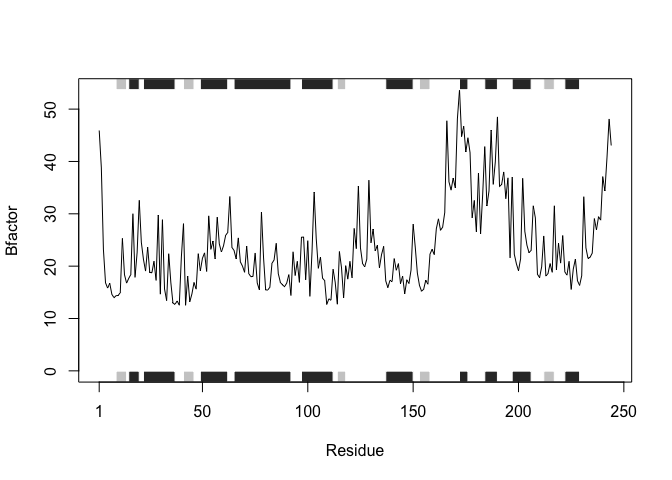

# Class06_Homework_Q6_Protein_Function
Andrew Sue

## Q6. How would you generalize the original code above to work with any set of input

protein structures?

``` r
library(bio3d)
s1 <- read.pdb("4AKE") # kinase with drug
```

      Note: Accessing on-line PDB file

``` r
s2 <- read.pdb("1AKE") # kinase no drug
```

      Note: Accessing on-line PDB file
       PDB has ALT records, taking A only, rm.alt=TRUE

``` r
s3 <- read.pdb("1E4Y") # kinase with drug
```

      Note: Accessing on-line PDB file

``` r
s1.chainA <- trim.pdb(s1, chain="A", elety="CA")
s2.chainA <- trim.pdb(s2, chain="A", elety="CA")
s3.chainA <- trim.pdb(s3, chain="A", elety="CA")
s1.b <- s1.chainA$atom$b
s2.b <- s2.chainA$atom$b
s3.b <- s3.chainA$atom$b
plotb3(s1.b, sse=s1.chainA, typ="l", ylab="Bfactor")
```


``` r
plotb3(s2.b, sse=s2.chainA, typ="l", ylab="Bfactor")
```


``` r
plotb3(s3.b, sse=s3.chainA, typ="l", ylab="Bfactor")
```


``` r
protein_fun <- function(x) {
  s1 <- read.pdb(x)
  s1.chainA <- trim.pdb(s1, chain="A", elety="CA")
  plotb3(s1.chainA$atom$b, sse=s1.chainA, typ="l", ylab="Bfactor")
}
protein_fun("4AKE")
```

      Note: Accessing on-line PDB file

    Warning in get.pdb(file, path = tempdir(), verbose = FALSE):
    /var/folders/l2/2q0br38x6z1_n65764nk6jyc0000gn/T//RtmpKdHiCz/4AKE.pdb exists.
    Skipping download


Here is a random PDB structure from the PDB database.

``` r
protein_fun("6GWV")
```

      Note: Accessing on-line PDB file
       PDB has ALT records, taking A only, rm.alt=TRUE


